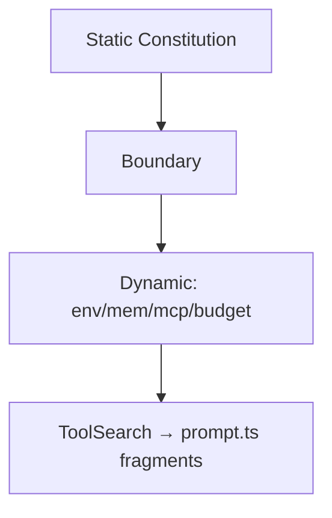
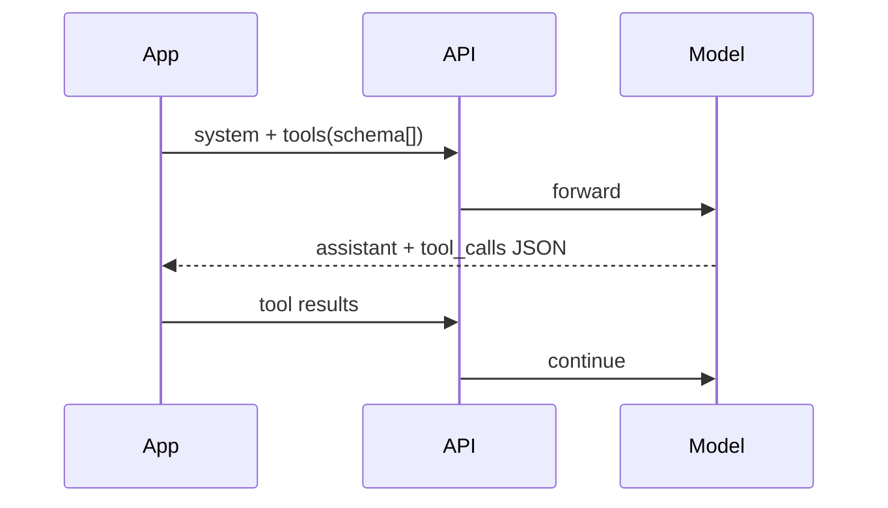
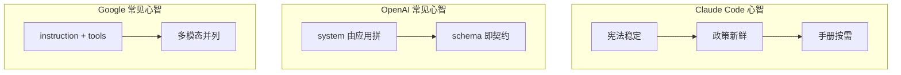

# 5.9 策略对比：Claude Code vs OpenAI vs Google

## 学习目标

- 从 **系统提示结构**、**工具描述组织**、**并行与失败策略** 三方面对比三家常见路线。
- 说明 **Claude Code** 的「静动边界 + 延迟工具手册」在 **成本与纪律** 上的取舍。
- 能向团队解释：为何 **不是**「谁的提示词更长谁更强」。

---

## 生活类比：三家快递公司的员工手册

- **A 公司**：手册很厚，但分 **总部红线** 与 **站点每日告示**——像静动分离。
- **B 公司**：总部发 **标准 API 卡片**（函数名、JSON Schema），站点自己贴便利贴——像 function calling 生态。
- **C 公司**：强调 **多模态与工具声明格式**，各城法规用插件描述——像 Gemini tools。

没有绝对赢家，只有 **场景匹配**。

---

## 对比总表

| 维度 | Claude Code（本篇模型） | OpenAI（function calling 生态） | Google（Gemini tools） |
|------|-------------------------|----------------------------------|-------------------------|
| **系统提示** | 静动拆分，边界下注入环境/记忆/MCP | 常由应用拼装 system + developer | system instruction + tools 声明 |
| **工具描述** | 总则 + 每工具 `prompt.ts`，可 ToolSearch 延迟加载 | JSON Schema + 简短 description 为主 | 工具定义 + 声明式约束（随 API 演进） |
| **纪律 enforcement** | 强提示 + **硬拦截**（如先读后改） | 多依赖应用层中间件 | 依赖应用层与模型遵循 |
| **并行** | 明确「无依赖并行」文化 | 由客户端决定是否并行 tool 调用 | 依客户端与模型能力 |
| **缓存意识** | 产品化考虑 prompt cache 前缀 | 视应用；Responses/缓存能力因产品而异 | 视应用与模型栈 |
| **典型强项** | 长上下文编程流、CLI 一体 | 生态与集成广度 | 多模态、部分谷歌云一体场景 |

---

## Claude Code：提示词策略摘要

1. **`getSystemPrompt()` 编译器模型**：静态宪法 + `SYSTEM_PROMPT_DYNAMIC_BOUNDARY` + 动态政策。
2. **行为铁律** 与 **工具死规矩** 双管齐下；关键路径 **代码拦截**。
3. **工具手册** 延迟加载，控制前缀长度，服务 **成本与专注**。

### Mermaid：Claude Code 提示词栈



---

## OpenAI：function calling 典型策略

### 特征

- 工具以 **函数列表** 形式提供给 API；模型在 **消息流** 中产出 `tool_calls`。
- **描述字段** 受 token 预算限制，团队常在「**短描述**」与「**行为完整**」间权衡。
- **系统提示** 常由 **应用** 拼接：安全策略、RAG、记忆、业务规则。

### 与 Claude Code 的差异（教学观点）

| 点 | OpenAI 生态常见现象 | Claude Code 倾向 |
|----|---------------------|------------------|
| 工具说明位置 | 紧附在 schema | 总则 + 可检索手册 |
| 硬约束 | 依赖中间件/沙箱 | 提示 + 专用工具链拦截 |
| 前缀治理 | 因应用而异，需自建规范 | 产品内建静动边界意识 |

### Mermaid：OpenAI 风格消息流（简化）



---

## Google：Gemini tools 典型策略

### 特征

- **声明式工具** 与 **系统 instruction** 组合；多模态输入常见。
- 工具与 **谷歌生态**（搜索、地图、企业数据）集成时，提示词侧重 **能力边界与合规**。
- 具体字段名、模式随 **API 版本** 演进较快，提示工程要 **版本锁定**。

### 与 Claude Code 的差异（教学观点）

| 点 | Gemini 路线 | Claude Code 路线 |
|----|---------------|------------------|
| 上下文形态 | 强多模态 | 编程 CLI 常以文本+工具为主 |
| 工具发现 | 应用定义 | ToolSearch + 延迟手册 |
| 团队心智 | 「instruction + tools」 | 「宪法/政策/手册」三层 |

---

## 何时借鉴哪一种？

| 你的场景 | 可借鉴 Claude Code | 可借鉴 OpenAI | 可借鉴 Google |
|----------|----------------------|---------------|----------------|
| 长对话编程 Agent | 静动边界、缓存意识 | 丰富中间件示例 | 多模态需求 |
| 大量第三方 API | 延迟工具手册思路 | schema 驱动 | 声明式工具 |
| 企业合规审计 | 硬拦截 + 日志 | 策略网关 | 云一体身份与权限 |

---

## 源码片段（概念）：三家「工具注册」形态对比

```typescript
// OpenAI 风格：schema 即契约
const openaiTools = [
  {
    type: "function",
    function: {
      name: "read_file",
      description: "Read a UTF-8 text file by path.",
      parameters: { type: "object", properties: { path: { type: "string" } }, required: ["path"] },
    },
  },
];

// Claude Code 风格：运行时检索 prompt.ts 片段 + 硬规则在宿主
const claudeCodeTooling = {
  globalRules: "FileRead for read; FileEdit for edit; parallelize independent tools.",
  lazyManuals: { bash: () => import("./tools/bash/prompt").then((m) => m.bashToolPrompt) },
};

// Gemini 风格（极度简化）：工具声明 + instruction
const geminiStyle = {
  systemInstruction: "You are a coding agent. Follow org policies.",
  tools: [{ name: "run_shell", description: "..." }],
};
```

---

## 常见误区

1. **误区**：「OpenAI 不用写长 system，全靠 schema。」  
   **正解**：复杂 Agent 仍然需要 **分层 system**；schema 无法承载全部协作策略。

2. **误区**：「Claude Code 只靠提示词约束。」  
   **正解**：关键路径有 **代码级 Fail-closed 与盲改拦截**。

3. **误区**：「换一家 API 只要复制提示词。」  
   **正解**：工具格式、并行语义、缓存机制不同，需要 **重写拼装层**。

---

## 迁移检查表：从 OpenAI 风格迁到「静动 + 手册」风格

| 步骤 | 动作 |
|------|------|
| 1 | 从现有 monolithic system 中 **剪切** 所有含用户路径/时间的句子 |
| 2 | 将剩余 **红线规则** 固化为 `buildStaticConstitution` |
| 3 | 将 **环境、记忆、插件** 迁入 `buildDynamicPolicy` |
| 4 | 把过长工具说明迁到 **per-tool prompt**，保留 **schema 短描述** |
| 5 | 加 **边界常量** 与 **集成测试**（快照哈希稳定） |

---

## Google 路径：多模态块放在哪？

| 内容 | 建议层级 |
|------|----------|
| 「如何描述图片中的 UI bug」总则 | 可放 **静态**（若不含用户图像） |
| 当前截图 bytes / 文件名 | **动态** 或 **user 消息**，勿进可共享缓存前缀 |
| 工具返回的富媒体 | **消息链**，与 system 手册分离 |

---

## Mermaid：三家的「单一职责」卡通对比



---

## 延伸阅读（官方与生态）

- 以 **各平台定价页** 校准缓存单价与写入费。
- 以 **各 API 版本 changelog** 校准工具声明字段名（尤其 Gemini）。
- 开源 Agent 框架（LangGraph、Semantic Kernel 等）常混用多家 API：**对照本篇分层表** 做适配层。

---

## 自测题

1. 为什么说 ToolSearch 延迟加载 **同时** 服务「注意力」与「成本」？
2. function calling 的 schema 描述过短会导致什么 **典型模型错误**？
3. 若你的 Agent 需要强多模态，你会如何把「静动边界」思想 **迁移** 过去？

---

## 导航

- [← 5.8 工具手册](./08-tool-manuals.md)
- [5.10 实践练习 →](./10-practice.md)
