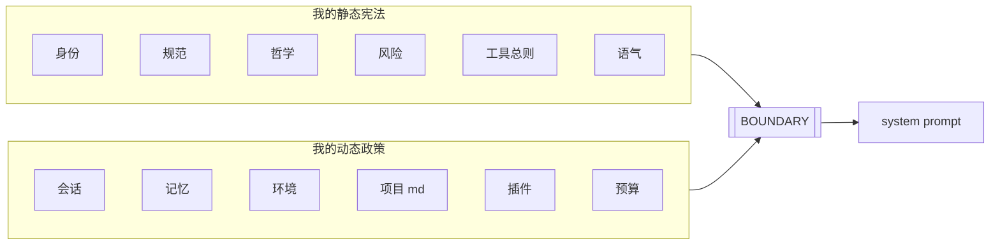
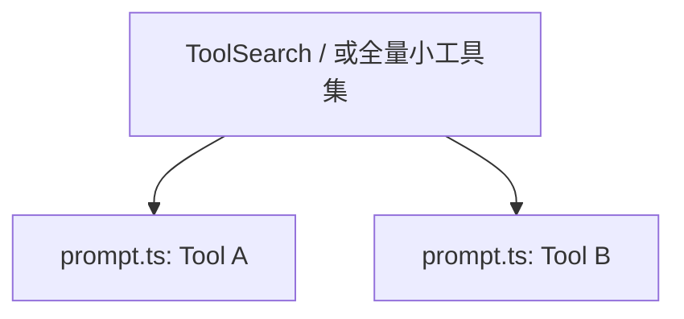

# 5.10 实践：设计你自己的系统提示词

## 学习目标

- 按 **Claude Code 模式** 为「迷你 Agent」划分 **静态宪法** 与 **动态政策**。
- 写出 **`SYSTEM_PROMPT_DYNAMIC_BOUNDARY` 等价标记** 两侧的目录级大纲。
- 起草 **任务哲学短章**（对齐 `getSimpleDoingTasksSection` 精神）。
- 为 **2 个虚构工具** 各写一份微型 `prompt.ts` 片段。
- 列出自己的 **缓存失效风险清单**（至少 5 条）。

---

## 生活类比：开一家只有两名员工的小店

你是老板，要写两本册子：

1. **员工守则**（天天贴在墙上）——静态。
2. **今日进货与特价**（每天早上更新）——动态。

本练习就是 **写这两本册子**，并规定 **只能把特价写在黑板下半截**（边界之下）。

---

## 练习 A：选定你的迷你 Agent

从以下选一（或自拟）：

| 编号 | Agent 类型 | 用户场景 |
|------|------------|----------|
| A1 | 个人记账助手 | 解析自然语言支出、分类、周报 |
| A2 | 仓库文档巡检 | 检查 README 链接、过期日期 |
| A3 | 课程作业批改辅助 | 对作业给出规范反馈，不直接给抄答案步骤 |

**写下一句「产品使命」**（≤30 字）。

---

## 练习 B：静态宪法六段大纲

复制下表并 **填空**（每格 1–3 条要点即可，不必长文）。

| 静态模块 | 你的要点 |
|----------|----------|
| 身份定位 | |
| 系统规范 | |
| 任务哲学 | |
| 风险规范 | |
| 工具总则 | |
| 语气风格 | |

### 任务哲学短章（模板）

```markdown
## 任务哲学（Doing tasks）

- 不添加用户未要求的无关功能。
- 避免过度抽象；优先最小可行修改。
- 不堆砌无意义注释。
- 不对耗时给出武断估计。
- 出错时先诊断再更换策略。
- 如实汇报结果与限制。
```

**要求**：至少 **改写其中 2 条** 以贴合你的 Agent 场景（例如记账助手强调「不臆造金额来源」）。

---

## 练习 C：动态政策六段大纲

| 动态模块 | 你将注入什么字段？（列变量名） |
|----------|--------------------------------|
| 会话引导 | |
| 记忆（≤5） | |
| 环境信息 | |
| 项目文件（类 CLAUDE.md） | |
| 插件说明（类 MCP） | |
| Token 预算 | |

---

## 练习 D：拼装函数（手写伪代码）

在下列骨架中补全你的函数名与字段：

```typescript
const SYSTEM_PROMPT_DYNAMIC_BOUNDARY = "<<<<MY_AGENT_DYNAMIC>>>>";

function getSystemPrompt(ctx: MySessionContext): string {
  const staticConstitution = buildStaticConstitution(/* ? */);
  const dynamicPolicy = buildDynamicPolicy(ctx);
  return `${staticConstitution}\n\n${SYSTEM_PROMPT_DYNAMIC_BOUNDARY}\n\n${dynamicPolicy}`;
}
```

**交付物**：实现 `buildStaticConstitution` 与 `buildDynamicPolicy` 的 **返回字符串大纲**（可用 Markdown 拼接）。

---

## 练习 E：两个工具的 `prompt.ts`

### 工具 1（只读型）示例骨架

```typescript
export const queryLedgerPrompt = `
## QueryLedgerTool
用途：按日期范围查询账本条目。
何时用：用户问「本周餐饮支出」。
何时不用：需要写入新支出 → 用 AppendExpenseTool。
参数：from (ISO date), to (ISO date), category?: string
`.trim();
```

### 工具 2（写入型）示例骨架

```typescript
export const appendExpensePrompt = `
## AppendExpenseTool
用途：追加一条支出记录。
硬规则：写入前必须先 QueryLedgerTool 读取重叠区间，避免重复记账（若你的业务需要）。
`.trim();
```

**要求**：把工具名/参数改成 **你的 Agent** 的虚构 API，但必须包含：

- 何时用 / 何时不用  
- 参数契约  
- 至少 **1 条反模式**

---

## 练习 F：缓存失效清单

至少列出 5 条 **你会主动避免** 的做法，映射到本篇 [5.6](./06-cache-pitfalls.md) 的陷阱编号（可重复类型）。

| 你的反模式 | 对应陷阱类型 | 你的规避 |
|------------|--------------|----------|
| 例：在静态区写 `Date.now()` | #4 时间戳 | 改放动态区 |
| | | |
| | | |

---

## Mermaid：画出你的 Agent 拼装流

将方框文字换成你的命名：



---

## Mermaid：你的工具与边界关系



---

## 评分 rubric（自评用）

| 项目 | 及格 | 良好 |
|------|------|------|
| 静动分离 | 有边界标记 | 静态无用户路径/时间戳 |
| 铁律 | 覆盖 4+ 条精神 | 与场景定制化结合 |
| 工具手册 | 2 个工具有意图分区 | 含反模式与并行提示 |
| 缓存意识 | 5 条风险 | 能联系到成本指标 |

---

## 参考答案思路（仅提示，非唯一解）

- **记账助手**：风险规范侧重 **不连接真实银行密钥**；动态块放 **货币与Locale**。
- **文档巡检**：工具总则强调 **先读后改链接**；动态块放 **仓库根路径与分支名**。
- **作业辅助**：任务哲学强调 **启发不代写**；风险规范写 **学术诚信边界**。

---

## 交付检查清单

- [ ] `getSystemPrompt()` 草图可运行（伪代码级）
- [ ] 边界之上无用户数据
- [ ] `getSimpleDoingTasksSection` 风格短章已场景化
- [ ] 两个 `prompt.ts` 草稿完成
- [ ] 缓存风险表 ≥5 行

---

## 导航

- [← 5.9 策略对比](./09-comparison.md)
- **本篇完** · 返回 [5.1 索引](./index.md)
