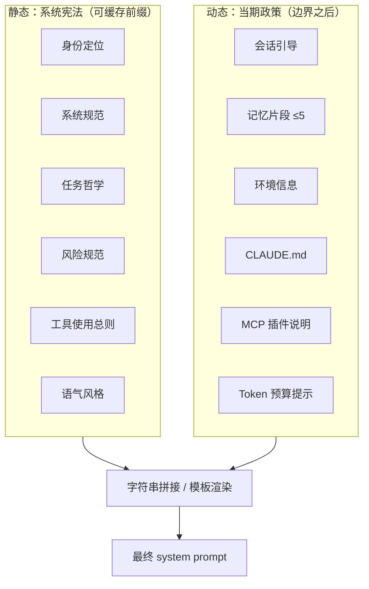
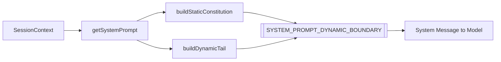
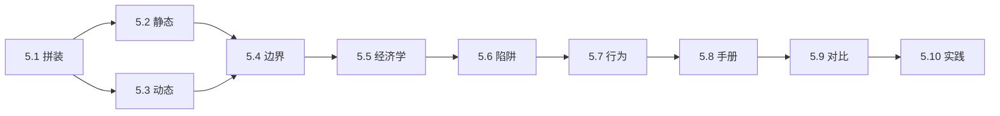

# 第 5 篇：提示词工程（Prompt Engineering）

> **Claude Code 完全指南 V2** · 全新篇章 · 从「写一段提示」到「理解系统如何拼装提示」

---

## 本篇学习目标

完成本篇后，你应能够：

1. **解释** `getSystemPrompt()` 如何把多段文本「编译」成最终系统提示词，而不是把它当成单一静态字符串。
2. **区分** 静态「系统宪法」与动态「当期政策」的职责边界，并说明各自对缓存与行为的影响。
3. **读懂** `SYSTEM_PROMPT_DYNAMIC_BOUNDARY` 在工程上的意图：把可缓存前缀与每次必变后缀切开。
4. **预判** 哪些用户侧或环境侧变化会让提示词缓存失效，从而推高 Token 成本。
5. **对照** 行为约束与工具手册在提示词中的角色：前者是铁律，后者是可检索的操作说明。

---

## 5.1 动态拼装机制：系统提示不是「一篇文章」

### 生活类比：餐厅后厨的「固定菜谱 + 当日特供」

想象一家餐厅：

- **固定菜谱**（对应静态部分）：刀工规范、卫生标准、上菜顺序、口味基调——**天天一样**，可以印在墙上长期不改。
- **当日特供**（对应动态部分）：今天进了什么海鲜、哪桌客人过敏、现在几点是否还能做复杂菜——**每餐不同**，必须写在小黑板上。

Claude Code 的系统提示词同理：**底层「怎么做 AI 员工」是宪法；「此刻为谁、在什么环境、读到了什么记忆」是政策。** 二者拼在一起，才是模型真正看到的系统消息。

### 核心论断：`getSystemPrompt()` 像编译器，不是「打开一个 .txt」

在工程实现上，系统提示词通常由函数 **动态拼装**：

- 多个模块各自产出片段（身份、规范、工具说明、环境、记忆……）。
- 按固定顺序 **concat**（或模板填充）成一个大字符串。
- 可能还有 **条件分支**（例如内部用户类型、是否启用 MCP）。

因此，你在文档里看到的「系统提示词示例」往往是 **某次运行的快照**；源码里真正重要的是 **拼装管线** 与 **边界标记**。

### 拼装流程概览（概念伪代码）

下面用 TypeScript 风格伪代码表达「编译器式」输出（教学用，非某版本逐行源码）：

```typescript
// 概念示意：系统提示 = 静态缓存前缀 + 动态后缀
function getSystemPrompt(ctx: SessionContext): string {
  const staticCore = buildStaticConstitution(); // 身份、规范、哲学、风险、工具总则、语气

  const dynamicTail = [
    buildSessionPreamble(ctx),
    buildMemoryInjections(ctx.memories, { max: 5 }),
    buildEnvironmentBlock(ctx.env),
    loadClaudeMd(ctx.workspace),
    buildMcpPluginSection(ctx.mcp),
    buildTokenBudgetHint(ctx.budget),
  ].join("\n\n");

  return (
    staticCore +
    "\n\n" +
    SYSTEM_PROMPT_DYNAMIC_BOUNDARY +
    "\n\n" +
    dynamicTail
  );
}
```

要点：

- **静态块** 尽量稳定，便于 **prompt caching**（前缀命中）。
- **动态块** 每轮/每会话可能变化，放在 **边界标记之后**，避免「污染」整个前缀缓存。

### Mermaid：从「模块」到「最终 system 字符串」



### Mermaid：`getSystemPrompt()` 数据流（编译器视角）



### 为什么要这样设计？（表格小结）

| 维度 | 若全是静态 | 若全是动态 | 静动分离 |
|------|------------|------------|----------|
| **缓存** | 易命中，但无法感知环境 | 难命中，成本高 | 前缀命中 + 后缀更新 |
| **一致性** | 行为稳，但「不知此刻上下文」 | 上下文全，但规则易漂移 | 规则稳、上下文新 |
| **可测试** | 易测静态块 | 难测组合爆炸 | 分测静态生成器与动态注入 |

### 与本篇其他章节的关系

| 章节 | 文件 | 你将深入的内容 |
|------|------|----------------|
| 5.2 | `02-static-constitution.md` | 六大静态模块各自写什么、为何不变 |
| 5.3 | `03-dynamic-policy.md` | 六大动态注入如何塑造「当期智能」 |
| 5.4 | `04-cache-boundary.md` | 边界标记如何把缓存风险「关进后院」 |
| 5.5 | `05-token-economics.md` | 缓存单价与长对话成本估算 |
| 5.6 | `06-cache-pitfalls.md` | 七种失效陷阱与规避 |
| 5.7 | `07-behavior-constraints.md` | 行为铁律、工具死规矩、Fail-closed |
| 5.8 | `08-tool-manuals.md` | 每工具 `prompt.ts` 如何写给模型读 |
| 5.9 | `09-comparison.md` | 与 OpenAI / Google 工具策略对照 |
| 5.10 | `10-practice.md` | 动手设计迷你 Agent 系统提示 |

### 自测清单（学完 5.1 应能回答）

1. 为什么说「系统提示词 = 编译器输出」比「提示词 = 配置文件」更贴切？
2. 静态块与动态块若顺序颠倒，对缓存与一致性分别有什么风险？
3. 若把「环境信息」误放进静态块，会带来什么工程后果？

---

## 本篇路线图（章节依赖）



建议阅读顺序：**5.1 → 5.2 → 5.3 → 5.4**，再按需跳读 **5.5–5.8**；**5.9** 适合与架构师讨论选型；**5.10** 适合工作坊收尾。

---

## 术语速查（本篇口径）

| 术语 | 含义 |
|------|------|
| 系统宪法 | 静态、低频变更的系统提示前缀，承载身份与底线规范 |
| 当期政策 | 动态、高频变更的后缀，承载环境与会话事实 |
| `getSystemPrompt()` | 将多段文本拼装为最终 system 字符串的入口（教学名） |
| Fail-closed | 元数据未显式声明安全能力时，按「不安全/不并行」保守处理 |
| ToolSearchTool | 按需检索工具手册（如各工具 `prompt.ts`）的机制（教学名） |

---

## 常见误解澄清

| 误解 | 实际情况 |
|------|----------|
| 「系统提示词就是运维写死的几页 Word」 | 多为 **运行时拼装**，且分静动两层 |
| 「提示词越长模型越聪明」 | 过长前缀 **稀释注意力**、抬高成本；应用 **分层 + 延迟手册** |
| 「缓存是云厂商魔法，与提示词无关」 | **前缀稳定性** 直接决定命中率与账单 |
| 「只要禁止 cat/sed 就安全了」 | 还需 **Git 协议、盲改拦截、Fail-closed** 等工程层 |

---

## 与「工具调用」章节的边界（预告）

本篇聚焦 **system 字符串如何构成**；具体 **JSON Schema、流式 tool_calls、错误重试** 属于 API 与宿主实现细节。阅读时请记住：**提示词定义倾向，代码定义底线。**

---

## 编者注

- 函数名、常量名（如 `getSystemPrompt`、`SYSTEM_PROMPT_DYNAMIC_BOUNDARY`）与真实代码库 **可能逐字一致也可能不同**，请以你所用版本为准。
- 价格与缓存规则以 **供应商当期文档** 为准；本篇算例仅建立 **数量级直觉**。

---

## 导航

- **上一篇**：（依全书目录链接）
- **下一篇**：[5.2 静态部分：系统宪法](./02-static-constitution.md)

---

*本篇为 V2 教学文稿，技术细节以官方实现与版本更新为准；文中伪代码与标记名用于对齐常见架构表述。*
