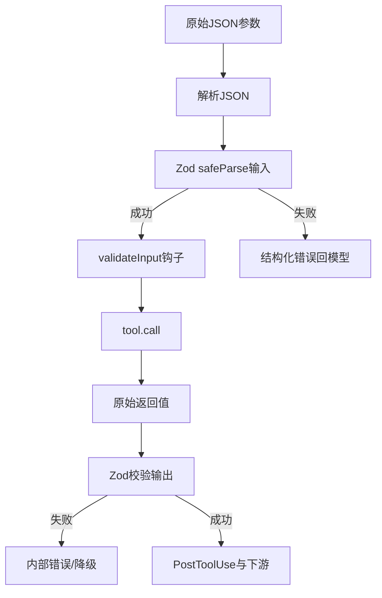
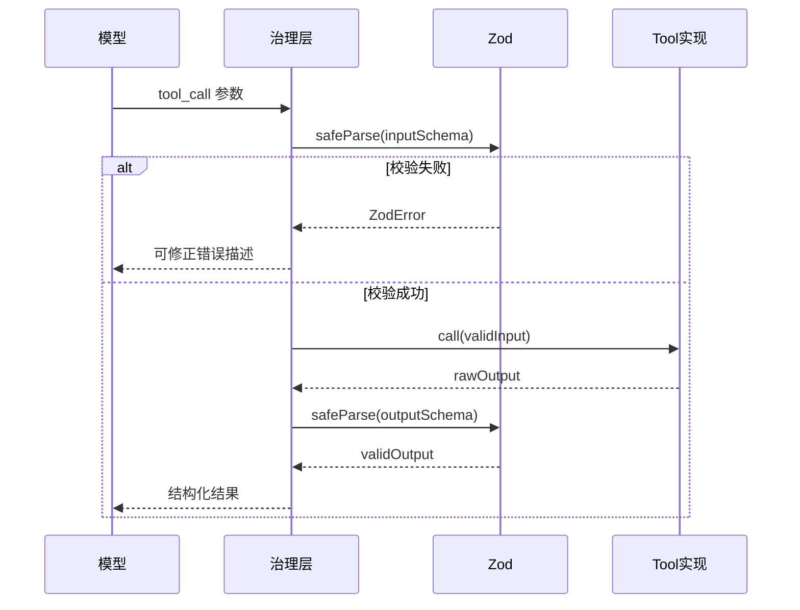

# 6.2 Tool 接口设计 — Zod 校验与输入输出 Schema

> **前置阅读**：[6.1 42 个工具全景](./index.md)

---

## 学习目标

完成本节学习后，你应该能够：

1. **描述** Tool 抽象中常见的字段：`name`、`description`、`inputSchema`、`outputSchema`、`call` 等。
2. **说明** 为何选用 **Zod**（或同类库）做运行时校验，而不是仅依赖 TypeScript 编译期类型。
3. **区分**「模型生成的 JSON」与「运行时强类型对象」，并理解校验失败时的 fail-closed 行为。
4. **设计** 一份最小可用的工具 Schema：必填字段、可选字段、联合类型与错误消息友好化。
5. **关联** 后续治理流水线中「解析输入 → 校验 Schema」两步的职责边界。

---

## 生活类比：海关申报单与开箱查验

**Tool 的输入输出 Schema** 就像**出入境申报单**：

- 旅客（模型）填写的每一项都必须落在**规定栏目**里；格式不对，柜台直接拒收（校验失败）。
- **申报单**是「对外可见的表格」（JSON / 结构化字段），**开箱**是「实际货物」（运行时对象），两者必须一致。
- **输出 Schema** 则是「回程时必须带回的收据格式」——海关（宿主应用）只接受标准格式的回执，避免乱七八糟的自然语言混入业务逻辑。

Zod 在这里扮演**既看表格又看货物**的稽查员：先问「有没有带违禁品字段」，再问「类型对不对」。

---

## Tool 接口核心要素（表）

| 要素 | 作用 | 与模型的关系 | 与宿主的关系 |
|------|------|--------------|--------------|
| `name` | 稳定标识、遥测键 | function calling 名称 | 注册表、权限策略 |
| `description` | 能力说明 | 选工具依据 | 可裁剪/压缩进 system |
| `inputSchema` | 入参契约 | 生成合法参数 | 拒绝非法调用 |
| `outputSchema` | 出参契约 | 收到可解析结果 | 管道下游消费 |
| `call()` | 副作用边界 | 不直接可见 | 审计、超时、取消 |

---

## Zod：为何需要运行时校验

TypeScript 类型在**编译后消失**，而模型产出的参数来自**网络与解析**，属于**不可信输入**。Zod 提供：

1. **运行时解析** — `safeParse` / `parse` 将未知数据变为强类型或明确错误。
2. **可序列化的 JSON Schema 对齐** — 不少实现会把 Zod 转为 JSON Schema 供 API 描述。
3. **精细化错误** — `path` + `message` 便于回灌给模型自我修正（与治理流水线「二次修正输入」呼应）。

---

## 源码片段：最小 Tool 定义

```typescript
import { z } from "zod";

// 输入：路径 + 可选编码
const FileReadInput = z.object({
  path: z.string().min(1, "path 不能为空"),
  encoding: z.enum(["utf8", "base64"]).optional(),
});

// 输出：内容与元数据
const FileReadOutput = z.object({
  content: z.string(),
  lineCount: z.number().int().nonnegative(),
  truncated: z.boolean(),
});

type FileReadInputT = z.infer<typeof FileReadInput>;
type FileReadOutputT = z.infer<typeof FileReadOutput>;

async function fileReadToolCall(input: FileReadInputT): Promise<FileReadOutputT> {
  // ... 实现省略
  return {
    content: "",
    lineCount: 0,
    truncated: false,
  };
}

function validateFileReadInput(raw: unknown) {
  const r = FileReadInput.safeParse(raw);
  if (!r.success) {
    return { ok: false as const, error: r.error.flatten() };
  }
  return { ok: true as const, data: r.data };
}
```

**要点**：

- `unknown` 入口强制你先校验再使用。
- `z.infer` 保证 **Schema 即类型源**（SSOT）。
- 错误结构可映射为工具层的标准 `ToolError`。

---

## 源码片段：输出也要校验

部分实现会对**工具返回值**再做一次 Zod 校验，防止实现 bug 或子进程污染：

```typescript
async function invokeTool(rawInput: unknown) {
  const inParsed = FileReadInput.safeParse(rawInput);
  if (!inParsed.success) {
    return { type: "invalid_input", issues: inParsed.error.issues };
  }

  const rawOut = await fileReadToolCall(inParsed.data);
  const outParsed = FileReadOutput.safeParse(rawOut);
  if (!outParsed.success) {
    return { type: "invalid_output", issues: outParsed.error.issues };
  }

  return { type: "ok", data: outParsed.data };
}
```

这体现了 **双端契约**：模型与工具实现都必须尊重 Schema。

---

## Mermaid：校验在流水线中的位置





---

## 进阶：联合类型与判别字段

工具参数常出现「模式切换」，用 `discriminatedUnion` 可减少非法组合：

```typescript
const SearchMode = z.discriminatedUnion("mode", [
  z.object({ mode: z.literal("text"), pattern: z.string() }),
  z.object({ mode: z.literal("regex"), pattern: z.string(), flags: z.string().optional() }),
]);
```

对模型而言，**清晰的枚举与字面量**比「一堆可选 boolean」更容易填对。

---

## 与 JSON Schema 的互操作（概念表）

| 场景 | Zod 优势 | JSON Schema 优势 |
|------|----------|------------------|
| TS 一体化 | `z.infer` 天然同步 | 需代码生成或手写类型 |
| 动态注册 | 可在运行时组合 | 生态广、部分平台原生 |
| 错误信息 | `issue.path` 友好 | 依赖实现 |

许多产品会 **Zod → JSON Schema** 导出，用于 OpenAPI 或客户端。

---

## 常见反模式

| 反模式 | 后果 | 建议 |
|--------|------|------|
| 仅用 TS 类型、不校验 | 运行时注入/缺字段 | 入口 `unknown` + Zod |
| Schema 过宽（全 `z.any()`） | 失去治理意义 | 收紧字段，版本化演进 |
| 输出不校验 | 静默数据损坏 | 对关键工具校验 output |
| 错误信息泄露路径 | 信息暴露 | 对用户/模型分级脱敏 |

---

## 小结

- **Tool 接口** = 名称 + 描述 + **输入/输出 Schema** + **call**；Schema 是模型与宿主之间的**法律合同**。
- **Zod** 把「模型 JSON」变成「可信对象」，并向上层提供**可恢复的错误**。
- **双端校验**（入参 + 出参）在关键工具上值得投入。

---

## 自测题

1. 若省略输出 Schema 校验，攻击面或故障面分别可能是什么？
2. `safeParse` 与 `parse` 在治理流水线里哪个更适合默认使用？为什么？
3. 如何将 Zod 错误映射为「可供模型二次修正」的提示语？

**上一节**：[6.1 全景](./index.md) · **下一节**：[6.3 十四步治理流水线](./03-governance-pipeline.md)
