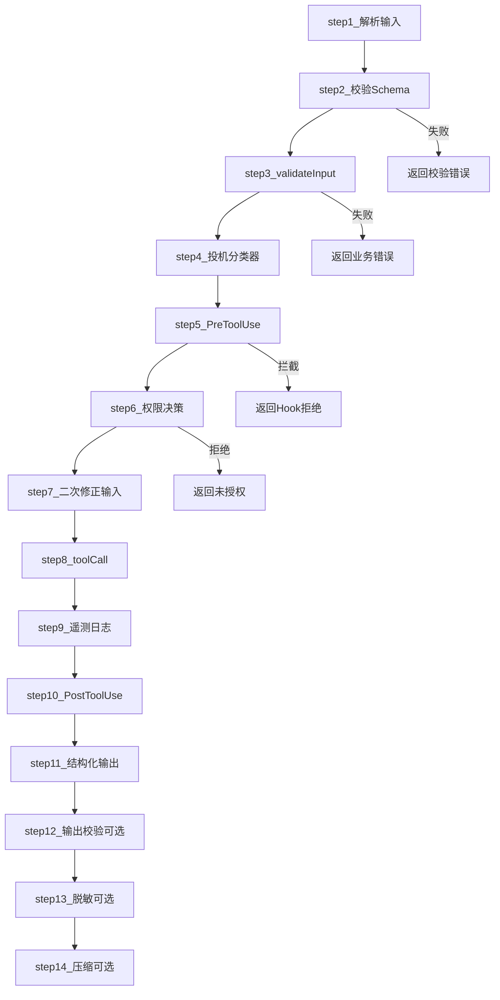
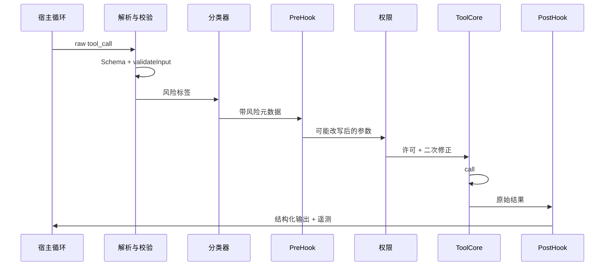

# 6.3 十四步治理流水线 — 从解析到结构化输出

> **前置阅读**：[6.2 Tool 接口设计](./02-tool-interface.md)

---

## 学习目标

完成本节学习后，你应该能够：

1. **按顺序复述** 14 步治理流水线各步职责：从解析输入到 PostToolUse、结构化输出。
2. **解释** `PreToolUse` 为何可以**改写或拦截**调用，以及它与「正式权限决策」的次序关系。
3. **说明**「投机分类器」在工程上的目的：预判风险、提前降速或加策略。
4. **关联** 遥测日志、二次修正输入与 `tool.call()` 之间的数据流。
5. **对照** 自家产品：哪些步骤可省略、哪些**不可省略**（安全与合规）。

---

## 生活类比：银行大额转账

把一次工具调用想象成**柜台办理大额转账**：

1. **解析**客户填单（JSON）是否缺栏。
2. **Schema 校验**格式是否合法。
3. **`validateInput`** 业务规则（收款人黑名单等）。
4. **投机分类器**像**风控预审**：疑似诈骗先标红。
5. **`PreToolUse`** 像**主管改单**：可要求补材料或直接拒办。
6. **正式权限**像**授权岗**：看角色、额度、时间。
7. **二次修正**像**客户签字确认最终金额**。
8. **`tool.call()`** 真正划账。
9. **遥测**记账本、供审计。
10. **`PostToolUse`** 事后短信通知、触发反洗钱规则。
11. **结构化输出**给客户一张**标准回执**（非手写便条）。

流水线越长，**延迟**可能越高，但**事故率**通常越低——工程上要在二者间折中。

---

## 十四步清单（总表）

| 步骤 | 名称（教学用） | 一句话职责 |
|------|----------------|------------|
| 1 | 解析输入 | 将原始 tool_call 解析为结构化对象 |
| 2 | 校验 Schema | Zod / 等价校验入参形状与类型 |
| 3 | validateInput | 业务层额外规则（路径白名单等） |
| 4 | 投机分类器 | 启发式 / 小模型预判风险等级 |
| 5 | PreToolUse Hook | 可改写参数、短路拒绝、附加元数据 |
| 6 | 正式权限决策 | 用户批准、策略引擎、角色 ACL |
| 7 | 二次修正输入 | 权限结果回填、参数归一化 |
| 8 | tool.call() | 执行真实副作用或只读操作 |
| 9 | 遥测日志 | 事件、耗时、结果摘要、关联 traceId |
| 10 | PostToolUse Hook | 审计、缓存失效、副作用链 |
| 11 | 结构化输出 | 映射为统一 ToolResult |
| 12 | （扩展）重试策略 | 可选：可恢复错误的有限重试 |
| 13 | （扩展）速率限制 | 可选：令牌桶防刷 |
| 14 | （扩展）结果裁剪 | 可选：大 payload 截断与哈希存档 |

> **说明**：不同实现可能合并或拆分步骤；上表在「核心 11 步」基础上补充 3 个常见扩展，凑满**教学用 14 步**口径，便于与「解析→校验→Hook→权限→执行→日志→输出」完整闭环对齐。若你内部分档为严格 11 步，可将 12–14 视为子阶段。

为与需求中的**精确 14 步**一致，下列**编号版**与开篇需求逐条对应：

| 步号 | 阶段 |
|------|------|
| 1 | 解析输入 |
| 2 | 校验 Schema |
| 3 | validateInput |
| 4 | 投机分类器预判风险 |
| 5 | PreToolUse Hook（可改写/拦截） |
| 6 | 正式权限决策 |
| 7 | 二次修正输入 |
| 8 | tool.call() |
| 9 | 遥测日志 |
| 10 | PostToolUse Hook |
| 11 | 结构化输出 |
| 12 | （实现可选）输出 Schema 再校验 |
| 13 | （实现可选）敏感字段脱敏 |
| 14 | （实现可选）返回模型前的压缩/引用 |

---

## Mermaid：完整流程图（主路径 + 拦截）





---

## 源码片段：流水线骨架（伪代码）

```typescript
type ToolCallResult =
  | { status: "ok"; output: unknown }
  | { status: "error"; code: string; message: string; retryable?: boolean };

async function runGovernedToolCall(
  raw: unknown,
  tool: ToolDefinition<unknown, unknown>,
  ctx: ExecutionContext,
): Promise<ToolCallResult> {
  // 1 解析输入
  const parsed = parseToolCallPayload(raw);
  if (!parsed.ok) return { status: "error", code: "parse", message: parsed.error };

  // 2 校验 Schema
  const schemaResult = tool.inputSchema.safeParse(parsed.data);
  if (!schemaResult.success) {
    return { status: "error", code: "schema", message: formatZod(schemaResult.error) };
  }

  // 3 validateInput
  const vi = await tool.validateInput?.(schemaResult.data, ctx);
  if (vi && !vi.ok) return { status: "error", code: "validateInput", message: vi.reason };

  // 4 投机分类器
  const risk = await speculativeClassifier(tool.name, schemaResult.data, ctx);

  // 5 PreToolUse
  const pre = await ctx.hooks.preToolUse({ tool: tool.name, input: schemaResult.data, risk });
  if (pre.action === "deny") return { status: "error", code: "pre_hook", message: pre.reason };
  let input = pre.input ?? schemaResult.data;

  // 6 正式权限
  const auth = await ctx.policy.authorize({ tool: tool.name, input, risk });
  if (!auth.allowed) return { status: "error", code: "auth", message: auth.reason };

  // 7 二次修正
  input = auth.normalizedInput ?? input;

  // 8 call
  const started = Date.now();
  let output: unknown;
  try {
    output = await tool.call(input, ctx);
  } catch (e) {
    emitTelemetry({ tool: tool.name, phase: "call", ms: Date.now() - started, error: String(e) });
    return { status: "error", code: "exception", message: String(e) };
  }

  // 9 遥测
  emitTelemetry({ tool: tool.name, phase: "call", ms: Date.now() - started, ok: true });

  // 10 PostToolUse
  const post = await ctx.hooks.postToolUse({ tool: tool.name, input, output });
  output = post.output ?? output;

  // 11–14 结构化、可选校验、脱敏、压缩
  const structured = structureToolResult(tool.name, output);
  return { status: "ok", output: structured };
}
```

---

## 关键交互：PreToolUse 与权限的边界

| 维度 | PreToolUse | 正式权限 |
|------|------------|----------|
| 典型实现 | Hook 函数、插件 | UI 确认、RBAC、策略引擎 |
| 能否改参数 | 常允许 | 一般只追加约束/归一化 |
| 失败体验 | 快速拒绝、可带建议 | 用户可见的授权窗 |
| 测试策略 | 单元 + 集成 | E2E + 合规用例 |

**反模式**：把「是否允许访问网络」只放在 PostToolUse —— 太迟，流量已发出。

---

## 遥测字段建议（表）

| 字段 | 用途 |
|------|------|
| `traceId` / `spanId` | 分布式追踪 |
| `toolName` | 聚合 QPS、错误率 |
| `riskScore` | 分类器效果评估 |
| `durationMs` | 性能回归 |
| `outcome` | ok / denied / error |
| `payloadBytes` | 大结果监控 |

---

## 小结

- **治理流水线**把「模型想做的事」变成「可被审计、可被拒绝、可修正的事」。
- **PreToolUse** 与 **权限** 是两道闸门；**投机分类器**为闸门提供先验。
- **遥测 + PostToolUse** 连接运维与合规，**结构化输出**连接下一轮对话。

---

## 自测题

1. 若 PreToolUse 允许无限改写参数，可能引入何种攻击面？
2. 「二次修正输入」与「Schema 校验」有何本质区别？
3. 哪些步骤在**只读工具**上可以简化仍不破坏安全？

**上一节**：[6.2](./02-tool-interface.md) · **下一节**：[6.4 BashTool](./04-bash-tool.md)
