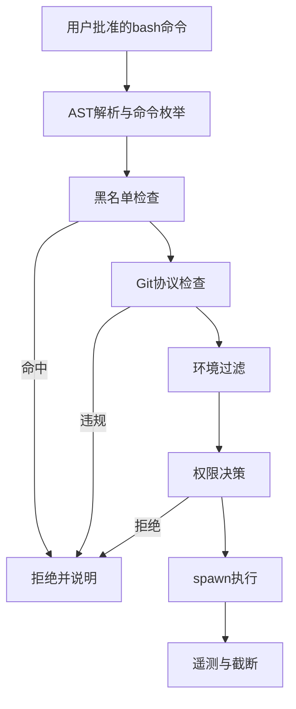
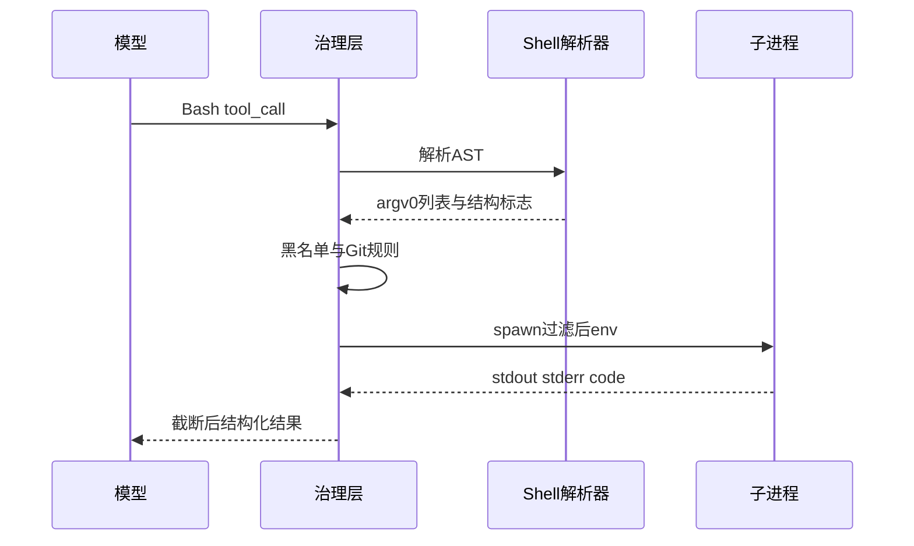

# 6.4 BashTool — AST 分析、Git 安全与命令黑名单

> **前置阅读**：[6.3 十四步治理流水线](./03-governance-pipeline.md)

---

## 学习目标

完成本节学习后，你应该能够：

1. **说明** BashTool 为何需要 **AST 级**（或 shell 解析器级）命令分析，而不是简单字符串 `includes`。
2. **列举** Git 安全协议常见规则：禁止强制推送、保护分支、凭证泄露场景。
3. **描述** 环境变量管理策略：继承、白名单、敏感键过滤。
4. **解释** `curl` / `wget` **默认禁用**的动机与绕过成本。
5. **将** Bash 调用映射到治理流水线：权限、PreToolUse、遥测字段。

---

## 生活类比：化工厂反应釜

**Bash** 像**反应釜上的总阀门**：一开就可能同时影响温度、压力、进料。AST 分析像**读工艺流程图**——你得知道**并行管道**里每一支走向哪里，而不是只看阀门上的标签字。

`curl`/`wget` 默认禁用，类似**禁止私自外接软管**：不是永远不能接，而是要经过**额外审批**（专用策略或替代工具如受控的 `WebFetch`）。

---

## BashTool 能力边界（表）

| 能力 | 说明 | 典型治理 |
|------|------|----------|
| 命令解析 | shell 词法/语法 | 防注入、拆分管道 |
| 工作目录 | `cwd` 约束 | 锁定仓库根 |
| 超时 / 取消 | SIGTERM → SIGKILL | 防僵尸 |
| 输出上限 | stdout/stderr 截断 | Token 与内存 |
| 环境 | `env` 注入与过滤 | 密钥防泄漏 |

---

## AST 解析：为何不够「字符串匹配」

下列命令**都包含 `rm`** 子串，但风险完全不同：

```bash
echo "not rm really"
rm -rf /
git commit -m "fix rm bug"
```

仅靠 `includes("rm")` 会产生大量误报；仅靠黑名单单词会漏掉：

```bash
$(which destructive_cmd)
bash -c '...嵌套...'
```

**工程方向**：

- 使用 **shell parser**（如 bash 的 AST、或 `shlex` 类分词 + 有限状态）得到**命令名与参数节点**。
- 对**简单场景**可退化为「首个 token 为命令」的启发式，但需标注置信度。

---

## 源码片段：命令名提取（概念）

```typescript
import { parse } from "some-shell-parser"; // 示意

interface ParsedCommand {
  argv0: string;
  args: string[];
  pipelines: boolean;
  hasSubshell: boolean;
}

function extractTopLevelCommands(script: string): ParsedCommand[] {
  const ast = parse(script);
  // 遍历 AST：Command、Pipeline、CompoundCommand 等节点
  return flattenToCommands(ast);
}

function isBlockedCommand(argv0: string, blocklist: Set<string>): boolean {
  const base = argv0.replace(/^.*\//, ""); // 去路径
  return blocklist.has(base);
}
```

**要点**：`argv0` 规范化（basename）可减少 `./curl` 绕过。

---

## Git 安全协议（教学清单）

| 规则 | 目的 |
|------|------|
| 禁止 `git push --force` 到共享主分支 | 防历史重写事故 |
| 限制 `git filter-branch` / 大范围重写 | 防供应链与审计断裂 |
| 拦截含 `token`、`password` 的 `git clone` URL | 防凭证写入 shell 历史 |
| 对 `.git` 外操作只读模式可选 | 防误改对象库 |
| `git config` 写全局配置需额外授权 | 防持久化后门 |

这些规则可放在 **`validateInput`** 或 **PreToolUse**：在进程 `spawn` 之前拦截。

---

## 环境变量管理

| 策略 | 描述 | 适用 |
|------|------|------|
| 继承宿主 | 简单，易泄露 | 开发机 |
| 白名单 | 仅 `PATH`、`HOME` 等 | CI |
| 注入只读元数据 | `CI=true`、`REPO_ROOT` | 流水线 |
| 剥离敏感键 | 去掉 `AWS_*`、`OPENAI_*` | 多租户 |

```typescript
const SAFE_ENV_KEYS = new Set(["PATH", "HOME", "LANG", "CI"]);

function filterEnv(env: NodeJS.ProcessEnv): NodeJS.ProcessEnv {
  const out: NodeJS.ProcessEnv = {};
  for (const k of SAFE_ENV_KEYS) if (k in env) out[k] = env[k]!;
  return out;
}
```

---

## 命令黑名单：`curl` / `wget` 默认禁

| 命令 | 风险 | 常见替代 |
|------|------|----------|
| `curl` | 任意出站、管道到 bash | `WebFetch`（受控 URL 策略） |
| `wget` | 同左 | 同左 |
| `nc` / `netcat` | 反向 shell | 禁止或审批 |
| `ssh` | 隧道与数据渗出 | 审批 + 目标白名单 |

**默认禁**不等于**永远不能**：可通过 **策略覆盖**、**专用配置文件** 或 **拆分工具**（例如只允许 `curl` 访问内网镜像且经 PreHook 改写 URL）。

---

## Mermaid：Bash 调用决策





---

## PowerShell 侧记

在 Windows 路径下，`PowerShell` 工具面临类似问题：**别名**、**编码**、**执行策略**。治理上可复用同一流水线，替换解析器与黑名单表。

---

## 测试用例建议（表）

| 用例 | 期望 |
|------|------|
| `echo hello` | 允许 |
| `curl https://evil` | 默认拒绝 |
| `git push --force origin main` | 拒绝或二次确认 |
| `rm -rf /` | 拒绝 |
| 嵌套子 shell 调用黑名单 | 解析器应识别 |

---

## 遥测与审计字段

| 字段 | 说明 |
|------|------|
| `argv0_flat` | 顶层命令列表 JSON |
| `blockedReason` | 黑名单 / Git / 策略 |
| `exitCode` | 进程退出码 |
| `truncated` | 输出是否裁剪 |

---

## 常见反模式

| 反模式 | 后果 |
|--------|------|
| 正则匹配整条命令 | 极易绕过 |
| 无超时 | 挂死占用 worker |
| 全量环境继承 | 密钥进子进程 |
| 超大 stdout 不截断 | OOM 与账单爆炸 |

---

## 小结

- **BashTool** 的核心是**解析 → 策略 → 受控执行 → 裁剪回传**。
- **Git 安全**与**出站黑名单**是高频事故源，应前置在 spawn 之前。
- **环境变量**是第二攻击面，**白名单 + 剥离**是稳妥默认。

---

## 自测题

1. 为何「首个 token」启发式在 `env VAR=value cmd` 场景下可能误判？
2. 若允许 `curl`，PreToolUse 可插入哪些约束降低 SSRF？
3. AST 解析失败时，fail-closed 应「拒绝」还是「降级为人工审核」？

**上一节**：[6.3](./03-governance-pipeline.md) · **下一节**：[6.5 文件工具](./05-file-tools.md)
