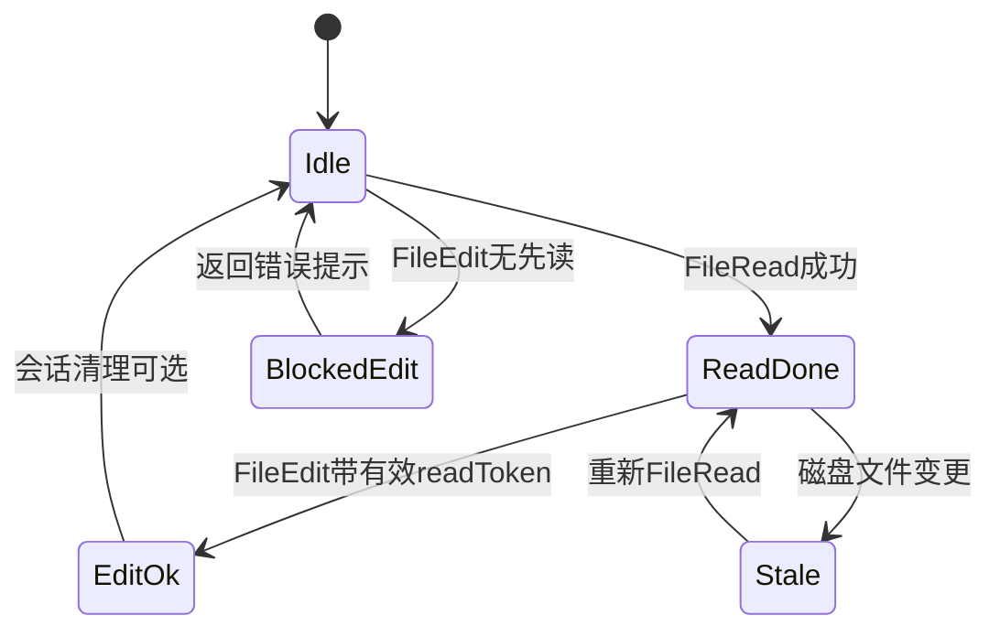
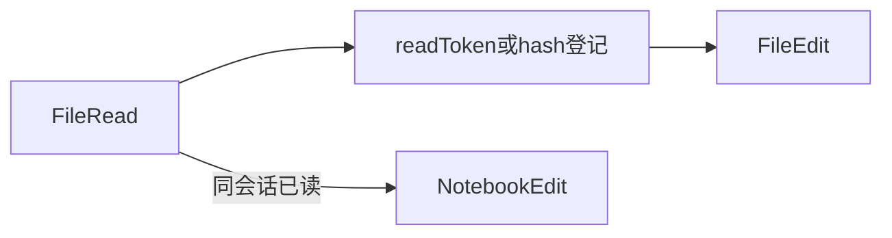

# 6.5 FileRead / FileEdit / NotebookEdit — 先读后写强制

> **前置阅读**：[6.1 全景](./index.md) · [6.3 治理流水线](./03-governance-pipeline.md)

---

## 学习目标

完成本节学习后，你应该能够：

1. **解释** `FileEditTool` **强制先** `FileReadTool` 的产品与安全理由。
2. **描述**「盲改拦截」在实现上的几种形态：会话缓存、ETag、版本向量。
3. **对比** 文本 `FileEdit` 与 `NotebookEdit` 在 Schema 与冲突处理上的差异。
4. **列举** 路径规范化、`..` 穿越、符号链接跟随等常见校验点。
5. **将** 文件三件套接入 PreToolUse / 权限：按扩展名、目录、行数阈值分级。

---

## 生活类比：手术核对清单

**先读后改**像**手术前核对患者手环**：你不能凭记忆动刀。`FileEdit` 在没有**当前文件内容上下文**（或等价的版本令牌）时拒绝执行，就像**未核对 ID 拒绝麻醉**——麻烦一秒，避免灾难级误切。

**Notebook** 则是「**多部位手术**」：每个单元格有独立 ID，改错一格不影响整本病历的页码体系（但若结构错乱仍会事故）。

---

## 三工具职责表

| 工具 | 主要职责 | 典型输入 | 典型输出 |
|------|----------|----------|----------|
| `FileRead` | 读文本/二进制元数据 | `path`, `offset?` | `content`, `truncated`, `lineCount` |
| `FileEdit` | 补丁/替换/整段写 | `path`, `old`/`new` 或结构化 diff | `applied`, `conflicts` |
| `NotebookEdit` | 改 `.ipynb` 单元 | `cellId`, `source`, `cellType?` | `notebookVersion` |

---

## 强制先读：策略表

| 机制 | 做法 | 优点 | 缺点 |
|------|------|------|------|
| 会话指纹 | 近期 `FileRead` 记录 path + hash | 实现快 | 会话外不共享 |
| 显式 `readToken` | Read 返回 token，Edit 必须带上 | 强一致 | API 冗长 |
| 版本号 | 文件 mtime / content hash | 可检测并发修改 | 时钟/缓存问题 |

---

## 源码片段：盲改拦截（概念）

```typescript
interface SessionReadCache {
  path: string;
  contentHash: string;
  readAt: number;
}

const recentReads = new Map<string, SessionReadCache>();

async function fileReadTool(input: { path: string }): Promise<{ content: string; readToken: string }> {
  const content = await fs.readFile(input.path, "utf8");
  const contentHash = sha256(content);
  const readToken = sign({ path: input.path, contentHash, ts: Date.now() });
  recentReads.set(input.path, { path: input.path, contentHash, readAt: Date.now() });
  return { content, readToken };
}

async function fileEditTool(input: { path: string; readToken: string; patch: string }) {
  const verified = verifyReadToken(input.readToken);
  if (!verified.ok) {
    return { error: "blind_edit_blocked", hint: "请先使用 FileRead 获取 readToken" };
  }
  const snap = recentReads.get(input.path);
  if (!snap || snap.contentHash !== verified.payload.contentHash) {
    return { error: "stale_read", hint: "文件已变化请重新读取" };
  }
  // ... 应用 patch
}
```

真实产品可能用 **更短的 nonce** 或 **把 read 结果缓存在宿主侧**；思想一致：**无读凭证则拒绝写**。

---

## NotebookEdit：结构化编辑

Notebook 是 JSON，编辑应尽量避免「整文件字符串替换」：

```typescript
const NotebookCellEdit = z.object({
  path: z.string(),
  cellId: z.string(),
  newSource: z.string(),
  mergeOutputs: z.boolean().optional(),
});
```

**生活类比**：改幻灯片某一页的备注，不应重排整份 PPTX 的 XML——应定位到 `slideId`。

---

## Mermaid：先读后写状态机





---

## 路径与安全校验清单

| 检查项 | 说明 |
|--------|------|
| `path.resolve` + 仓库根前缀 | 防 `..` 逃逸 |
| 符号链接 | 是否跟随、是否允许跳出根 |
| 二进制大文件 | 读时截断、禁止编辑 |
| `.env` / 密钥文件 | 更高权限或脱敏展示 |
| 行尾与编码 | 统一 `LF` / `utf8` 减少伪冲突 |

---

## PreToolUse 钩子示例（伪代码）

```typescript
hooks.preToolUse = async ({ tool, input }) => {
  if (tool === "FileEdit") {
    const p = (input as any).path as string;
    if (p.endsWith(".pem") || p.includes(".ssh/")) {
      return { action: "deny", reason: "敏感路径需人工模式" };
    }
  }
  return { action: "allow" };
};
```

---

## 与 Glob / Grep 的协作

| 步骤 | 工具 |
|------|------|
| 发现候选文件 | `Glob` |
| 确认内容上下文 | `Grep` / `FileRead` |
| 小范围修改 | `FileEdit` |
| 笔记本实验 | `NotebookEdit` |

---

## 冲突与合并（概念表）

| 场景 | 策略 |
|------|------|
| 同时编辑 | hash 不匹配 → 要求重读 |
| patch 不匹配 | 返回 hunks 失败列表 |
| Notebook cell 删除 | `cellId` 不存在 → 明确错误 |

---

## 遥测建议

| 事件 | 字段 |
|------|------|
| `file_read` | `bytes`, `truncated` |
| `file_edit` | `hunkCount`, `applyResult` |
| `blind_edit_blocked` | `path` 哈希化 |

---

## 常见反模式

| 反模式 | 后果 |
|--------|------|
| 允许无读直接写 | 覆盖他人变更、模型幻觉 patch |
| 整文件覆盖大仓库 | 费用与审查困难 |
| Notebook 当纯文本改 | JSON 结构损坏 |

---

## 小结

- **FileRead** 是 **FileEdit** 的前置条件；**盲改拦截**把「幻觉式修改」变成**可恢复错误**。
- **NotebookEdit** 应以 **cell 身份** 为第一公民。
- **路径与敏感文件**策略应落在 **validateInput / PreToolUse**。

---

## 自测题

1. `readToken` 与 Git 本身提供的版本控制有何互补关系？
2. 若多进程并发写同一文件，仅靠会话缓存是否足够？
3. Notebook 输出区（outputs）是否应默认清空以防泄露旧图？

**上一节**：[6.4 BashTool](./04-bash-tool.md) · **下一节**：[6.6 搜索工具](./06-search-tools.md)
