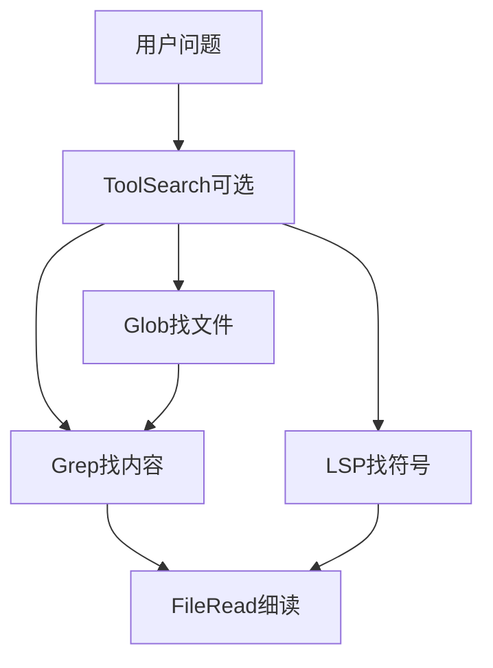
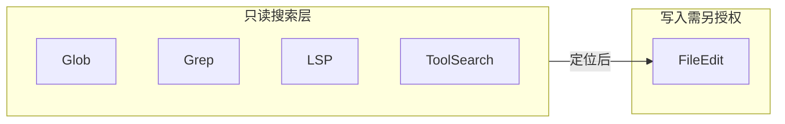

# 6.6 搜索工具族 — Glob / Grep / LSP / ToolSearch

> **前置阅读**：[6.1 全景](./index.md) · [6.11 延迟加载](./11-lazy-loading.md)（ToolSearch 可对照阅读）

---

## 学习目标

完成本节学习后，你应该能够：

1. **区分** `Glob`、`Grep`、`LSP`、`ToolSearch` 的适用场景与返回形态。
2. **解释** 为何搜索类工具通常标为 **只读** 且更易 **并发安全**（与 fail-closed 默认值对照）。
3. **说明** `ToolSearch` 与「42 工具全景」的关系：**元层**发现能力，延迟注入节省 Token。
4. **列举** 大仓库上使用 Grep/Glob 的**配额**与**截断**策略。
5. **关联** LSP 工具与 IDE 能力：定义跳转、引用查找、符号重命名前置。

---

## 生活类比：图书馆四件套

- **Glob** = **书架分区目录**：「三楼科技类所有书名」。
- **Grep** = **全文索引卡片**：「哪本书第几页出现关键词」。
- **LSP** = **专业编目员**：告诉你术语的**标准定义**与他人**引用关系**。
- **ToolSearch** = **问管理员「你们馆有哪些查询服务」**——先问目录，再决定用哪台终端。

---

## 四工具对比总表

| 工具 | 输入要点 | 输出要点 | Token 风险 | 典型失败 |
|------|----------|----------|------------|----------|
| `Glob` | `pattern`, `cwd?` | 路径列表 | 中（结果多） | 模式过宽 |
| `Grep` | `pattern`, `path?`, `glob?` | 匹配行+文件 | 高 | 正则灾难 |
| `LSP` | `uri`, `position`, `method` | 结构化符号 | 中 | 服务未就绪 |
| `ToolSearch` | `query` | 工具名+摘要 | 低 | 词不达意 |

---

## Glob：模式匹配与性能

```typescript
const GlobInput = z.object({
  pattern: z.string(),
  root: z.string().optional(),
  limit: z.number().int().positive().max(5000).optional(),
});
```

**实践**：

- 默认 **limit** 防止 `**/*` 爆炸。
- 排除 `node_modules`、`.git` 为内置约定（可配置）。

---

## Grep：内容与正则

```typescript
const GrepInput = z.object({
  pattern: z.string(),
  path: z.string().optional(),
  glob: z.string().optional(),
  caseInsensitive: z.boolean().optional(),
  contextLines: z.number().int().min(0).max(5).optional(),
});
```

**生活类比**：在**整库复印**前先用**便利贴**标上下文（`contextLines`），否则每 hit 一页 A4，账单惊人。

---

## LSP：语言服务桥接

LSP 工具将 **Language Server Protocol** 能力暴露给模型：

| 能力 | 教学用 LSP 方法 | 模型用途 |
|------|-----------------|----------|
| 跳定义 | `textDocument/definition` | 找实现 |
| 引用 | `textDocument/references` | 影响分析 |
| 符号 | `workspace/symbol` | 粗定位 |

**注意**：需要 IDE 或 headless language server **已启动**且项目可索引。

---

## ToolSearch：按需发现工具

**核心思想**：不在 system prompt 里一次性塞满 42 个工具说明，而是让模型先 **搜索工具目录**，再加载相关工具的 `prompt.ts` 片段（详见 6.11）。

| 维度 | 说明 |
|------|------|
| 延迟加载 | 仅注入候选工具 schema |
| 查询 | 自然语言 → 匹配工具名/标签 |
| 失败降级 | 返回「最接近的 3 个」 |

---

## Mermaid：搜索工具协作





---

## 源码片段：Grep 结果截断

```typescript
interface GrepHit {
  file: string;
  line: number;
  text: string;
}

function truncateGrepHits(hits: GrepHit[], maxHits: number, maxChars: number) {
  const out: GrepHit[] = [];
  let chars = 0;
  for (const h of hits) {
    if (out.length >= maxHits) break;
    if (chars + h.text.length > maxChars) break;
    out.push(h);
    chars += h.text.length;
  }
  return { hits: out, truncated: hits.length > out.length };
}
```

---

## 权限与治理

| 工具 | 常见默认 |
|------|----------|
| Glob/Grep/LSP | 只读，较宽松 |
| ToolSearch | 只读；结果可能泄露工具名（低敏感） |

**PreToolUse** 可限制 Grep 的 `path` 必须在子目录 `packages/app` 内等。

---

## 与 Bash 的边界

| 需求 | 优先 |
|------|------|
| 搜字符串 | `Grep` |
| `find` + `wc` | 仍可能 Bash，但 Grep/Glob 更可控 |
| `git grep` | 若需版本感知，可在 Grep 内封装 |

---

## 遥测维度

| 指标 | 用途 |
|------|------|
| `hitCount` | 调整默认 limit |
| `regexCompileMs` | 恶意 ReDoS 监测 |
| `lspMethod` | 语言服务器健康度 |

---

## 常见反模式

| 反模式 | 后果 |
|--------|------|
| 无 limit 的 Glob | 数万路径打爆上下文 |
| 巨型正则 | CPU 拒绝服务 |
| LSP 未就绪仍重试 | 卡死会话 |

---

## 小结

- **Glob/Grep** 解决「**在哪、有什么**」；**LSP** 解决「**语义上是什么关系**」。
- **ToolSearch** 解决「**有哪些工具可用**」，与延迟加载强相关。
- 搜索层尽量 **只读 + 截断**，为后续 **FileEdit** 铺路。

---

## 自测题

1. 何时应用 LSP 而非 Grep？举一对互斥场景。
2. ToolSearch 的结果若包含 MCP 工具名，会引入何种提示注入风险？
3. 如何为 Grep 设计「渐进式」结果（先文件列表再展开）？

**上一节**：[6.5 文件工具](./05-file-tools.md) · **下一节**：[6.7 AgentTool](./07-agent-tool.md)
