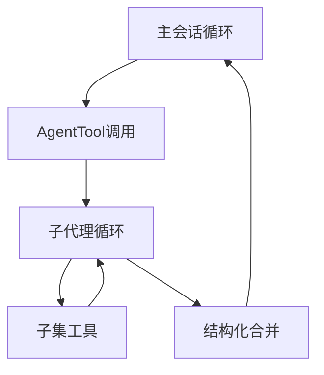
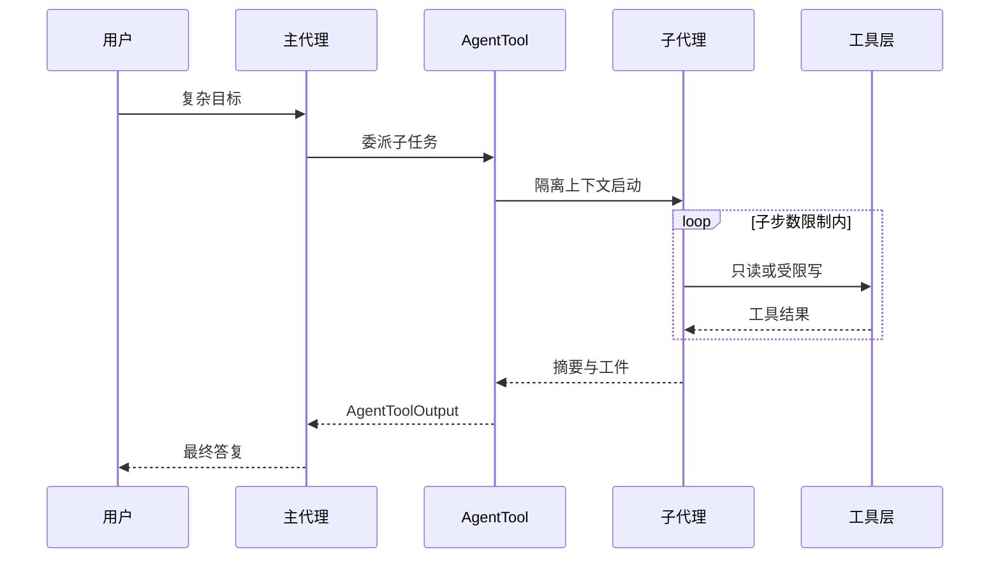

# 6.7 AgentTool — 子代理生成与隔离上下文

> **前置阅读**：[6.3 治理流水线](./03-governance-pipeline.md)

---

## 学习目标

完成本节学习后，你应该能够：

1. **解释** `AgentTool` 如何将复杂任务**委派**给子代理（subagent）执行。
2. **描述** 子上下文隔离的动机：Token 预算、权限降级、提示注入面。
3. **对比** 主循环与子循环在**工具白名单**、**模型参数**、**历史压缩**上的差异。
4. **列举** 子代理完成的典型任务：大范围重构调研、并行探索、沙箱验证。
5. **说明** 子代理返回结果如何**结构化合并**回主会话，避免「对话套娃」失控。

---

## 生活类比：项目经理与专项小组

主代理像**项目经理**：把握目标与边界，不亲自拧每一颗螺丝。`AgentTool` 像**成立专项小组**——小组有自己的会议室（**隔离上下文**）、自己的工具柜（**子工具白名单**）、结束后只交**验收报告**（**结构化摘要**），而不是把上千页会议记录塞回总经理邮箱。

---

## AgentTool 能力要素（表）

| 要素 | 说明 |
|------|------|
| 任务描述 | 自然语言 + 可选结构化约束 |
| 子系统提示 | 角色、输出格式、禁止项 |
| 工具子集 | 如仅 Glob+Grep+Read |
| 预算 | 最大步数、最大 Token、墙钟时间 |
| 返回契约 | JSON Schema / 固定章节 |

---

## 隔离上下文：三层含义

| 层 | 隔离内容 | 目的 |
|----|----------|------|
| 消息历史 | 子代理不见完整用户生平 | 减噪、保密 |
| 文件视图 | 可选 chroot / 子目录 | 缩小 blast radius |
| 密钥与 MCP | 子集或空 | 防数据渗出 |

---

## 源码片段：子代理调度（概念）

```typescript
interface AgentToolInput {
  objective: string;
  constraints?: string[];
  allowedTools?: string[];
  maxSteps?: number;
}

interface AgentToolOutput {
  summary: string;
  artifacts: Array<{ type: "file"; path: string } | { type: "json"; data: unknown }>;
  traceId: string;
}

async function agentToolCall(input: AgentToolInput, parentCtx: ExecutionContext): Promise<AgentToolOutput> {
  const childCtx = parentCtx.fork({
    toolAllowlist: input.allowedTools ?? DEFAULT_SUBAGENT_TOOLS,
    history: seedMessages(input.objective),
    budget: { maxSteps: input.maxSteps ?? 40 },
  });

  const runner = new AgentLoop(childCtx);
  const final = await runner.runUntilStop();

  return {
    summary: compressForParent(final.messages),
    artifacts: collectArtifacts(final.messages),
    traceId: childCtx.traceId,
  };
}
```

**要点**：`fork` 显式传递策略，避免隐式继承全部父权限。

---

## Mermaid：主代理与子代理





---

## 工具白名单建议（示例表）

| 子任务类型 | 推荐子集 |
|------------|----------|
| 代码调研 | Glob, Grep, FileRead, LSP |
| 文档撰写 | FileRead, WebFetch(可选) |
| 运行测试 | Bash(沙箱), FileRead |
| 大范围改 | 谨慎加入 FileEdit + 先读后写 |

---

## 与 Bash 的边界

| 用 Bash | 用 AgentTool |
|---------|--------------|
| 单条确定命令 | 多步探索 + 决策 |
| 脚本化流水线 | 需模型判断分支 |

**反模式**：为跑 `npm test` 专门 spawn 子代理 —— 过重；直接 Bash 更便宜。

---

## 结构化合并策略

| 策略 | 描述 |
|------|------|
| 模板摘要 | 固定 `## 结论` `## 证据` `## 风险` |
| 引用路径 | 仅回传路径列表 + 关键片段 |
| 差异包 | 子代理生成 patch，父代理审核 |

---

## 安全：提示注入与子代理

子代理若可 `WebFetch`，可能把**恶意页面指令**当真理。应：

- 对子代理 **降级 Web 权限**；
- **PostToolUse** 扫描外源内容中的「忽略上文」模式；
- 记录 **父→子** 的不可篡改 `objective` 哈希。

---

## 遥测

| 字段 | 用途 |
|------|------|
| `parentTraceId` / `childTraceId` | 关联追踪 |
| `subSteps` | 成本归因 |
| `toolHistogram` | 子代理行为画像 |

---

## 常见反模式

| 反模式 | 后果 |
|--------|------|
| 子代理继承全部 MCP | 攻击面翻倍 |
| 无步数上限 | 费用失控 |
| 子结果全文灌父上下文 | 上下文爆炸 |

---

## 小结

- **AgentTool** = **受预算约束的二次循环** + **隔离上下文** + **结构化回传**。
- **白名单与 fork** 是安全关键，不是可选优化。
- 适用于**高分支、多文件、需试探**的任务，而非单步 shell。

---

## 自测题

1. 子代理的 `traceId` 为何应与主会话关联？
2. 若子代理需要写库，如何设计「父审核再落盘」？
3. 何时应优先并行多个子代理 vs 单个子代理多步？

**上一节**：[6.6 搜索工具](./06-search-tools.md) · **下一节**：[6.8 外部工具](./08-external-tools.md)

---

## 预算调参指南（表）

| 参数 | 保守默认 | 放宽条件 | 风险 |
|------|----------|----------|------|
| `maxSteps` | 20–40 | 仓库极大且只读 | 费用↑ |
| 墙钟超时 | 2–5 min | CI 内可延长 | 占用 worker |
| 允许工具数 | 3–6 | 任务经人工批准 | 攻击面↑ |
| 返回摘要最大长度 | 2k–8k tokens | 需要附 patch | 父上下文膨胀 |

**生活类比**：给专项小组**会议时长上限**和**会议室人数上限**，不是不信任，而是**控制加班费**。

---

## 子代理输出契约模板（示例）

```markdown
## 结论
（1–3 句）

## 证据
- 文件路径 + 关键片段引用
- 或工具调用 ID / 时间戳

## 未解决问题
- 需要父代理或用户决策的点

## 建议的下一步
- 具体可执行动作
```

宿主可将该模板写进 **子系统提示**，降低合并难度。

---

## 故障排查

| 现象 | 可能原因 | 排查 |
|------|----------|------|
| 子代理空转 | 工具白名单过窄 | 临时开只读 Bash 日志 |
| 结果过长 | 无摘要模板 | 强制结构化节 |
| 与父结论冲突 | 目标歧义 | 收紧 `objective` 文本 |
| 费用暴增 | maxSteps 过大 | 分段委派 |

---

## 与 REPL 工具的差异（简表）

| 维度 | AgentTool | REPL |
|------|-----------|------|
| 控制流 | 模型多步循环 | 通常单行求值或短会话 |
| 状态 | 子上下文隔离 | 会话内变量持续 |
| 适用 | 探索+决策 | 快速验算/画图 |

---

## 小结补充

- **子代理不是免费午餐**：预算与模板是**必选项**。  
- **白名单**比「子代理里再开全集工具」更安全。  
- 与 **6.3 流水线** 结合：子循环内部仍应跑完整治理（仅策略可裁剪）。
