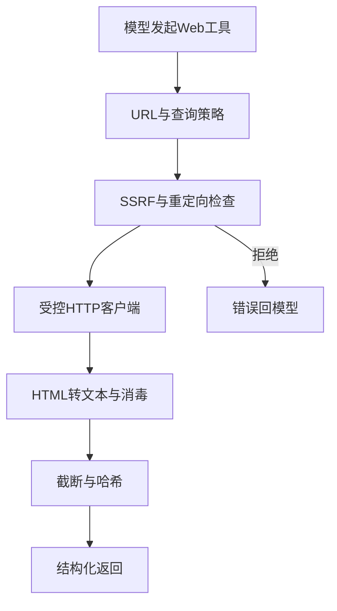
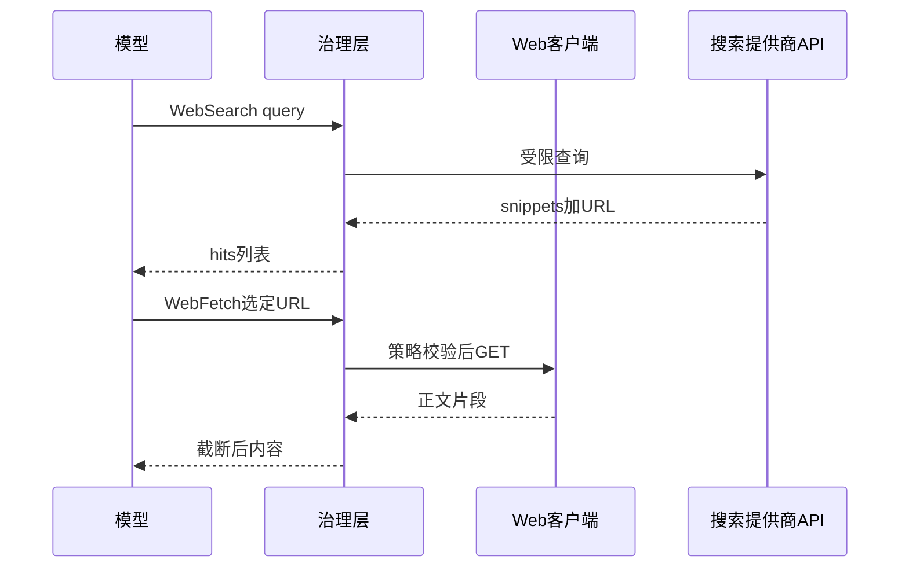

# 6.8 外部工具 — WebFetch 与 WebSearch

> **前置阅读**：[6.4 BashTool](./04-bash-tool.md)（出站对比） · [6.3 治理流水线](./03-governance-pipeline.md)

---

## 学习目标

完成本节学习后，你应该能够：

1. **区分** `WebFetch`（拉取 URL 内容）与 `WebSearch`（检索索引）的输入输出与风险模型。
2. **解释** 为何用专用 HTTP 工具替代 Bash 里的 `curl`：**策略集中**、SSRF 防护、响应大小上限。
3. **列举** Web 工具在治理流水线中的检查点：URL 白名单、重定向限制、内容类型过滤。
4. **说明** 搜索结果 **snippet vs 全文** 对 Token 与版权的影响。
5. **关联** `ReadMcpResource`（在 6.9 详述）与 Web 工具的边界：HTTP 通用 vs MCP 资源模型。

---

## 生活类比：持证记者 vs 私人侦探

- **WebFetch** 像**持证记者采访指定地址**：你只能去**报备过的门牌**（URL 策略），进门**最多录音 N 分钟**（响应截断），**危险品室**（二进制下载）默认不进。
- **WebSearch** 像**报社资料室**：管理员给你**剪报摘要**（snippet），未必附原文全书；要快、要广，但**细节需再 Fetch**。

---

## WebFetch vs WebSearch（总表）

| 维度 | WebFetch | WebSearch |
|------|----------|-----------|
| 输入 | `url`, `headers?`, `method?` | `query`, `locale?`, `timeRange?` |
| 输出 | HTML/文本片段、状态码元数据 | 结果列表（标题、URL、摘要） |
| 主要风险 | SSRF、恶意内容、超大响应 | 查询注入、结果投毒（SEO） |
| 与 Bash | 替代 `curl` 主路径 | 替代「手搓搜索引擎 API」 |

---

## WebFetch：实现要点

| 控制点 | 说明 |
|--------|------|
| DNS 重绑定 | 解析后再次校验 IP 段 |
| 内网 IP | 默认拒绝 `10/8`、`192.168/16` 等 |
| 重定向 | 限制次数，每跳重验 |
| `Content-Length` | 预检上限 |
| 超时 | 连接 + 首字节 + 总时长 |

---

## 源码片段：URL 策略（概念）

```typescript
const FetchInput = z.object({
  url: z.string().url(),
  maxBytes: z.number().int().positive().max(2_000_000).optional(),
});

function isUrlAllowed(url: URL, policy: FetchPolicy): boolean {
  if (policy.blockPrivateIp && isPrivateIp(url.hostname)) return false;
  if (policy.allowlistHosts && !policy.allowlistHosts.has(url.hostname)) return false;
  if (url.protocol !== "https:" && policy.httpsOnly) return false;
  return true;
}
```

---

## WebSearch：结果形态

```typescript
const SearchHit = z.object({
  title: z.string(),
  url: z.string().url(),
  snippet: z.string(),
  publishedAt: z.string().optional(),
});

const WebSearchOutput = z.object({
  hits: z.array(SearchHit).max(15),
  provider: z.string(),
});
```

**生活类比**：**菜单**（hits）与**后厨实物**（fetch 全文）分开，避免一上来端整头烤全羊。

---

## Mermaid：外部工具在流水线中的位置





---

## 内容与提示注入

| 风险 | 缓解 |
|------|------|
| 页面含「忽略上文」 | 内容消毒、引用分隔符 |
| 搜索引擎摘要被 SEO 污染 | 多源交叉、低权重采纳 |
| PDF/HTML 隐写 | 类型白名单、纯文本管线 |

---

## 与 MCP 的分工

| 场景 | 工具 |
|------|------|
| 任意公开文档 | WebFetch |
| 需登录或 OAuth 的 SaaS | MCP 工具 |
| 稳定资源 URI | ReadMcpResource |

---

## 遥测

| 事件 | 字段 |
|------|------|
| `web_fetch` | `host`, `status`, `bytes` |
| `web_search` | `provider`, `hitCount` |
| `ssrf_blocked` | `reason` |

---

## 常见反模式

| 反模式 | 后果 |
|--------|------|
| 允许 file:// Fetch | 本地文件读出 |
| 无截断 | 上下文与内存爆炸 |
| 搜索结果直接当真理 | 错误事实传播 |

---

## 小结

- **WebFetch** 解决**受控拉取**；**WebSearch** 解决**发现与导航**。
- **替代 curl** 的价值在策略与遥测**集中**。
- **SSRF + 大小 + 注入** 是三连击，应在前置阶段处理。

---

## 自测题

1. 重定向到 `file://` 时应如何处理？
2. 为何搜索摘要仍可能触发提示注入？
3. WebFetch 返回 Markdown 与 HTML 各有什么利弊？

**上一节**：[6.7 AgentTool](./07-agent-tool.md) · **下一节**：[6.9 MCP 工具](./09-mcp-tools.md)

---

## WebSearch 提供商维度（概念表）

| 维度 | 说明 |
|------|------|
| 地域合规 | 结果是否受区域法规影响 |
| 索引新鲜度 | 新闻/文档滞后 |
| snippet 长度 | 影响后续是否必须 Fetch |
| 配额与计费 | QPS、按调用计费 |
| 可观测性 | 是否返回可追溯 requestId |

**生活类比**：选搜索 API 像选**通讯社**——不只看价格，还要看**发稿速度**与**版权边界**。

---

## 重试与退避

| 场景 | 建议 |
|------|------|
| 429 / 5xx | 指数退避 + 最大重试次数 |
| DNS 失败 | 快速失败，提示检查网络策略 |
| TLS 错误 | 记录证书指纹，勿静默忽略 |

```typescript
async function fetchWithRetry(url: string, opts: { maxRetries: number }) {
  let delay = 300;
  for (let i = 0; i < opts.maxRetries; i++) {
    try {
      return await controlledFetch(url);
    } catch (e) {
      if (i === opts.maxRetries - 1) throw e;
      await sleep(delay);
      delay *= 2;
    }
  }
  throw new Error("unreachable");
}
```

---

## 缓存策略

| 类型 | 适用 | 注意 |
|------|------|------|
| URL 正文短缓存 | 静态文档 | 与鉴权响应勿混缓存 |
| 搜索结果不缓存 | 强时效查询 | 避免陈旧事实 |
| ETag | 大页面增量 | 需服务端支持 |

---

## 与 REPL / Bash 的边界

| 需求 | 推荐 |
|------|------|
| 拉取公开 API JSON | WebFetch（策略化） |
| 在本地算矩阵 | REPL / 语言运行时 |
| 克隆 Git 仓库 | 专用 VCS 工具或受控 Bash |

避免「WebFetch 拉脚本 | bash」这种**二段式绕过** —— 应在策略层识别组合风险。

---

## 合规与版权提示（教学）

| 实践 | 说明 |
|------|------|
| snippet 展示 | 控制长度，注明来源 URL |
| 全文抓取 | 遵守 robots 与服务条款（视场景） |
| 内网文档 | 走 VPN + 内网 URL 白名单 |

---

## FAQ

**问：为何不直接把 HTML 全量塞进上下文？**  
答：**Token、版权、XSS 消毒**三重压力；应用 `readability` 类提取与上限。

**问：WebSearch 结果能当作引用来源吗？**  
答：只能当**线索**；关键事实应 **Fetch 原文** 或 **交叉验证**。

**问：与 ReadMcpResource 如何二选一？**  
答：公网匿名可读 → WebFetch；需登录/组织内资源 URI → MCP（见 6.9）。

---

## 小结补充

- **WebFetch + WebSearch** 常成对出现：**先搜后取**。  
- **重试、缓存、合规** 属于生产必选项，而非「以后再说」。  
- 对外部工具保持 **fail-closed**：默认假设内容**不可信**，需消毒与截断。
