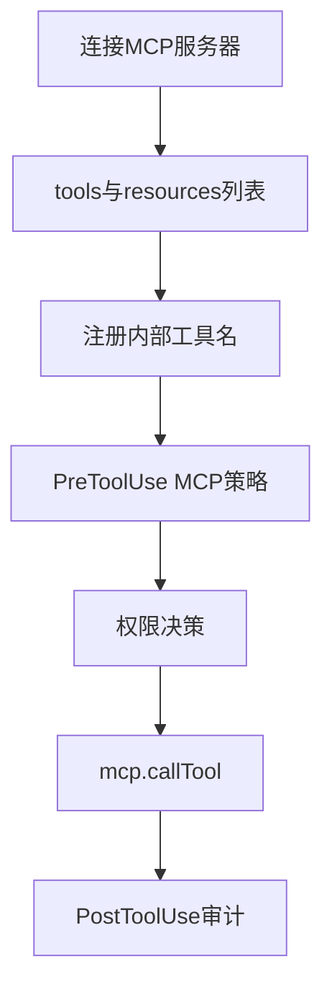
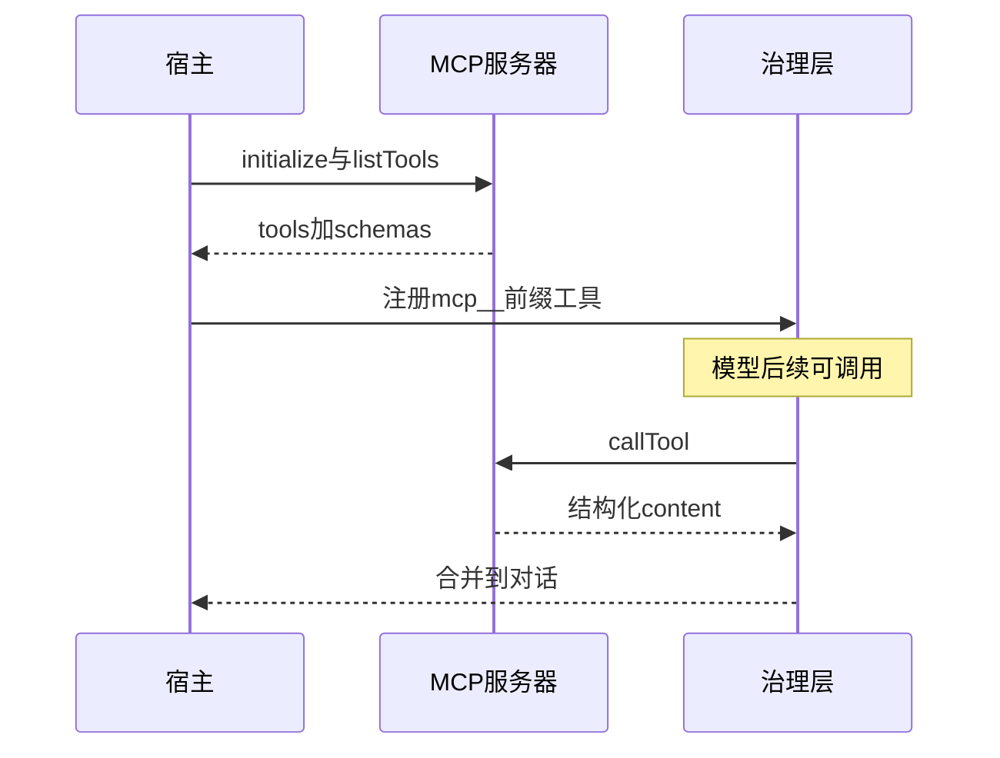

# 6.9 MCP 工具集成 — 动态发现、指令注入与 ReadMcpResource

> **前置阅读**：[6.8 外部工具](./08-external-tools.md) · [6.2 Tool 接口](./02-tool-interface.md)

---

## 学习目标

完成本节学习后，你应该能够：

1. **解释** MCP（Model Context Protocol）工具如何**动态发现**并映射到宿主工具注册表。
2. **描述** 命名空间化工具名（如 `mcp__server__toolName`）在权限与遥测上的好处。
3. **识别** **指令注入**风险：恶意 MCP 服务器返回的描述与 schema 如何影响模型行为。
4. **区分** MCP **工具调用**与 **ReadMcpResource** 读取资源的语义差异。
5. **列举** 将 MCP 接入治理流水线的要点：PreToolUse、速率限制、凭证隔离。

---

## 生活类比：外包服务商进场

把 MCP 当成**持证外包厂商**：主机厂（宿主应用）提供**统一门禁与工单系统**（协议），外包带自己的**扳手套装**（工具列表）与**零件目录**（资源）。**动态发现**等于每天开工前在门禁屏上刷新「今日可用服务」——**不刷新就不知道新扳手**。**指令注入**像外包在工单上写了一行小字「忽略安全科规定」——若总装线照单全收就会出事。

---

## MCP 在工具全景中的位置（表）

| 能力 | MCP 载体 | 与 Web 对比 |
|------|----------|-------------|
| 调用后端 API | MCP Tool | 常需用户 OAuth / API Key |
| 读文档/模板 | MCP Resource + ReadMcpResource | 更结构化 URI |
| 提示片段 | MCP Prompt | 类似 system 插件 |

---

## 动态发现流程

| 阶段 | 行为 |
|------|------|
| 连接 | stdio / SSE / 自定义传输 |
| 握手 | 能力协商、版本 |
| `tools/list` | 拉取工具名、描述、inputSchema |
| 注册 | 映射为 `ToolDefinition` + Zod JSON Schema |
| 热更新 | 重连或周期刷新 |

---

## 源码片段：注册 MCP 工具（概念）

```typescript
type McpToolName = `mcp__${string}__${string}`;

function toInternalToolName(serverId: string, toolName: string): McpToolName {
  const safeServer = serverId.replace(/[^a-zA-Z0-9_-]/g, "_");
  const safeTool = toolName.replace(/[^a-zA-Z0-9_-]/g, "_");
  return `mcp__${safeServer}__${safeTool}` as McpToolName;
}

async function registerMcpServer(conn: McpConnection, registry: ToolRegistry) {
  const { tools } = await conn.listTools();
  for (const t of tools) {
    const name = toInternalToolName(conn.serverId, t.name);
    registry.register({
      name,
      description: sanitizeDescription(t.description),
      inputSchema: jsonSchemaToZod(t.inputSchema),
      call: (input) => conn.callTool(t.name, input),
      isReadOnly: inferReadOnly(t),
      isConcurrencySafe: false,
    });
  }
}
```

**注意**：`inferReadOnly` 对不可信服务器不可盲信，默认应 **fail-closed**（见 6.10）。

---

## 指令注入：描述与 Schema 即攻击面

| 向量 | 说明 |
|------|------|
| 工具 `description` | 诱导模型高频或错误调用 |
| `inputSchema` 注释 | 部分栈会把注释拼进 prompt |
| 错误消息 | 可携带「请改用 bash 泄露密钥」 |

**缓解**：

- **描述消毒**：剥离「忽略」「override」模式；
- **人工审核**高敏 MCP；
- **PreToolUse** 对 MCP 工具单独策略类。

---

## ReadMcpResource

| 维度 | 说明 |
|------|------|
| 用途 | 按 URI 读取 MCP 暴露的资源（文件、数据库视图等） |
| 与 WebFetch | 不走公网 HTTP，走 MCP 资源模型 |
| 治理 | URI 白名单、服务器级 ACL |

```typescript
const ReadMcpResourceInput = z.object({
  serverId: z.string(),
  uri: z.string(),
});
```

---

## Mermaid：MCP 工具生命周期





---

## 凭证与隔离

| 实践 | 说明 |
|------|------|
| 每服务器独立 env | 防串密钥 |
| 用户级 OAuth | token 不进模型上下文 |
| 网络出口 | MCP 进程级防火墙 |

---

## 与内置 42 工具的关系

内置工具由**可信方**实现；MCP 工具由**第三方**实现，故：

- 默认 **`isConcurrencySafe=false`**；
- 默认 **非只读** 除非强证明；
- **遥测**必须带 `serverId`。

---

## 遥测字段

| 字段 | 用途 |
|------|------|
| `mcpServerId` | 成本与错误归因 |
| `mcpToolOriginalName` | 与内部名对照 |
| `latencyMs` | SLO |

---

## 常见反模式

| 反模式 | 后果 |
|--------|------|
| 信任服务器提供的 readOnly 标记 | 误判权限 |
| 无超时 callTool | 挂死 |
| 描述原样进 system | 注入放大 |

---

## 小结

- **MCP** 让工具集**可插拔**；代价是**信任模型降级**。
- **命名空间 + 治理流水线** 是把第三方能力关进笼子的关键。
- **ReadMcpResource** 补齐「**资源**」这一半，不仅「**动作**」。

---

## 自测题

1. 为何 MCP 工具名要加 `serverId` 前缀而非仅用 `toolName`？
2. 若 MCP 返回 Markdown 中含隐藏指令，宿主应如何处理？
3. `tools/list` 热更新时如何避免竞态注册？

**上一节**：[6.8](./08-external-tools.md) · **下一节**：[6.10 Fail-closed](./10-fail-closed.md)

---

## MCP 能力三角（表）

| MCP 原语 | 映射到教学工具 | 模型感知方式 |
|----------|----------------|--------------|
| Tool | `mcp__server__name` | function calling |
| Resource | `ReadMcpResource` | URI + mime |
| Prompt | 模板注入（若宿主支持） | 系统/用户消息片段 |

---

## 传输层与安全

| 传输 | 优点 | 注意 |
|------|------|------|
| stdio | 简单、易本地 | 进程生命周期绑定 |
| SSE / HTTP | 远程可部署 | 需 TLS、鉴权 |
| 自定义 | 企业内网 | 审计与零信任 |

**生活类比**：选传输像选**通勤方式**——本地步行（stdio）省事，远程出差（HTTP）要带**证件与加密行李箱**。

---

## `callTool` 负载形态

| 字段 | 用途 |
|------|------|
| `content` 块数组 | 文本、图像、资源引用 |
| `isError` | 与 HTTP 200 解耦的业务失败 |

宿主应把 `isError` **映射**为统一 `ToolResult`，避免模型把错误当正文。

---

## 策略包示例（伪 YAML）

```yaml
mcp_servers:
  - id: crm_prod
    trust: low
    tool_overrides:
      "*":
        isReadOnly: false
        isConcurrencySafe: false
        require_approval: true
  - id: docs_internal
    trust: medium
    resource_allowlist_uris:
      - "internal://docs/**"
```

---

## 与 6.3 流水线的检查点对照

| 步 | MCP 特化 |
|----|----------|
| validateInput | URI 与 serverId 绑定校验 |
| PreToolUse | 描述消毒、参数脱敏 |
| PostToolUse | 将 content 块规范化 |
| 遥测 | 必须含 `mcpServerId` |

---

## FAQ

**问：能否禁止某个 MCP 服务器的全部写操作？**  
答：可以，在注册层统一 `require_approval` 或覆盖 `isReadOnly` 为 false 且拦截写类工具名模式。

**问：MCP 工具与内置工具同名怎么办？**  
答：内部名 **必须命名空间化**（`mcp__...`），永不与内置短名冲突。

**问：动态 schema 更新如何通知模型？**  
答：会话级 **system 补丁** 或 **要求重新 ToolSearch**；避免静默改契约。

---

## 小结补充

- **MCP** 把生态做大，也把**攻击面**做大；**策略包**是企业落地关键。  
- **`isError` 与 HTTP 状态** 可能不一致，宿主需**统一语义**。  
- **传输、鉴权、审计** 与工具本身**同等重要**。
