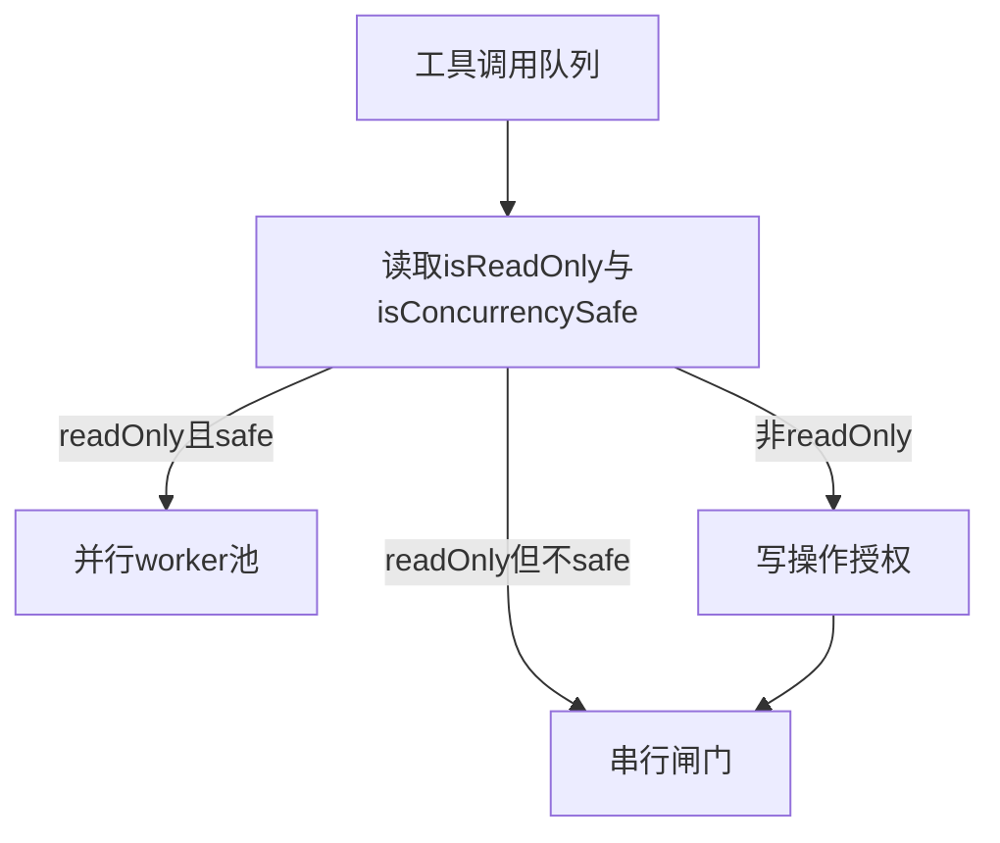

# 6.10 Fail-closed 设计 — 默认「不安全」与工厂函数

> **前置阅读**：[6.2 Tool 接口](./02-tool-interface.md) · [6.9 MCP](./09-mcp-tools.md)

---

## 学习目标

完成本节学习后，你应该能够：

1. **解释** `isConcurrencySafe=false` 与 `isReadOnly=false` 作为**默认值**的 fail-closed 含义。
2. **说明** 为何「未显式声明安全」的工具应视为**需串行或需锁**。
3. **设计** 工厂函数 `defineTool()`，强制调用方传入安全能力位，避免遗漏。
4. **对照** 只读搜索工具与 Bash 工具在安全位上的典型覆盖。
5. **关联** 权限 UI：默认拦截、显式放行与审计日志。

---

## 生活类比：化工管道默认阀门

Fail-closed 像**常闭电磁阀**：**断电（信息缺失）= 停止流动**。若你不知道一条管道是**单行道还是双向**，默认按**会爆炸**处理——**关阀**比**赌运气**便宜。

`isConcurrencySafe` 默认 `false`：不知道能否并行，就**不要并行**。`isReadOnly` 默认 `false`：不知道是否改状态，就**按会改状态**要求授权。

---

## 两个布尔位的语义（表）

| 字段 | `true` | `false`（默认 fail-closed） |
|------|--------|---------------------------|
| `isReadOnly` | 不写盘、不改外部系统 | **可能**写盘或副作用 → 需严格策略 |
| `isConcurrencySafe` | 可并行调用无竞态 | **可能**有竞态 → 串行或加锁 |

---

## 为何默认「不安全」

| 场景 | 若错误标 `readOnly: true` | 若错误标 `concurrencySafe: true` |
|------|---------------------------|-----------------------------------|
| 文件写 | 绕过写权限 | 交错写入损坏 |
| MCP 工具 | 静默改远端数据 | 重复扣款 |
| Bash | 极危 | 管道竞态 |

**原则**：只有**可证明**的性质才能标 `true`；缺失证明 → 保守默认。

---

## 源码片段：危险默认值（反例）

```typescript
// 反模式：默认值过于乐观
interface ToolDefBad {
  isReadOnly?: boolean; // 缺省 undefined → 被当成 falsy 仍可能逻辑错误
  isConcurrencySafe?: boolean;
}

function runBad(def: ToolDefBad) {
  const readOnly = def.isReadOnly ?? true; // 若有人误用「缺省即只读」会灾难
  // ...
}
```

---

## 源码片段：工厂函数强制显式（推荐）

```typescript
type SafetyFlags =
  | { isReadOnly: true; isConcurrencySafe: true }
  | { isReadOnly: true; isConcurrencySafe: false }
  | { isReadOnly: false; isConcurrencySafe: false };

interface ToolConfig<I, O> extends SafetyFlags {
  name: string;
  inputSchema: ZodSchema<I>;
  outputSchema: ZodSchema<O>;
  call(input: I): Promise<O>;
}

function defineTool<I, O>(config: ToolConfig<I, O>) {
  // 编译期：必须传入 SafetyFlags 联合的某一枝，不能省略
  return {
    ...config,
    // 运行期再次断言，防止 as any 逃逸
    meta: {
      isReadOnly: config.isReadOnly,
      isConcurrencySafe: config.isConcurrencySafe,
    },
  };
}

// 示例：只读且可并发
const globTool = defineTool({
  name: "Glob",
  isReadOnly: true,
  isConcurrencySafe: true,
  inputSchema: GlobInput,
  outputSchema: GlobOutput,
  call: async () => ({ paths: [] }),
});

// 示例：写操作必须 isReadOnly: false，通常 isConcurrencySafe: false
const fileEditTool = defineTool({
  name: "FileEdit",
  isReadOnly: false,
  isConcurrencySafe: false,
  inputSchema: FileEditInput,
  outputSchema: FileEditOutput,
  call: async () => ({ applied: true }),
});
```

---

## Mermaid：调度器如何消费安全位




---

## 与治理流水线的衔接

| 步骤 | fail-closed 影响 |
|------|------------------|
| 权限决策 | 非只读 → 默认弹窗 |
| 并行优化 | 非 concurrencySafe → 禁止合并 |
| 缓存 | 非只读 → 禁止缓存响应 |

---

## MCP 与第三方扩展

对 MCP 工具：

- **禁止**信任对端声明的 `readOnly` 除非有**本地证明**（静态列表或人工勾选）；
- 默认 **`isConcurrencySafe: false`**；
- 可在 `registerMcpServer` 内**覆盖**为更保守。

---

## 测试矩阵（概念表）

| 工具 | `isReadOnly` | `isConcurrencySafe` |
|------|--------------|---------------------|
| Glob | true | true |
| Grep | true | true（视实现，可能 false） |
| FileRead | true | true |
| FileEdit | false | false |
| Bash | false | false |
| MCP 未知 | false | false |

---

## 常见反模式

| 反模式 | 后果 |
|--------|------|
| 「大部分是只读」默认 true | 写穿权限 |
| 为性能盲目并行 | 数据竞争 |
| 用注释代替布尔位 | 调度器读不到 |

---

## 审计与 UI

| 事件 | 记录 |
|------|------|
| `tool_safety_flags` | 注册时快照 |
| `override` | 管理员改标记需留痕 |

---

## 小结

- **Fail-closed** = **缺省最保守** + **证明才可放宽**。
- **工厂函数 + 联合类型** 能在编译期减少遗漏。
- **调度与权限** 应消费同一套元数据，避免分叉逻辑。

---

## 自测题

1. 若 `isReadOnly=true` 但实现里写了日志文件，属于什么失败模式？
2. 何时 `isReadOnly=true` 仍不应 `isConcurrencySafe=true`？
3. 如何把 fail-closed 策略做成可配置的企业策略包？

**上一节**：[6.9 MCP](./09-mcp-tools.md) · **下一节**：[6.11 延迟加载](./11-lazy-loading.md)
