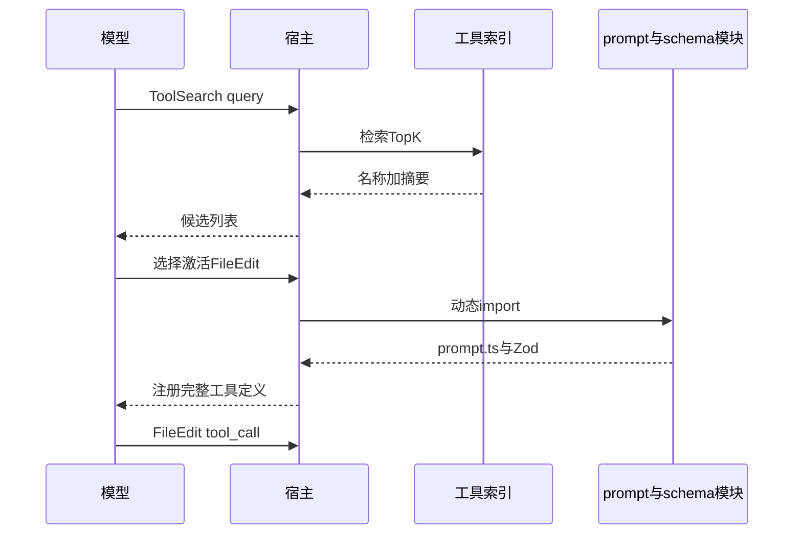

# 6.11 延迟加载 — ToolSearchTool、prompt.ts 与 Token 节省

> **前置阅读**：[6.1 全景](./index.md) · [6.6 搜索工具](./06-search-tools.md)

---

## 学习目标

完成本节学习后，你应该能够：

1. **解释** 为何一次性向模型暴露 42 个工具的**完整说明**会浪费 Token。
2. **描述** `ToolSearchTool` **按需注入**的工作流：查询 → 命中工具 → 挂载 schema 与描述片段。
3. **说明** 每个工具目录下的 **`prompt.ts`**（或等价文件）写给谁看、包含哪些内容。
4. **对比** 「全量工具列表」与「分层工具列表」在**首包延迟**与**误选率**上的权衡。
5. **列举** 实现延迟加载时的坑：schema 版本、缓存失效、命中排序。

---

## 生活类比：餐厅菜单与厨房小抄

**全量工具**像**一本 200 页菜单**：顾客（模型）从头读到尾才点菜，**点餐时间（首 Token）**很长。**延迟加载**像**先给分类目录**，顾客说「我想吃鱼」，服务员只递上**海鲜页**再加**今日特供小抄**（`prompt.ts`）。**ToolSearch** 就是**「请问有哪几种做法」**的问询台。

---

## Token 经济学（表）

| 策略 | system+tools 体积 | 误选风险 | 实现复杂度 |
|------|-------------------|----------|------------|
| 全量暴露 | 高 | 低 | 低 |
| 静态分组 | 中 | 中 | 中 |
| ToolSearch + 动态挂载 | 低 | 中-高 | 高 |

---

## ToolSearchTool 流程

| 步 | 行为 |
|----|------|
| 1 | 模型调用 `ToolSearch`，`query` 为任务关键词 |
| 2 | 宿主在工具元数据索引中检索（BM25/向量/标签） |
| 3 | 返回 Top-K 工具名 + 一行摘要 |
| 4 | 模型选定后，宿主**注入**完整 `inputSchema` 与详细描述 |
| 5 | 下一轮可 `call` 该工具 |

---

## prompt.ts：写给 AI 看的说明

| 区块 | 内容示例 |
|------|----------|
| 何时使用 | 「多文件重命名用我，不用 Bash sed」 |
| 输入诀窍 | 「path 必须相对仓库根」 |
| 反模式 | 「不要对大二进制用 FileRead」 |
| 与其他工具协作 | 「先 Grep 再 FileEdit」 |

**生活类比**：`prompt.ts` 是**岗位培训卡片**，不是给人看的 README 全文。

---

## 源码片段：工具元数据索引（概念）

```typescript
interface ToolPromptModule {
  whenToUse: string;
  tips?: string[];
  antiPatterns?: string[];
}

interface ToolCatalogEntry {
  name: string;
  summary: string;
  tags: string[];
  loadPrompt: () => Promise<ToolPromptModule>;
  loadSchema: () => Promise<{ input: ZodSchema<unknown> }>;
}

const catalog: ToolCatalogEntry[] = [
  {
    name: "FileEdit",
    summary: "对文本文件应用结构化编辑，需先读",
    tags: ["write", "patch", "file"],
    loadPrompt: () => import("./tools/FileEdit/prompt.js").then((m) => m.default),
    loadSchema: () => import("./tools/FileEdit/schema.js").then((m) => m.FileEditInput),
  },
];

async function toolSearch(query: string, k: number) {
  const ranked = rankByQuery(catalog, query); // 简化：关键词打分
  return ranked.slice(0, k).map((e) => ({ name: e.name, summary: e.summary }));
}

async function activateTool(name: string, session: Session) {
  const entry = catalog.find((e) => e.name === name);
  if (!entry) throw new Error("unknown tool");
  const [prompt, schema] = await Promise.all([entry.loadPrompt(), entry.loadSchema()]);
  session.attachTool({ name, prompt, inputSchema: schema.input });
}
```

---

## Mermaid：延迟加载时序




---

## 与 Tool 接口的衔接

延迟加载不改变 **Tool 接口**，只改变**何时**把 `description` + `inputSchema` 放进**可见上下文**：

| 阶段 | 模型可见 |
|------|----------|
| 初启 | 核心工具（Read/Bash/Search）+ ToolSearch |
| 激活后 | 额外工具的完整契约 |

---

## 缓存与失效

| 策略 | 说明 |
|------|------|
| 按版本哈希 | schema 变更 bump |
| 会话级缓存 | 避免重复 import |
| 冷启动预热 | 对高频工具同步加载 |

---

## 风险：检索失误

| 问题 | 缓解 |
|------|------|
| 搜不到 | 返回「相近」+ 建议关键词 |
| 搜错工具 | 多轮澄清；保留安全默认值 |
| 注入恶意条目 | 目录签名、可信源 |

---

## 遥测

| 指标 | 用途 |
|------|------|
| `toolsearch_query` | 优化索引与别名 |
| `activate_latency_ms` | import 性能 |
| `mismatch_rate` | 选错工具比例 |

---

## 常见反模式

| 反模式 | 后果 |
|--------|------|
| 动态加载无版本 | 新旧 schema 混用 |
| prompt.ts 过长 | 激活后仍爆 Token |
| 无 ToolSearch 回退 | 新用户不会用库 |

---

## 小结

- **延迟加载**把「**工具说明书**」从**首包**挪到**真正需要时**。
- **`ToolSearchTool`** 是元工具，`**prompt.ts**` 是面向模型的**操作手册**。
- 权衡：**Token↓** 可能带来 **误选↑**，需检索与默认核心工具兜底。

---

## 自测题

1. 哪些工具应始终常驻而不走延迟加载？
2. `prompt.ts` 与 `description` 字段如何避免重复冗长？
3. ESM 动态 `import()` 在 Serverless 冷启动下有何影响？

**上一节**：[6.10 Fail-closed](./10-fail-closed.md) · **下一节**：[6.12 实践](./12-practice.md)

---

## 常驻工具集建议（表）

| 常驻 | 理由 |
|------|------|
| FileRead | 几乎所有开发任务需读 |
| Glob 或 Grep | 导航仓库 |
| ToolSearch | 延迟加载入口 |
| Bash（受限）或替代 | 用户期望跑测试 |

| 可延迟 | 理由 |
|--------|------|
| NotebookEdit | 仅笔记本任务 |
| WebFetch | 仅联网任务 |
| 低频 MCP 工具 | 减攻击面与体积 |

---

## 与「工具裁剪」关系

**裁剪**：从全集删永不用的工具。**延迟加载**：全集仍在，但**描述与 schema 按需出现**。二者可组合：先裁剪高危/无用，再对长尾延迟。

---

## FAQ

**问：延迟加载会增加一轮对话吗？**  
答：通常 **会**（先 ToolSearch 再调用）；换得 **首包更小** 与 **更聚焦上下文**。

**问：如何避免循环依赖（搜不到就永远不用）？**  
答：**核心工具常驻** + **文档化典型工作流**（如「改配置先 Grep」）。

**问：prompt.ts 能否用多语言？**  
答：可以，但应与**用户界面语言策略**一致，避免模型混读。

---

## 小结补充

- **ToolSearch + prompt.ts + 动态 import** 是三位一体的 Token 策略。  
- **常驻最小集**决定「是否多一轮」与「误选率」的平衡。  
- 监控 **`toolsearch_query` → 激活工具** 漏斗，持续优化索引与别名。
