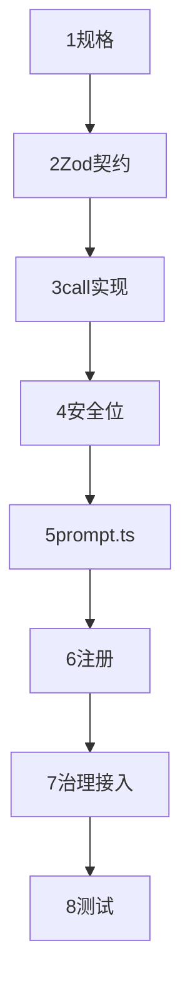
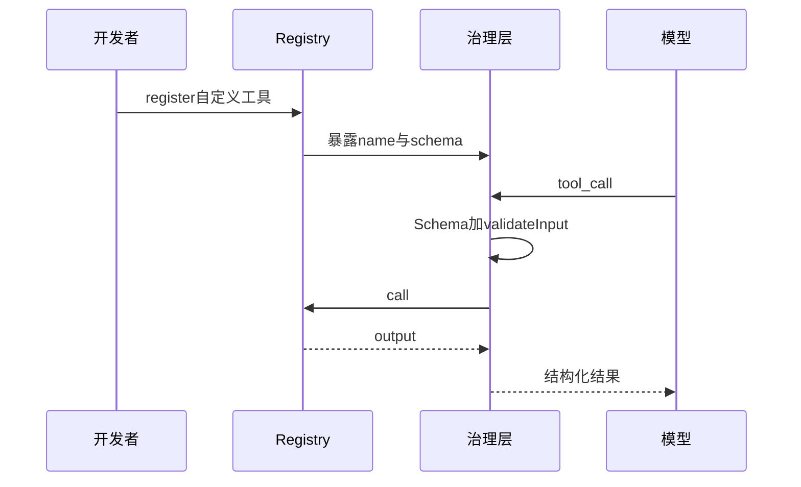

# 6.12 实践 — 构建自定义工具（步骤指南）

> **前置阅读**：[6.2 Tool 接口](./02-tool-interface.md) · [6.3 治理流水线](./03-governance-pipeline.md) · [6.10 Fail-closed](./10-fail-closed.md)

---

## 学习目标

完成本节学习后，你应该能够：

1. **按步骤** 从零实现一个宿主可加载的自定义工具：目录结构、Schema、`call`、注册。
2. **编写** 配套的 `prompt.ts`，让模型**稳定**选对工具并填对参数。
3. **接入** PreToolUse / 权限策略，演示**拦截**与**参数改写**。
4. **选择** 正确的 `isReadOnly` / `isConcurrencySafe` 默认与覆盖条件。
5. **验证** 输入输出 Zod 校验与**遥测**字段是否齐全。

---

## 生活类比：定制专用印章

自定义工具像**刻一枚法务专用章**：要有**印模尺寸**（Schema）、**用印流程**（治理流水线）、**谁能盖**（权限）、**盖完留底**（遥测）。刻完还要给文员一张**「何时盖此章」**的便签（`prompt.ts`），否则章会被盖在无关合同上。

---

## 步骤总览（表）

| 步号 | 步骤 | 产出 |
|------|------|------|
| 1 | 定义能力与边界 | 一句话 spec |
| 2 | 设计入参出参 Zod | `Input` / `Output` schema |
| 3 | 实现 `call` 纯逻辑 | 无模型依赖 |
| 4 | `defineTool` 包装安全位 | fail-closed 元数据 |
| 5 | 编写 `prompt.ts` | whenToUse + tips |
| 6 | 注册到 Registry | 名称唯一 |
| 7 | 接 Hook / 权限 | 风险分级 |
| 8 | 单元测试 + 契约测试 | `safeParse` 用例 |
| 9 | 遥测与文档字符串 | 运维可观测 |
| 10 | 灰度发布 | 特性开关 |

---

## 步骤 1：规格示例

**工具名**：`InvoiceTotal`

**做什么**：给定本地 JSON 路径，汇总 `items[].amount` 返回总和与币种。

**不做什么**：不访问网络；不修改文件。

→ 可得：`isReadOnly: true`，`isConcurrencySafe: true`（若文件只读快照）。

---

## 步骤 2–3：Schema 与实现

```typescript
import { z } from "zod";

const InvoiceTotalInput = z.object({
  path: z.string().min(1),
  currency: z.string().length(3).optional(),
});

const InvoiceTotalOutput = z.object({
  total: z.number(),
  currency: z.string(),
  itemCount: z.number().int().nonnegative(),
});

type In = z.infer<typeof InvoiceTotalInput>;
type Out = z.infer<typeof InvoiceTotalOutput>;

async function invoiceTotalCall(input: In): Promise<Out> {
  const raw = await fs.readFile(input.path, "utf8");
  const data = JSON.parse(raw) as { items?: Array<{ amount: number; currency?: string }> };
  const items = data.items ?? [];
  const currency = input.currency ?? items[0]?.currency ?? "USD";
  const total = items.reduce((s, it) => s + it.amount, 0);
  return { total, currency, itemCount: items.length };
}
```

---

## 步骤 4：defineTool 包装

```typescript
const invoiceTotalTool = defineTool({
  name: "InvoiceTotal",
  isReadOnly: true,
  isConcurrencySafe: true,
  inputSchema: InvoiceTotalInput,
  outputSchema: InvoiceTotalOutput,
  call: invoiceTotalCall,
  validateInput: async (input, ctx) => {
    const resolved = path.resolve(ctx.repoRoot, input.path);
    if (!resolved.startsWith(ctx.repoRoot)) {
      return { ok: false, reason: "路径必须在仓库内" };
    }
    return { ok: true };
  },
});
```

---

## 步骤 5：prompt.ts

```typescript
// tools/InvoiceTotal/prompt.ts
export default {
  whenToUse:
    "当用户给出仓库内发票 JSON 路径并需要汇总金额时使用；不要用于任意二进制文件。",
  tips: [
    "path 使用相对仓库根路径",
    "若多币种需先在业务层规范，本工具仅做简单默认",
  ],
  antiPatterns: ["不要用本工具读取 .env 或密钥文件"],
};
```

---

## 步骤 6：注册

```typescript
registry.register(invoiceTotalTool);
```

---

## 步骤 7：Hook 示例

```typescript
hooks.preToolUse = async ({ tool, input }) => {
  if (tool === "InvoiceTotal") {
    const p = (input as any).path as string;
    if (p.endsWith(".pem")) return { action: "deny", reason: "敏感扩展名" };
  }
  return { action: "allow" };
};
```

---

## Mermaid：自定义工具生命周期





---

## 步骤 8：测试清单（表）

| 用例 | 期望 |
|------|------|
| 缺字段 | Zod 失败 |
| 路径穿越 | validateInput 失败 |
| 超大 JSON | 可另加限额 |
| 并发两次 | 结果稳定 |

```typescript
test("InvoiceTotal rejects traversal", async () => {
  const r = await runValidate(invoiceTotalTool, { path: "../../../etc/passwd" });
  expect(r.ok).toBe(false);
});
```

---

## 步骤 9：遥测

```typescript
emitTelemetry({
  tool: "InvoiceTotal",
  itemCount: output.itemCount,
  durationMs: dt,
});
```

---

## 步骤 10：灰度

| 手段 | 说明 |
|------|------|
| 特性开关 | 仅内测 workspace |
| 配额 | 每会话 N 次 |
| 影子模式 | 执行但结果不返回模型，只记录 diff |

---

## 进阶：复用治理流水线

自定义工具**禁止**绕过统一入口；即使内部调用也应走：

`parse → schema → validateInput → hooks → authorize → call → telemetry → post`。

---

## 与 MCP 的对比

| 维度 | 宿主内自定义 | MCP 插件 |
|------|--------------|----------|
| 信任 | 高 | 低 |
| 部署 | 随版本发布 | 独立进程 |
| 默认安全位 | 仍建议保守 | 必须保守 |

---

## 常见反模式

| 反模式 | 后果 |
|--------|------|
| call 内直接 `fetch` 无策略 | SSRF |
| 无 output 校验 | 静默错误 |
| prompt 与实现不一致 | 模型误用 |

---

## 小结

- **自定义工具** = **契约（Zod）** + **实现（call）** + **安全位** + **模型说明（prompt.ts）** + **治理注册**。
- **测试**应覆盖 **Schema**、**路径规则**、**Hook**。
- **发布**用特性开关与遥测闭环。

---

## 自测题

1. 若工具只读但依赖进程全局缓存，并发安全位应如何标？
2. `validateInput` 与 Zod 的边界应如何划分？
3. 如何把自定义工具纳入 ToolSearch 索引？

**上一节**：[6.11 延迟加载](./11-lazy-loading.md) · **返回**：[6.1 全景](./index.md)
