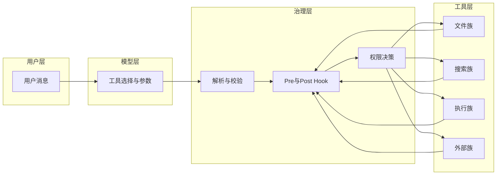
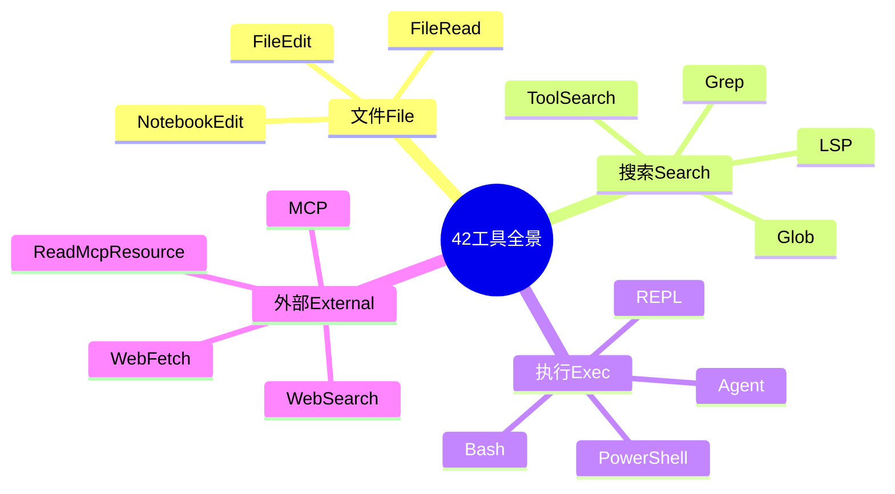

# 第六部分 · 工具系统（6.1）— 42 个内置工具全景

> **导航**：本部分共 12 节。本节为总览；后续各节深入接口、治理流水线、各类工具与工程实践。

---

## 学习目标

完成本节学习后，你应该能够：

1. **枚举** Claude Code 生态中约 42 个内置工具，并按「文件 / 搜索 / 执行 / 外部」四大类归类。
2. **解释** 每类工具在对话中的典型职责，以及为何需要如此拆分（权限、安全、Token 效率）。
3. **对照** 官方或实现中的命名习惯（如 `FileRead`、`Bash`），在文档与配置中快速定位能力边界。
4. **预判** 哪些操作会触发权限提示、子进程或网络 I/O，从而在架构设计时预留 Hook 与审计点。

---

## 生活类比：工具箱与专柜

把 Claude Code 的**工具系统**想象成一家**大型五金超市**：

- **文件类**像「档案柜 + 订书机」：只能动你授权范围内的纸张（工作区），改错可版本管理回滚。
- **搜索类**像「索引员 + 放大镜」：不直接改货，只告诉你东西在哪、长什么样。
- **执行类**像「车间里的机床」：能切能焊，但必须戴护目镜（权限与沙箱），误操作代价高。
- **外部类**像「电话与快递」：连到外界（网页、搜索 API、MCP 服务），需要额外信任与配额。

42 个工具不是 42 把一模一样的锤子，而是**分工明确的专柜**——柜员（运行时）按流程取货、登记、再交给顾客（模型）结构化结果。

---

## 42 工具功能分类总表

下表按**功能域**归纳内置能力（具体名称以你所用版本为准；数量为教学用「约 42」口径）。空单元格表示该域下无对应子类或合并到其他节讲解。

| 功能域 | 代表工具 / 能力 | 主要职责 | 典型风险 |
|--------|-----------------|----------|----------|
| **文件** | `FileRead`、`FileEdit`、`NotebookEdit` | 读/写文本与笔记本单元格 | 覆盖写、路径穿越 |
| **搜索** | `Glob`、`Grep`、`LSP`、`ToolSearch` | 模式匹配、符号与引用、按需发现工具 | 大仓库扫描耗 Token |
| **执行** | `Bash`、`PowerShell`、`Agent`、`REPL` |  Shell/子代理/交互解释器 | 任意命令、数据外泄 |
| **外部** | `WebFetch`、`WebSearch`、`MCP`、`ReadMcpResource` | HTTP、检索、MCP 工具与资源 | SSRF、提示注入、隐私 |

### 子类速查（教学用清单）

| 类别 | 工具族（示例） | 一句话 |
|------|----------------|--------|
| File | Read / Edit / Notebook | 先读后写（见 6.5） |
| Search | Glob / Grep / LSP / ToolSearch | 本地索引与「工具目录」 |
| Exec | Bash / PowerShell / Agent / REPL | 强治理与隔离 |
| External | Web / MCP | 出站与插件边界 |

---

## Mermaid：工具全景与数据流

下列流程图展示**用户意图 → 模型选工具 → 治理层 → 工具实现 → 结构化回传**的粗粒度关系（节点 ID 无空格，标签用引号包裹中文）。





---

## 源码片段（概念性）：工具注册伪代码

下列伪代码展示「工具名 → 实现 → Schema」的常见组织方式，与真实仓库结构类似，便于你在阅读源码时对照（非逐行拷贝自某一版本）。

```typescript
// 概念：工具注册表（Registry）
type ToolName =
  | "FileRead"
  | "FileEdit"
  | "Glob"
  | "Grep"
  | "Bash"
  | "WebFetch"
  | "mcp__server__toolName";

interface ToolDefinition<I, O> {
  name: ToolName;
  description: string;
  inputSchema: ZodSchema<I>;
  outputSchema: ZodSchema<O>;
  isReadOnly: boolean;
  isConcurrencySafe: boolean;
  call(input: I): Promise<O>;
}

const registry = new Map<ToolName, ToolDefinition<unknown, unknown>>();

function registerTool<I, O>(def: ToolDefinition<I, O>) {
  registry.set(def.name, def as ToolDefinition<unknown, unknown>);
}
```

要点：

- **名称**既是模型可见的 capability，也常作为遥测与权限策略的键。
- **Schema**在运行前约束参数，减少「胡编字段」导致的失败。
- **布尔标记**参与 fail-closed 默认值（详见 6.10）。

---

## 与后续章节的映射

| 本节概念 | 深入章节 |
|----------|----------|
| Zod 与 Tool 接口 | [6.2 工具接口设计](./02-tool-interface.md) |
| 解析→Hook→权限 | [6.3 十四步治理流水线](./03-governance-pipeline.md) |
| Bash / Shell | [6.4 BashTool](./04-bash-tool.md) |
| 先读后写 | [6.5 文件三件套](./05-file-tools.md) |
| Glob / Grep / LSP | [6.6 搜索工具族](./06-search-tools.md) |
| 子代理 | [6.7 AgentTool](./07-agent-tool.md) |
| Web | [6.8 外部工具](./08-external-tools.md) |
| MCP | [6.9 MCP 集成](./09-mcp-tools.md) |
| 默认不安全 | [6.10 Fail-closed](./10-fail-closed.md) |
| ToolSearch / prompt.ts | [6.11 延迟加载](./11-lazy-loading.md) |
| 自建工具 | [6.12 实践](./12-practice.md) |

---

## 小结

- **42 个内置工具**可按 **文件 / 搜索 / 执行 / 外部** 理解，核心是**权限、安全与 Token 经济**的平衡。
- **总图**帮助你把「模型选工具」放到「治理流水线」之下，避免把工具当成裸 API。
- 下一节将聚焦 **Tool 接口与 Zod Schema**，说明输入输出如何成为**可校验的契约**。

---

## 自测题

1. 为何「执行类」与「文件类」通常要分开治理？
2. `ToolSearch` 更靠近「搜索」还是「元工具」？它解决什么问题？
3. MCP 工具命名空间化（如 `mcp__...`）对权限策略有什么好处？

**下一节**：[6.2 Tool 接口设计（Zod 校验、输入输出 schema）](./02-tool-interface.md)

---

## 四十二工具教学枚举（按域占位）

下表为**课程用占位清单**：真实产品版本可能增删或改名，学习时以**官方文档与源码注册表**为准。目的有二：一是建立**心智地图**，二是练习**权限分级**思维。

| 序号 | 教学用名称 | 域 | 备注 |
|------|------------|----|------|
| 1 | FileRead | 文件 | 只读 |
| 2 | FileEdit | 文件 | 先读后写 |
| 3 | NotebookEdit | 文件 | 单元格级 |
| 4 | Glob | 搜索 | 路径模式 |
| 5 | Grep | 搜索 | 正则/文本 |
| 6 | LSP | 搜索/语义 | 需语言服务 |
| 7 | ToolSearch | 搜索/元 | 延迟发现 |
| 8 | Bash | 执行 | AST+黑名单 |
| 9 | PowerShell | 执行 | Windows |
| 10 | Agent | 执行 | 子代理 |
| 11 | REPL | 执行 | 交互解释器 |
| 12 | WebFetch | 外部 | 受控 HTTP |
| 13 | WebSearch | 外部 | 检索 API |
| 14 | MCP（动态 tools） | 外部 | 多工具 |
| 15 | ReadMcpResource | 外部 | 资源 URI |
| 16–42 | 其余内置与组合能力 | 混合 | 视版本：压缩、多模态、诊断、VCS 辅助等 |

> **说明**：第 16–42 项在不同发行版中对应**具体命名**（如编辑器的专用工具、测试运行器、Git 状态查询等）。教学上可把它们理解为：**在四大域之上叠加快捷封装**，仍服从同一套 **Tool 接口 + 治理流水线**。

---

## 术语速查

| 术语 | 解释 |
|------|------|
| Tool | 模型可调用的原子能力，含 schema 与实现 |
| Schema | 用 Zod/JSON Schema 描述的入参出参契约 |
| Hook | Pre/Post 注入点，可改写、拒绝或审计 |
| Fail-closed | 信息不足时选更保守默认（如非并发安全） |
| 延迟加载 | 推迟注入完整工具描述以降低首包 Token |
| MCP | 第三方工具与资源的插件协议 |

---

## 常见问题（FAQ）

**问：42 是硬性数字吗？**  
答：教学口径。实际以注册表为准；**架构方法**比精确个数重要。

**问：为何执行类工具特别少但风险最高？**  
答：Shell/子进程/子代理的 **blast radius** 大，产品侧往往用**更少工具 + 更强策略**而非堆数量。

**问：模型选错工具怎么办？**  
答：靠 **描述质量**、`prompt.ts`、**ToolSearch**、以及 **Schema 错误可恢复** 四件事一起兜。

**问：内置工具与 MCP 工具能混排吗？**  
答：可以，但必须在 UI 与策略上**区分信任级别**（见 6.9、6.10）。

---

## 版本与实现差异（阅读建议）

| 你手中的产物 | 建议对照 |
|--------------|----------|
| 开源宿主 | `registry` 初始化文件、`tools/` 目录 |
| 闭源 IDE 插件 | 官方「工具列表」文档 |
| 企业私有化 | 内部策略包：允许的工具子集 |

学习路径推荐：**6.1 → 6.2 → 6.3** 建立骨架，再按兴趣跳读 **Bash / 文件 / MCP**。

---

## 本节知识点回顾（ checklist ）

- [ ] 能不看资料画出四大域工具地图  
- [ ] 能解释「治理层」为何夹在模型与工具之间  
- [ ] 能举例说明哪类工具应默认非 `concurrencySafe`  
- [ ] 能说明 Web 与 MCP 在信任模型上的差异  

---

## 延伸阅读（与本部分其他节）

| 主题 | 章节 |
|------|------|
| Zod 双端校验 | [6.2](./02-tool-interface.md) |
| PreToolUse 顺序 | [6.3](./03-governance-pipeline.md) |
| curl 替代 | [6.4](./04-bash-tool.md) · [6.8](./08-external-tools.md) |
| 先读后写 | [6.5](./05-file-tools.md) |
| ToolSearch | [6.6](./06-search-tools.md) · [6.11](./11-lazy-loading.md) |
