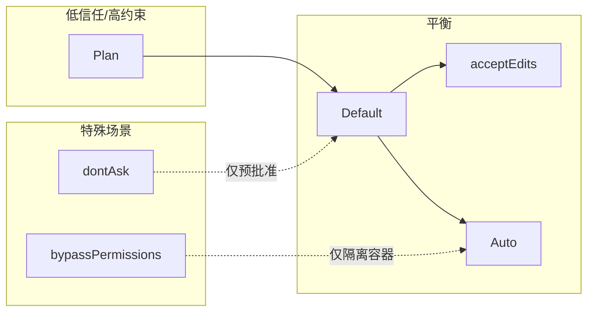
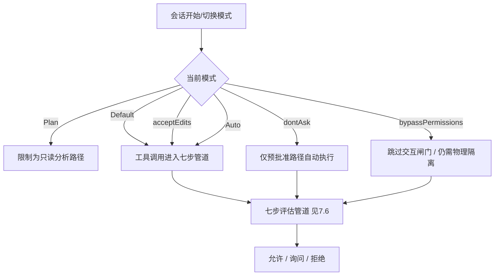

# 7.2 六种权限模式：一张总表读懂全局

> **本篇定位**：在 7.1 建立「为什么需要权限」之后，本节用**对比表 + 决策图**把六种模式一次性放到同一坐标系里，避免碎片化记忆。

---

## 学习目标

完成本节学习后，你应该能够：

1. **默写或复述** 六种模式的名称及其**一句话定位**（信任级别 + 典型场景）。  
2. **对照表格** 说明：在每种模式下，**只读**、**编辑**、**Shell 命令** 三类动作默认是「自动 / 询问 / 拒绝」中的哪一种倾向。  
3. **解释** `bypassPermissions` 为何必须绑定**隔离容器**，而不能当作日常开发快捷键。  
4. **选择** 在代码阅读、重度重构、CI 流水线中分别更适合的模式组合。  
5. **理解** Auto 模式中「后台分类器（Sonnet 4.6）」与其他模式的本质差异：**策略由模型在后台评估**，而非仅靠静态规则。  
6. **预判** `dontAsk` 下「未预批准即拒绝」对脚本稳定性的影响。

---

## 生活类比：机场安检等级

| 模式 | 类比 |
|-----|------|
| **Plan** | 只许站在玻璃外看飞机，不许登机（纯只读分析） |
| **Default** | 经济舱：随身行李要过机，托运要贴条（只读省事，动刀要确认） |
| **acceptEdits** | 常旅客：安检快一点，但液体仍有限制（编辑免批，命令仍要确认） |
| **Auto** | 智能闸机：先 AI 看你的包像不像危险品，再决定要不要开箱 |
| **dontAsk** | 货运清单：只收「单子上的货」，多一件都不要（CI） |
| **bypassPermissions** | 消防演练专用通道：仅限封闭场地，出了场地就是事故 |

---

## 核心总表：六种模式对比

| 模式 | 只读类操作 | 编辑类操作 | Shell / 外部命令 | 典型用户 | 主要风险若误用 |
|-----|-----------|-----------|-----------------|---------|---------------|
| **Default** | 倾向自动（免批） | **需确认** | **需确认** | 日常开发默认 | 反复弹窗（可用 allowlist 缓解，见 7.10） |
| **acceptEdits** | 倾向自动 | **免批** | **需确认** | 大规模重构、文档批量改 | 错误编辑扩散快 |
| **Plan** | 自动（在只读允许范围内） | **禁止 / 不执行** | **禁止 / 不执行** | 读代码、画架构、评审 | 无法落地改代码 |
| **Auto** | 只读常自动通过 | 依分类器与规则 | 依分类器与规则 | 想减少打断又不愿全开 | 分类误判 |
| **dontAsk** | 仅**预批准**集合内自动 | 同左 | 同左 | CI、自动化流水线 | 配置过宽=流水线变攻击面 |
| **bypassPermissions** | 理论上全放行 | 全放行 | 全放行 | **仅隔离容器**内调试 | 在主机上使用=灾难 |

> **注意**：上表描述的是**产品语义层面的倾向**；具体某一工具调用仍要经过 **7.6 七步管道**（工具 deny、ask、Bash 子命令检查、安全护栏等）。不要把「模式」理解成绕过管道的万能开关——`bypassPermissions` 是**例外中的例外**。

---

## Mermaid：六种模式的信任光谱



---

## Mermaid：用户请求如何先「选模式」再「过管道」



---

## 说明性配置片段：模式在 CLI / 设置中的示意

以下为**教学用伪配置**，键名以概念为主，请以你所用版本的官方文档为准：

```yaml
# 示意：权限模式（概念键名）
permission_mode: default   # default | accept_edits | plan | auto | dont_ask | bypass_permissions

# 示意：与 dontAsk 配套的预批准前缀/命令（概念）
preapproved_commands:
  - "npm test"
  - "pnpm lint"
  - "git status"
```

要点：

- **模式**解决「这一会话的信任基调」。  
- **预批准列表**解决「在 dontAsk 下什么仍允许自动跑」。  
- **规则文件**里的 `deny → ask → allow` 解决「具体到子命令/路径」的细粒度（7.6、7.10）。

---

## 模式与「命令黑名单」的叠加关系

你已知道：**`curl` / `wget` 默认在黑名单中**（拉取远程脚本的高风险通道）。模式**不会** magically 撤销硬安全策略——除非进入 `bypassPermissions` 且环境本身已隔离。

| 组合 | 预期行为（语义层） |
|-----|-------------------|
| Default + 黑名单命令 | 管道早期 **deny** 或强制 **ask**，以产品实现为准 |
| Plan + 任意写/执行 | 应在模式层即限制，不进入执行 |
| dontAsk + 非预批准 | **拒绝**（fail-closed 友好） |
| bypassPermissions + 黑名单 | 可能仍被企业策略拦截；**不应依赖**此组合 |

---

## 与 Auto 模式的一行预告

**Auto** 会启动 **Sonnet 4.6 后台分类器**：

- 匹配 `allow` / `deny` 规则 → **即时决策**；  
- **只读操作** → 常 **自动通过**；  
- 判定「不安全」→ 可能进入 **两阶段 XML 分类器** 做更稳的归类（详见 7.4）。

---

## 小结对照卡（建议收藏）

| 我想…… | 优先考虑 |
|--------|---------|
| 只聊天分析、不动手 | Plan |
| 日常写代码、偶尔跑命令 | Default |
| 大批量改文件、少被打断 | acceptEdits |
| 想少弹窗、又不敢全开 | Auto（配合规则细化） |
| CI 里稳定跑固定脚本 | dontAsk + 窄预批准 |
| 仅在 Docker/K8s 隔离里调试极端问题 | bypassPermissions（仍要最小化时长） |

---

## 深入阅读索引

| 主题 | 章节 |
|-----|------|
| Default / acceptEdits / Plan 细节 | [7.3](./03-basic-modes.md) |
| Auto 分类器 | [7.4](./04-auto-mode.md) |
| dontAsk / bypassPermissions | [7.5](./05-advanced-modes.md) |
| 七步管道 | [7.6](./06-evaluation-pipeline.md) |

---

## 自测题

1. 为什么说 **acceptEdits** 是「编辑加速」而不是「安全加速」？  
2. **Plan** 模式下，若仍能对磁盘写入，可能违背哪条安全原则（提示：7.9）？  
3. 若 CI 使用 **dontAsk**，但预批准里写了 `bash -c`，可能引入什么问题？

---

## 附录：英文标识与中文称呼对照

| 中文叙述常用 | 英文/配置中常见写法 |
|-------------|-------------------|
| 默认模式 | Default |
| 接受编辑 | acceptEdits |
| 计划/只读 | Plan |
| 自动 | Auto |
| 勿询问 | dontAsk |
| 绕过权限 | bypassPermissions |

---

## 常见反模式（团队规范可照抄禁止）

| 反模式 | 为何危险 | 替代做法 |
|--------|---------|---------|
| 长期 `bypassPermissions` 在本机 | 等同关闭产品安全层 | 短生命周期容器 + 最小时长 |
| CI `dontAsk` + 过宽预批准 | 流水线可被打成远程执行器 | 前缀锁定 + 哈希钉扎脚本 |
| 新人默认 `acceptEdits` | 误改扩散 | 先 Plan/Default 熟悉仓库 |
| 把 Auto 当「永不询问」 | 分类器会错 | 关键目录 deny 优先 |

---

## 模式切换的检查清单

在切换模式前自问：

1. **下一小时我会不会跑网络命令或装依赖？** → 谨慎从 Plan 切到 Default。  
2. **是否会改 50+ 文件？** → 考虑 acceptEdits，但先提交或开分支。  
3. **是否在共享 runner 上？** → 优先 dontAsk + 窄规则，而不是 Auto。  
4. **是否在客户 VPC 内？** → 禁止 bypass，除非安全团队书面批准 + 隔离证明。

---

*上一篇：[7.1 为什么需要权限](./index.md) · 下一篇：[7.3 Default/acceptEdits/Plan](./03-basic-modes.md)*
