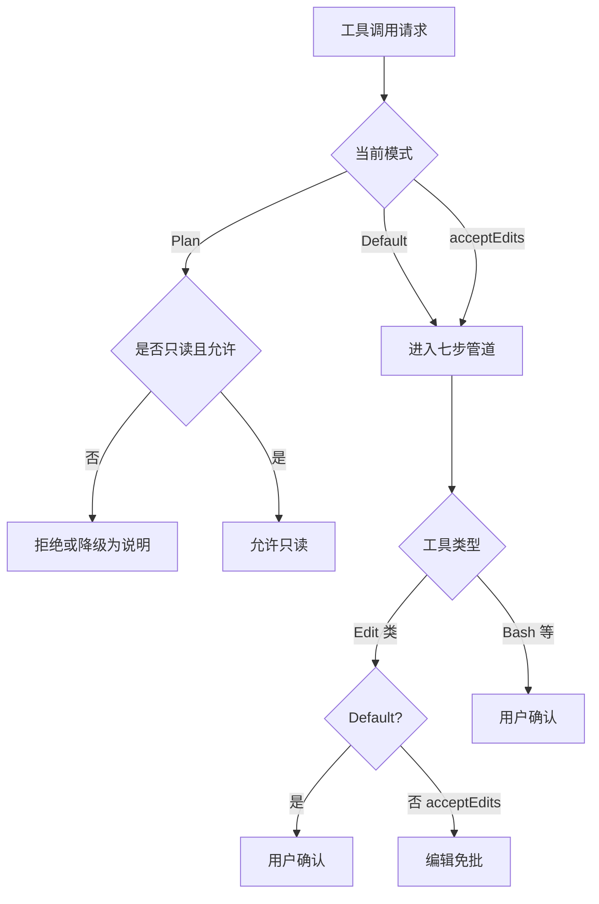
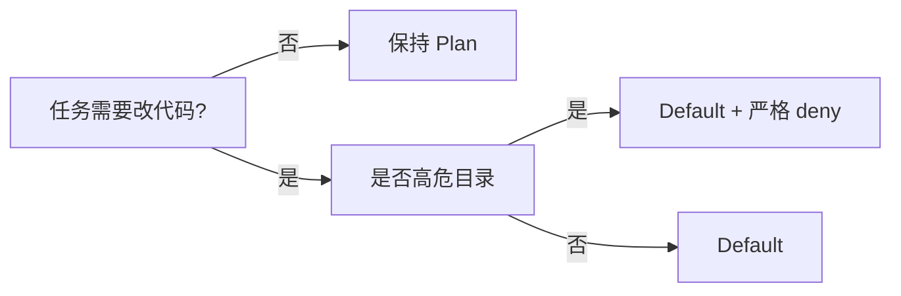

# 7.3 Default、acceptEdits、Plan 详解

> **本篇定位**：三种最常用、语义最清晰的模式——**默认平衡**、**编辑加速**、**只读分析**。掌握它们后，再读 Auto / dontAsk 会轻松很多。

---

## 学习目标

完成本节学习后，你应该能够：

1. **准确描述** Default 模式下「只读免批、编辑与命令要确认」的产品语义，并举例三种典型弹窗场景。  
2. **对比** acceptEdits 与 Default：在什么情况下换用能省时间，在什么情况下换用会放大错误。  
3. **说明** Plan 模式的边界：适合架构梳理、风险评审、 onboarding，而不适合需要落地改代码的任务。  
4. **绘制** 三者在「读写执行」三维空间中的位置关系（可对照本节 Mermaid）。  
5. **结合** 七步管道（7.6）理解：模式**不替代**工具级 deny/ask。  
6. **制定** 个人/团队默认策略：例如新人首周 Plan、核心库分支 Default、大规模格式化分支 acceptEdits。

---

## 生活类比：图书馆、编辑部、施工队

| 模式 | 类比 | 你能做什么 |
|-----|------|-----------|
| **Plan** | **图书馆阅览室** | 看书、做笔记、画思维导图；不能把书撕了重写 |
| **Default** | **杂志社编辑部** | 随便读；改稿、发稿、叫印刷厂要主编签字 |
| **acceptEdits** | **排版车间** | 批量改样式、统一术语；但叫「外包印刷」仍要签字 |

---

## 核心对照表

| 维度 | Default | acceptEdits | Plan |
|-----|---------|-------------|------|
| 读文件 / 分析 | 倾向 **免批**（在策略允许范围内） | 同左 | **核心用途**：只读分析 |
| 编辑工作区 | **需确认** | **免批** | **不执行** / 禁止写入路径 |
| Bash / 外部命令 | **需确认** | **需确认** | **不执行** |
| 典型心智负担 | 中等（弹窗频率适中） | 低（改文件快） | 最低（但无法动手） |
| 误操作后果 | 可控（编辑前有闸） | **编辑错误可快速扩散** | 低（几乎不能写） |

---

## Mermaid：三种模式下的请求路径（简化）



---

## Mermaid：何时从 Plan 切到 Default（决策树）



---

## Default 模式：日常开发的「主档位」

### 语义（牢记）

- **只读类**：在策略允许下常 **自动通过**，减少「读个文件也问一遍」的疲劳。  
- **编辑类**：**需要确认**——防止模型一次性改坏大量文件。  
- **命令类**：**需要确认**——`rm`、`git push --force`、包管理器等都应可见、可取消。

### 适用场景

- 功能开发、修 bug、小步提交。  
- 与 Code Review 流程配合：本地改动有闸，远程评审有第二道眼。  
- 对接 **allowlist**：把 `git status`、`npm test` 等**高频且低风险**命令放进允许列表，缓解 Prompt fatigue（7.10）。

### 说明性片段：Default 下的「编辑闸门」示意

```typescript
// 示意：Default — 编辑工具需显式批准
function shouldPromptForEdit(mode: PermissionMode, tool: string): boolean {
  if (mode === "plan") return true; // Plan 下应在更前阶段拦截
  if (tool === "edit" && mode === "default") return true;
  if (tool === "edit" && mode === "accept_edits") return false;
  return true; // 默认保守
}
```

---

## acceptEdits 模式：批量编辑的加速器

### 语义（牢记）

- **编辑免批**：适合「重命名贯穿全库」「格式化」「批量改 import」等。  
- **命令仍要确认**：防止在「省掉编辑弹窗」的错觉下，顺手批准了高危 Shell。

### 风险与缓解

| 风险 | 缓解 |
|-----|------|
| 模型改错 100 个文件 | 先开分支；小步 commit；用测试守护 |
| 与业务逻辑无关的「智能重排」 | Code review；关键路径加 deny |
| 误以为命令也免批 | 团队文档醒目标注「**仅编辑免批**」 |

### 何时切换

- **切换前**：`git status` 干净或已提交检查点。  
- **切换后**：完成大批量任务后**切回 Default**，避免「长期免批编辑」成为习惯。

---

## Plan 模式：纯只读分析

### 语义（牢记）

- **纯只读分析**：阅读、解释、画架构图、列出风险点、对比方案。  
- **不执行**写操作与 Shell（与产品实现对齐；若你的版本有细微差异，以官方文档为准）。

### 适用场景

- 新人阅读巨型单体仓库。  
- 安全评审、合规预审（「这段代码会访问哪些外部系统？」）。  
- 客户环境只允许「看」不允许「动」的演示。

### 与 Auto 的区分

- **Plan**：模式层就约束为只读路径，**不依赖**后台分类器做「能不能写」的取舍。  
- **Auto**：仍可能执行经分类与规则允许的写/命令；信任模型不同（7.4）。

---

## 三种模式与「写入仅限项目目录」

无论你用哪种模式，**写入限制**通常仍然成立：

- **只能写项目目录及子目录**；  
- **不能写父目录**（防止 `../` 逃逸）。

因此：

- **acceptEdits** 加速的是「项目内批量改」，不是「写到 `$HOME/.ssh`」。  
- **Plan** 若尝试写父目录，应在 **Edit 路径检查**（管道第 3 步）或更早失败。

---

## 团队规范模板（可粘贴到内部 Wiki）

```markdown
## Claude Code 模式使用规范

1. 默认：全员 **Default**。
2.  release 分支：禁止 **acceptEdits**；仅 hotfix owner 可申请临时切换并在当日切回。
3. 架构评审会议：共享屏幕使用 **Plan**。
4.  大规模 codemod：专用分支 + **acceptEdits** + CI 必须通过。
5.  任何 **bypassPermissions** 必须 ticket + 安全审批（见 7.5）。
```

---

## 小结

| 模式 | 一句话 |
|-----|--------|
| Default | 读省事，改和跑命令要你说「行」 |
| acceptEdits | 改可以一路畅通，跑命令仍要你说「行」 |
| Plan | 只动嘴（分析）不动手（写/执行） |

---

## 自测

1. Default 下，为什么「只读免批」不等于「任何读取都免批」？（提示：敏感路径、.git）  
2. acceptEdits 最适合与哪三种 Git 工作流习惯搭配？  
3. Plan 模式能否替代代码静态分析工具？为什么？

---

## 故障排查速查

| 现象 | 可能原因 | 建议 |
|-----|---------|------|
| 只读也总弹窗 | ask 规则过宽或工具被标为敏感 | 检查 deny/ask 顺序（7.6） |
| Plan 下仍能写 | 版本差异或插件绕过 | 核对官方 changelog |
| acceptEdits 不生效 | 实际模式未切换或管道 deny | 查工具级规则 |

---

## 场景演练（对照三种模式）

| 任务描述 | 推荐模式 | 理由 |
|---------|---------|------|
| 「用自然语言解释 `auth` 模块调用链」 | Plan | 不需要写盘或跑命令 |
| 「修复登录 bug 并跑单测」 | Default | 小步编辑与命令均需可见 |
| 「全仓库把 `legacy_api` 重命名为 `v2_api`」 | acceptEdits | 编辑量大；命令仍单独确认 |
| 「评估是否引入新依赖」 | Plan → Default | 先只读查现有依赖图，再切换执行 `pnpm why` |

---

## 与「命令黑名单」的日常配合

在 **Default** 与 **acceptEdits** 下，用户仍可能遇到「想 `curl` 文档」被拒：

| 用户意图 | 更安全替代 |
|---------|-----------|
| 拉安装脚本 | 用镜像内已缓存包或内部 Artifactory |
| 下载开源 release | 浏览器下载到 `~/Downloads` 后 **手动** `cp` 进项目（仍受写入边界约束） |
| API 调试 | 只读 Plan 分析 + 专用 Postman/Insomnia，不把密钥塞进 Shell 历史 |

---

*上一篇：[7.2 六种模式](./02-six-modes.md) · 下一篇：[7.4 Auto 模式](./04-auto-mode.md)*
