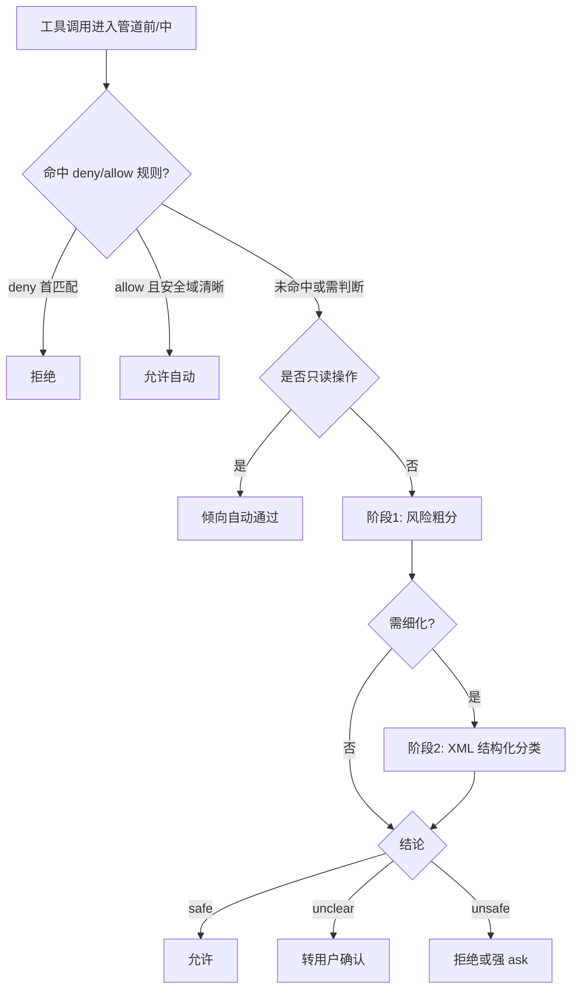
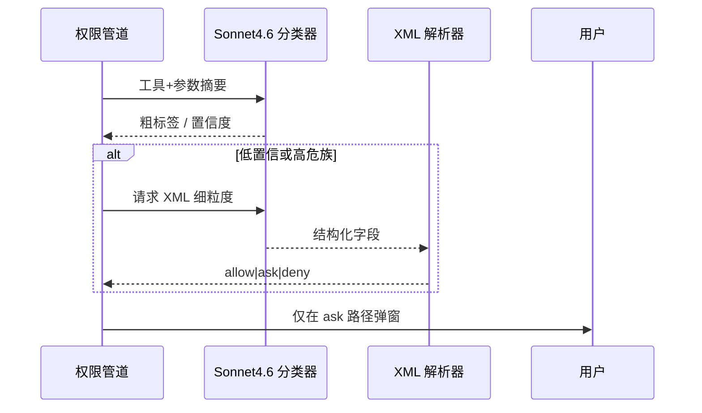

# 7.4 Auto 模式与后台分类器（Sonnet 4.6）

> **本篇定位**：Auto 模式把一部分「该不该弹窗」的决策交给**后台运行的 Sonnet 4.6 分类器**，在**规则匹配**与**安全降级**之间找平衡。本节讲清原理、边界与运维注意点。

---

## 学习目标

完成本节学习后，你应该能够：

1. **说明** Auto 模式中后台分类器的职责：评估工具调用意图与风险标签，映射到 allow/deny/ask。  
2. **描述** 「规则即时匹配 → 只读自动通过 → 不安全时两阶段 XML 分类器」的决策链。  
3. **对比** Auto 与 Default：前者减少打断，后者更可预测；能向经理解释取舍。  
4. **识别** Auto 的失效模式：分类错误、规则缺口、对抗性提示与异常工具输入。  
5. **配置** 思路：用 **deny 优先** 兜住高危路径与命令，Auto 负责「灰色地带」。  
6. **理解** 「Sonnet 4.6 在后台运行」对延迟、成本与隐私的影响（定性层面）。

---

## 生活类比：机场预检与复检

- **即时规则匹配**：液体容量一眼超标 → 直接拒，不用讨论。  
- **只读自动通过**：空手通过金属探测门 → 默认放行。  
- **两阶段 XML 分类器**：包里有奇怪形状 → 先机器断层扫描（第一阶段），仍可疑再人工开箱按清单逐项勾选（第二阶段，结构化 XML 便于程序解析）。

Auto 不是「完全不问」，而是**把问的时机交给模型 + 规则**，而不是事事找用户。

---

## 核心信息结构化

| 环节 | 行为 | 目的 |
|-----|------|------|
| 规则匹配 allow/deny | 命中即 **即时决策** | 确定性高的策略不走模型 |
| 只读操作 | 倾向 **自动通过** | 降低读文件类摩擦 |
| 判定不安全 / 不确定 | **两阶段 XML 分类器** | 结构化输出，减少胡言乱语导致的误执行 |
| 与七步管道关系 | Auto **不豁免** 工具 deny、路径检查等 | 模式是「用户交互策略层」之一 |

---

## Mermaid：Auto 模式决策总览



---

## Mermaid：两阶段分类器与下游系统



---

## 说明性伪代码：分类器输出约束为 XML

```xml
<!-- 示意：第二阶段期望的结构化片段（教学用） -->
<permission_decision version="1">
  <verdict>ask</verdict>
  <risk_family>network_fetch</risk_family>
  <confidence>0.72</confidence>
  <rationale>Command resembles package install with postinstall script.</rationale>
</permission_decision>
```

```typescript
// 示意：解析层只信字段，不信散文
function parseClassifierXml(raw: string): Decision {
  const doc = safeParseXml(raw);
  const verdict = doc.query("verdict")?.text; // allow | ask | deny
  if (!["allow", "ask", "deny"].includes(verdict)) {
    return { kind: "ask", reason: "malformed_classifier_output" };
  }
  return { kind: verdict as Verdict };
}
```

**要点**：XML（或等价结构化格式）让**程序可做 schema 校验**；若解析失败，应 **ask 或 deny**，而不是默认 allow（fail-closed，7.9）。

---

## 为什么「只读」常自动通过

只读操作（在沙箱与路径策略允许范围内）通常：

- **可逆性高**（不修改工作区）；  
- **频次高**（探索代码库）；  
- **用户价值大**（减少无意义打断）。

但注意：**读取 `.env`、密钥、`.ssh` 配置**仍可能被 **安全护栏** 或 **内容特定 ask** 拦截（7.6 第 6、7 步）。

---

## Auto 与命令黑名单的关系

**`curl` / `wget` 默认禁用** 属于**硬策略**。Auto 分类器不应被理解为「可以聪明到绕过黑名单」——正确做法是：

| 层级 | 谁说了算 |
|-----|---------|
| 工具级 deny | 硬拒，无覆盖（管道第 1 步） |
| 分类器 | 在 **未 deny** 的集合里细分 ask/allow |
| 用户 | 最终对 ask 路径拍板 |

---

## 运维与协作建议

1. **关键仓库**：对 `**/secrets/**`、`.env*`、`*.pem` 配 **deny 优先**。  
2. **监控**：记录分类器 verdict 分布，发现 `allow` 异常升高要复盘规则。  
3. **版本钉扎**：分类器模型升级（如 Sonnet 系列小版本）可能改变行为，升级后跑一轮回归场景。  
4. **隐私**：后台分类会上传**工具摘要**类信息到模型 API（依产品实现），敏感项目应用本地规则减小上传面。

---

## Auto vs Default 选择表

| 你的优先级 | 更合适的模式 |
|-----------|-------------|
| 可预测、可审计、培训新人 | Default |
| 熟练用户、规则已细化、愿承担分类误差 | Auto |
| 强合规、只读会议 | Plan（7.3） |

---

## 常见误解澄清

| 误解 | 事实 |
|-----|------|
| Auto = 全自动不问 | 仍可能 ask；deny 仍硬 |
| 分类器不会错 | 会错；用 deny 与沙箱兜底 |
| Auto 可替代代码审查 | 不能；只辅助权限交互 |

---

## 小结

- **Auto** 用 **Sonnet 4.6** 在后台做**风险分类**，把「灰色地带」从用户肩上卸下一部分。  
- **规则匹配**负责「黑白分明」；**只读**负责「高频低害」；**XML 两阶段**负责「结构化 + 可解析 + 可 fail-closed」。  
- 与 **七步管道** 叠加使用，**永远不要**用 Auto 作为唯一安全层。

---

## 自测

1. 若 XML 解析失败，系统应采取 allow 还是 ask/deny？为什么？  
2. 举出一个「只读但仍敏感」的路径，说明它为何不应仅依赖「只读自动通过」。  
3. deny 规则与分类器同时存在时，谁先谁后？（提示：首次匹配）

---

## 参考串联

- 七步管道：[7.6](./06-evaluation-pipeline.md)  
- Fail-closed：[7.9](./09-fail-closed.md)  
- 企业 allowlist：[7.10](./10-practice.md)

---

## 监控指标建议（定性）

| 指标 | 异常信号 |
|-----|---------|
| `allow` 比例周环比 | 突然上升 → 规则被改宽或分类器漂移 |
| `ask` 集中在某仓库 | 该仓库路径规则缺失 |
| 用户手动改为 Default | 对 Auto 不信任的投票 |

---

## 与「只读自动通过」的例外讨论

以下只读仍可能需要 **ask** 或 **deny**（取决于企业基线）：

| 路径/内容 | 原因 |
|-----------|------|
| `**/*secret*` | 命名即敏感 |
| `*.pem` / `id_rsa` | 密钥材质 |
| `.claude/settings.local.json` | 可能含 token |
| 巨大二进制 | 非安全但涉带宽/隐私政策 |

---

## 版本与模型说明（声明）

本节中 **Sonnet 4.6** 与 **两阶段 XML 分类器** 描述依据产品公开语义整理；具体模型名、端点与日志字段以你所用版本为准。升级大版本后应复测三类用例：**纯读**、**安全写**、**明显恶意链**。

---

*上一篇：[7.3 基础模式](./03-basic-modes.md) · 下一篇：[7.5 高级模式](./05-advanced-modes.md)*
