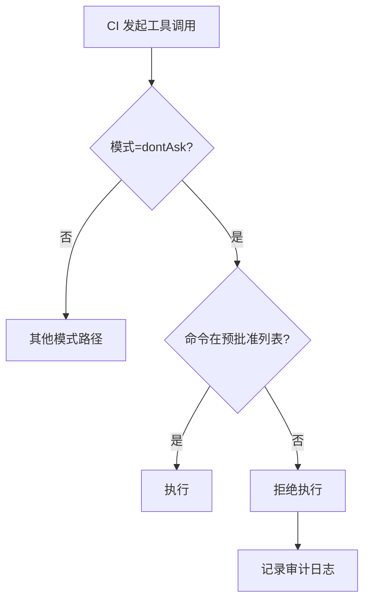
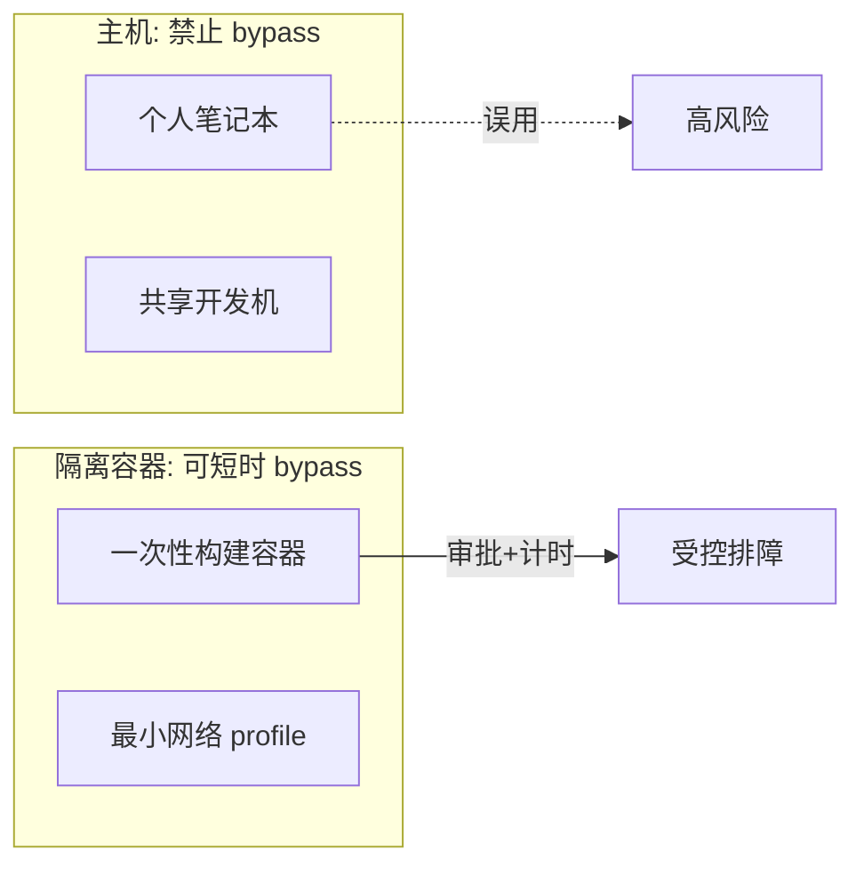

# 7.5 dontAsk 与 bypassPermissions

> **本篇定位**：**dontAsk** 服务 CI 与确定性自动化；**bypassPermissions** 是「核弹选项」，**仅**应在隔离容器中使用。本节把边界、风险与合规话术写清楚。

---

## 学习目标

完成本节学习后，你应该能够：

1. **复述** dontAsk 的核心语义：**只执行预批准**，否则 **拒绝**；说明为何适合 CI。  
2. **解释** bypassPermissions：**全跳过**交互闸门；为何文档与内规应写「仅隔离容器」。  
3. **设计** 一套「预批准命令」清单的粒度：前缀锁定、哈希钉扎、禁止 `bash -c` 泛化。  
4. **向安全团队陈述** 使用 bypassPermissions 的审批材料：威胁模型、时长、网络策略、日志留存。  
5. **对比** dontAsk 与 Auto：前者 **确定性**，后者 **模型参与**。  
6. **识别** 典型事故：共享 runner 上误开 bypass、预批准里写了 `curl`。

---

## 生活类比

| 模式 | 类比 |
|-----|------|
| **dontAsk** | **无人值守自动售货机**：只认「编好号的货道」；你塞硬币想买没上架的货 → **直接退币（拒绝）** |
| **bypassPermissions** | **消防演习时拆掉办公楼门禁**：只在封闭演练场有效；若在日常办公楼常态拆除 → **全员失窃风险** |

---

## 核心对照表

| 维度 | dontAsk | bypassPermissions |
|-----|---------|-------------------|
| 用户交互 | **无**（未预批准则拒） | **无**（全跳过） |
| 适用场景 | CI、自动化、回归脚本 | **仅** Docker/K8S/VM **隔离**调试 |
| 确定性 | **高**（清单驱动） | **低**（依赖环境隔离） |
| 配错后果 | 流水线失败（fail-closed 友好） | 主机被一锅端（fail-open 灾难） |
| 与黑名单 | 预批准仍不应包含 curl/wget 类（应拒） | 技术上可能执行，**绝对不应依赖** |

---

## Mermaid：dontAsk 执行流



---

## Mermaid：bypassPermissions 与容器边界



---

## dontAsk：预批准清单设计原则

### 推荐做法

| 原则 | 说明 |
|-----|------|
| **前缀锁定** | `npm run test --` 固定脚本名，避免自由拼接 |
| **禁止泛化 shell** | 不写 `sh -c` / `bash -c` 通配 |
| **哈希钉扎** | 对辅助脚本 `sha256sum` 校验后再执行 |
| **环境变量最小化** | CI secret 仅注入必要键 |
| **分环境清单** | `ci-frontend.yaml` / `ci-backend.yaml` 分离 |

### 说明性 YAML 片段

```yaml
# 示意：dontAsk 预批准（教学）
permission_mode: dont_ask
preapproved_commands:
  - "pnpm -s test"
  - "pnpm -s lint"
  - "git diff --stat"
# 明确不要写：
# - "curl https://..."
# - "bash -c '...任意...'"
```

---

## bypassPermissions：何时「理论上可用」

仅当同时满足：

1. **进程在隔离文件系统内**（容器 rootfs，不包含宿主 `$HOME`）。  
2. **网络策略**默认拒绝或严格 egress allowlist。  
3. **生命周期短**：排障结束立即销毁容器。  
4. **审批与 ticket**：谁、何时、为何、如何验证无数据渗出。  
5. **日志外送**到公司 SIEM（若合规要求）。

### 伪代码：双重门禁

```typescript
function assertBypassAllowed(ctx: RuntimeContext) {
  if (ctx.permissionMode !== "bypass_permissions") return;

  if (!ctx.isolatedContainer) {
    throw new SecurityError("bypassPermissions requires isolated container");
  }
  if (!ctx.approvalTicketId) {
    throw new SecurityError("missing approval ticket");
  }
  // 仍可叠加：宿主机上直接拒绝启动该模式
}
```

---

## dontAsk vs Auto（给架构师的表）

|  | dontAsk | Auto |
|--|---------|------|
| 决策主体 | 清单 + 管道 | 清单 + 管道 + **分类器** |
| CI 可重复性 | 优 | 中（模型输出需约束） |
| 灵活性 | 低 | 高 |
| 误配风险类型 | 清单过宽 | 规则 + 模型双误差 |

**经验**：**CI 用 dontAsk**，**人机协作用 Default/Auto**。

---

## 合规话术模板（提交给安全审批）

```text
申请事项：在隔离构建容器内短时启用 bypassPermissions
时间窗口：2026-04-02 14:00–16:00 UTC
原因：复现仅当权限全放行时触发的工具链 bug
隔离证明：镜像 ID xxx，无宿主挂载，egress 仅 registry 白名单
数据：仓库不含 PII；构建日志脱敏后上传 bucket yyy
回滚：容器销毁；模式恢复 dontAsk
```

---

## 与七步管道的关系

即使 **bypassPermissions**，在**企业加固版**实现中仍可能保留：

- 宿主机级别的 **Seatbelt/bubblewrap**（7.8）  
- 某些 **硬编码 deny**（视产品策略）

教学上请假设：**bypass 跳过的是「用户交互」**，**不保证跳过所有 OS 策略**——以实际版本为准。

---

## 命令黑名单提醒

**curl/wget 默认禁**：dontAsk 的预批准若试图放行，应在 **code review 阶段拒绝合并**。bypass 在容器内也**不应**成为下载任意脚本的借口。

---

## 小结

| 模式 | 一句话 |
|-----|--------|
| dontAsk | **只跑清单上的；清单外的统统拒绝**——CI 之友 |
| bypassPermissions | **跳过询问的核弹**——**只配待在隔离容器里** |

---

## 自测

1. 为什么 `preapproved_commands: ["bash -c"]` 几乎等于放弃 dontAsk？  
2. bypassPermissions 与「写入仅限项目目录」同时成立时，攻击面还剩哪些？  
3. 若 CI 需要 `curl` 下载依赖，更安全的替代方案是什么？（提示：缓存层、镜像预装、私有 registry）

---

## 故障排查

| 现象 | 可能原因 |
|-----|---------|
| dontAsk 下全失败 | 命令与清单字符串不完全一致（空格/参数） |
| bypass 仍弹窗 | 企业策略或宿主拦截 |
| CI 间歇通过 | Auto 与 dontAsk 混用 |

---

## 时间盒（Time-boxing）实践

对 **bypassPermissions** 建议强制 **时间盒**：

| 字段 | 示例 |
|-----|------|
| 开始 UTC | 2026-04-02T06:00:00Z |
| 结束 UTC | 2026-04-02T08:00:00Z |
| 审批人 | security@example.com |
| 容器镜像 digest | `sha256:abcd…` |

到期后 CI 与本地 profile **自动回退** 至 Default/dontAsk，避免「临时绕过」变成永久配置。

---

*上一篇：[7.4 Auto 模式](./04-auto-mode.md) · 下一篇：[7.6 七步管道](./06-evaluation-pipeline.md)*
