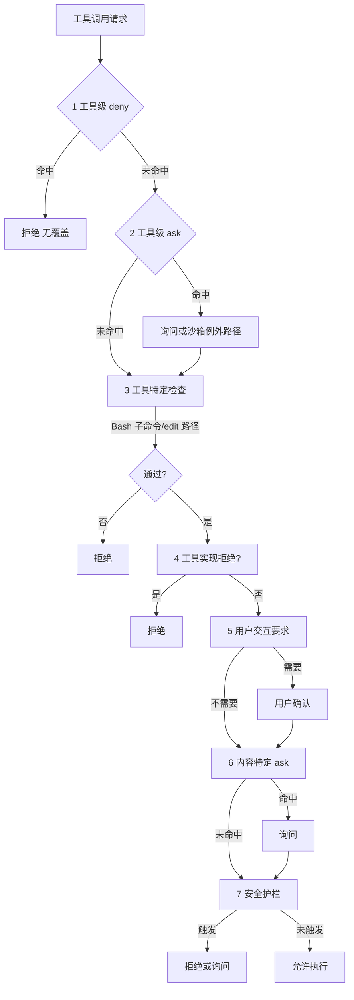
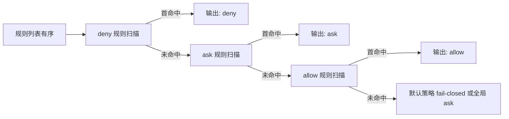

# 7.6 七步权限评估管道（完整流程图）

> **本篇定位**：把分散的规则串成**一条有序管道**。顺序很重要：**deny → ask → allow，首次匹配生效**。本节是第 7 篇的理论中枢。

---

## 学习目标

完成本节学习后，你应该能够：

1. **按顺序背诵** 七个步骤，并说明每一步的输入/输出。  
2. **解释** 为何「工具级 deny」是硬拒且无覆盖（在标准语义下）。  
3. **说明** 「工具级 ask」与「沙箱例外」的关系（第 2 步）。  
4. **指向** Bash 与 Edit 的专项检查分别属于第 3 步的哪类逻辑（7.7 详解）。  
5. **区分** 第 5 步「用户交互要求」与第 6 步「内容特定 ask」。  
6. **列举** 第 7 步安全护栏涉及的典型路径：`.git`、`.claude`、shell 配置等。

---

## 生活类比：海关七道岗

| 步骤 | 类比 |
|-----|------|
| 1 工具 deny | **绝对禁运清单**：毒品一律扣，无「领导批条」 |
| 2 工具 ask | **特许通道也要抽检**：外交邮袋可过，但仍可能开箱 |
| 3 工具特定检查 | **品类专检**：肉类检疫、电子产品辐射 |
| 4 工具实现拒绝 | **仪器故障/读数异常**：宁可滞留 |
| 5 用户交互 | **你本人到场签字** |
| 6 内容特定 ask | **行李里发现液体超量**：单独问这一瓶 |
| 7 安全护栏 | **国门生物安全**：土壤、种子一律特殊处置 |

---

## 七步管道总表

| 步骤 | 名称 | 要点 |
|:---:|-----|------|
| 1 | **工具级 deny 规则** | **硬拒**，无覆盖；命中即停 |
| 2 | **工具级 ask 规则** | 可定义「沙箱例外」等：仍可能触发询问或受限执行 |
| 3 | **工具特定检查** | **Bash**：子命令/AST；**Edit**：路径是否在允许写入范围 |
| 4 | **工具实现拒绝** | 运行时实现层拒绝（参数不合法、越权等） |
| 5 | **用户交互要求** | 当前模式若要求确认 → 弹窗/CLI 提示 |
| 6 | **内容特定 ask** | 命中敏感内容模式 → 即使前面偏 allow 也可能要问 |
| 7 | **安全护栏** | `.git`、`.claude`、**shell 配置**等全局敏感区 |

---

## Mermaid：七步管道（自上而下）



---

## Mermaid：规则顺序 deny → ask → allow（首次匹配）



---

## 各步详解（精简版）

### 第 1 步：工具级 deny（硬拒无覆盖）

- **目的**：把「永不希望发生」的动作挡在最前。  
- **特性**：命中后**不再**被 allow 或用户「我记得批准过」覆盖——这是防社会工程与误点的关键。  
- **示例**：`rm -rf /`、`curl` 下载远程脚本、写入 `~/.ssh`。

### 第 2 步：工具级 ask（沙箱例外）

- **目的**：对「需要知道一下」的动作统一打标。  
- **沙箱例外**：某些 ask 规则可配合 **受限沙箱**（7.8）——例如允许在只读网络下试跑，但仍记录。  
- **与 deny 区别**：ask 是「可谈」，deny 是「免谈」。

### 第 3 步：工具特定检查

- **Bash**：解析命令 AST，识别管道、子 shell、逻辑与；匹配黑名单子命令（7.7）。  
- **Edit**：校验目标路径位于**项目目录及子目录**，禁止写父目录 `../` 逃逸。

### 第 4 步：工具实现拒绝

- SDK/适配器层发现非法参数、越界索引、与模式冲突时直接拒绝。  
- 这一步保证「即使规则文件写错」，实现层仍有最后一道类型安全。

### 第 5 步：用户交互要求

- **Default**：编辑与命令常在此步前已倾向 ask。  
- **acceptEdits**：编辑可能跳过，命令仍可能进入。  
- **Plan/dontAsk/bypass**：各自短路逻辑不同（见前文各篇）。

### 第 6 步：内容特定 ask

- 即使工具类型安全，**内容**可能敏感：例如文件中出现 `AWS_SECRET_ACCESS_KEY=`。  
- 这一步解决「读看起来无害，但内容不能外传」类问题。

### 第 7 步：安全护栏

- **`.git`**：防止破坏对象库、hook 投毒。  
- **`.claude`**：防止规则与技能被篡改闭环。  
- **Shell 配置**：`.bashrc`、`.zshrc` 等持久化执行面。

---

## 说明性源码片段：管道编排器

```typescript
type StepResult = "continue" | "deny" | "ask" | "allow";

async function permissionPipeline(req: ToolRequest): Promise<FinalDecision> {
  if (matchFirst(req, rules.deny)) {
    return finalize("deny", { step: 1, reason: "tool_deny" });
  }
  if (matchFirst(req, rules.ask)) {
    const r = await handleAskWithSandboxExceptions(req);
    if (r === "deny") return finalize("deny", { step: 2 });
    if (r === "ask") return finalize("ask", { step: 2 });
  }
  if (!toolSpecificChecks(req)) {
    return finalize("deny", { step: 3, reason: "bash_or_path" });
  }
  if (toolRuntimeReject(req)) {
    return finalize("deny", { step: 4 });
  }
  if (modeRequiresUserPrompt(req)) {
    return finalize("ask", { step: 5 });
  }
  if (contentSpecificAsk(req)) {
    return finalize("ask", { step: 6 });
  }
  if (safetyGuardrails(req)) {
    return finalize("deny", { step: 7 });
  }
  return finalize("allow", { step: 7 });
}
```

---

## 与六种模式的「交汇点」

模式主要影响 **第 5 步** 及之前的**是否短路**（例如 Plan 在更上层限制写/执行）。但 **第 1 步 deny** 通常**不因模式而消失**——除非进入企业不允许的 bypass 路径。

---

## 写入限制在管道中的位置

| 约束 | 典型步骤 |
|-----|---------|
| 仅项目目录可写 | 第 3 步 Edit 路径检查 + 第 7 步护栏 |
| 禁止父目录 | 路径规范化后比对 project root |

---

## 命令黑名单在管道中的位置

| 约束 | 典型步骤 |
|-----|---------|
| curl/wget 默认禁 | 第 1 步 deny 或第 3 步 Bash 子命令 |

---

## 小结 Checklist

- [ ] deny 最先，硬拒无覆盖  
- [ ] ask 其次，可结合沙箱  
- [ ] Bash/Edit 专项检查  
- [ ] 实现层可拒  
- [ ] 模式驱动用户交互  
- [ ] 内容敏感再问  
- [ ] 全局护栏收尾  

---

## 自测

1. 若 deny 与 allow 同时「匹配」，最终以谁为准？为什么叫「首次匹配」？  
2. 第 6 步与第 5 步的触发条件有何本质不同？  
3. 安全护栏为何放在最后一步而不是最前？（提示：性能与语义分工）

---

## 与相邻章节映射

| 步骤 | 深入阅读 |
|:---:|---------|
| 3 Bash | [7.7](./07-bash-ast.md) |
| 7 护栏 + 沙箱 | [7.8](./08-sandbox.md)、[7.9](./09-fail-closed.md) |
| 规则维护 | [7.10](./10-practice.md) |

---

*上一篇：[7.5 高级模式](./05-advanced-modes.md) · 下一篇：[7.7 Bash AST](./07-bash-ast.md)*
