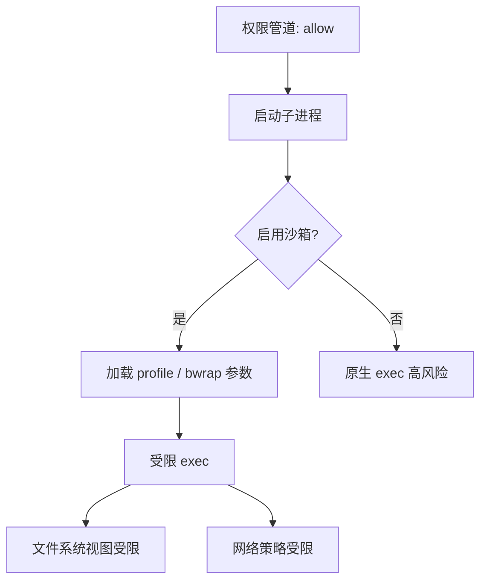
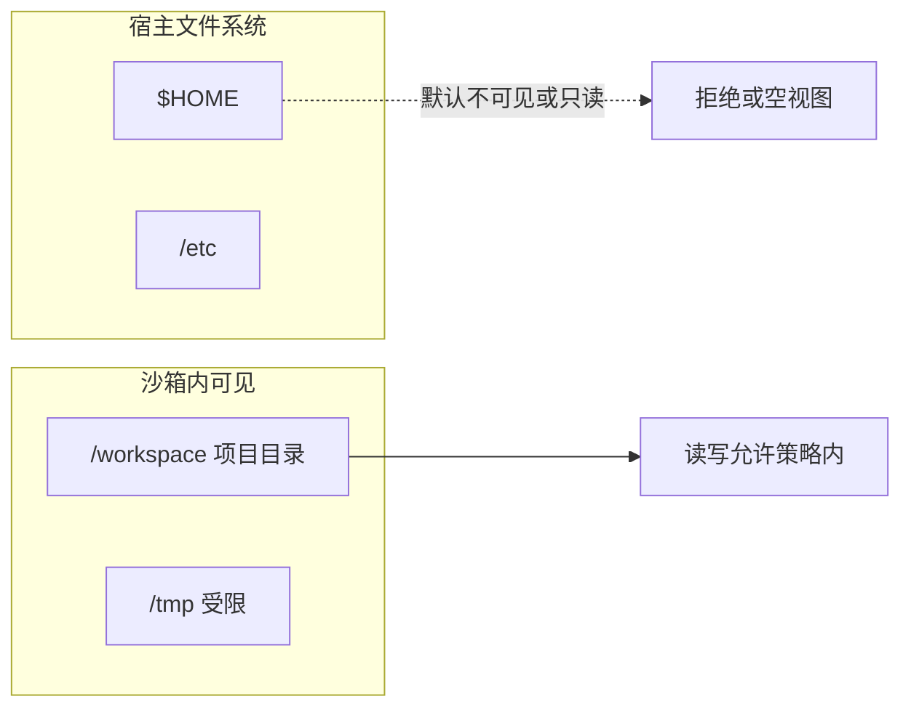
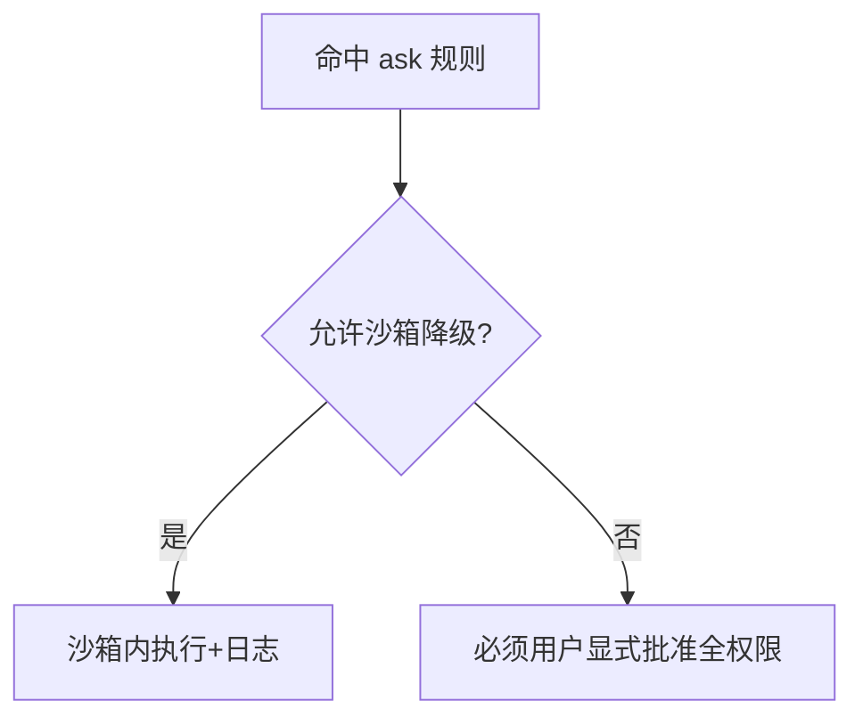

# 7.8 沙箱执行：macOS Seatbelt 与 Linux bubblewrap

> **本篇定位**：沙箱把「即使命令跑起来」的伤害限制在**文件系统与网络**的可控边界内。Claude Code 在 macOS 上常映射到 **Seatbelt (sandbox-exec 系)**，在 Linux 上常用 **bubblewrap (bwrap)**。

---

## 学习目标

完成本节学习后，你应该能够：

1. **说明** 沙箱解决的是哪类威胁：误删、越权读、外向 C2、横向移动。  
2. **对比** Seatbelt 与 bubblewrap 的适用 OS 与典型限制维度。  
3. **解释** 「文件系统隔离」与「写入仅限项目目录」如何叠加。  
4. **描述** 网络隔离对 `curl`/`git fetch` 等命令的可见影响。  
5. **向团队说明** 沙箱不是「防模型坏」，而是「防命令真坏」。  
6. **识别** 沙箱的常见逃逸面：挂载泄漏、Unix socket、ptrace、内核漏洞（定性了解即可）。

---

## 生活类比：生物实验室负压舱

- **沙箱**：你在负压舱里做实验；碎了试管，污染**主要在舱内**，不扩散到整栋楼。  
- **无沙箱**：在食堂操作台做同实验——后果自负。

---

## 核心对照表

| 平台 | 典型技术 | 常见限制 |
|-----|---------|---------|
| **macOS** | **Seatbelt** / Sandbox profile | 读写路径集合、网络、子进程能力 |
| **Linux** | **bubblewrap** | mount 命名空间、PID 网络命名空间、drop cap |

---

## Mermaid：沙箱在工具执行栈中的位置



---

## Mermaid：文件系统视图（示意）



---

## Seatbelt（macOS）要点

| 主题 | 说明 |
|-----|------|
| Profile | 声明式规则：可读路径、可写路径、网络出入 |
| 与签名关系 | 系统级沙箱常与企业 MDM 策略交织；教学聚焦概念 |
| 调试成本 | 权限拒绝日志需 Console / log stream 辅助 |

### 说明性 profile 片段（概念，非真实语法照搬）

```scheme
;; 示意：Seatbelt 风格「仅项目可写」概念
(allow file-read-data (subpath "/workspace/project"))
(allow file-write-data (subpath "/workspace/project"))
(deny file-write-data (subpath "/Users"))
```

---

## bubblewrap（Linux）要点

| 主题 | 说明 |
|-----|------|
| 核心思想 | 新 mount namespace + 最小 rootfs + 可选 `--unshare-net` |
| 常用 flags 概念 | `--ro-bind`、`--bind`、`--die-with-parent` |
| 与容器关系 | 比 Docker 更轻；适合 CLI 工具封装 |

### 说明性命令行（教学拼接）

```bash
# 示意：bwrap 仅绑定项目目录为读写，系统路径只读或不可见
bwrap \
  --ro-bind / / \
  --bind /home/user/proj /home/user/proj \
  --chdir /home/user/proj \
  --unshare-pid \
  --proc /proc \
  --dev /dev \
  bash -lc "npm test"
```

> 真实生产参数需安全团队评审；上例仅为结构演示。

---

## 网络隔离层级

| 级别 | 效果 | 副作用 |
|-----|------|--------|
| 完全断网 | 杜绝外连 C2 | `npm i`、`go mod` 失败 |
| 仅 allowlist egress | 允许 registry | 配置复杂 |
| 允许 DNS 限制 | 降低数据渗出 | 仍可能 DNS 隧道（高级威胁） |

**实践**：开发机可较松，**CI** 用 **dontAsk + 断网或白名单**（7.5、7.10）。

---

## 与七步管道第 2 步「沙箱例外」

**工具级 ask** 可声明：在**沙箱 profile A** 下允许试运行，在 profile B 下必须用户批准。这样把「试一试」的风险关在舱内。



---

## 写入限制：项目目录 vs 沙箱 bind

| 机制 | 作用 |
|-----|------|
| **逻辑路径检查**（Edit/Bash 重定向） | 即使沙箱松，也拒绝 `../` 写父目录 |
| **沙箱 bind** | 从 OS 层使宿主路径不可见 |

二者 **互补**：逻辑层防配置错误，OS 层防底层绕过尝试。

---

## 命令黑名单在沙箱内是否仍重要？

**重要**。沙箱不是万能的：

- 若沙箱仍可见 **项目内 `.env`**，`cat` 即可泄密，无需网络。  
- 若允许 **Unix domain socket** 连到宿主服务，可能横向移动。  
- **curl 禁** 减少「沙箱内下载 payload」的概率，降低与内核/容器逃逸链组合风险。

---

## 故障排查表

| 现象 | 可能原因 |
|-----|---------|
| 构建失败 EACCES | 沙箱可写路径未包含 `node_modules` 缓存目录 |
| git clone 失败 | 网络 unshare |
| 仅 macOS 复现 | Seatbelt profile 与 Linux 不一致 |

---

## 与 bypassPermissions 的再次强调

在 **bypassPermissions** 下，用户交互跳过，但**企业加固**仍可能套沙箱。**绝对不应**把 bypass 理解为「宿主机裸奔合理」。

---

## 小结

- **macOS Seatbelt** 与 **Linux bubblewrap** 提供 **FS + 网络** 维度的隔离。  
- 与 **七步管道**、**写入边界**、**黑名单** 叠加，形成纵深防御。  
- 沙箱配置是**运维 + 安全**共有资产，应与仓库 README 同步变更。

---

## 自测

1. 沙箱能防住「模型读了 `.env` 并通过聊天外泄」吗？  
2. 为什么「项目目录可写 + 禁止父目录」在逻辑层仍然必须？  
3. bubblewrap 的 `--ro-bind / /` 与最小 rootfs 方案各有什么权衡？

---

## 延伸阅读线索

- Fail-closed 哲学：[7.9](./09-fail-closed.md)  
- 企业实践：[7.10](./10-practice.md)

---

## 跨平台一致性检查表

团队同时有 **macOS 与 Linux** 开发者时，建议维护一张对齐表：

| 能力 | macOS Seatbelt | Linux bwrap |
|-----|----------------|-------------|
| 项目目录读写 | profile `subpath` | `--bind` rw |
| 禁止 `$HOME` | deny 规则 | 不 bind home |
| 网络 | entitlement / profile | `--unshare-net` 或 iptables |
| 临时目录 | 明确 `/tmp` 子路径 | `--tmpfs /tmp` |

**目标**：同一仓库在两种 OS 上「能跑同一套测试」且「都碰不到父目录敏感文件」。

---

*上一篇：[7.7 Bash AST](./07-bash-ast.md) · 下一篇：[7.9 Fail-closed](./09-fail-closed.md)*
