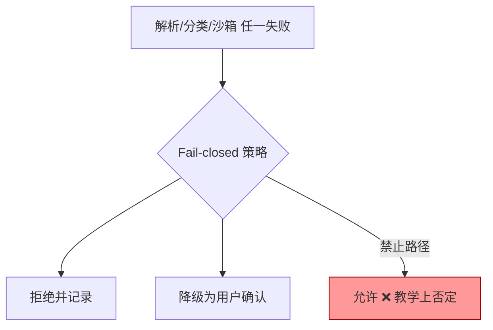
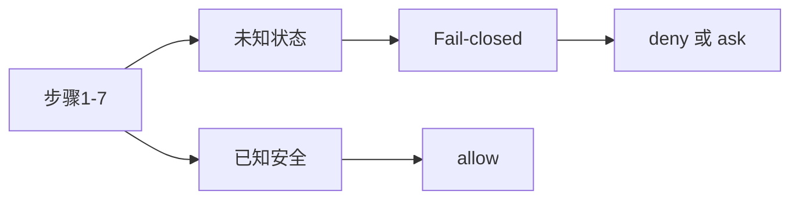

# 7.9 Fail-closed 安全哲学

> **本篇定位**：**Fail-closed**（故障关闭）指：当策略引擎**不确定**、组件**故障**或输入**无法解析**时，默认选择 **拒绝或询问**，而不是 **允许**。这是权限系统与「产品要好用」张力下的安全基石。

---

## 学习目标

完成本节学习后，你应该能够：

1. **用一句话定义** fail-closed，并对比 fail-open 在 AI 工具场景下的后果。  
2. **列举** 至少五种应触发 fail-closed 的条件：规则解析失败、AST 错误、XML 分类器损坏、沙箱启动失败等。  
3. **解释** 为何「工具级 deny 无覆盖」是 fail-closed 在策略层的体现。  
4. **向非技术同事说明**：为什么「系统坏了宁可停工」比「系统坏了全开」更符合安全合规。  
5. **设计** 日志字段，使 fail-closed 事件可事后审计。  
6. **理解** dontAsk 模式下「未预批准即拒绝」与 fail-closed 的一致性。

---

## 生活类比：电梯急停 vs 电梯失控

- **Fail-closed**：传感器异常 → **刹车关门停运**——乘客抱怨，但没人坠梯。  
- **Fail-open**：传感器异常 → **忽略限制全速运行**——短期「还能用」，长期「会出人命」。

对能执行 Shell 的 AI 助手来说，**一次 fail-open 的代价**可能是**整个代码库与密钥**。

---

## 核心对照：Fail-closed vs Fail-open

| 维度 | Fail-closed | Fail-open |
|-----|-------------|-----------|
| 默认倾向 | **拒绝 / 询问** | **允许** |
| 用户体验 | 可能「卡住」 | 流畅直到出事 |
| 合规友好度 | 高 | 低 |
| 运维信号 | 明确报错需修 | 静默埋雷 |
| 适用场景 | 高后果工具调用 | 低后果只读展示（仍需谨慎） |

---

## Mermaid：决策不确定时的汇合点



---

## Mermaid：与七步管道的关系



---

## 应触发 Fail-closed 的典型条件

| 条件 | 示例 | 期望行为 |
|-----|------|---------|
| 规则文件语法坏 | YAML 缩进错误 | 拒绝加载或回退最严默认 |
| Bash 解析失败 | 非法语法、不完整的引号 | **deny** 或 **ask**，不允许执行 |
| 分类器 XML 损坏 | 缺字段、非法 verdict | **ask** 或 **deny**（7.4） |
| 沙箱启动失败 | bwrap 参数不兼容 | **不**裸执行全权限（理想） |
| 路径规范化异常 | `realpath` 失败 | 禁止写入 |
| 模式未知/枚举越界 | 配置拼写错误 | 回退 **Default** 或 **Plan** |

---

## 说明性源码：统一「安全降级」

```typescript
type SafeOutcome = { kind: "allow" } | { kind: "ask"; reason: string } | { kind: "deny"; reason: string };

function failClosed(reason: string): SafeOutcome {
  return { kind: "deny", reason };
}

function ambiguousClassifierOutput(raw: string): SafeOutcome {
  // 解析失败 → 绝不默认 allow
  return { kind: "ask", reason: `classifier_malformed:${hash(raw)}` };
}

function bashParseError(detail: string): SafeOutcome {
  return failClosed(`bash_parse_error:${detail}`);
}
```

---

## 「Deny 无覆盖」= 策略层 Fail-closed

当 **deny** 与后续 **allow** 冲突时，以 **deny 首次匹配** 为准（7.6）。这等价于：

> **黑名单的语义强度高于白名单** —— 在高后果域，这是 fail-closed 的自然实现。

---

## dontAsk 与 Fail-closed 的一致性

**dontAsk**：仅预批准执行，**未匹配 → 拒绝**。这不是「 openness」，而是 **清单驱动的 closed world**：

| 事件 | 行为 |
|-----|------|
| 命令不在清单 | **拒绝**（fail-closed） |
| 清单含歧义项 | 应在 code review **拒绝合并**（组织层 fail-closed） |

---

## 与 Prompt Fatigue 的张力

用户讨厌反复点「允许」，但 **fail-closed** 要求 **不能** 因疲劳改成默认 allow。**正确缓解**是：

- **allowlist 常用安全命令**（7.10）  
- **更细的 deny** 减少误 ask  
- **模式选择**（Default vs acceptEdits）减少无关弹窗  

**错误缓解**：「关闭权限」——fail-open。

---

## 审计日志建议字段

| 字段 | 用途 |
|-----|------|
| `event` | `permission_denied` / `sandbox_failed` / `parse_error` |
| `step` | 七步管道序号 |
| `tool` | bash / edit / … |
| `reason_code` | 稳定枚举，便于 SIEM |
| `hash_redacted_input` | 隐私友好指纹 |
| `mode` | Default / … |

---

## 合规叙事模板（对内）

```text
我们采用 fail-closed：当权限子系统无法证明某动作安全时，不会默认执行。
这会导致偶尔的自动化失败，需要修正规则或预批准清单——这是预期成本。
```

---

## 反模式清单

| 反模式 | 后果 |
|--------|------|
| 解析失败 → allow | 直接打开攻击面 |
| 日志仅 debug 级别 | 事故后无迹可循 |
| 用 bypass 解决 fail-closed 噪声 | 饮鸩止渴 |
| CI 失败就改宽 dontAsk | 流水线变 RCE 入口 |

---

## 小结

- **Fail-closed** 是 AI 代码助手权限设计的**道德与工程底线**。  
- **解析失败、沙箱失败、分类器损坏** 都应导向 **deny/ask**，而非 **allow**。  
- 与 **deny 优先、首次匹配**、**dontAsk 清单世界** 同一哲学。

---

## 自测

1. 若企业 KPI 推动「降低弹窗率」，如何在不违背 fail-closed 前提下优化？  
2. fail-closed 是否意味着「永远 deny」？与 **ask** 的关系？  
3. 举一个你所在技术栈中「解析失败」的真实案例（如 JSON/YAML）。

---

## 相关章节

- 七步管道：[7.6](./06-evaluation-pipeline.md)  
- Auto XML：[7.4](./04-auto-mode.md)  
- 企业实践：[7.10](./10-practice.md)

---

## 与 GDPR / 等保叙述的衔接（高层）

审计人员常问：「系统故障时会不会误执行？」**Fail-closed** 的回答模板：

> 在策略或解析子系统故障时，本助手默认不执行高后果操作；必要时降级为人工确认。默认不允许执行优于错误执行。

这与数据处理「最小必要原则」叙事一致：**无把握则不处理**。

---

## 灰度发布中的 Fail-closed

新规则上线建议 **灰度**：

```text
阶段1：仅日志记录「would_deny」不真拒
阶段2：对 10% 会话真拒
阶段3：全量
```

若阶段1发现误杀率过高，**修规则**而不是跳至 allow。灰度是**观测手段**，不是放宽安全理由。

---

*上一篇：[7.8 沙箱](./08-sandbox.md) · 下一篇：[7.10 实践](./10-practice.md)*
