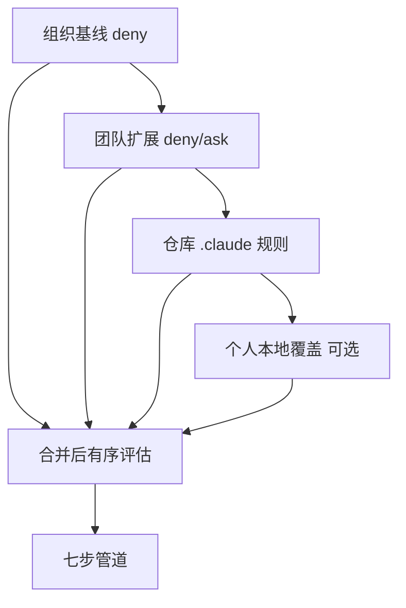
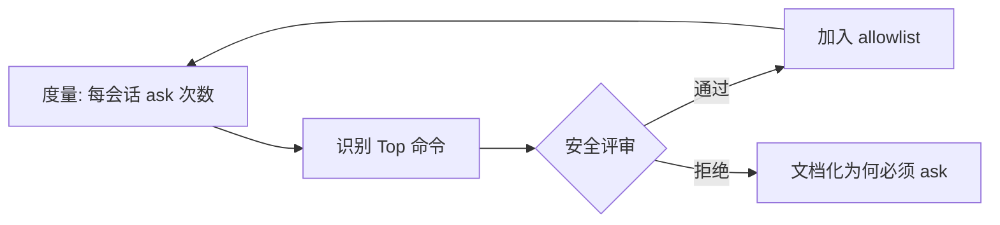

# 7.10 实践：企业级权限配置与 Prompt Fatigue 缓解

> **本篇定位**：把前几节的理论落到**可复制的配置策略**上：规则顺序 **deny→ask→allow**、**allowlist**、**CI dontAsk**、**沙箱基线**、**审计**。目标是在不牺牲 **fail-closed** 的前提下，让团队「少点鼠标」。

---

## 学习目标

完成本节学习后，你应该能够：

1. **起草** 一份团队级 `deny` 基线：密钥路径、shell 配置、父目录写入、`curl|bash` 模板。  
2. **设计** `ask` 规则与 **沙箱例外** 的组合，覆盖「想试但怕」的场景。  
3. **编写** **allowlist** 缓解 Prompt fatigue：精确前缀、`&&` 全链评估意识。  
4. **落地** CI：**dontAsk** + 窄预批准 + 网络白名单/缓存。  
5. **组织** 规则代码评审：谁有权改 deny、如何版本化、如何回滚。  
6. **解释** 为何 **首次匹配** 要求把**最严 deny 放最前**。

---

## 生活类比：公司采购审批流

- **deny**：法律部黑名单供应商——**一票否决**。  
- **ask**：超过 5 万要 VP 批。  
- **allow**：办公文具包月额度内自动过。  
- **allowlist**：常用快递账号，不用每次填表——但**不能**把「任意收款人」加进去。

---

## 核心原则表

| 原则 | 操作要点 |
|-----|---------|
| **deny → ask → allow** | 文件内严格排序；审查时先看 deny |
| **首次匹配生效** | 更具体的 deny 排在泛化 allow 之前 |
| **写入边界** | 任何规则不得默许写父目录 |
| **黑名单** | `curl`/`wget` 保持禁或强 ask；与供应链政策一致 |
| **fail-closed** | 解析失败 → 不执行 |

---

## Mermaid：企业规则分层



---

## Mermaid：Prompt Fatigue 缓解闭环



---

## 说明性规则文件（教学 YAML）

```yaml
# 示意：规则顺序 deny → ask → allow（首次匹配）
version: 1
rules:
  - name: block-remote-download
    action: deny
    tool: bash
    pattern: "(curl|wget)\\b"
    note: "默认禁 curl/wget；用私有 registry 与缓存"

  - name: block-parent-write
    action: deny
    tool: edit
    path_regex: '^\\.\\./'
    note: "禁止写父目录"

  - name: block-dot-git-direct
    action: deny
    tool: edit
    path_regex: '(^|/)\\.git(/|$)'
    note: "安全护栏与专用工具处理"

  - name: ask-install-scripts
    action: ask
    tool: bash
    pattern: "(npm|pnpm|yarn)\\s+(i|install)\\b"

  - name: allow-status-test
    action: allow
    tool: bash
    pattern: "^git\\s+status\\b"

  - name: allow-pnpm-test
    action: allow
    tool: bash
    pattern: "^pnpm\\s+-s\\s+test\\b"
```

> 真实产品字段名以官方为准；此处强调 **顺序** 与 **语义**。

---

## CI 配置清单（dontAsk）

| 检查项 | 说明 |
|--------|------|
| 预批准字符串 | 与脚本 **完全一致**（含 `-s`） |
| 禁止 `bash -c` | 除非拆分进多条明确批准 |
| 镜像预装依赖 | 减少安装类 ask/deny 噪声 |
| egress | 仅 registry；禁止公网 `curl` |
| 密钥 | 最小 scope；不写回仓库 |

```yaml
# 示意：CI 会话
permission_mode: dont_ask
preapproved_commands:
  - "pnpm -s test"
  - "pnpm -s lint"
  - "git diff --stat"
isolated: true
sandbox_profile: ci-minimal
```

---

## 沙箱基线建议（与 7.8 对齐）

| 环境 | 文件系统 | 网络 |
|-----|---------|------|
| 本地开发 | 项目读写 + 缓存目录 | 较松，可配合用户防火墙 |
| 共享跳板机 | 严格 bind | 白名单 |
| CI | 最小 rootfs | 白名单或离线缓存 |

---

## 角色与权限（RBAC 类比）

| 角色 | 能否改组织 deny | 能否加 allow |
|-----|----------------|-------------|
| 安全团队 | 是 | 评审后 |
| 团队 Tech Lead | 否 | 是（团队范围） |
| 个人开发者 | 否 | 仅本地实验，不进主分支 |

---

## 审计与复盘

1. **每周**导出 Top deny / ask 原因码。  
2. **每月**复盘：有无误杀；是否应升格为 deny。  
3. **事件响应**：若发现绕过 AST 的技巧，更新 Bash 策略（7.7）。

---

## 与六种模式的落地建议

| 场景 | 推荐模式 |
|-----|---------|
| 默认开发 | Default |
| codemod 周 | acceptEdits + 特性分支 |
| 架构评审会 | Plan |
| 熟练工程师 + 细规则 | Auto |
| CI | dontAsk |
| 隔离排障 | bypassPermissions（短时 + 审批） |

---

## 命令黑名单治理

| 动作 | 负责人 |
|-----|--------|
| 申请开放 `curl` | 安全例外流程 + 替代方案评估 |
| 引入新下载工具 | `aria2c` 等同样高危，默认 deny |
| 供应链扫描 | 与预批准 install 脚本联动 |

---

## 源码片段：合并规则时排序

```typescript
function mergeRules(layers: RuleLayer[]): Rule[] {
  const merged = layers.flatMap((l) => l.rules);
  // 示意：保证 deny 全在 ask 前、ask 全在 allow 前
  return merged.sort((a, b) => rank(a.action) - rank(b.action));
}
function rank(action: "deny" | "ask" | "allow") {
  return action === "deny" ? 0 : action === "ask" ? 1 : 2;
}
```

---

## 小结

- **企业级权限** = 组织基线 + 仓库规则 + 沙箱 + CI 模式 + 审计。  
- **Prompt fatigue** 用 **allowlist** 与 **缓存/镜像** 解决，不用 fail-open。  
- **deny→ask→allow** 与 **首次匹配** 是维护时的「防呆设计」。

---

## 交付物模板（可直接复制为工单）

```text
标题：新增 allowlist 条目申请
命令：pnpm -s test
理由：每日 200+ 次 ask，已审查无 install 生命周期脚本
风险：低（只读测试，无网络 fetch）
评审：@security @tl
回滚：删除对应 allow 规则提交
```

---

## 自测

1. 为什么 allow 规则不能写在 deny 之前？举反例。  
2. 团队合并规则冲突时，以「仓库优先」还是「组织优先」更合理？  
3. 如何在度量上区分「烦人的 ask」与「必要的 ask」？

---

## 第 7 篇回顾

| 节 | 关键词 |
|----|--------|
| 7.1 | rm -rf、为什么需要闸门 |
| 7.2 | 六种模式总表 |
| 7.3 | Default / acceptEdits / Plan |
| 7.4 | Auto、Sonnet 4.6、XML 两阶段 |
| 7.5 | dontAsk、bypass+容器 |
| 7.6 | 七步管道 |
| 7.7 | Bash AST |
| 7.8 | Seatbelt、bubblewrap |
| 7.9 | Fail-closed |
| 7.10 | 企业实践、allowlist |

---

*上一篇：[7.9 Fail-closed](./09-fail-closed.md) · 返回：[7.1 导论](./index.md)*
