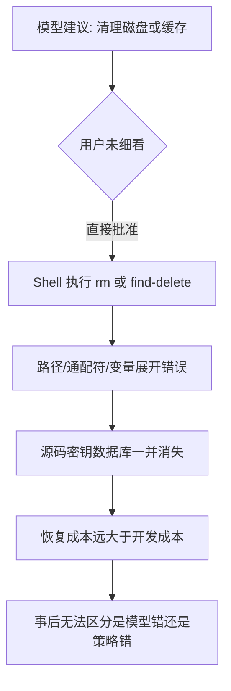

# 7.1 为什么需要权限：从 `rm -rf` 噩梦说起

> **本篇定位**：Claude Code 完全指南 V2 · 第 7 篇「权限与安全」导论。后续章节将展开六种模式、七步管道与沙箱细节。

---

## 学习目标

完成本节学习后，你应该能够：

1. **解释** 为什么「能跑命令的 AI」必须自带权限闸门，而不是完全信任模型输出。
2. **识别** 典型高危操作（删除、覆盖、外泄、供应链）与「误操作」之间的区别。
3. **理解** 权限系统解决的是「谁、在何种模式下、对哪些资源、执行什么动作」的可审计决策问题。
4. **建立** 「默认保守、显式放行」的心理模型，为 7.2–7.10 的模式与管道章节打底。
5. **列举** 至少五种与 Shell 相关的常见事故模式，并能对应到后续章节中的缓解手段（沙箱、deny、ask、写入边界）。
6. **区分** 「用户点了同意」与「策略上应该允许」——前者是交互事实，后者是安全策略，二者不可混为一谈。

---

## 生活类比：智能管家与钥匙串

想象你雇了一位**反应极快、知识面极广**的管家，但他：

- 会**字面执行**你随口说的「把没用的都删掉」；
- 分不清「清理下载文件夹」和「清空整个家」；
- 偶尔被钓鱼话术诱导，去「帮主人装个工具」，实则执行了陌生脚本。

你不会把**保险柜钥匙、房产证、银行卡密码**一次性全交出去，而是：

- **默认**：先看一眼再签字（对应 Default 等模式的「确认」）；
- **分区**：卧室能进，邻居车库不能进（对应写入仅限项目目录等规则）；
- **黑名单**：明确禁止「代签大额合同」（对应 deny / 命令黑名单）。

Claude Code 的权限体系，本质上就是这把**可配置的钥匙串**。管家越聪明，钥匙串越要**细粒度、可撤销、可审计**。

---

## 核心信息：`rm -rf` 为何是教科书级噩梦

| 风险维度 | 典型场景 | 没有闸门时会发生什么 |
|---------|---------|---------------------|
| **不可逆删除** | `rm -rf /`、`rm -rf ~`、`rm -rf .`（路径解析错误） | 数据永久丢失，备份链断裂 |
| **范围误判** | 通配符、变量展开、`find … -delete` | 「以为删的是 build，实际删的是 repo」 |
| **供应链** | `curl \| bash`、下载后执行 | 远程脚本可篡改本地环境与密钥 |
| **横向移动** | 任意网络拉取、写系统目录 | 单项目被攻破后影响整台机器 |
| **权限提升错觉** | `sudo`、修改 shell 配置、写 crontab | 一次批准可能变成持久后门 |
| **误合并/误覆盖** | `git reset --hard`、强制推送策略被脚本化 | 协作仓库历史被破坏 |

### 扩展案例：不是「恶意」，而是「太勤快」

许多事故并非模型「想害你」，而是：

1. **过度泛化**：你说「清理临时文件」，它选了更「彻底」的命令。  
2. **上下文缺失**：不知道 `.env` 里是真密钥还是占位符。  
3. **路径脆弱性**：相对路径、`cd` 后状态、CI 工作目录与本地不一致。  
4. **工具链组合**：格式化工具 + `git add -A` + 提交脚本，一步走错全盘皆输。

因此，权限设计的起点是：**假设聪明人会犯傻、聪明模型会过度优化**。

---

## 权限系统要回答的三个问题


1. **谁在请求**：用户显式触发、Auto 模式下的后台分类器、CI 中的 `dontAsk` 等，责任归属与可追溯性不同。  
2. **什么动作**：读文件、改仓库、跑 Bash、访问网络——后果与可逆性不同；同一动作在不同目录上风险也不同。  
3. **在什么模式下**：从「只读分析」到「全跳过护栏」是一条光谱，没有一种模式适合所有场景；**选错模式的代价比多点一次确认更大**。

---

## Mermaid：一次草率命令如何滚雪球



---

## 说明性源码片段：权限决策的「伪代码」骨架

以下**不是** Claude Code 真实源码，而是帮助理解「闸门插在哪里」的示意：

```typescript
// 示意：工具调用前的统一入口（概念层）
type PermissionDecision = "allow" | "ask" | "deny";

async function invokeTool(tool: Tool, input: unknown, context: SessionContext) {
  const decision: PermissionDecision = await evaluatePermissions({
    tool,
    input,
    mode: context.permissionMode,
    rules: context.mergedRules,
    sandbox: context.sandboxProfile,
  });

  if (decision === "deny") {
    return failClosed("blocked_by_policy", { tool: tool.name });
  }
  if (decision === "ask") {
    await requireUserApproval({ tool: tool.name, preview: summarize(input) });
  }
  return tool.run(input, { sandbox: context.sandboxProfile });
}
```

要点：

- **在真正 `exec` / `write` 之前**就要完成决策；事后补救往往来不及。  
- **`failClosed`** 表示「拿不准就拒绝」，详见 7.9。  
- **规则顺序** `deny → ask → allow`、首次匹配生效，将在 7.6 与 7.10 反复强调。

---

## 与「写入仅限项目目录」的关系（预告）

你将在 7.8 与 7.10 看到明确约束：**只能写项目目录及子目录，不能写父目录**。这与 `rm -rf` 类事故形成互补：

| 约束类型 | 防什么 | 典型失败若缺失 |
|---------|--------|----------------|
| 写入边界 | 逃逸到 `../`、家目录、系统路径 | 单项目任务污染全局环境 |
| 命令黑名单 | `curl`/`wget` 默认禁 | 一键拉取远程 payload |
| 沙箱 | 文件系统与网络隔离 | 误触敏感路径或外连 |

---

## 与后续章节的路线图

| 小节 | 文件 | 你将学到 |
|-----|------|---------|
| 7.2 | `02-six-modes.md` | 六种权限模式一张总表 |
| 7.3 | `03-basic-modes.md` | Default / acceptEdits / Plan 的日常用法 |
| 7.4 | `04-auto-mode.md` | Auto 与后台分类器（Sonnet 4.6） |
| 7.5 | `05-advanced-modes.md` | `dontAsk`（CI）与 `bypassPermissions`（隔离容器） |
| 7.6 | `06-evaluation-pipeline.md` | **七步评估管道**完整流程 |
| 7.7 | `07-bash-ast.md` | Bash 子命令与 AST 级检查思路 |
| 7.8 | `08-sandbox.md` | Seatbelt / bubblewrap 隔离 |
| 7.9 | `09-fail-closed.md` | Fail-closed 安全哲学 |
| 7.10 | `10-practice.md` | 企业级实践与 allowlist 缓解 Prompt fatigue |

---

## FAQ（与本节强相关）

**问：用户每次都点「允许」，权限系统还有意义吗？**  
答：有意义。系统仍可提供**默认 deny**、**沙箱**、**写入边界**、**审计轨迹**；交互疲劳用 **allowlist** 缓解（7.10），而不是直接关掉护栏。

**问：是不是只要不用 Bash 就安全了？**  
答：不是。编辑工具写错路径、依赖安装脚本、插件市场供应链等，同样属于「高后果动作」，需要 **Edit 路径检查** 与 **七步管道**（7.6–7.7）。

**问：最危险的组合是什么？**  
答：**高权限模式 + 无隔离环境 + 宽规则**。例如在非容器内长期 `bypassPermissions`（7.5），等价于把钥匙串扔掉。

---

## 小结

- **模型不是运维**：它的目标是「完成任务」，不是你的数据保全顾问。  
- **权限是产品特性**：把「危险动作」变成**可解释、可重复、可审计**的决策。  
- **下一节**从六种模式的总表开始，把「我此刻处于哪种信任级别」说清楚。

---

## 自测 checklist

- [ ] 能否用一句话说明：为什么 `curl|bash` 与 `rm -rf` 同属「必须过闸门」类操作？  
- [ ] 能否画出「模式 → 是否询问 → 是否沙箱」的粗粒度心智图（可先手绘，再在 7.2 对照）？  
- [ ] 是否理解「规则顺序 deny→ask→allow、首次匹配」将在 7.6 正式展开？  
- [ ] 能否举出一个「非恶意但后果严重」的自动化例子，并说明哪一类规则会拦截它？

---

## 术语速查（本篇）

| 术语 | 含义 |
|-----|------|
| Fail-closed | 不确定则拒绝，见 7.9 |
| 沙箱 | OS 级隔离执行环境，见 7.8 |
| 七步管道 | 从工具 deny 到安全护栏的完整评估链，见 7.6 |
| allowlist | 显式列出可自动通过的安全命令，缓解反复确认，见 7.10 |

---

## 延伸阅读：事故时间线（虚构但典型）

下列时间线用于**团队内部分享**，帮助新成员建立肌肉记忆：

| 时刻 | 事件 | 若有权限闸门 |
|-----|------|-------------|
| T0 | 模型建议删除 `dist/` | 可能仅 ask 或 allow（低风险目录） |
| T1 | 路径写成 `../dist` 或变量为空 | **Edit/Bash 路径检查**或 deny 拦截 |
| T2 | 附带 `find … -delete` | Bash AST 层识别高危子命令（7.7） |
| T3 | 用户连点三次「允许」 | **allowlist** 应吸收重复安全命令（7.10） |
| T4 | 发现 `.env` 被删 | 审计日志定位「谁批准的」 |

---

## 与「Prompt injection」的边界说明

权限系统主要防的是**高后果动作被误执行**，而不是替代：

- 代码审查流程  
- 依赖漏洞扫描  
- 密钥轮换与 HSM  

把它想成**车速限制 + 安全气囊**：不保证不出事故，但显著降低伤亡。

---

*下一篇：[7.2 六种模式对比表](./02-six-modes.md)*
