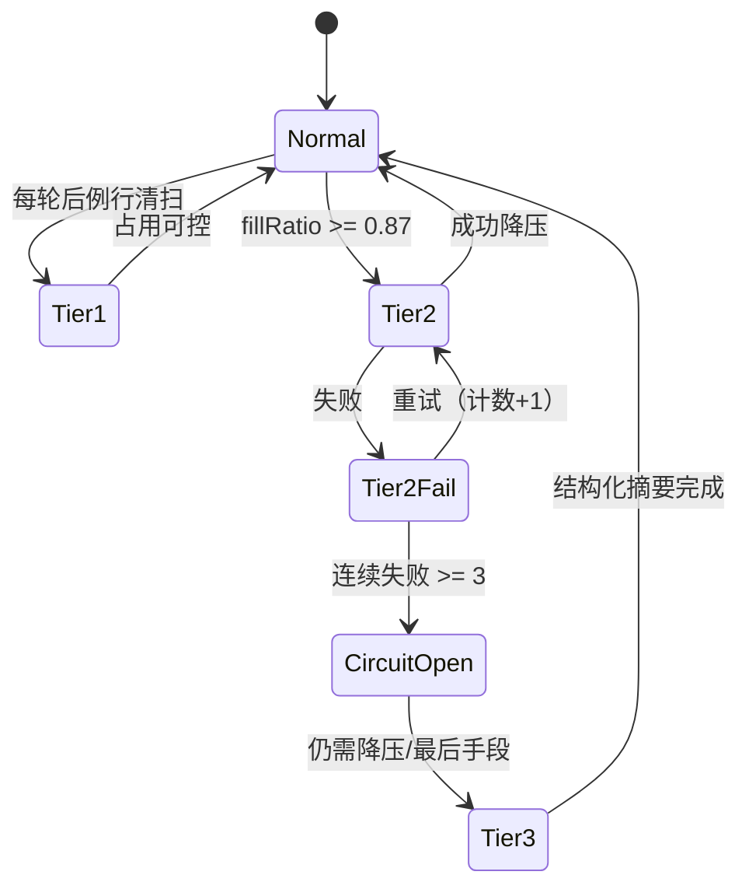
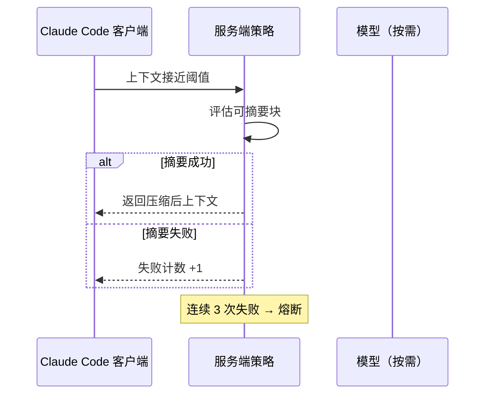

# 8.2 三层压缩总览：Tier1 → Tier2 → Tier3

> 把「整理对话」当成一条有梯度的逃生通道：先扫地，再收纳，最后搬家式打包。

---

## 本节学习目标

1. **口述** 三层压缩的**触发意图**：从「低成本减负」到「服务端自动摘要」再到「最后手段结构化折叠」。
2. **对比** 各层是否调用模型、对**信息保真度**的影响、以及与**缓存前缀**的关系。
3. **画出** 决策流：占用上升时系统更可能走哪条路径，**熔断**在何处介入。
4. **解释** Tier3 的 **九节摘要** 在工程上解决什么问题：让模型在极端压力下仍保留任务连续性骨架。
5. **联系** 手动 `/compact` 与 API compaction：它们分别站在**交互层**与**传输层**的什么位置。

---

## 生活类比：办公室整理的三档力度

- **Tier1（微压缩）**：同事下班前把桌面上**上周的打印稿**收进抽屉，只留下最近五份待办——**不需要**请外部顾问（模型）来评估哪些该扔。
- **Tier2（自动压缩）**：行政发现工位**堆到 87%** 容积率，启动标准流程：统一扫描、归档、贴标签——由**服务端策略**执行，强调自动化与一致性。
- **Tier3（完全压缩）**：办公室要搬迁，只能带走集装箱有限体积：必须把资料**按九大类装箱单**重排，并把临时草稿（类比 chain-of-thought）**剥离**，只留对外可交付结论。

---

## 核心机制一览表

| 层级 | 名称（教学称呼） | 典型触发 | 模型参与 | 主要动作 | 备注 |
|------|------------------|----------|----------|----------|------|
| Tier1 | 微压缩 | 持续进行/轻量条件 | **否** | 清理旧工具结果，**保留最近 5 个** | 成本低、延迟小 |
| Tier2 | 自动压缩 | **约 87%** 阈值 | 由策略决定（服务端） | 自动摘要/折叠 | **连续 3 次失败 → 熔断** |
| Tier3 | 完全压缩 | 压力极高/最后手段 | 通常涉及更强摘要 | **九节摘要** + CoT 后剥离 | 保骨架、丢枝节 |

---

## Mermaid：三层压缩状态机（概念）



---

## Tier1：微压缩的「边界条件」

Tier1 的关键不是「更聪明」，而是**更便宜、更确定**：

- **清旧工具结果**：旧 `run_terminal_cmd` 输出、`read_file` 大块内容等，往往占据大量 token。
- **保留最近 5 个**：保证模型仍能看到**刚刚发生**的证据链，避免「刚跑完测试但输出被瞬间蒸发」的荒谬体验。

### 伪代码：Tier1 只做结构化剪枝

```typescript
function tier1MicroCompaction(messages: Message[]) {
  const toolResults = messages.filter(isToolResult);
  if (toolResults.length <= 5) return;

  const victims = toolResults.slice(0, -5); // 旧的
  for (const m of victims) {
    m.content = "[tool output elided by Tier1 micro-compaction]";
    // 或硬删除/移出热上下文，视产品实现而定
  }
}
```

### 表：Tier1 保留/清理直觉

| 内容 | Tier1 倾向 |
|------|------------|
| 最近 5 个工具结果 | **保留** |
| 更早的工具结果 | **清理/占位** |
| 用户自然语言 | 通常**不动**（除非另有策略） |
| 系统提示 | **不动** |

---

## Tier2：自动压缩与 87% 阈值

把 **87%** 理解成「再不放水，下一轮工具输出可能把桶顶翻」的预警线：

- **触发**：上下文占用达到阈值附近（教学用 **0.87**）。
- **执行者**：**服务端策略**（客户端只感受结果：摘要变短、某些细节变糊）。
- **失败与熔断**：若自动压缩**连续失败 3 次**，应停止盲目重试，避免抖动、循环与额外费用；转入更保守路径或提示用户介入（具体 UX 以版本为准）。

### Mermaid：Tier2 请求—响应回路



---

## Tier3：完全压缩与九节摘要

Tier3 是「最后手段」：当继续堆原文会伤害可用性/成本/稳定性时，必须把对话**重构**为更小但仍可执行的表示。

### 九节摘要（教学版结构）

1. **意图**：用户到底想达成什么。
2. **概念**：领域名词、约束、定义。
3. **文件**：关键路径与模块职责。
4. **错误**：未解决问题与复现信息。
5. **消息**：必须保留的用户原话要点。
6. **任务**：分解后的 TODO 与完成标准。
7. **当前工作**：下一步建议动作。
8. （若你的资料版本为 9 节，可在此扩展「环境/依赖/风险」等固定栏目）
9. **链式思考后剥离**：把中间推理移出持久上下文，只留结论。

> 注：「九节」是结构化信息架构的教学归纳；具体字段命名以实现为准。

### 片段：九节摘要的 Markdown 骨架

```markdown
## Compaction Summary (Tier3)

### 1. Intent
- ...

### 2. Concepts
- ...

### 3. Files
- path/to/a.ts — ...

### 4. Errors
- ...

### 5. Message Highlights
- ...

### 6. Tasks
- [ ] ...

### 7. Current Focus
- Next: ...

### 8. Environment / Constraints
- ...

### 9. Reasoning Stripped
- (CoT removed; conclusions only below)
- ...
```

---

## chain-of-thought 后剥离：为什么重要

CoT 对**单次推理**有帮助，但对**长期上下文**往往是高噪声：

- Token 占用高；
- 可能包含未验证猜想；
- 不利于人类审阅与 diff。

Tier3 的策略倾向：**结论入库，草稿出栈**。

---

## 与其他章节映射

| 主题 | 详述位置 |
|------|----------|
| `cache_edits` 手术刀 | `06-cache-aware.md` |
| API 头 `compact-2026-01-12` | `07-api-compaction.md` |
| `/compact` 焦点提示 | `08-manual-compact.md` |
| 费用与 60% 建议 | `09-cost-analysis.md` |

---

## 对比表：什么时候你该手动介入？

| 信号 | 建议 |
|------|------|
| 占用 ~60% | 主动整理、拆任务、减少工具大块输出 |
| 频繁自动摘要 | 用 `/compact` 给出**焦点**，减少误摘要 |
| 关键证据可能被卷走 | 把结论写入文件或 `CLAUDE.md`（第 9 篇） |
| 熔断发生 | 降低并行工具调用；缩小读取范围；新开会话 |

---

## 练习

1. 用你自己的一次长调试会话，标注哪些消息应进 Tier1 的「冷区」。
2. 试写一份「九节摘要」草稿，看看能否在 **2K token** 内保留任务连续性。

---

## 小结

三层压缩不是三个孤立功能，而是一条**梯度**：Tier1 负责「便宜地减掉明显垃圾」，Tier2 在**阈值**附近做服务端自动化，Tier3 用**结构化摘要**在极限条件下保住主线。理解这条梯度，你才能在成本、稳定性与正确性之间做权衡。

---

## 附录：阈值记忆口诀

- **60%**：你开始管；
- **87%**：系统更可能强力自动压；
- **3 连失败**：自动策略熔断，别再赌运气。
