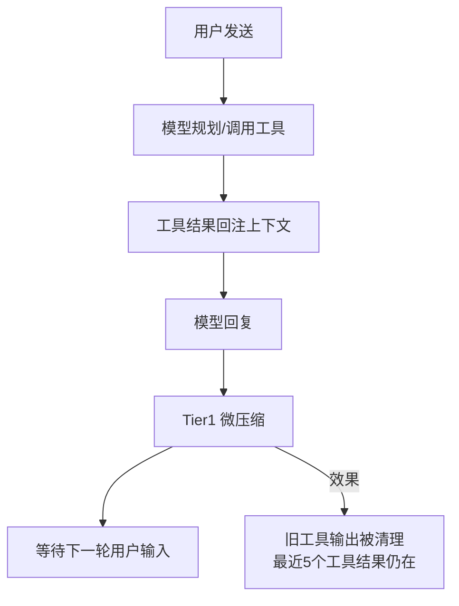
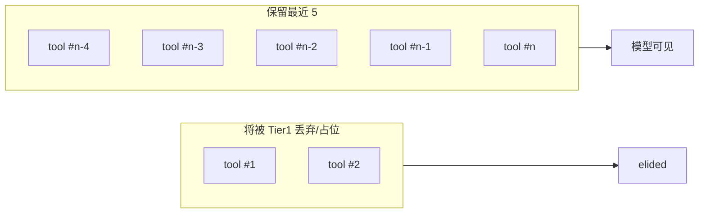

# 8.3 Tier1 微压缩：无模型参与的「前台清桌」

> 不等「房间满了」才收拾：每轮对话后悄悄扔掉过期工具小票，只留下最近五张。

---

## 本节学习目标

1. **说明** Tier1 微压缩的设计目标：**低延迟、低成本、确定性**，因此**不调用模型**。
2. **描述** 「清旧工具结果、**保留最近 5 个**」在用户体验上的意义：既减体积，又不断裂即时证据链。
3. **识别** 哪些内容最适合 Tier1 处理，哪些**绝不能**只靠规则硬删（需要人工或 Tier2/3）。
4. **对照** Tier1 与缓存：Tier1 应尽量走**结构化删除**，避免重写系统前缀（详见 8.6）。
5. **演练** 如何在日常使用中**减少 Tier1 也救不了的膨胀**（例如万行日志、重复读全文）。

---

## 生活类比：咖啡店只保留最近五张小票

咖啡师台面空间有限：

- 做完的订单里，**最近五杯**的备注还可能被追问（「刚才那杯少冰对吗？」）。
- 更早的小票可以收进垃圾桶，只保留**总额统计**或**是否退款**这类结构化记录——而且**不需要**请店长（模型）来读每张票决定扔不扔，店员按规则做就行。

Tier1 就是这名店员：**按规则清桌**，不叫店长开会。

---

## Tier1 做什么 / 不做什么

| 维度 | Tier1 典型行为 |
|------|----------------|
| 旧工具输出 | **删除、截断或替换为占位符** |
| 最近工具输出 | **保留最近 5 个**（教学约定） |
| 用户文本消息 | 默认**不处理**（避免误删需求） |
| 助手最终答复 | 默认**不处理**（避免误删结论） |
| 需要「理解语义」的合并 | **不做**（交给更高 Tier 或人类） |

---

## Mermaid：Tier1 在对话回合中的插入点



---

## 源码片段：按「工具结果序号」滑动窗口

教学用 TypeScript 伪代码，展示「最近 5 个」如何实现为**滑动窗口**：

```typescript
type ToolMessage = { role: "tool"; id: string; content: string };

function retainLatestToolResults(msgs: ToolMessage[], keep = 5): ToolMessage[] {
  const idxs = msgs.map((m, i) => ({ m, i })).filter((x) => x.m.role === "tool");

  if (idxs.length <= keep) return msgs;

  const dropCount = idxs.length - keep;
  const dropSet = new Set(idxs.slice(0, dropCount).map((x) => x.i));

  return msgs.map((m, i) =>
    dropSet.has(i)
      ? { ...m, content: "[elided: Tier1 micro-compaction]" }
      : m
  );
}
```

### 变体：按「字节预算」而非条数

当单个工具输出极大时，「保留 5 条」仍可能爆窗口；工程上常见补强是：

```typescript
function budgetAwareElide(tool: ToolMessage, maxChars: number) {
  if (tool.content.length <= maxChars) return tool;
  return {
    ...tool,
    content:
      tool.content.slice(0, maxChars) +
      `\n... [truncated ${tool.content.length - maxChars} chars]`,
  };
}
```

---

## 表：典型工具输出在 Tier1 下的命运

| 工具类型 | 风险 | Tier1 策略倾向 |
|----------|------|----------------|
| `read_file` 大文件 | 极高 | 旧次优先 elide |
| 测试 stdout | 高 | 保留最近失败日志更久（若实现支持优先级） |
| `grep` 结果 | 中-高 | 大量匹配时优先截断 |
| `ls -R` | 高 | 强烈建议用户避免；Tier1 只能善后 |

---

## 为什么 Tier1 **不**该调用模型

| 若调用模型 | 结果 |
|------------|------|
| 每次清桌都推理 | 成本上升、延迟上升 |
| 需要额外上下文来理解「重要性」 | 可能反向增加 token |
| 规则可判定的事 | 应用确定性算法更可靠 |

Tier1 的哲学：**把 80% 体积垃圾用 1% 成本清掉**。

---

## Mermaid：Tier1 与更高 Tier 的职责切分

```mermaid
flowchart LR
  subgraph Tier1["Tier1：规则与结构"]
    A1[旧工具输出]
    A2[重复快照]
    A3[无损占位替换]
  end
  subgraph High["Tier2/3：语义摘要"]
    B1[合并多轮讨论]
    B2[抽取关键结论]
    B3[九节骨架"]
  end
  Tier1 -->|仍过高占用| High
```

---

## 实操建议：让 Tier1「少加班」

| 做法 | 说明 |
|------|------|
| 分段 `read_file` | 只读必要行范围 |
| 日志先 `tail`/`rg` | 不要把整个 CI 输出喂给模型 |
| 大 JSON 先 `jq` 过滤 | 保留错误字段即可 |
| 同类工具少并行爆量 | 避免同一轮塞回 10 份大结果 |

---

## 边界案例（教学）

### 案例 A：用户要求「对比三次 `read_file`」

若 Tier1 已 elide 其中两次，模型可能**无法对比**。对策：

- 把对比结论**落地成文件**；
- 或在对比完成前避免进入需要 Tier1 大幅清理的阶段。

### 案例 B：安全相关的完整审计日志

规则删除可能丢掉**合规需要的原貌**。对策：

- 日志保留在**仓库外文件**；
- 上下文只保留**摘要 + 指针**（路径、命令、时间）。

---

## 与第 8.6 节的关系（预告）

Tier1 若实现不谨慎，可能通过「整段重写消息数组」破坏缓存前缀；更理想的是 **cache_edits**：像手术刀一样只改工具节点文本。你现在只需记住：**结构化、局部、可审计**。

---

## FAQ

**Q：为什么是「5」而不是 3 或 10？**  
A：教学文档采用你提供的产品化描述；本质是**滑动窗口宽度**。过窄易断链，过宽减负不足。

**Q：Tier1 会删我的代码吗？**  
A：Tier1 针对的是**消息里的工具输出副本**，不是仓库文件系统（除非另有工具写入）。

---

## 练习

1. 打开你最近一段长会话，数一下工具消息条数，标出若只保留 5 条会丢失什么信息。  
2. 写一条「用户指令模板」，要求模型读文件时始终带行号范围。

---

## 小结

Tier1 微压缩是上下文治理的**第一道闸**：**无模型**、**偏规则**、**对工具输出最敏感**。它用「最近 5 个」在**减负**与**连贯**之间取平衡。你要做的是：少用超大工具输出挑战这道闸。

---

## 自检答案提示

- 「无模型」省下的是：**推理 token、往返延迟、非确定性**。
- 「保留 5 个」保住的是：**短窗口内的因果链**（刚运行的命令、刚读的文件）。

---

## 扩展阅读：消息图模型

把会话看成**有向图**有助于理解 Tier1：

| 节点 | 边 |
|------|-----|
| user | → assistant |
| assistant | → tool_call |
| tool | → tool_result → assistant |

Tier1 主要裁剪 **tool_result 叶子** 上的冗余，而不破坏「最近推理链」的主干。

---

## Mermaid：工具结果滑动窗口可视化



---

## 场景推演：五次 `read_file` 后第六次对比

1. 用户要求对比 6 个配置文件。
2. 若 Tier1 只保留 5 个工具结果，最早那份可能变占位。
3. **对策**：对比前声明「把结论写入 `docs/diff-summary.md`」，或分批对比（3+3）。

---

## 对照表：Tier1 与「人类手动删消息」

| 维度 | Tier1 | 人类删消息 |
|------|-------|------------|
| 速度 | 毫秒级 | 慢 |
| 一致性 | 高 | 因人而异 |
| 语义理解 | 无 | 有 |
| 误伤风险 | 可预测 | 可能删错 user |

---

## 术语小抄

| 英文 | 中文 |
|------|------|
| micro-compaction | 微压缩 |
| elide | 省略/占位替换 |
| sliding window | 滑动窗口 |
