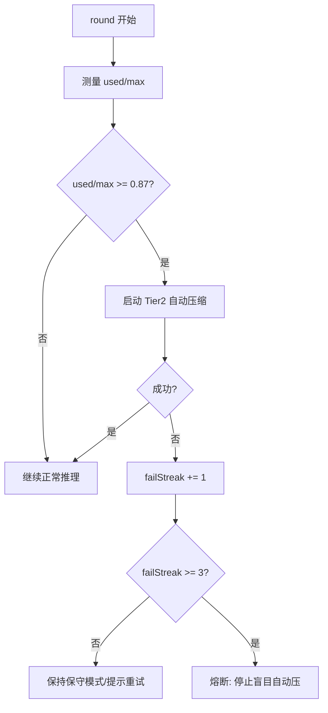
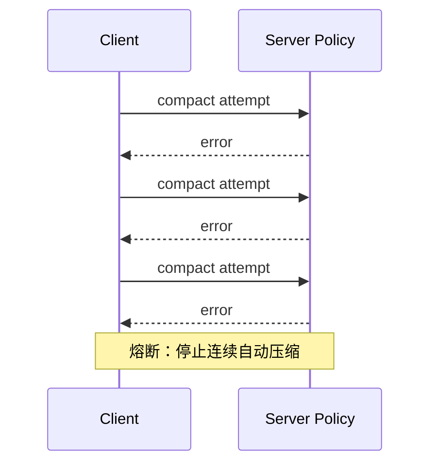
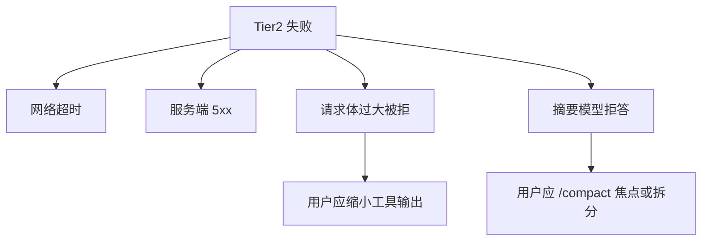

# 8.4 Tier2 自动压缩：87% 阈值与服务端策略

> 水位涨到警戒线，水库自动泄洪；若闸门卡死三次，别再硬开——先换策略。

---

## 本节学习目标

1. **解释** **87%** 阈值在工程上的意义：为「下一轮工具输出突刺」预留安全余量。
2. **描述** Tier2 由**服务端策略**驱动的含义：客户端体验为「上下文突然变短/更摘要化」。
3. **说明** **连续 3 次失败熔断**：防止重试风暴、成本螺旋与不可用状态抖动。
4. **对比** Tier2 与 Tier1：何时必须引入**语义级**摘要（通常更贵、更慢）。
5. **列举** 用户侧可执行的降压手段，降低 Tier2 触发频率与失败率。

---

## 生活类比：小区二次供水与限流阀

住户用水高峰时，水箱液位上升到 **87%**：

- 物业系统自动开启**排放与分流**（类比服务端摘要），避免漫灌。
- 若阀门故障连续三次，系统应**熔断**报警，而不是无限电动重试烧电机——否则整个泵房都可能挂。

---

## 触发与执行：一张总表

| 项目 | 教学描述 |
|------|----------|
| 触发阈值 | 上下文占用约 **87%**（`fillRatio >= 0.87`） |
| 执行主体 | **服务端策略**（非纯本地规则） |
| 成功效果 | 体积下降、对话可继续 |
| 失败计数 | 每次失败 `failStreak++` |
| 熔断条件 | **连续 3 次失败** → 暂停激进自动策略（概念） |

---

## Mermaid：占用率与 Tier2 触发



---

## 服务端策略可能做什么（概念清单）

> 具体算法随版本迭代；此处给学习者「预期集合」。

| 策略 | 目的 |
|------|------|
| 合并相邻助手说明性段落 | 减少重复修辞 |
| 对旧轮次用户消息做要点抽取 | 保留意图，删口语 |
| 对工具输出做模板化摘要 | 保留 exit code、关键行 |
| 丢弃极低价值中间态 | 例如重复 `pwd` |

---

## 源码片段：失败计数与熔断（伪代码）

```typescript
type AutoCompactionState = {
  failStreak: number;
  lastError?: string;
};

async function maybeAutoCompact(
  ctx: Context,
  state: AutoCompactionState
): Promise<boolean> {
  if (ctx.fillRatio < 0.87) return true;

  if (state.failStreak >= 3) {
    console.warn("circuit open: auto-compaction paused");
    return false;
  }

  try {
    await serverSideCompaction(ctx);
    state.failStreak = 0;
    return true;
  } catch (e) {
    state.failStreak += 1;
    state.lastError = String(e);
    return false;
  }
}
```

---

## Mermaid：序列图——三次失败路径



---

## 表：Tier2 成功 vs 失败的典型原因

| 成功因素 | 失败诱因 |
|----------|----------|
| 工具输出可被模板化 | 输出高度非结构化 |
| 用户允许丢失细节 | 用户强制「全文保留」类需求冲突 |
| 上游 API 健康 | 限流/超时 |
| 上下文本身可分段摘要 | 上下文含大量互指代词缺主语 |

---

## 用户侧降压清单（减少 Tier2 触发）

| 动作 | 机制 |
|------|------|
| **60%** 起手动 `/compact` 带焦点 | 主动摘要，降低冲到 87% 的概率 |
| 拆分 Epic 任务 | 单会话更短 |
| 减少「整仓扫描」式工具调用 | 控制回注体积 |
| 把中间结论写入文件 | 上下文只保留指针 |

---

## 与 API 层 compaction 的交界

Tier2 常与 **API 头**（如 `compact-2026-01-12`）协同：客户端声明能力，服务端选择摘要管线。详见 `07-api-compaction.md`。

---

## 深度阅读：为什么「熔断」是成本工程

若无熔断：

- 每次失败可能仍附带**大上下文上传**；
- 重试抖动造成 **N 倍费用**；
- 用户看到「卡住」会更频繁强制中断，产生更多垃圾状态。

熔断把系统从**振荡**推到**可诊断的稳定失败**。

---

## 表：熔断后建议操作

| 步骤 | 说明 |
|------|------|
| 1 | 保存当前任务焦点到 `NOTES.md` 或 `CLAUDE.md` |
| 2 | 新开会话，携带焦点摘要 |
| 3 | 缩小工具范围，先复现再扩展 |
| 4 | 检查网络/配额/模型可用性 |

---

## 练习

1. 假设 `max=200000`，计算 **87%** 对应的 token 数。  
2. 写一段「会话开场白」，在新线程里恢复被 Tier2 摘要掉的大型重构上下文。

---

## FAQ

**Q：失败三次后是不是永远不能自动压了？**  
A：教学上描述为**熔断暂停**；真实产品可能允许冷却恢复或手动复位。以版本说明为准。

**Q：87% 是精确值还是区间？**  
A：理解为**策略阈值**；实现可能有滞回，避免在边界来回抖动。

---

## 小结

Tier2 自动压缩是**高压下的泄洪阀**：在 **87%** 附近启动，由**服务端**做语义级处理，并用**连续三次失败熔断**避免系统与用户双输。你的最佳配合是在 **60%** 前主动整理，让 Tier2 更少「不得不出手」。

---

## 附录：阈值与行数对照（示意）

| maxTokens | 87% | 60% |
|-----------|-----|-----|
| 200,000 | 174,000 | 120,000 |

用于建立数量级直觉，非承诺 SLA。

---

## 扩展：滞回阈值（概念）

工程上为避免在 **86%～88%** 之间反复触发，可能使用：

```text
触发阈值 87%
解除阈值 82%（示意）
```

你只需知道：**存在滞回**时，体感上「有时刚过线没立刻压」是正常的。

---

## Mermaid：失败类型分类



---

## 表：日志字段建议（自建观测时）

| 字段 | 用途 |
|------|------|
| `fill_ratio_before` | 触发原因分析 |
| `compact_latency_ms` | SLA |
| `fail_streak` | 熔断诊断 |
| `profile` | 与 `compact-2026-01-12` 对齐 |

---

## 与组织治理：何时升级工单

| 条件 | 建议 |
|------|------|
| 单项目持续熔断 | 检查工具脚本是否灌日志 |
| 全局熔断率上升 | 平台配额/区域故障 |
| 仅某模型 | 模型路由配置 |

---

## 练习补充

3. 设计一个「熔断后」用户可见提示文案（中文，不超过 80 字）。
