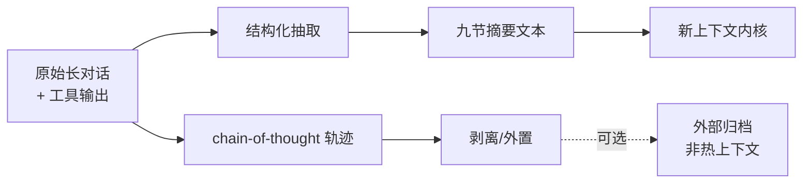
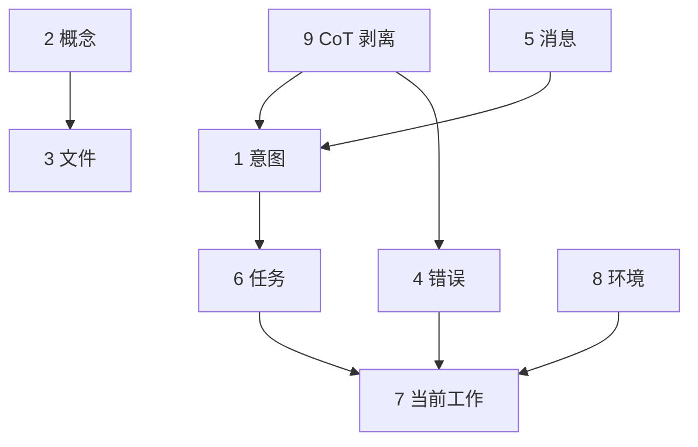

# 8.5 Tier3 完全压缩：九节摘要与 CoT 剥离

> 搬家时只能带走集装箱：把散件按装箱单归类，草稿纸烧掉，只留签字版结论。

---

## 本节学习目标

1. **定义** Tier3「完全压缩」：**最后手段**，在极端压力下重构上下文为**结构化骨架**。
2. **背诵并理解** **九节摘要** 的信息架构：意图、概念、文件、错误、消息、任务、当前工作 + 扩展节 + CoT 剥离。
3. **解释** **chain-of-thought 后剥离**：降低噪声与 token，保留可执行结论。
4. **对照** Tier3 与 Tier1/Tier2：何时规则不够、何时自动摘要不够。
5. **实操** 能根据九节模板**手工**重建一段「将死会话」的连续性。

---

## 生活类比：庭审卷宗 vs 律师草稿纸

诉讼结束时：

- **卷宗**（Tier3 产物）必须包含：当事人意图、争议焦点、关键证据目录、未决事项、下一步程序——像**九节目录**。
- 律师的**演算草稿**（CoT）可以销毁或归档到不允许带入庭审的文件盒：不是「没发生过」，而是**不应再占用主卷宗的页数**。

---

## 九节摘要：字段说明表

| 节 | 名称 | 应回答的问题 |
|----|------|----------------|
| 1 | 意图 | 用户最终要什么交付物？ |
| 2 | 概念 | 有哪些术语/约束必须统一？ |
| 3 | 文件 | 哪些路径是「主战场」？ |
| 4 | 错误 | 现在卡住的失败是什么？如何复现？ |
| 5 | 消息 | 用户哪些原话不可改写？ |
| 6 | 任务 | TODO 列表与完成定义？ |
| 7 | 当前工作 | 下一步最小动作？ |
| 8 | 环境/依赖（扩展） | 版本、分支、运行命令？ |
| 9 | CoT 剥离 | 中间推理删除后，**保留了哪些结论**？ |

> 第 8 节可根据团队模板替换为「风险/回滚/安全」等固定栏目。

---

## Mermaid：Tier3 的输入—输出变换



---

## 源码片段：把对话折叠为九节（伪实现）

```typescript
type Tier3Summary = {
  intent: string;
  concepts: string[];
  files: { path: string; note: string }[];
  errors: { title: string; repro: string }[];
  messageHighlights: string[];
  tasks: { id: string; done: boolean; text: string }[];
  currentFocus: string;
  environment: string;
  strippedCoT: { keptConclusions: string[] };
};

function buildTier3Summary(longThread: string): Tier3Summary {
  // 真实实现：由更强摘要模型或规则流水线完成
  return {
    intent: extractIntent(longThread),
    concepts: extractConcepts(longThread),
    files: extractFiles(longThread),
    errors: extractErrors(longThread),
    messageHighlights: extractUserQuotes(longThread),
    tasks: extractTasks(longThread),
    currentFocus: extractNextStep(longThread),
    environment: extractEnv(longThread),
    strippedCoT: { keptConclusions: extractConclusionsOnly(longThread) },
  };
}
```

---

## chain-of-thought 剥离：操作守则

| 守则 | 原因 |
|------|------|
| 结论必须可独立成立 | 否则剥离 CoT 会丢因果 |
| 关键数字/路径写进正文 | 避免「我记得大概是」 |
| 未验证假设不得写死 | 防止错误固化成「事实」 |
| 剥离物可外置到文件 | 需要审计时仍可追溯 |

### 片段：剥离前后对照（示意）

```text
# 剥离前（节选）
我先猜是路由问题…… 不对，再看 middleware……
哦日志里 403 来自 authz…… 所以应该改 policy……

# 剥离后（应写入第 4/7 节）
错误：403 来自 authz policy X。
下一步：修改 policy X 并补集成测试。
```

---

## Mermaid：九节之间的依赖关系



---

## Tier3 使用时机（判断表）

| 场景 | 是否倾向 Tier3 |
|------|----------------|
| Tier2 熔断 + 仍超高占用 | 是 |
| 用户明确要「重置但不断任务」 | 是 |
| 仅需删旧工具输出 | 否（Tier1） |
| 中等占用、可接受服务端自动处理 | 优先 Tier2 |

---

## 手工演练：从混乱对话生成九节

假设对话主题是「把 Express 迁移到 Fastify」：

```markdown
### 1. Intent
完成 Express → Fastify 迁移，并通过现有集成测试。

### 2. Concepts
- 中间件签名差异
- 请求生命周期钩子映射

### 3. Files
- `src/server.ts` — 入口替换
- `src/routes/*` — 路由注册方式

### 4. Errors
- 测试 `auth.test.ts` 超时：待复现日志

### 5. Message Highlights
- 用户要求：「保持对外 API 不变」

### 6. Tasks
- [ ] 迁移入口
- [ ] 对齐 middleware
- [ ] 修复 auth 测试

### 7. Current Focus
先定位 `auth.test.ts` 超时是路由还是插件初始化。

### 8. Environment
Node 22，pnpm，分支 `feat/fastify`.

### 9. Reasoning Stripped
保留结论：超时更可能来自插件 await 链，而非路由层。
```

---

## 与手动 `/compact` 的关系

Tier3 是系统级「硬重置骨架」；用户级 `/compact` 则可用**焦点提示**引导摘要保留哪些节更重要。见 `08-manual-compact.md`。

---

## 风险与缓解

| 风险 | 缓解 |
|------|------|
| 九节写错导致后续全偏 | 关键事实附 **文件路径 + 命令** |
| 过度剥离丢证据 | 大日志放文件，摘要里留指针 |
| 团队字段不一致 | 固定模板提交到仓库 `docs/` |

---

## 练习

1. 找一段你自己的长 ChatGPT 线程，手工填九节，看能否在 **1500 汉字**内说清。  
2. 标出哪些句子必须来自「用户原话」（第 5 节）。

---

## FAQ

**Q：九节必须严格九个吗？**  
A：教学上是**信息完备性的 checklist**；实现可合并字段，但别丢维度。

**Q：Tier3 会不会删掉我还没同意的修改？**  
A：Tier3 处理的是**对话上下文**，不是 Git；但模型可能**遗忘**未落地变更的意图——所以要及时 `commit` 或写 `CLAUDE.md`。

---

## 小结

Tier3 完全压缩用**九节摘要**把「散乱的对话—工具证据」变成**可续写的项目状态机**；再通过 **CoT 剥离**把高噪声推理移出热上下文。掌握这套装箱单，你就不怕长会话「物理上还在、逻辑上散了」。

---

## 附录：九节模板（纯 Markdown，可复制）

```markdown
## Tier3 / Nine-Section Summary

1. Intent:
2. Concepts:
3. Files:
4. Errors:
5. Message Highlights:
6. Tasks:
7. Current Focus:
8. Environment:
9. Stripped CoT — Kept Conclusions:
```
