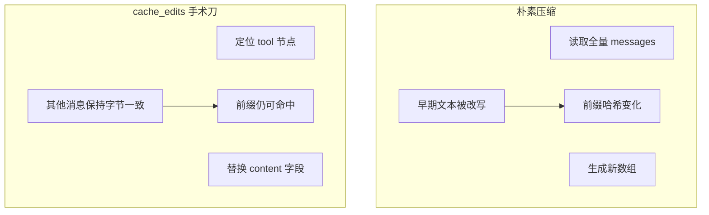
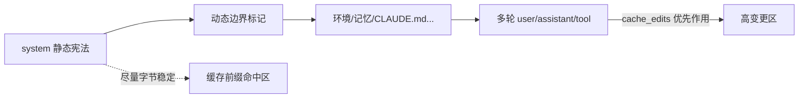
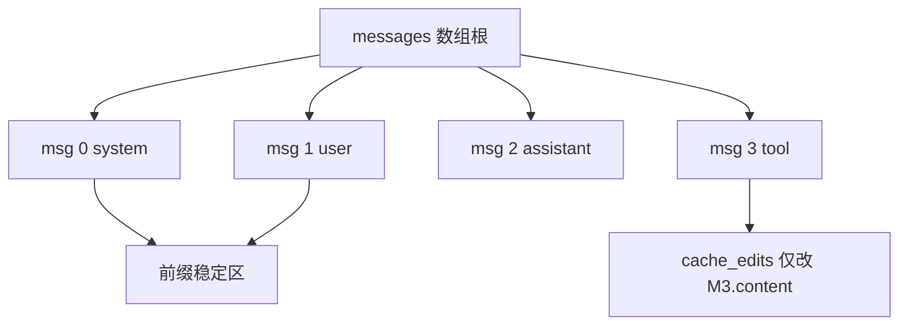

# 8.6 缓存感知压缩：`cache_edits` 与「前缀不动」纪律

> 整理书架时只抽走几本厚书，而不是把整面墙重新粉刷——否则「常读区」的标签全得重贴。

---

## 本节学习目标

1. **解释** 提示词 **prompt caching** 的基本收益：稳定前缀命中 → 更低费用/更快首包（视产品与模型支持而定）。
2. **说明** 朴素压缩（整段重写对话）如何**破坏缓存前缀**，从而「省下的上下文」被「上涨的单价」反噬。
3. **描述** **cache_edits** 思路：**手术刀式**删除或替换工具结果，尽量保持前缀字节级稳定。
4. **对照** 「删消息」与「改消息」对缓存的不同影响（概念层面）。
5. **制定** 团队规范：哪些块必须append-only，哪些块允许被 cache_edits 触碰。

---

## 生活类比：超市会员价标签

超市对「会员价」贴在**固定展板**上（缓存前缀）：

- 若店员每天把整块展板撕掉重贴（整段重写上下文），系统要重新录入、重新核对——成本高。
- 更好的做法是：只替换**可变价签插槽**里的数字（**局部 edit**），展板底板不动。

`cache_edits` 就是替换插槽，而不是换整块板。

---

## 缓存前缀为何脆弱

| 行为 | 对前缀的影响 |
|------|----------------|
| 在前缀后 append 新消息 | 通常**不破坏**既有前缀匹配（取决于服务商规则） |
| 修改前缀中任意字符 | **通常破坏** |
| 重排早期消息顺序 | **高风险** |
| 把工具输出插到前缀之前 | **极高风险**（改变前缀边界） |

> 精确语义以 Anthropic/OpenAI 等官方缓存文档为准；本节给 Claude Code 学习者的**工程直觉**。

---

## Mermaid：朴素压缩 vs cache_edits



---

## 源码片段：`cache_edits` 伪代码

```typescript
type CacheEdit = {
  messageId: string;
  field: "content";
  oldHash: string;
  newContent: string;
};

function applyCacheAwareCompaction(
  messages: Message[],
  edits: CacheEdit[]
): Message[] {
  const byId = new Map(messages.map((m) => [m.id, m]));

  for (const e of edits) {
    const m = byId.get(e.messageId);
    if (!m) continue;
    if (hash(m.content) !== e.oldHash) {
      // 并发冲突：放弃此 edit 或重算
      continue;
    }
    m.content = e.newContent;
  }

  return messages; // 顺序不变、非目标消息不变
}
```

### 片段：只 elide 工具结果节点

```json
{
  "type": "cache_edits",
  "edits": [
    {
      "message_id": "toolmsg_0182",
      "replace_content_with": "[tool output elided; see artifacts/run-182.log]"
    }
  ]
}
```

---

## 表：可编辑 vs 不可编辑（团队规范示例）

| 消息类型 | 是否建议 cache_edits | 备注 |
|----------|----------------------|------|
| 系统提示静态段 | **否** | 动了就失缓存 |
| 用户原始消息 | 谨慎 | 语义敏感 |
| 工具结果 | **是** | 体积大户 |
| 助手最终答复 | 视情况 | 可能影响连贯索引 |

---

## Mermaid：上下文拼装顺序与「前缀边界」



---

## 与 Tier1 的协同

Tier1「清旧工具结果」若实现为：

- **好**：对 tool 消息内容做**原地替换**或**定点删除**；
- **差**：把整轮 messages 重新序列化导致无关空格/字段顺序变化。

---

## 实操：让缓存「有东西可命中」

| 建议 | 解释 |
|------|------|
| 少改系统提示模板 | 提高静态段稳定性 |
| 动态内容集中在边界后 | 保护前缀 |
| 大内容走文件指针 | 工具输出变小 |
| 合并无意义的小修小补 | 减少前缀抖动频率 |

---

## 反模式清单

| 反模式 | 后果 |
|--------|------|
| 每次压缩都 pretty-print JSON | 空白变化 → 前缀变 |
| 随机重排消息 | 哈希变 |
| 把 timestamp 写入静态前缀 | 前缀永不稳定 |
| 同一策略两种字符串拼接顺序 | 难以命中 |

---

## 练习

1. 画你项目里「静态系统提示」与「动态后缀」的分界线。  
2. 写三条 `cache_edits` 规则，只针对 `grep` 与 `read_file` 工具消息。

---

## FAQ

**Q：我怎么知道前缀有没有命中？**  
A：看计费面板/日志中的 cache read/write 指标（以平台为准）。

**Q：cache_edits 是用户可见 API 吗？**  
A：可能是内部/底层表示；学习者只需理解**局部编辑**思想。

---

## 小结

缓存感知压缩的核心是：**能删工具结果，就别重写世界**。`cache_edits` 用**手术刀**维护前缀稳定，让「减负」与「省钱」一致起来，而不是互相打架。

---

## 附录：与第 5 篇边界的对照

| 概念 | 第 5 篇重点 | 本篇重点 |
|------|-------------|----------|
| 动态边界 | `SYSTEM_PROMPT_DYNAMIC_BOUNDARY` | 压缩不跨越边界胡改 |
| 静态宪法 | 可缓存 | Tier1/2/3 都慎动 |

---

## 扩展：哈希稳定性的最小示例

```typescript
import { createHash } from "node:crypto";

function stableHash(messages: Message[]) {
  const canonical = JSON.stringify(messages, Object.keys(messages[0] ?? {}).sort());
  return createHash("sha256").update(canonical).digest("hex");
}
```

工程上常改用**更细粒度**的「前缀字节范围哈希」；此处仅说明：**序列化细节影响命中**。

---

## Mermaid：edit 只触达子树



---

## 表：服务商缓存语义备忘（学习者）

| 概念 | 记住一句话 |
|------|------------|
| prefix cache | 前缀相同部分可复用计费 |
| TTL | 缓存可能过期，别当永久磁盘 |
| breakpoints | 断点位置影响命中 |

以官方文档为准。

---

## 实战：审查一次 PR 中的「压缩实现」

检查清单：

1. 是否**原地修改**工具消息而非重建全数组？
2. 是否避免对 system 块 `trim()`？
3. 是否有单元测试覆盖「edit 后哈希」？

---

## 练习补充

3. 列举三个会改变 JSON 序列化从而破坏缓存的「无害」代码改动。
