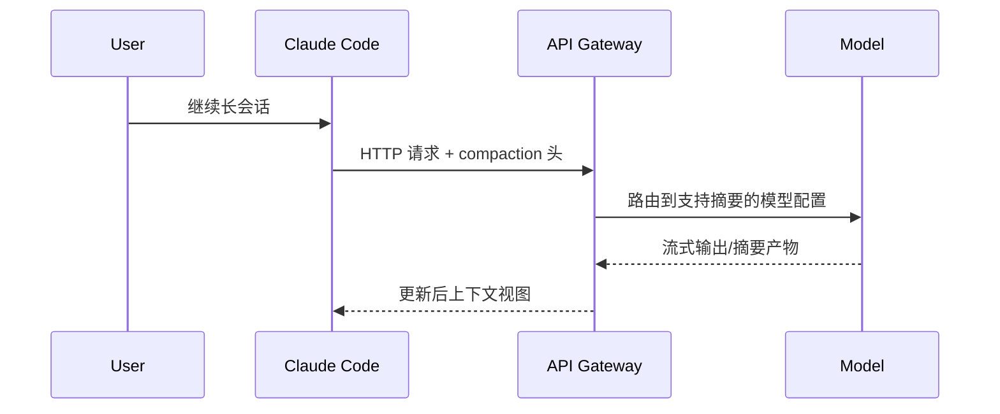
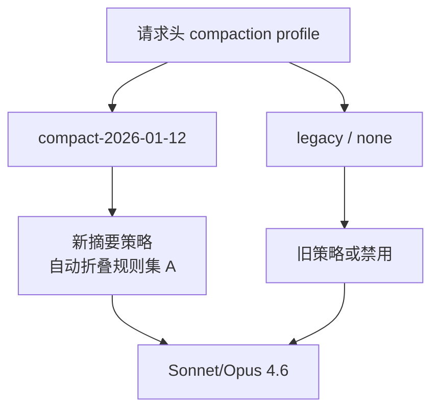
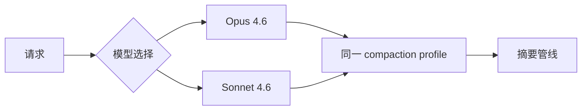

# 8.7 API 层 compaction：`compact-2026-01-12` 与模型支持

> 在 HTTP 头上贴一张「请用新版收纳盒」的标签，服务端才知道该走哪条摘要管线。

---

## 本节学习目标

1. **说明** API 层 compaction 与客户端 `/compact` 的差异：**声明能力/协议版本** vs **交互命令**。
2. **识别** 头字段 **`compact-2026-01-12`**（教学命名）所代表的「2026-01-12 版压缩协议/行为」。
3. **列举** **Opus 4.6** 与 **Sonnet 4.6** 在自动摘要链路中的支持面（概念：二者均支持该类能力）。
4. **解释** 「自动摘要」在传输层的价值：用户少操心，但仍受阈值与策略约束。
5. **对照** API compaction 与 Tier2：一个在**协议层**声明，一个在**会话层**表现为占用压力反应。

---

## 生活类比：快递箱上的「易碎/冷链」标签

同样的包裹：

- 贴上 **冷链** 标签，分拣系统会走冷库线路；
- 没贴标签，可能当普通件处理，夏天就化了。

API 头里的 compaction 标记类似：**告诉基础设施用哪套处理规则**。

---

## 概念架构表

| 层级 | 角色 | 典型载体 |
|------|------|----------|
| 交互层 | 用户触发 | `/compact` + 焦点提示 |
| 会话层 | 占用治理 | Tier1/2/3 |
| API 层 | 能力协商 | `compact-2026-01-12` 等头 |

---

## Mermaid：请求中的 compaction 协商



---

## 头字段示例（教学用伪 HTTP）

```http
POST /v1/messages HTTP/1.1
Content-Type: application/json
X-Client: claude-code
X-Compaction-Profile: compact-2026-01-12

{
  "model": "claude-sonnet-4-6",
  "messages": [ ... ]
}
```

> 真实头名称以实现为准；此处展示「把版本钉在协议上」的意图。

---

## 模型支持矩阵（教学）

| 模型族 | 支持 API 层自动摘要（概念） |
|--------|-----------------------------|
| Opus 4.6 | 支持 |
| Sonnet 4.6 | 支持 |

说明：「支持」指产品路线中该模型可参与/可受益于对应 compaction 管线，而非保证每一请求都触发摘要。

---

## 源码片段：客户端如何附加 profile（伪代码）

```typescript
type HttpHeaders = Record<string, string>;

function buildHeaders(session: Session): HttpHeaders {
  return {
    "Content-Type": "application/json",
    "X-Compaction-Profile": "compact-2026-01-12",
    "X-Session-Id": session.id,
  };
}

async function sendModelRequest(body: unknown, session: Session) {
  return await fetch(session.apiBase, {
    method: "POST",
    headers: buildHeaders(session),
    body: JSON.stringify(body),
  });
}
```

---

## Mermaid：不同 profile 的分支



---

## 自动摘要：用户可感知的信号

| 信号 | 可能含义 |
|------|----------|
| 对话突然「变短」 | 服务端已折叠早期细节 |
| 旧栈追踪不见 | 被摘要为一句错误描述 |
| 任务仍在 | 九节/要点仍保留 |

---

## 与 Tier2 阈值的关系

API profile 决定「**怎么压**」；Tier2 阈值决定「**何时压**」。二者组合：

```text
何时压：fillRatio >= 0.87（会话层）
怎么压：compact-2026-01-12（API 层）
```

---

## 兼容性注意

| 场景 | 建议 |
|------|------|
| 旧客户端 | 可能缺少新 profile → 摘要行为不同 |
| 多模型切换 | 确认目标模型在矩阵内 |
| 自建代理 | 透传 compaction 相关头 |

---

## 练习

1. 解释如果把 compaction 头去掉，Tier2 是否仍可能存在？  
2. 画一张表对比「只有 Tier2」与「Tier2 + 新 profile」的风险差异。

---

## FAQ

**Q：日期 2026-01-12 是什么？**  
A：教学用**版本钉**；代表某次行为变更基线，便于日志与排障。

**Q：会改变计费吗？**  
A：摘要可能改变输入 token 结构，从而影响费用；以平台账单为准。

---

## 小结

API 层 compaction 用 **`compact-2026-01-12`** 这类头把「摘要策略版本」**显式化**，使 **Opus 4.6 / Sonnet 4.6** 等模型在服务端可走一致的自动摘要路径。它与 Tier2 **何时触发**互补，与用户 `/compact` **主动控制焦点**互补。

---

## 附录：排障 checklist

| 现象 | 检查 |
|------|------|
| 摘要行为与文档不符 | profile 头是否下发 |
| 只有部分会话异常 | 是否模型混用 |
| 费用异常 | 缓存命中 + 摘要前后 token 对比 |

---

## 扩展：版本钉与可观测性

把 `compact-2026-01-12` 写入客户端版本遥测：

```json
{
  "client": "claude-code",
  "version": "x.y.z",
  "compaction_profile": "compact-2026-01-12",
  "model": "claude-opus-4-6"
}
```

排障时对比：**升级前后 profile 是否漂移**。

---

## Mermaid：多模型路由



---

## 表：客户端升级检查表

| 检查项 | 通过标准 |
|--------|----------|
| 头发送 | 抓包可见 |
| 模型白名单 | 仅 4.6 族走新管线 |
| 回滚路径 | 可关闭 profile |

---

## 与 Sonnet / Opus 的选用提示（概念）

| 倾向 | 说明 |
|------|------|
| Sonnet | 更快扫描/执行，适合高频 compact 辅助 |
| Opus | 更强推理，适合极难摘要保留因果 |

具体路由以产品为准。

---

## 练习补充

3. 写一段「发布说明」文案，告知团队新 compaction profile 上线与回滚方式。
