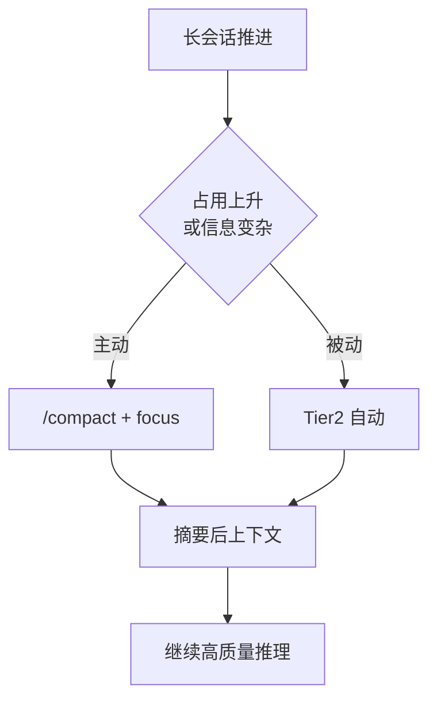
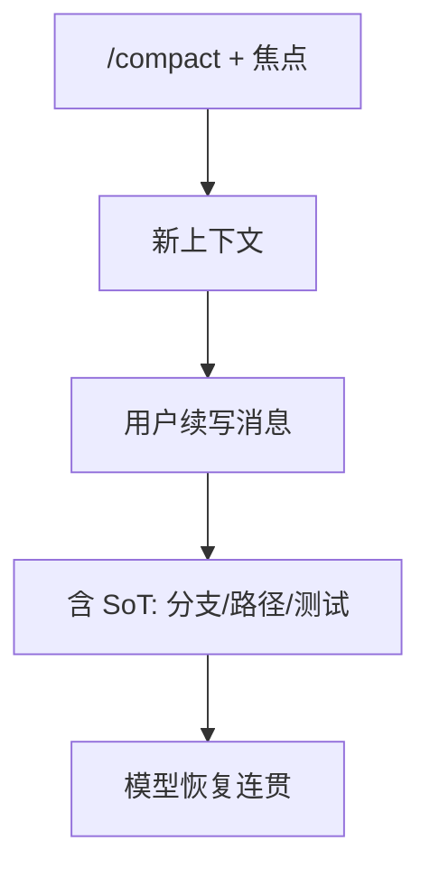

# 8.8 手动 `/compact`：节奏、焦点与可控摘要

> 吸尘器的高级模式不是「更强吸力」，而是「告诉它重点吸沙发角」。

---

## 本节学习目标

1. **使用** `/compact` 在对话中段主动触发压缩，而不是被动等待 Tier2。
2. **编写** 有效的**焦点提示**（focus hint）：告诉模型摘要后必须保留什么、可以牺牲什么。
3. **对比** `/compact` 与 API 自动摘要：控制权、可预期性与适用场景。
4. **规避** 误摘要：把不可丢失的事实绑定到**文件路径/测试名/命令**。
5. **规划** 压缩后的下一句用户消息，使新上下文「一键续写」。

---

## 生活类比：摄影师选片

拍了一整天婚礼：

- **自动选片**像 Tier2：算法按规则删重复，但可能删掉你喜欢的抓拍。
- **`/compact` + 焦点**像你对修图师说：**「保留新人与父母那组，其他可以狠裁」**——结果更贴合意图。

---

## `/compact` 是什么（概念）

| 维度 | 描述 |
|------|------|
| 类型 | 手动命令（聊天内） |
| 目的 | 主动整理上下文 |
| 关键能力 | 支持 **焦点提示** |
| 与 Tier 关系 | 可能调用与 API/Tier2 类似的摘要能力，但**由你发起** |

---

## Mermaid：手动压缩介入点



---

## 焦点提示模板库

### 模板 A：保留错误与复现

```text
/compact
焦点：保留当前 TypeError 的完整堆栈与复现命令；
可删：早期探索性 read_file 全文与已解决的 lint 输出。
```

### 模板 B：保留架构决策

```text
/compact
焦点：保留我们已确认的模块边界与公开 API 列表；
可删：讨论过程的口语往返与中间假设。
```

### 模板 C：保留未合并 PR 状态

```text
/compact
焦点：保留 PR #482 的审查意见摘要与待改文件列表；
可删：与 PR 无关的本地实验输出。
```

---

## 源码片段：CLI 解析 `/compact`（伪实现）

```typescript
type CompactCommand = {
  kind: "compact";
  focus?: string;
};

function parseSlashCommand(input: string): CompactCommand | null {
  if (!input.startsWith("/compact")) return null;
  const rest = input.replace("/compact", "").trim();
  return { kind: "compact", focus: rest || undefined };
}

async function handleCompact(cmd: CompactCommand, session: Session) {
  await session.compact({
    userFocus: cmd.focus,
    preserveRecentToolResults: 5, // 可能与 Tier1 协同
  });
}
```

---

## 表：何时用手动 vs 自动

| 场景 | 手动 `/compact` | 等 Tier2 |
|------|-----------------|----------|
| 你要赶 deadline，必须可控 | 优先 | 次选 |
| 占用缓慢上升 | 可选 | 可等 |
| 刚完成大阶段，准备新阶段 | 强建议 | 不必等 |
| 你明确知道什么是噪音 | 强建议 | 风险更高 |

---

## Mermaid：焦点提示的信息流


---

## 实操步骤（建议流程）

1. **保存** 当前工作区状态（`git status` 干净或已提交 WIP）。
2. **写焦点**：3～6 条 bullet，区分「必须保留 / 可删」。
3. 执行 `/compact` 粘贴焦点。
4. **下一条消息**用「续写协议」开场：

```text
我们继续上一段任务。以下事实仍以仓库为准：
- 分支：feature/x
- 失败测试：packages/foo/__tests__/bar.test.ts
请基于压缩后的摘要，从「修复 bar.test」继续。
```

---

## 与 Tier3 九节的关系

你可以把焦点提示看成**用户版的九节权重**：强调第 4 节（错误）和第 7 节（当前工作），其余让摘要器自由折叠。

---

## 反模式

| 反模式 | 为什么糟 |
|--------|----------|
| `/compact` 无焦点 | 可能删掉你心里的关键细节 |
| 焦点写太长 | 摘要提示本身占 token |
| 焦点互相矛盾 | 模型无所适从 |
| 压缩后不交代续写协议 | 容易「失忆式乱改」 |

---

## 练习

1. 给你当前真实任务写一段 **50 字内** 焦点提示。  
2. 模拟压缩后第一条用户消息，包含 **分支名 + 一个文件路径**。

---

## FAQ

**Q：`/compact` 会动我的磁盘文件吗？**  
A：通常动的是**会话上下文**；文件除非你另有工具操作。

**Q：焦点提示必须用中文吗？**  
A：用你**最会写约束**的语言即可；团队统一更重要。

---

## 小结

`/compact` 把压缩从「系统不得不」变成「我主动要」：配合**焦点提示**，你在 **60%** 占用前后就能把对话整理成**下一阶段可读**的形态，减少对 Tier2/3 的被动依赖。

---

## 附录：与 `CLAUDE.md` 联动

压缩会丢细节，**项目记忆**不会：

| 内容 | 放会话 | 放 `CLAUDE.md` |
|------|--------|----------------|
| 一次性调试 | 是 | 否 |
| 长期命令/约定 | 可 | 是 |
| 团队规范 | 可 | 是 |

详见第 9 篇。

---

## 扩展：`/compact` 与其他斜杠命令的协同

| 命令 | 关系 |
|------|------|
| `/compact` | 整理上下文 |
| 新会话 | 更激进「重置」 |
| `CLAUDE.md` 编辑 | 长期约束不依赖会话 |

---

## Mermaid：压缩前后的「首条用户消息」策略



---

## 表：焦点提示的长度建议

| 长度 | 评价 |
|------|------|
| < 30 字 | 可能信息不足 |
| 50～200 字 | 甜区 |
| > 500 字 | 可能浪费 token |

---

## 反例改写练习

**反例**：`/compact 别删东西`  
**改写**：`/compact 焦点：保留 X；可删：Y；SoT：path Z`

---

## 与无障碍/国际化

若团队双语：

```text
/compact
Focus (EN): Keep failing stack trace for test T.
可删：早期探索性输出。
```

模型通常能处理混合指令，但**焦点句建议一种语言主写**。

---

## 练习补充

3. 记录一次你真实使用 `/compact` 前后的「模型行为差异」（主观即可）。
