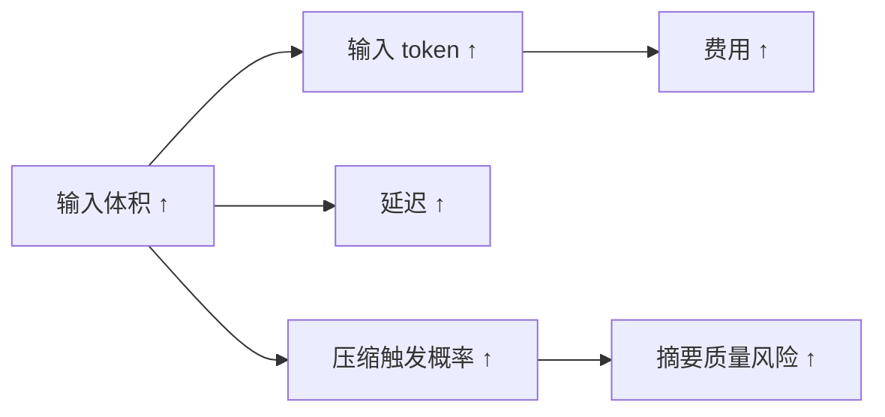
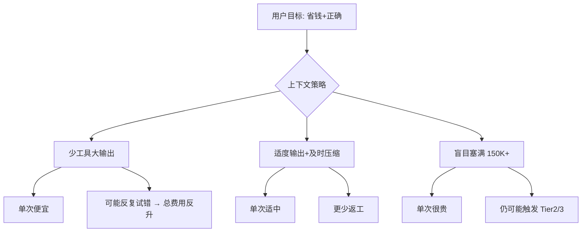

# 8.9 成本分析：窗口长度、单价与 5 倍差距直觉

> 同一模型下，「多带行李登机」往往要多付钱——上下文越长，单次请求的输入侧成本越可能陡升。

---

## 本节学习目标

1. **建立** 定量直觉：在可比设定下，**30K token** 请求与 **150K token** 请求的成本量级比约为 **1 : 5**（教学用：$0.09 vs $0.45）。
2. **解释** 为何「窗口有 200K」不等于「每次都应该用满」：费用近似随**有效输入规模**缩放。
3. **采纳** **60% 使用量介入**建议：为工具输出突刺与多轮累积留安全垫。
4. **拆解** 成本构成：**输入 token**、**缓存命中**、**输出 token**、**摘要额外调用**（若有）。
5. **制定** 个人/团队的「上下文预算 SLO」：例如单任务会话目标占用上限。

---

## 生活类比：搬家公司按车厢体积计费

你叫同一辆车：

- 只装 **30 箱**（类比 ~30K token 输入），按起步价 + 少量立方 —— **便宜一档**。
- 装到 **150 箱**（类比 ~150K），车厢要更大、装卸更久、油费更高 —— **大约贵好几倍**。

模型请求里，**长上下文**就像**塞满车厢**：不是不能装，而是**每次搬运都更贵**。

---

## 教学用定价对照表（示意）

下列数字用于**比例直觉**；真实价格以官方页面为准。

| 单次请求有效输入规模（示意） | 示意费用（USD） | 相对倍数 |
|------------------------------|-----------------|----------|
| ~30K tokens | **$0.09** | 1× |
| ~150K tokens | **$0.45** | **5×** |

核心结论：**5 倍**不是「模型变贵」，而是「你一次性喂给模型的上下文体积」变大导致的**输入侧计价**结果。

---

## Mermaid：token 体积与费用敏感度



---

## 为什么 60% 就要介入（与第 8.1 节呼应）

设 `max = 200K`：

| 比例 | token 量级 | 解读 |
|------|------------|------|
| 60% | ~120K | **建议介入**：整理、拆分、`/compact` |
| 87% | ~174K | Tier2 高概率触发 |
| 100% | 200K | 强压缩/失败风险上升 |

**60%** 的意义：你还剩 ~80K 的「缓冲」给：

- 下一轮 `read_file` / 测试输出；
- 多轮 user/assistant 文本；
- 可能的摘要提示本身。

---

## 源码片段：费用估算器（伪代码）

```typescript
type TieredPrice = { upToTokens: number; usdPerMillion: number }[];

function estimateInputCost(inputTokens: number, tiers: TieredPrice): number {
  // 教学用：简化为线性单价示意
  const usdPerMillion = 3; // 假设值
  return (inputTokens / 1_000_000) * usdPerMillion;
}

function compareTwoLoads() {
  const a = estimateInputCost(30_000, []);
  const b = estimateInputCost(150_000, []);
  return { low: a, high: b, ratio: b / a }; // 期望 ratio ≈ 5
}
```

### 片段：把「工具输出预算」纳入会话策略

```typescript
const SESSION_INPUT_BUDGET = 120_000; // 60% of 200k

function beforeToolCall(estimatedReturn: number, current: number) {
  if (current + estimatedReturn > SESSION_INPUT_BUDGET) {
    warn("将超过建议预算：先 /compact 或缩小工具范围");
  }
}
```

---

## Mermaid：成本与压缩策略的博弈



---

## 表：降本杠杆排序（从高影响到低）

| 杠杆 | 机制 | 难度 |
|------|------|------|
| 控制工具输出体积 | 直接降低输入 token | 低 |
| 提高缓存前缀命中 | 降低有效计费输入 | 中 |
| 60% `/compact` | 避免长期高水位徘徊 | 低 |
| 拆分会话 | 每会话峰值更低 | 中 |
| 把结论写入仓库 | 上下文只保留指针 | 中 |

---

## 与缓存的关系（费用第二曲线）

即使「原始对话很长」，若 **cache read** 命中率高，账单可能**好于** naive 计数。反之：

- 频繁破坏前缀 → 命中差 → **费用接近「全量重读」**。

因此第 8.6 节的 `cache_edits` 同时也是**成本工程**。

---

## 场景推演 A：调试循环

| 轮次 | 行为 | 输入体积趋势 |
|------|------|----------------|
| 1-5 | 每次贴 8K 日志 | 线性上升 |
| 6 | 达 60% | 应压缩或外置日志 |
| 若不做 | 10+ | 冲 87%，Tier2 介入 |

**教训**：日志进文件，上下文只留 **50 行关键**。

---

## 场景推演 B：大重构

| 阶段 | 建议 |
|------|------|
| 设计 | 新开会话 + `CLAUDE.md` 记录决策 |
| 实施 | 多会话按子模块切 |
| 验证 | 测试输出截断 |

---

## 表：「便宜但错」vs「贵但对」

| 策略 | 单次费用 | 总费用风险 | 正确性风险 |
|------|----------|------------|------------|
| 上下文极简但不交代约束 | 低 | 高（返工） | 高 |
| 上下文饱满但不整理 | 高 | 高（抖动+重试） | 中 |
| 60% 整理 + 文件指针 | 中 | **低** | **低** |

---

## 练习

1. 用你自己的账单（若可得）验证「长输入」与费用的相关性。  
2. 给团队写一条 **SLO**：单会话建议不超过多少 K token（自行定义）。

---

## FAQ

**Q：输出 token 不重要吗？**  
A：重要；但本篇强调**上下文体积**带来的 **5×** 直觉，因为许多用户忽略了输入侧。

**Q：压缩本身花钱吗？**  
A：若摘要需要额外模型调用，可能产生**附加费用**；但与长期高水位相比，常更划算。

---

## 小结

把 **30K vs 150K** 的 **$0.09 vs $0.45（约 5 倍）**刻进肌肉记忆，你会自然接受 **60% 介入**：不是焦虑，而是**预算管理**。配合工具输出控制与缓存纪律，总成本与稳定性通常同时变好。

---

## 附录：速算卡片

```text
200K 窗口
60% ≈ 120K  ← 建议开始整理
87% ≈ 174K  ← Tier2 高概率

同模型、可比单价下：
输入 ×5 规模 ≈ 输入费用 ×5（示意）
```

---

## 延伸阅读

- `03-micro-compaction.md`：先 cheap 地砍体积。
- `06-cache-aware.md`：别让压缩毁掉缓存红利。
- `08-manual-compact.md`：用焦点把「该花钱保留的」钉死。

---

## 案例表：三类开发者的一周账单差异（虚构但比例可信）

| 角色 | 习惯 | 周费用示意 |
|------|------|------------|
| A | 每轮贴万行日志 | 高 |
| B | 60% compact + 日志外置 | 中低 |
| C | 极短上下文但反复返工 | 中高 |

---

## 术语对照

| 英文 | 中文 |
|------|------|
| input tokens | 输入 token |
| prompt caching | 提示缓存 |
| compaction | 压缩/摘要 |

---

## 与产品指标对齐（建议）

若你在组织内推广 Claude Code，可跟踪：

1. 平均会话峰值 token（或 proxy：消息大小）。
2. compact 触发次数 / 千次请求。
3. 人均周费用与返工率（PR revert 率）。

---

## 反思题

1. 你愿意为「少返工」支付多少额外输入 token？  
2. 哪些信息绝对应从上下文迁移到 Git 与 `CLAUDE.md`？

---

## 结语

成本分析的本质不是抠门，而是**把 token 花在刀刃上**：长上下文是工具，不是荣誉勋章。
