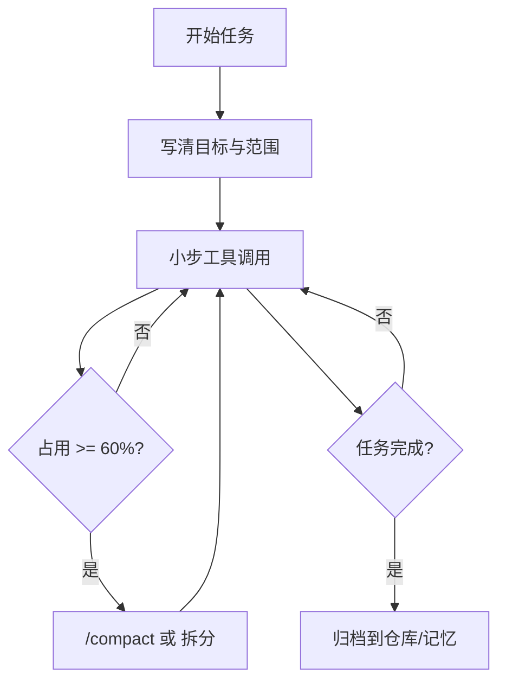
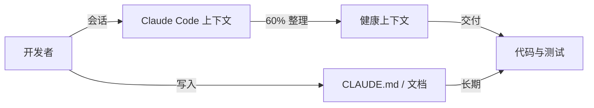
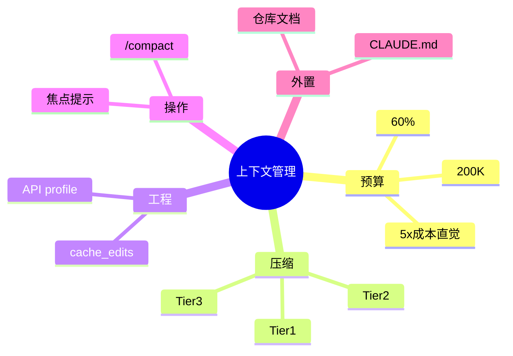

# 8.10 最佳实践：上下文管理的「日常纪律」

> 像健身计划一样：不靠一次极限冲刺，靠每天 10 分钟的好习惯。

---

## 本节学习目标

1. **整合** Tier1/2/3、缓存感知、API compaction、手动 `/compact` 与成本意识，形成**可执行清单**。
2. **制定** 个人工作流：从打开会话到收尾归档，上下文**全程可控**。
3. **识别** 高风险习惯（万行日志、整仓 `read`、永不 compact）并给出替代方案。
4. **对齐** 团队规范：代码审查时同时审查「对话是否可复现」（通过仓库而非聊天）。
5. **复盘** 一次故障：用九节摘要模板做**事后归档**。

---

## 生活类比：厨房「边做边洗」

大厨炒菜不堆碗：

- **Tier1** 是顺手冲一下砧板；
- **60% 整理**是每两道菜洗一批锅；
- **Tier3** 是打烊大扫除——不应成为日常唯一手段。

---

## 总览：一页纸清单（建议打印）

| 时机 | 动作 | 对应机制 |
|------|------|----------|
| 会话开始 | 明确目标一句话 + 分支名 | 降低跑题膨胀 |
| 每 3-5 轮 | 扫一眼占用/消息长度 | 预警 |
| ~60% | `/compact` + 焦点 或 新会话 | 主动治理 |
| 大工具调用前 | 评估返回体积 | 预防 |
| 里程碑 | 决策写入 `CLAUDE.md`/README | 记忆外置 |
| 故障 | 九节摘要进 `docs/incidents/` | Tier3 思维人工化 |

---

## Mermaid：推荐日常工作流



---

## 实践 1：工具调用「先问体积」

### 反例

```bash
# 不要：直接让助手 cat 巨型日志进聊天
cat full-ci.log
```

### 正例

```bash
# 先定位，再精读
rg -n "FAIL|Error" full-ci.log | head -n 80
sed -n '1200,1280p' full-ci.log
```

---

## 实践 2：分层记忆，不把聊天当数据库

| 信息类型 | 应存何处 |
|----------|----------|
| 命令如何启动服务 | `CLAUDE.md` / README |
| 本次调试临时栈 | 会话（可压缩） |
| 合规审计原始日志 | 对象存储/日志系统 |

---

## 实践 3：焦点提示的标准 Operating Procedure

1. **Must keep**（3 条以内）
2. **Nice to drop**（明确许可摘要器删）
3. **Source of truth**（仓库路径/测试名）

```text
/compact
Must keep: failing test name + last green commit hash + migration file list.
Nice to drop: early grep dumps.
SoT: repo branch feature/x, file packages/api/src/migrate.ts
```

---

## Mermaid：团队规范中的「责任边界」



---

## 实践 4：与 CI/CD 的接口

| CI 输出 | 建议 |
|---------|------|
| JUnit XML | 只摘失败用例名 |
| Docker build log | 只摘 ERROR 段 |
| E2E 录屏 | 不上传；给链接 |

---

## 实践 5：熔断发生时的 playbook

1. **停**：不要疯狂重试同一 compact 路径。
2. **存**：`git stash` 或 commit WIP。
3. **写**：九节摘要到文件。
4. **开**：新会话携带摘要路径。
5. **缩**：缩小工具范围复现。

---

## 表：习惯红榜 vs 黑榜

| 红榜 | 黑榜 |
|------|------|
| 分段读文件 | 反复全文 read |
| 失败先最小复现 | 一次并行 10 个重工具 |
| 60% compact | 等到模型卡顿才慌 |
| 指针代替粘贴 | 把二进制当文本塞聊天 |

---

## 源码片段：团队 hook 伪代码（可选）

```typescript
// 在本地 CLI 包装层提示用户（概念）
onBeforeSendPrompt(ctx => {
  if (ctx.estimatedInputTokens > 120_000) {
    ui.warn("已超过 60% 建议阈值：考虑 /compact 或拆分任务");
  }
});
```

---

## 实践 6：代码审查中的「可复现性检查」

审查者问：

1. 若聊天丢失，能否靠 README 跑起来？
2. 关键环境变量是否记录在 `.env.example`？
3. 迁移步骤是否写进 `docs/`？

---

## 与第 9 篇的接口

| 本篇 | 第 9 篇 |
|------|---------|
| 控制热上下文体积 | `CLAUDE.md` 提供冷约束 |
| `/compact` 丢细节 | 自动记忆/项目记忆补长期偏好 |

注意：**记忆注入也耗 token**——记忆不是免费午餐。

---

## 复盘模板（事后）

```markdown
## Incident Context Archive (Nine-Section)

1. Intent: ...
2. Concepts: ...
...

Artifacts:
- logs/2026-04-02-api-timeout.zip
```

---

## 练习

1. 写你的「个人上下文 SLO」三条。  
2. 与同伴交换 `/compact` 焦点模板，互相挑刺。

---

## FAQ

**Q：小团队也要这么正式吗？**  
A：最小集：**60% + 日志不外灌 + 决策进 README** 就赢过大多数人。

**Q：会不会过度优化？**  
A：当你周账单或卡顿让你不爽时，就不是过度。

---

## 小结

最佳实践 = **预防（工具体积） + 节奏（60%） + 外置（文档/记忆） + 急救（九节/新会话）**。把上下文管理当职业习惯，Tier3 会很少打扰你。

---

## 附录：本篇速查卡

```text
Tier1: 无模型，清旧工具，留最近 5
Tier2: ~87% 自动，3 连失败熔断
Tier3: 九节 + CoT 剥离
cache_edits: 手术刀，保前缀
API: compact-2026-01-12，Opus/Sonnet 4.6
手动: /compact + 焦点
成本: 30K $0.09 vs 150K $0.45（5x 示意）
介入: 60% 窗口占用
```

---

## 致谢与免责声明

本篇机制描述用于**教学**；具体阈值、头字段名与模型能力以你所用版本官方说明为准。

---

## 最后一图：把八篇知识叠成习惯


