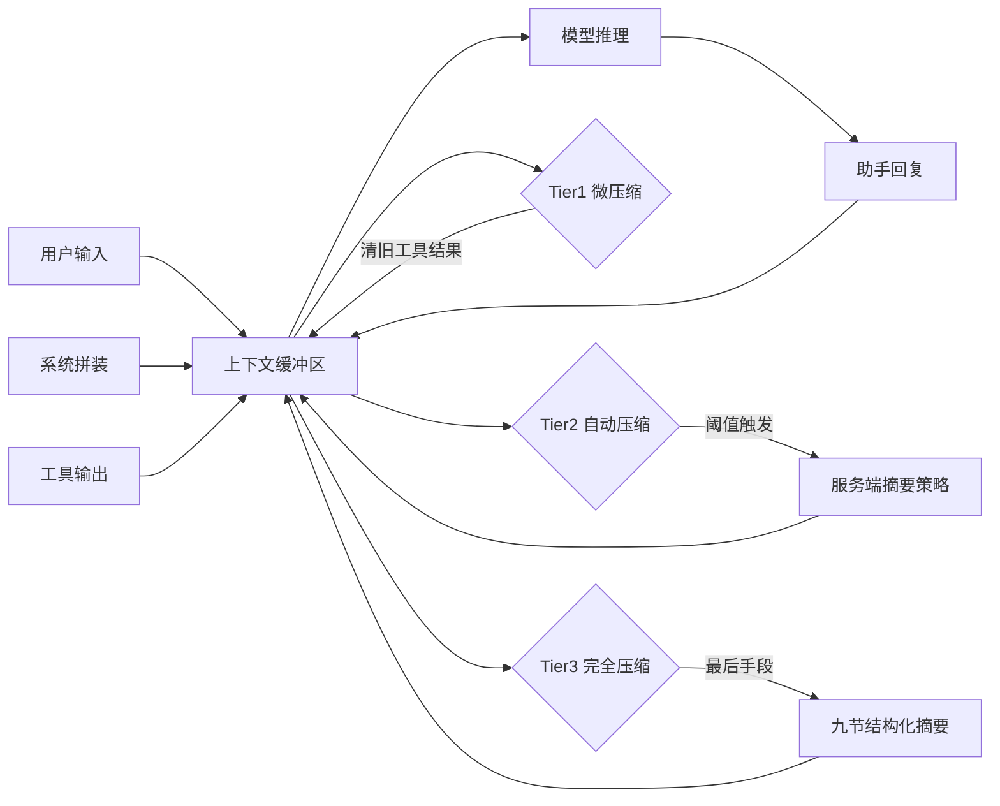
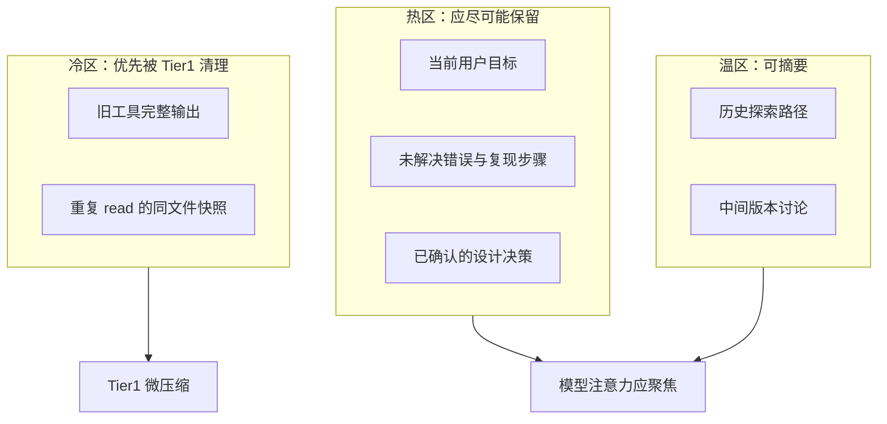

# 第 8 篇：上下文管理（Context Management）

> **Claude Code 完全指南 V2** · 从「对话越长越贵」到「预算、压缩与缓存」的系统化理解

---

## 本篇学习目标

完成本篇后，你应能够：

1. **用预算思维** 描述约 **200K token** 上下文窗口：它不是「无限记事本」，而是**可耗尽、可计价、可优化**的资源。
2. **区分** 三层压缩（Tier1 微压缩 → Tier2 自动压缩 → Tier3 完全压缩）的触发条件、是否调用模型、以及失败熔断策略。
3. **解释** **缓存感知压缩**（如 `cache_edits`）如何在「剪掉臃肿工具输出」的同时，尽量**不破坏可缓存前缀**。
4. **对照** **API 层 compaction**（如 `compact-2026-01-12` 头）与交互层 **`/compact`** 命令：谁在服务端做摘要、谁给你「焦点提示」的控制权。
5. **估算** 长上下文请求的**相对成本**（例如 30K vs 150K 量级差异），并在 **~60% 使用量** 时主动介入，而不是等到撞墙。

---

## 8.1 为什么「上下文管理」是 Claude Code 的必修课

### 生活类比：行李箱与登机行李额

把一次长会话想象成**国际航班**：

- **200K token** 像是航空公司给你的**总行李额度**（托运+随身有上限）。
- **工具返回的大段日志** 像是你在免税店不断往里塞的「纪念品」——很快箱子就满了。
- **压缩（compaction）** 不是把记忆删掉，而是把「占体积但不影响决策」的东西**折叠成摘要**或**丢掉过期副本**，让你还能继续装下一段旅程必需品。

如果你从不整理行李，最后要么**超重加钱**（更多输入 token 成本），要么**塞不进去**（触发更激进的压缩甚至丢信息）。

### 核心论断：上下文 = 工作记忆 + 证据链 + 系统拼装

在 Claude Code 中，上下文通常同时承载：

| 成分 | 典型内容 | 对窗口的影响 |
|------|----------|----------------|
| 系统与规范 | 身份、工具策略、项目规则 | 相对稳定，利于缓存前缀 |
| 用户与助手消息 | 需求、方案、追问 | 持续增长 |
| 工具 I/O | `read_file`、`grep`、测试输出 | **极易膨胀** |
| 隐式状态 | 当前任务焦点、未决错误 | 往往散落在消息里 |

因此，**上下文管理**的目标不是「越短越好」，而是：**在可接受的信息损失下，把窗口留给高价值 token**。

### 200K 窗口：预算表（教学用示意）

下列数字用于建立直觉；实际计费以官方定价与计量为准。

| 概念 | 说明 |
|------|------|
| 窗口上限 | 约 **200K token** 量级的可用上下文（产品/模型代际可能调整） |
| 软预警 | 建议在总占用约 **60%** 时开始整理（手动 `/compact`、减少大输出、拆分任务） |
| 硬压力 | 更高占用会提高触发 **Tier2 自动压缩** 的概率 |
| 成本直觉 | 同模型下，**输入 token 越多，单次请求通常越贵**（见第 9 节定量对照） |

### Mermaid：上下文在会话中的「流入—膨胀—压缩」循环



### 源码片段（概念）：把「窗口占用」当成可观测指标

下面用伪代码表达「你应该在脑子里有的仪表板」（非绑定某一发行版的真实字段名）：

```typescript
type ContextBudget = {
  maxTokens: 200_000;
  usedTokens: number;
  toolResultsBytes: number;
  cachePrefixStable: boolean;
};

function recommendAction(b: ContextBudget): string {
  const ratio = b.usedTokens / b.maxTokens;
  if (ratio >= 0.87) return "预计触发 Tier2；准备接受自动摘要或手动 /compact";
  if (ratio >= 0.60) return "建议主动整理：删大输出、拆分任务、焦点压缩";
  return "正常推进";
}
```

### 本篇路线图（10 节）

| 节 | 文件 | 主题 |
|----|------|------|
| 8.1 | `index.md` | 总览与预算思维 |
| 8.2 | `02-three-tiers.md` | 三层压缩总览 |
| 8.3 | `03-micro-compaction.md` | Tier1 微压缩 |
| 8.4 | `04-auto-compaction.md` | Tier2 自动压缩与熔断 |
| 8.5 | `05-full-compaction.md` | Tier3 完全压缩与九节摘要 |
| 8.6 | `06-cache-aware.md` | 缓存感知与 `cache_edits` |
| 8.7 | `07-api-compaction.md` | API 头与模型支持 |
| 8.8 | `08-manual-compact.md` | `/compact` 与焦点提示 |
| 8.9 | `09-cost-analysis.md` | 成本与窗口经济学 |
| 8.10 | `10-best-practices.md` | 最佳实践清单 |

### 与相邻篇章的关系

- **第 5 篇（提示词工程）**：静态/动态边界决定**缓存前缀**是否稳定；压缩策略必须**尊重**该边界。
- **第 9 篇（记忆系统）**：记忆注入会**增加**上下文消耗；压缩后仍要靠**项目记忆**找回长期约束。

### 常见误解澄清

| 误解 | 更准确的表述 |
|------|----------------|
| 「压缩 = 失忆」 | 压缩是**信息折叠**；Tier 越高，折叠越激进，但仍尽量保留任务连续性的骨架。 |
| 「只要窗口够大就不用管」 | 窗口大 ≠ 成本低；**长输入**仍可能显著增加费用。 |
| 「手动压缩一定比自动好」 | 手动给你**焦点**与**节奏**；自动在**阈值**下更省心力。二者应组合使用。 |

### 练习（自检）

1. 用你自己的项目举一个「工具输出膨胀」的例子，并说明它主要伤害**延迟**、**费用**还是**可读性**。
2. 画一张草图：你的对话里哪些块应该尽量稳定以命中缓存，哪些块必然每轮变化。

### 小结

上下文管理的核心不是背诵阈值数字，而是建立三件事：**预算意识**（200K 不是无限）、**分层策略**（微/自动/完全）、**缓存纪律**（剪枝时尽量不动前缀）。后续各节把这些原则落到机制与操作上。

---

## 延伸阅读（概念索引）

- Tier1：**无模型参与**的快速减负。
- Tier2：**87% 阈值**触发 + **连续 3 次失败熔断**。
- Tier3：**九节摘要** + chain-of-thought 后剥离。
- 手动：`/compact` + **焦点提示**。
- API：`compact-2026-01-12` 与 **Opus 4.6 / Sonnet 4.6** 支持面。

（以上产品细节以你所用客户端/服务端版本说明为准；本篇以教学模型解释机制。）

---

## 术语表（本篇）

| 术语 | 含义 |
|------|------|
| Compaction | 压缩/折叠上下文以降低占用或成本 |
| Tier | 压缩分级策略（激进程度与模型参与度不同） |
| Cache prefix | 可缓存的提示前缀；破坏它可能让「便宜的前缀」失效 |
| Focus hint | 手动压缩时提示模型应优先保留什么 |

---

## 附录：Mermaid 语法自检清单

本篇所有 Mermaid 图遵循：

- 使用 `flowchart`/`graph` 关键字与明确方向（如 `LR`、`TB`）。
- 节点文本避免未转义的引号嵌套混乱；必要时用 `["节点文本"]` 形式。
- 不在节点标签中使用会破坏解析的 `<>` 未闭合片段。

---

> **下一节**：`02-three-tiers.md` —— 把三层压缩放进一张「决策树」，你会第一次完整看到：什么情况下系统会「悄悄整理」，什么时候会「大刀阔斧」。

---

## 8.1 补充：把「上下文」拆成可管理的块

### 工具输出为何是头号膨胀源

在一次典型重构会话中，模型可能多次：

- 读取大文件全文；
- 运行测试并捕获完整 stdout/stderr；
- 对目录做递归列举。

这些输出**对当时一步推理**可能必要，但对**十步之后**往往只剩一句「当时测试失败原因是 X」有价值。Tier1 的目标就是：**在不调用模型的情况下**，先把这种「过期证据」移出前排。

### Mermaid：上下文块的「保质期」



### 表：各块在压缩中的典型命运

| 块类型 | Tier1 | Tier2 | Tier3 |
|--------|-------|-------|-------|
| 最近用户消息 | 保留 | 保留/压缩视策略 | 进入摘要骨架 |
| 旧工具输出（非最近 5） | 删除/截断 | 强摘要 | 极大折叠 |
| 系统提示稳定前缀 | 尽量不碰 | 尽量不碰 | 尽量不碰 |
| CoT 草稿 | 可能保留 | 可能被摘要 | **Tier3 后剥离** |

### 伪代码：会话循环中的「预算守门人」

```typescript
async function onTurnEnd(ctx: Session) {
  tier1MicroCompaction(ctx); // 无模型：清旧工具结果，保留最近 5

  if (ctx.fillRatio >= 0.87) {
    const ok = await tier2AutoCompaction(ctx); // 服务端策略
    if (!ok) ctx.autoFailStreak += 1;
    else ctx.autoFailStreak = 0;

    if (ctx.autoFailStreak >= 3) {
      pauseAggressiveAuto("熔断：连续 3 次自动压缩失败");
    }
  }

  if (ctx.mustRecoverFromPressure) {
    tier3FullCompaction(ctx); // 九节摘要 + 剥离 CoT
  }
}
```

### 与「提示词缓存」的交界

即使你从不手动压缩，**缓存命中**仍可能因为以下行为变差：

- 在系统前缀后频繁插入大块动态内容；
- 让工具输出穿插在「希望稳定」的提示结构之前（取决于具体拼装顺序）；
- 同一轮内反复改动同一段前缀文本。

第 8.6 节会专门讲 **cache_edits** 思路：**手术刀式**删除工具结果，而不是「重写整段对话」。

### 实操清单（现在就能用）

| 时机 | 动作 | 目的 |
|------|------|------|
| 任务切换 | 新开线程或手动 `/compact` 带焦点 | 减少串台与旧日志干扰 |
| 大文件阅读 | 让模型分段读或指定行范围 | 控制单次工具输出 |
| CI 日志 | 先本地过滤再粘贴关键段 | 避免万行日志进上下文 |
| 长讨论 | 60% 占用时整理 | 降低 Tier2/3 触发概率 |

### FAQ

**Q：200K 是「硬上限」还是「建议值」？**  
A：教学上把它当**硬预算**理解最安全；触及上限会引发更强压缩或失败模式，具体表现随版本变化。

**Q：我为什么要在 60% 就行动？**  
A：留出余量给下一轮工具输出突刺；否则你会频繁触发自动策略，摘要节奏不再由你掌控。

**Q：压缩会影响代码修改正确性吗？**  
A：可能影响**细节回忆**（例如很久以前贴过的栈追踪）。应对办法是：把关键约束写入 **CLAUDE.md** 或仓库文档（见第 9 篇）。

### 本篇自测题（简答）

1. 解释 Tier1 为何强调「无模型参与」：它省下了什么成本？  
2. Tier2 的「熔断」保护的是哪一类失败场景？  
3. 为什么说「缓存感知」是压缩系统的工程难点之一？

---
