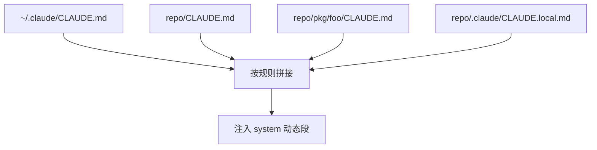
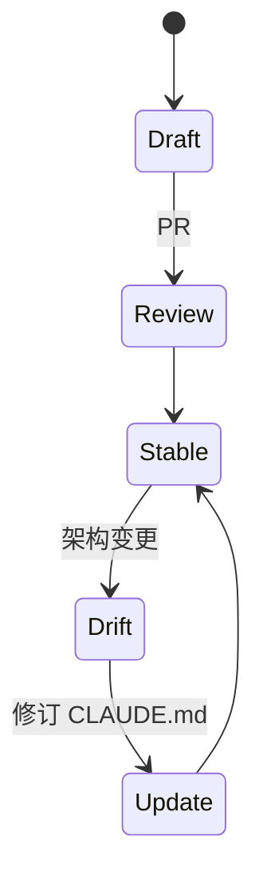
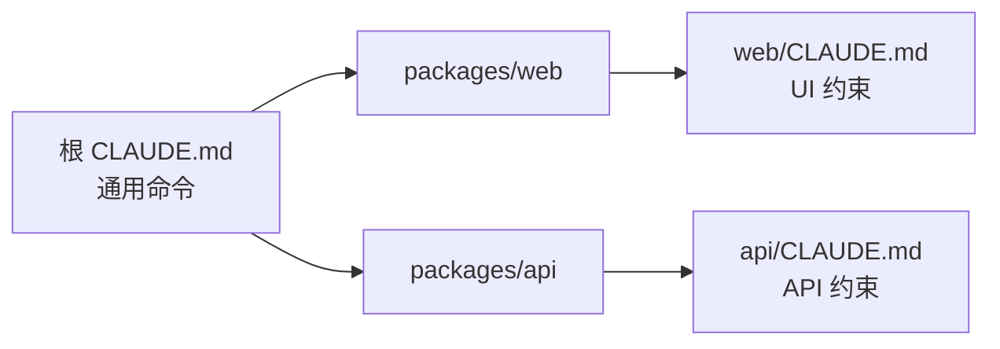

# 9.2 CLAUDE.md：层级、拼接与 50～200 行纪律

> 像建筑规范：总规在市里，细则在地块，装修备注在自己抽屉——叠在一起才好用，但不能互相打架。

---

## 本节学习目标

1. **默写** 四层来源（教学顺序）：`~/.claude/CLAUDE.md`（全局）→ 项目根 `CLAUDE.md` → **目录级** `CLAUDE.md` → `.claude/CLAUDE.local.md`（个人，建议 **gitignore**）。
2. **解释** 「按位置拼接」：越靠近当前工作目录的规则，越**具体**。
3. **遵守** 篇幅建议 **50～200 行**：可检索、可审查、可 diff。
4. **区分** 应提交仓库的内容 vs 应留在 **local** 的个人偏好。
5. **撰写** 一份最小可用模板，覆盖：运行、测试、风格、禁区。

---

## 生活类比：俄罗斯套娃式的「家规」

- **全市物业管理条例**（`~/.claude/CLAUDE.md`）：所有项目默认遵守。
- **小区公约**（仓库根 `CLAUDE.md`）：这个仓库特有。
- **楼栋通知**（子目录 `CLAUDE.md`）：例如 `services/payments/` 下的额外约束。
- **自家便签**（`CLAUDE.local.md`）：只有你喜欢的快捷键、本地路径——**别贴到电梯里**（别 commit）。

---

## 层级表

| 层级 | 路径（典型） | 版本控制 | 受众 |
|------|----------------|----------|------|
| 全局 | `~/.claude/CLAUDE.md` | 个人机器 | 你所有项目 |
| 项目 | `<repo>/CLAUDE.md` | Git | 团队 |
| 目录 | `<repo>/foo/CLAUDE.md` | Git | 子模块贡献者 |
| 个人本地 | `<repo>/.claude/CLAUDE.local.md` | **gitignore** | 仅你 |

---

## Mermaid：拼接管线（概念）



---

## 源码片段：解析栈（伪代码）

```typescript
function loadClaudeMdStack(cwd: string): string {
  const parts: string[] = [];

  parts.push(readIfExists("~/.claude/CLAUDE.md"));
  parts.push(readIfExists(`${repoRoot(cwd)}/CLAUDE.md`));

  for (const dir of ancestorsFromRootTo(cwd)) {
    const p = `${dir}/CLAUDE.md`;
    if (exists(p)) parts.push(read(p));
  }

  parts.push(readIfExists(`${repoRoot(cwd)}/.claude/CLAUDE.local.md`));

  return parts.filter(Boolean).join("\n\n---\n\n");
}
```

---

## 为什么 50～200 行

| 行数区间 | 评价 |
|----------|------|
| < 30 | 可能缺关键命令 |
| 50～200 | **甜区**：人类可读、模型可抓重点 |
| > 300 | 易重复、易陈旧、难 code review |

---

## Mermaid：维护生命周期



---

## 模板 A：最小可用 `CLAUDE.md`

```markdown
# 项目：example-api

## 运行
- `pnpm i && pnpm dev` — 本地 API :8080

## 测试
- `pnpm test` — 单元
- `pnpm test:e2e` — 需 Docker

## 代码风格
- TypeScript strict；禁止 `any` 除非附理由

## 禁区
- 勿改 `legacy/v1` 除非 ticket LEGACY-xxx

## 架构速览
- `src/domain` 纯逻辑；`src/http` 适配层
```

---

## 模板 B：`CLAUDE.local.md`（个人）

```markdown
# 本地偏好（勿提交）

- 默认使用简体中文回复我
- 本地 DB 连接串见 `~/.config/...`（勿写入仓库）
```

`.gitignore` 追加：

```gitignore
.claude/CLAUDE.local.md
```

---

## 表：内容放置决策

| 内容 | 放根 CLAUDE.md | 放目录 CLAUDE.md | 放 local |
|------|----------------|------------------|----------|
| 团队测试命令 | 是 | 若仅子包 | 否 |
| 个人语气偏好 | 否 | 否 | 是 |
| 支付模块额外规范 | 可摘要 | **是** | 否 |
| 秘密密钥 | **永不** | **永不** | **永不**（用密钥管理） |

---

## 冲突解决心智模型

| 情况 | 建议 |
|------|------|
| 根与目录矛盾 | **更具体目录优先**（常见） |
| 全局与项目矛盾 | 项目优先（团队真相） |
| local 与团队矛盾 | **local 仅个人**；团队规则仍以根为准 |

> 精确优先级以实现为准；文档应显式写「本仓库优先级约定」。

---

## 源码片段：目录级覆盖示例

`services/billing/CLAUDE.md`：

```markdown
# Billing 子系统

- 所有价格以「分」整数存储
- 禁止直接调用第三方支付 SDK；走 `BillingPort`
```

---

## 与自动记忆的分工

| CLAUDE.md | 自动记忆 |
|-----------|----------|
| 显式、可 PR | 模型观察生成 |
| 团队共识 | 个人化沉淀 |
| 稳定条款 | 可能随习惯演变 |

---

## 练习

1. 给你当前仓库写一版 **80 行内** `CLAUDE.md` 草稿。  
2. 列出应放进 `CLAUDE.local.md` 的三项。

---

## FAQ

**Q：每个子目录都要 CLAUDE.md 吗？**  
A：不必须；只在**边界清晰**的子系统加，避免碎片化。

**Q：能用中文写吗？**  
A：可以；团队统一即可。

---

## 小结

`CLAUDE.md` 是项目记忆的**脊柱**：从全局到本地**按位置拼接**，用 **50～200 行**保持可读与可维护，把个人项隔离到 **`.claude/CLAUDE.local.md` 并 gitignore**。

---

## 附录：目录布局示例

```text
myapp/
  CLAUDE.md
  .claude/
    CLAUDE.local.md      # gitignored
  packages/
    web/
      CLAUDE.md          # 前端特有
    api/
      CLAUDE.md          # 后端特有
```

---

## Mermaid：多包 monorepo 的信息流



---

## 审查清单（Code Review）

- [ ] 无密钥与内部 URL 泄露  
- [ ] 命令可在 CI/新同事机器复现  
- [ ] 与 README 不重复冗长（可互链）  
- [ ] 过期段落已删或标注日期  

---

## 与 `AGENTS.md` 共存策略

若仓库同时存在：

| 文件 | 建议 |
|------|------|
| `CLAUDE.md` | Claude Code 专用细节 |
| `AGENTS.md` | 跨工具通用代理说明 |
| 重复内容 | **单点维护** + 另一方链接  

---

## 反模式

| 反模式 | 后果 |
|--------|------|
| 把聊天全文贴进 CLAUDE.md | 不可维护 |
| 复制粘贴大段第三方文档 | 版权与更新问题 |
| local 提交进 Git | 泄漏个人路径 |

---

## 术语

| 英文 | 中文 |
|------|------|
| stack / merge | 拼接栈 |
| scoped rules | 目录级规则 |
