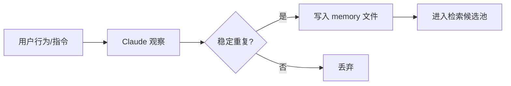
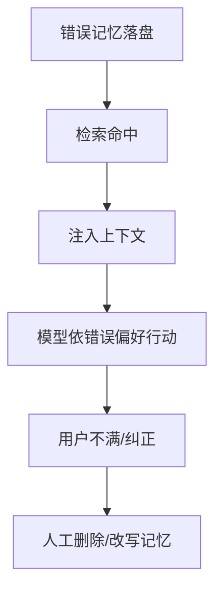
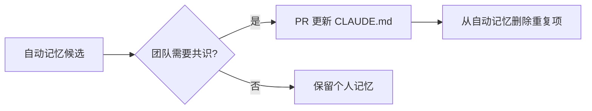
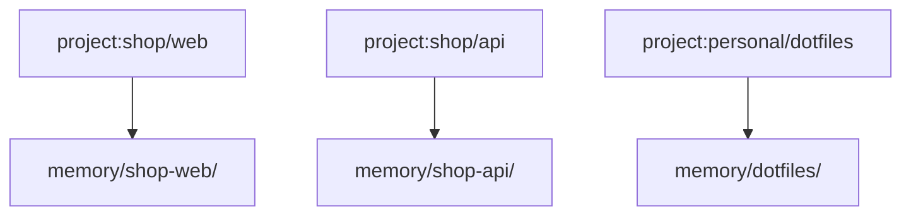

# 9.3 自动记忆提取：观察、写入与审计

> 像称职的秘书：记住你爱喝半糖，但若记错了，你要能翻开笔记本划掉那一行。

---

## 本节学习目标

1. **定义** 自动记忆：Claude 在会话中**观察**稳定重复的用户偏好与项目事实，并写入 **`~/.claude/projects/memory/`**（路径以版本为准）。
2. **列举** 适合自动沉淀的信息与**不适合**的信息（密钥、一次性试错）。
3. **设计** 个人审计节奏：定期查看、删除、纠正错误记忆。
4. **解释** 自动记忆与 **`CLAUDE.md`** 的互补：前者偏「个性化」，后者偏「团队契约」。
5. **预判** 错误记忆注入的后果：模型行为偏移、上下文噪声。

---

## 生活类比：Spotify 的「猜你喜欢」

流媒体会记录你切歌行为来调整推荐：

- **好处**：少搜几次。
- **风险**：某次借账号给朋友听了一晚重金属，推荐就歪了——你需要「重置口味」或删历史。

自动记忆同理：**高效但有偏**，需要**人类把关**。

---

## 自动记忆可能记录什么（示例域）

| 类型 | 示例 |
|------|------|
| 语言偏好 | 「回复用简体中文」 |
| 工具偏好 | 「优先 pnpm 不用 npm」 |
| 项目习惯 | 「此仓库 E2E 用 playwright」 |
| 重复踩坑 | 「勿改某 legacy 目录」 |

---

## Mermaid：从观察到落盘



---

## 源码片段：memory 文件形态（伪 JSON）

```json
{
  "id": "mem_7f3a",
  "title": "包管理器偏好",
  "description": "用户要求使用 pnpm；避免 npm 命令示例",
  "scope": "project:acme/web",
  "created_at": "2026-04-01T12:00:00Z",
  "confidence": 0.82
}
```

实际格式以实现为准；关键是**可检索的标题/描述**。

---

## 表：适合 vs 不适合自动记忆

| 适合 | 不适合 |
|------|--------|
| 重复 ≥3 次的偏好 | 临时 A/B 尝试 |
| 可公开的项目习惯 | 密码、token |
| 与仓库文档一致的事实 | 未验证的猜测 |
| 个人效率设置 | 法务敏感结论 |

---

## 审计 SOP（建议每月）

1. 打开 `~/.claude/projects/memory/`（或设置页等价 UI）。
2. 删除**低置信度**或**已过时**条目。
3. 把应团队共享的条目**升格**为 `CLAUDE.md` PR。
4. 对错误条目写一句「纠正指令」给模型，观察是否更新。

---

## Mermaid：错误记忆的放大回路



---

## 与双模型检索的衔接

自动记忆先**广泛沉淀**；检索阶段由 **Sonnet** 快速扫标题/描述，**最多 5 条**注入（见下一节）。提取与检索是**流水线前后级**。

---

## 源码片段：安全过滤（伪代码）

```typescript
function safeToAutowrite(observation: Observation): boolean {
  if (observation.containsSecretPattern) return false;
  if (observation.confidence < 0.7) return false;
  if (observation.isOneOff) return false;
  return true;
}
```

---

## 练习

1. 写出你希望**永远不要**自动记录的两类信息。  
2. 设计一条「团队政策」：自动记忆默认关闭还是开启。

---

## FAQ

**Q：自动记忆会同步到云端吗？**  
A：以实现与账号设置为准；敏感项目建议查隐私说明。

**Q：能否按项目隔离？**  
A：教学路径 `projects/memory/` 暗示**按项目**隔离；确认本地目录结构。

---

## 小结

自动记忆提取让 Claude 从「复读你的偏好」进化到「记住你的偏好」，但必须配套**审计与升格策略**：可靠的进 `CLAUDE.md`，个人的留记忆文件，**机密永不落盘**。

---

## 附录：观察信号表

| 信号强度 | 说明 |
|----------|------|
| 弱 | 说过一次 |
| 中 | 同一项目多次 |
| 强 | 纠正模型后仍坚持 |

仅**中强**适合自动写入（示意规则）。

---

## 与合规

若你在受监管行业：

- 记录**数据保留策略**；
- 记忆目录纳入**退出权**流程（删除用户数据时一并清）。

---

## Mermaid：CLAUDE.md 升格路径



---

## 反模式

| 反模式 | 修复 |
|--------|------|
| 从不审计 | 设日历提醒 |
| 把机密写进记忆 | 换用 vault |
| 团队靠记忆传规范 | 应用 `CLAUDE.md` |

---

## 术语

| 英文 | 中文 |
|------|------|
| extraction | 提取 |
| observation | 观察 |

---

## 扩展：写入节流（概念）

避免同一偏好 **10 分钟内重复落盘**：

```typescript
const lastWrite = new Map<string, number>();

function throttleWrite(key: string, minIntervalMs: number): boolean {
  const now = Date.now();
  const prev = lastWrite.get(key) ?? 0;
  if (now - prev < minIntervalMs) return false;
  lastWrite.set(key, now);
  return true;
}
```

---

## Mermaid：多项目隔离



防止 **跨仓污染** 是自动提取与检索的共同前提。

---

## 表：提取置信度与人工确认

| 置信度 | 默认行为 | 企业可选 |
|--------|----------|----------|
| < 0.5 | 不写 | 同上 |
| 0.5～0.8 | 写「待确认」标记 | 需人审 |
| > 0.8 | 直接写入 | 审计抽样 |

---

## 练习补充

3. 为「自动提取默认关闭」写一条用户可见的产品说明（不超过 100 字）。
