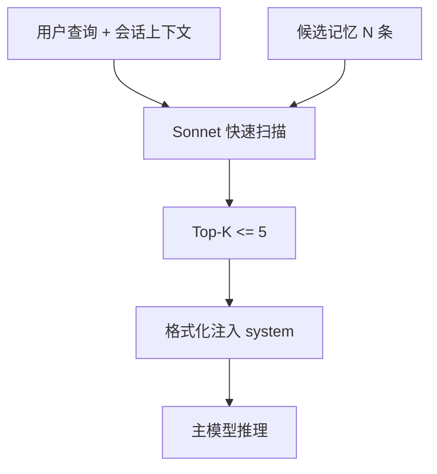
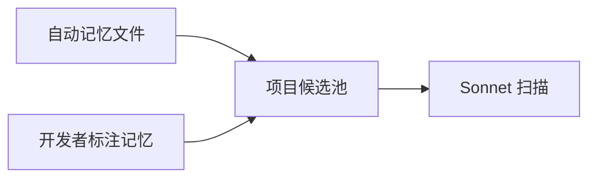
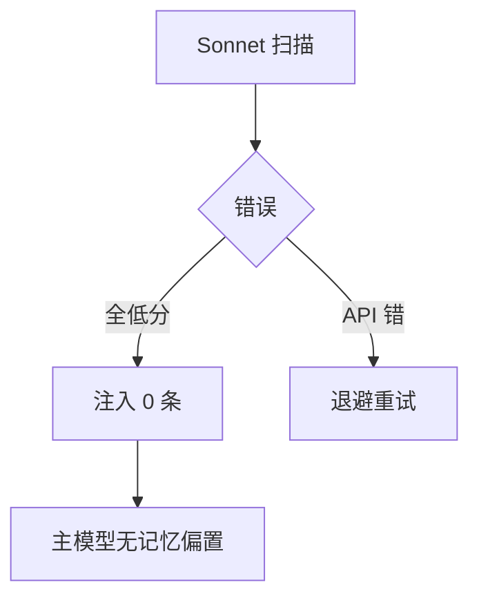

# 9.4 双模型检索：快速 Sonnet 扫描与「最多 5 条」注入

> 像图书馆检索台：先由管理员快速扫书名目录挑出五本书，再把书送到阅览室，而不是把整个书库搬进去。

---

## 本节学习目标

1. **描述** 双模型检索管线：**快速 Sonnet** 负责扫描记忆条目的**标题/描述**，做相关性打分与筛选。
2. **解释** 注入上限 **最多 5 条**：平衡「有用」与「上下文成本」。
3. **对比** 单阶段大模型全量读取所有记忆的反例：延迟高、费用高、噪声大。
4. **说明** 筛选结果如何进入 system 动态段（与第 5 篇边界呼应）。
5. **调试** 检索失败：标题含糊、描述过短、跨项目污染。

---

## 生活类比：急诊分诊

到医院：

- **分诊护士**（快速 Sonnet）看你主诉关键词，决定你去哪科——**快**。
- **专科医生**（主模型）再深度处理——**贵且慢**不能用来做海量初筛。

记忆检索同样：**快模型筛目录，主模型用结果**。

---

## Mermaid：双阶段检索



---

## 源码片段：检索接口（伪代码）

```typescript
type MemoryCard = {
  id: string;
  title: string;
  description: string;
};

async function dualModelRetrieve(
  candidates: MemoryCard[],
  userQuery: string,
  opts: { max: number }
): Promise<MemoryCard[]> {
  const scored = await fastSonnetScore(candidates, userQuery); // 只看 title/desc
  return scored.slice(0, opts.max); // max 默认 5
}
```

---

## 表：为什么限制 5 条

| 若 K 太大 | 结果 |
|-----------|------|
| token 膨胀 | 费用↑ 压缩↑ |
| 不相关混入 | 行为偏移 |
| 延迟 | 注入块解析变慢 |

| 若 K 太小 | 结果 |
|-----------|------|
| 丢偏好 | 体验下降 |

**5** 是产品与成本的折中（教学数）。

---

## Mermaid：候选池来源



---

## 写好标题/描述的技巧

| 差 | 好 |
|----|-----|
| 「偏好」 | 「包管理：优先 pnpm」 |
| 「注意」 | 「勿修改 legacy/v1 路由」 |
| 「项目」 | 「E2E：playwright + docker compose」 |

**可检索性**直接决定 Sonnet 扫描质量。

---

## 源码片段：注入格式化

```typescript
function formatInjections(picked: MemoryCard[]): string {
  return [
    "## Retrieved memories (max 5)",
    ...picked.map(
      (m) => `### ${m.title}\n${m.description}\n(ref: ${m.id})`
    ),
  ].join("\n\n");
}
```

---

## 调试清单

| 症状 | 检查 |
|------|------|
| 从未注入 | 候选池是否空 |
| 注入无关 | 标题是否太泛 |
| 注入过时 | 审计记忆文件 |
| 注入重复 | 与 CLAUDE.md 是否重复 |

---

## 与精确度优先（下一节预告）

双模型检索是工程手段；**产品哲学**是「宁缺毋滥」——若不确定相关，**少注入**。

---

## 练习

1. 给你三条真实偏好写「标题+描述」各一行。  
2. 假设候选池有 20 条，手写你认为应对某查询返回的 5 条 id。

---

## FAQ

**Q：能否全用 Opus 检索？**  
A：可以但贵；**快速 Sonnet** 是性价比常见的初筛角色。

**Q：5 能改吗？**  
A：可能为配置项；默认体现产品保守策略。

---

## 小结

双模型检索用 **Sonnet 快速扫标题/描述** 从候选池挑出 **最多 5 条** 记忆注入，避免把记忆系统做成「第二个无限上下文」。写好记忆卡片，比盲目增加条数更重要。

---

## 附录：打分特征（概念）

| 特征 | 用途 |
|------|------|
| 关键词重叠 | 粗匹配 |
| 项目 scope | 防跨仓污染 |
| 时间衰减 | 降权旧记忆 |

---

## Mermaid：失败路径



---

## 性能直觉

| 阶段 | 相对成本 |
|------|----------|
| 扫描 50 条标题 | 低 |
| 主模型读 5 段描述 | 中 |
| 主模型读 50 段全文 | 高 |

---

## 反模式

| 反模式 | 后果 |
|--------|------|
| 描述写成长文 | 扫描模型仍只看摘要字段，浪费维护成本 |
| 同一事实复制 10 张卡片 | 检索抖动 |
| 跨项目同名标题 | 误注入 |

---

## 团队规范示例

```markdown
## 记忆卡片规范
- title: 动宾结构，<= 40 字
- description: 1～3 句，可执行
- 禁止放密钥
```
