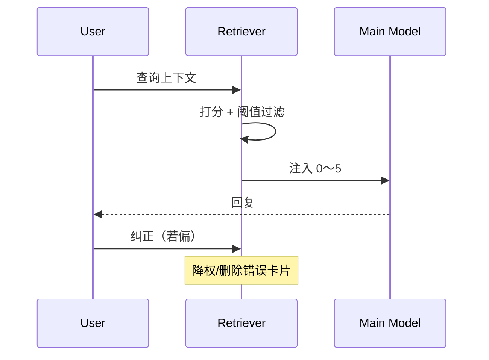
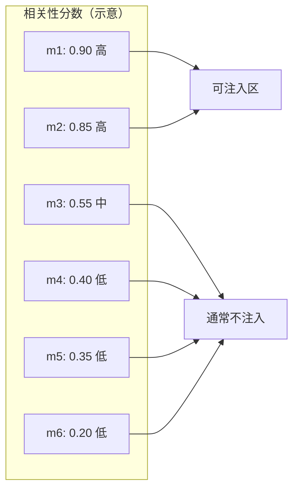

# 9.5 精确度优先：宁缺毋滥的注入哲学

> 像配菜：宁可少一道清爽小菜，也不要堆一盘互相串味的剩菜。

---

## 本节学习目标

1. **陈述** 精确度优先原则：**不确定相关则不注入**，优于「可能有用就塞」。
2. **解释** 该原则与 **最多 5 条**、**上下文成本**、**模型注意力** 的一致性。
3. **识别** 误注入的典型模式：标题泛化、跨项目 scope 泄露、过期偏好。
4. **制定** 团队评审：新增记忆卡片需 **title/description 检查表**。
5. **度量** 主观指标：注入后用户纠正次数是否下降。

---

## 生活类比：导航语音

开车导航：

- **精确**：「前方 200 米右转」——你立刻行动。
- **不精确**：同时播报五条备选路线历史、上周路况、朋友推荐餐厅——你**认知超载**，反而走错。

记忆注入亦然：**少而准**胜过**多而杂**。

---

## Mermaid：噪声注入的注意力稀释


---

## 表：注入决策矩阵

| 相关性 | 置信度 | 动作 |
|--------|--------|------|
| 高 | 高 | 注入 |
| 高 | 中 | 可注入 + 标记待确认 |
| 中 | 任意 | **默认不注入** |
| 低 | 任意 | 不注入 |

---

## 源码片段：保守阈值（伪代码）

```typescript
function shouldInject(card: MemoryCard, score: number): boolean {
  if (score < 0.78) return false; // 宁缺毋滥
  if (card.scope !== currentProjectScope) return false;
  if (card.stale) return false;
  return true;
}
```

---

## 与第 8 篇联动：token 账簿

每条注入：

```text
+ title + description + 格式开销 ≈ 数十～数百 tokens（视长度）
× 5 条 ≈ 可观
```

**精确度优先 = 成本优先**。

---

## Mermaid：检索—注入—反馈闭环



---

## 反模式表

| 反模式 | 症状 |
|--------|------|
| 「万能卡片」 | 任何查询都命中 |
| 复制粘贴 CLAUDE.md 进记忆 | 重复与冲突 |
| 把实验性偏好固化 | 长期误行为 |

---

## 团队检查表（PR Review）

- [ ] title 是否**唯一且具体**  
- [ ] description 能否**单读自明**  
- [ ] 是否与现有 `CLAUDE.md` **重复**  
- [ ] scope 是否**正确项目**  
- [ ] 是否含**敏感信息**  

---

## 练习

1. 写一条「应被拒绝注入」的虚构记忆，并说明原因。  
2. 把同一事实分别写成「泛标题」与「精确标题」对比。

---

## FAQ

**Q：注入 0 条是不是浪费检索？**  
A：检索成本低；**错误注入**成本高。

**Q：用户明确说「记住」就一定对？**  
A：仍应**可审计**；用户也会变心。

---

## 小结

精确度优先是记忆系统的**价值观**：**宁缺毋滥**保护模型注意力与 token 预算。工程上靠 **Sonnet 扫描 + 阈值 + 上限 5** 落实，文化上靠 **卡片质量与审计** 巩固。

---

## 附录：A/B 思想实验

| 策略 A | 策略 B |
|--------|--------|
| 总是注满 5 条 | 只注入 >0.85 分 |
| 用户纠正率？ | 预期更低 |

---

## Mermaid：分数分布示意（条形抽象）



> 注：阈值线（如 0.78）之上才注入；具体数以实现为准。

---

## 与伦理

滥注入可能强化**错误刻板印象**（例如错误归因用户能力）。精确度优先也是**公平性**策略。

---

## 术语

| 英文 | 中文 |
|------|------|
| precision-first | 精确度优先 |
| false positive injection | 误注入 |

---

## 升级路径

当产品允许用户调「记忆敏感度」：

| 档位 | 描述 |
|------|------|
| 保守 | 默认；精确度优先 |
| 平衡 | 略降阈值 |
| 激进 | 易误注入；不推荐默认 |

---

## 案例简析

**场景**：前端项目记忆注入了一条「后端 Java 风格偏好」。  
**原因**：scope 未收紧或标题过泛。  
**修复**：删卡 + 为前后端分项目 + 标题加栈前缀。

---

## 与监控

若可埋点：

- `injected_count_per_turn`  
- `user_correction_after_injection_rate`  

用数据验证「宁缺毋滥」是否改善体验。
