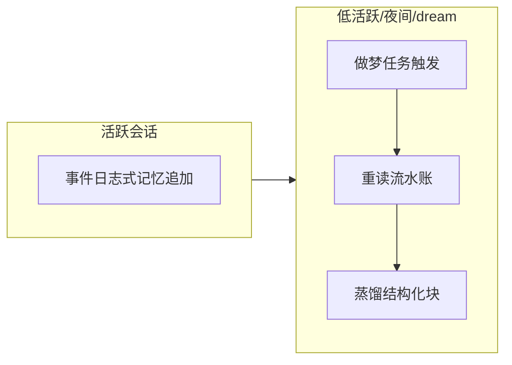
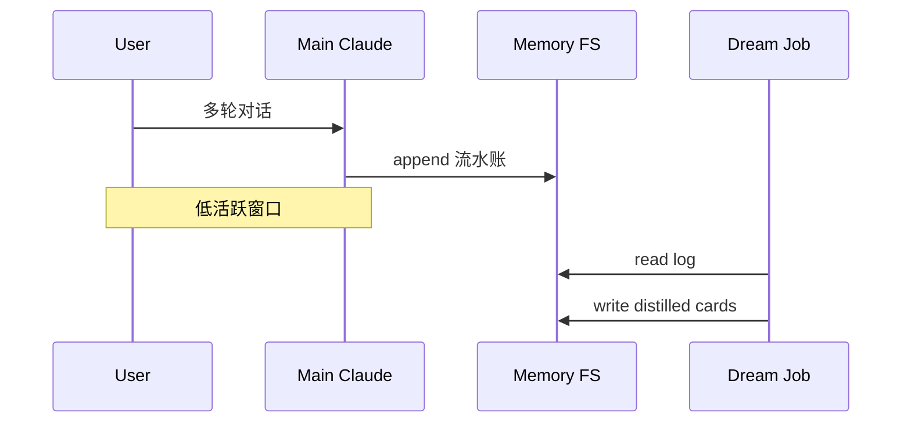
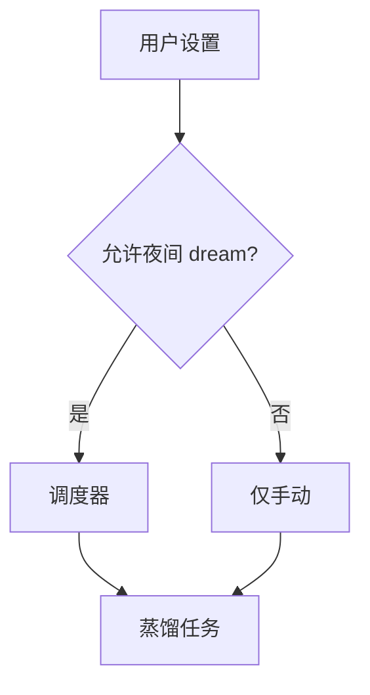

# 9.6 KAIROS 做梦模式：流水账、低活跃与夜间触发

> 像睡眠整理白天碎片：白天把经历先记在草稿本上，夜里大脑做重组，醒来留下几条清晰结论。

---

## 本节学习目标

1. **定义** KAIROS 做梦模式（教学名）：在长会话中，把自动记忆先当作**时间顺序流水账**，再在**低活跃**、**夜间**或 **`dream` 技能**触发时进入「睡眠」整理。
2. **解释** 为何需要两阶段：实时写入求**快**，做梦求**结构化**。
3. **列举** 适合触发做梦的信号：会话时长、无输入间隔、用户显式调用技能。
4. **对比** 做梦前后记忆文件形态：从日志到「用户偏好」「项目背景」分类。
5. **评估** 风险：做梦摘要错误时的回滚与人工审计。

---

## 生活类比：旅行日记与游记

- **白天**：在高铁上随手记「3:15 误车」「司机电话 138xxxx」——**流水账**。
- **晚上**：酒店里把一天整理成「行程」「花费」「明日计划」——**做梦蒸馏**。

KAIROS 把自动记忆从「草稿」变成「游记」。

---

## Mermaid：KAIROS 两阶段



---

## 触发条件表（教学归纳）

| 条件 | 说明 |
|------|------|
| 低活跃 | 例如 **30～120 分钟**无新消息（示意） |
| 夜间 | 本地时间窗口，如 **23:00～07:00** |
| `dream` 技能 | 用户或策略显式触发 |
| 会话长度 | token 或轮次超阈 |

> 精确参数以实现为准。

---

## 流水账记忆示例（虚构）

```text
[10:01] 用户拒绝使用 npm，要求 pnpm
[10:18] 用户说测试要 Docker
[11:03] 用户纠正：E2E 在 packages/web
```

做梦后应变为结构化条目（见 9.7）。

---

## Mermaid：与主会话的关系



---

## 为什么叫「KAIROS」（教学）

| 词源联想 | 含义 |
|----------|------|
| Kairos | 古希腊「恰当时机」 |
| 做梦 | 在**对的时机**做整理，而非每轮打断用户 |

名称帮助记忆：**不是每时每刻蒸馏**，而是择机。

---

## 与 `dream` 技能

技能层可封装：

```yaml
# 概念示意，非严格 YAML
skill: dream
triggers:
  - manual
  - idle_night
actions:
  - distill_memories
  - prune_duplicates
```

---

## 风险表

| 风险 | 缓解 |
|------|------|
| 做梦时摘要错 | 保留原流水账归档 |
| 夜间任务耗电 | 笔记本可关策略 |
| 用户不想自动跑 | 设置里关闭 |

---

## 练习

1. 写三条你认为应留在「流水账」而非立即结构化的事件。  
2. 设计一个「仅手动 dream」的团队政策理由。

---

## FAQ

**Q：做梦会调用模型吗？**  
A：蒸馏通常需要**模型参与**；成本低于把流水账全量注入每轮对话。

**Q：和 /compact 什么关系？**  
A：`/compact` 压**会话上下文**；KAIROS 整理**记忆文件**——层次不同。

---

## 小结

KAIROS 做梦模式解决「实时记忆只能草草记」的问题：先**流水账**沉淀，再在**低活跃/夜间/dream** 把记忆**重组**为可用卡片。它是连接 **9.3 提取** 与 **9.7 蒸馏** 的桥梁。

---

## 附录：时间线示意图

```text
|---活跃对话--->| idle |---dream--->| 结构化记忆 |
```

---

## Mermaid：策略开关



---

## 与隐私

夜间任务读取本地记忆文件：

- 确保磁盘加密；  
- 企业环境评估 **DLP** 策略。

---

## 反模式

| 反模式 | 后果 |
|--------|------|
| 每轮都全量蒸馏 | 费用爆炸 |
| 不做梦只堆流水账 | 检索差 |
| dream 失败静默忽略 | 记忆腐化 |

---

## 术语

| 英文 | 中文 |
|------|------|
| dreaming mode | 做梦模式 |
| idle | 低活跃 |

---

## 与第 8 篇

会话压缩丢细节；**做梦蒸馏**把可保留的长期项写入记忆，形成互补。

---

## 场景推演

**周一长会话** 产生 40 条流水账；**周一晚** 低活跃触发 dream → 合并为 6 张卡片；**周二** 检索只扫 6 张标题 → **更快更准**。

---

## 监控建议

- `dream_runs_count`  
- `distilled_cards_count`  
- `dream_fail_rate`  

---

## 文化注记

「AI 睡觉」是**隐喻**：实际是**后台批处理**；避免用户以为模型真有意识。
