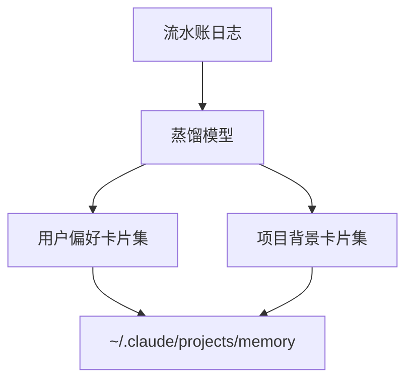
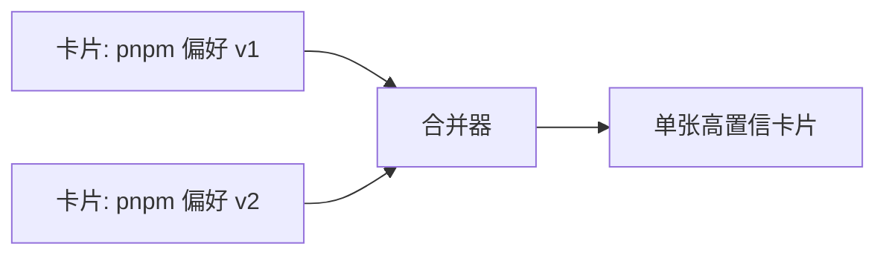
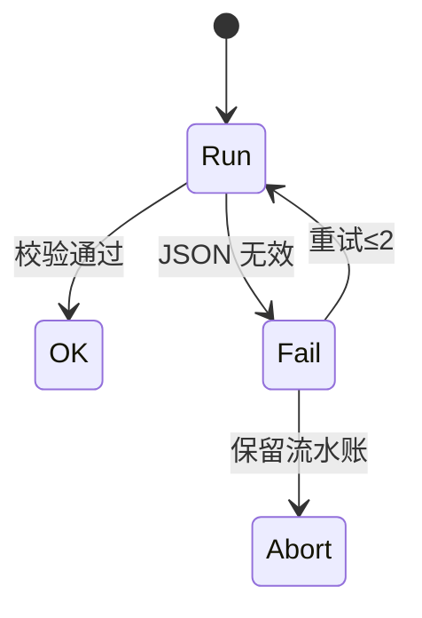

# 9.7 做梦蒸馏：从流水账到「用户偏好」与「项目背景」

> 像熬高汤：一大锅骨头和香料，最后只要那一碗清澈鲜甜的汤底。

---

## 本节学习目标

1. **描述** 蒸馏输出两类结构化块：**用户偏好**（如何与我协作）与 **项目背景**（此仓库的事实与约束）。
2. **解释** 蒸馏与 **双模型检索** 的衔接：蒸馏提升卡片 **title/description** 质量。
3. **对比** 蒸馏前后 token：流水账总长大于结构化卡片之和。
4. **编写** 蒸馏提示的**结构骨架**（教学用），便于团队自建批处理。
5. **处理** 冲突：新蒸馏与旧卡片矛盾时的合并策略。

---

## 生活类比：周报

员工每天写工作日志（流水账），周五写周报（蒸馏）：

- 日志：**过程**  
- 周报：**结果 + 风险 + 下周计划**

老板只看周报也能掌握大局——类似模型只看**蒸馏卡片**。

---

## Mermaid：输入—输出形态



---

## 两类结构化块定义

### 用户偏好（User Preferences）

| 字段 | 示例 |
|------|------|
| 沟通 | 简体中文；先给结论再细节 |
| 工具 | pnpm；禁止擅自 `git push` |
| 审查 | PR 需附测试结果摘要 |

### 项目背景（Project Context）

| 字段 | 示例 |
|------|------|
| 架构 | monorepo；API 在 packages/api |
| 约束 | legacy/v1 冻结 |
| 命令 | `pnpm test:e2e` 需 Docker |

---

## 源码片段：蒸馏提示骨架（伪）

```text
你将阅读一段按时间排序的会话记忆流水账。
请输出 JSON 数组，每项含: type ("preference"|"project"), title, description, evidence_ids。

规则：
- 合并重复事件
- 丢弃一次性试错
- 描述需可执行、无敏感密钥
```

---

## Mermaid：合并去重



---

## 表：蒸馏质量检查

| 检查项 | 通过标准 |
|--------|----------|
| 无密钥 | 正则扫描 |
| 有标题 | 非空 |
| 描述长度 | 1～5 句 |
| scope | 正确项目 |

---

## 与 CLAUDE.md 的升格（再次强调）

| 蒸馏结果 | 动作 |
|----------|------|
| 团队应共识 | 提 PR 到 `CLAUDE.md` |
| 纯个人 | 保留记忆 |
| 重复 | 删重复卡片 |

---

## 练习

1. 给一段虚构流水账（5 行），手写蒸馏后的 2 张卡片。  
2. 指出哪一行流水账应被**丢弃**而非蒸馏。

---

## FAQ

**Q：蒸馏会删证据吗？**  
A：会；证据应已在 Git/文档；记忆只保留**指针级**描述。

**Q：能否人工触发蒸馏？**  
A：`dream` 技能/命令（以实现为准）。

---

## 小结

做梦蒸馏把 **KAIROS** 的流水账变为 **用户偏好** 与 **项目背景** 两类高质量卡片，降低检索噪声与上下文注入量，是记忆系统「**由乱到治**」的关键一步。

---

## 附录：JSON 输出示例

```json
[
  {
    "type": "preference",
    "title": "沟通：中文与结构",
    "description": "用户偏好简体中文；回复先结论后步骤。",
    "evidence_ids": ["log_12", "log_18"]
  },
  {
    "type": "project",
    "title": "E2E 运行方式",
    "description": "在 packages/web 运行 playwright；需 docker compose up testdeps。",
    "evidence_ids": ["log_22"]
  }
]
```

---

## Mermaid：失败重试



---

## Token 直觉表

| 阶段 | 相对体积 |
|------|----------|
| 流水账 10K tokens | 100% |
| 蒸馏后卡片 1.5K | ~15% |

示意比例；以实测为准。

---

## 冲突解决策略

| 策略 | 何时 |
|------|------|
| 时间新覆盖旧 | 偏好变更 |
| 合并描述 | 互补事实 |
| 标记 human_review | 不确定 |

---

## 反模式

| 反模式 | 后果 |
|--------|------|
| 蒸馏输出过长 | 检索退化 |
| 把流水账原样复制 | 未蒸馏 |
| 无校验直接写入 | 脏数据 |

---

## 与 Opus / Sonnet

| 角色 | 可用模型 |
|------|----------|
| 蒸馏整理 | 较强模型更稳 |
| 扫描检索 | 快速 Sonnet |

---

## 术语

| 英文 | 中文 |
|------|------|
| distillation | 蒸馏 |
| structured memory | 结构化记忆 |

---

## 企业扩展

- 蒸馏任务走**审计日志**；  
- 输出经 **PII 扫描** 再落盘。

---

## 与 9.5 精确度优先

蒸馏时应**主动丢弃**弱相关流水行，预先践行「宁缺毋滥」。

---

## 复盘模板

```markdown
## Dream run 2026-04-02
- input lines: 42
- output cards: 6
- pruned: 36
- manual fixes: 1 (see issue #...)
```
