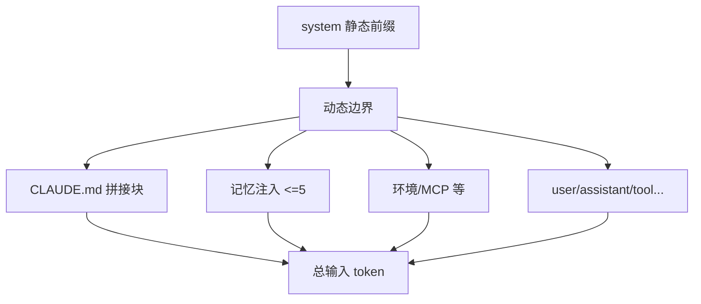
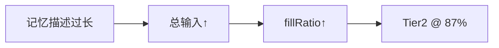
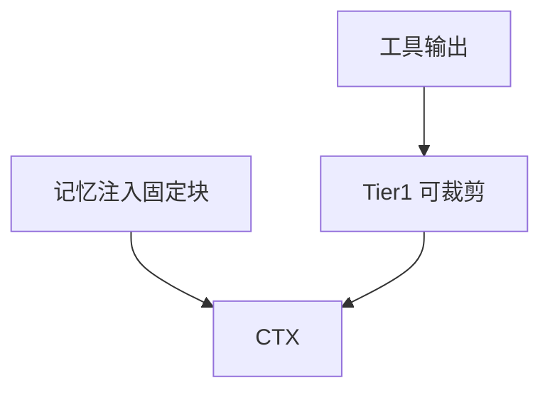

# 9.8 记忆与上下文交互：注入如何吃掉窗口预算

> 记忆不是「额外附赠的超能力」，而是**从同一只钱包里掏钱**——掏的是上下文 token。

---

## 本节学习目标

1. **量化直觉**：每条记忆注入增加 **system 动态段** token，从而推高**总输入**与**压缩概率**（第 8 篇）。
2. **解释** 记忆与 **prompt caching** 的交界：注入块通常在**动态边界之后**，影响后缀长度。
3. **优化** 注入块格式：**短标题 + 精炼描述**，避免 Markdown 花饰。
4. **权衡** 「多记」vs「少注入」：仓库文档承担部分冷知识。
5. **观测** 一轮对话中 `projectBlock + injections` 的占比（概念）。

---

## 生活类比：行李箱里的「必读小册子」

你登机箱总容量固定：

- 每塞一本「旅行必读小册子」（记忆注入），就要拿掉一件 T 恤（原始对话细节）。
- 小册子越薄，你越能多带真正要穿的衣服。

---

## Mermaid：上下文拼装中的记忆位



---

## 表：组成部分与典型可压缩性

| 块 | 是否常被 Tier1 动 | token 弹性 |
|----|-------------------|------------|
| 静态 system | 否 | 低（稳定） |
| CLAUDE.md | 否 | 中（随文件变） |
| 记忆注入 | 否 | **完全由你控制** |
| 工具输出 | 是 | 高 |

---

## 源码片段：估算注入开销（伪代码）

```typescript
function estimateInjectionTokens(cards: MemoryCard[]): number {
  const text = formatInjections(cards);
  return countTokens(text);
}

function budgetCheck(ctx: Context) {
  const inj = estimateInjectionTokens(ctx.injectedMemories);
  const msgs = countTokens(ctx.messages);
  const budget = 200_000;
  if (inj + msgs > 0.6 * budget) {
    warn("记忆+消息已超 60%：考虑缩短 CLAUDE.md 或记忆描述");
  }
}
```

---

## Mermaid：记忆长度与压缩触发



---

## 优化技巧表

| 技巧 | 效果 |
|------|------|
| 删冗余修饰语 | −token |
| 用指针代替粘贴 | −大段 |
| 重复事实只存一处 | −重复注入 |
| 升仓到 README | 记忆卡片变薄 |

---

## 与第 5 篇：`SYSTEM_PROMPT_DYNAMIC_BOUNDARY`

记忆注入应落在**边界之后**，避免：

- 污染可缓存前缀；
- 让静态段频繁失效。

---

## 练习

1. 取一条你的记忆描述，尝试压缩到 **50% 字数**而不失语义。  
2. 解释为何「注入 5 条长文」比「注入 2 条短文」更易触发 Tier2。

---

## FAQ

**Q：能不注入记忆吗？**  
A：可关闭或清空候选；但会损失个性化。

**Q：记忆和 CLAUDE.md 会重复计费吗？**  
A：二者都在输入中；**重复内容 = 双倍浪费**。

---

## 小结

记忆与上下文是**零和博弈**：注入越多，留给工具输出与对话历史的余量越少。**精确度优先 + 短文描述 + 文档外置** 是正统解法。

---

## 附录：示例对比

### 冗长注入（反例）

```markdown
### 关于包管理器的一些说明
在之前的对话中我们多次讨论过，用户似乎更喜欢……
```

### 精简注入（正例）

```markdown
### 包管理：pnpm
使用 pnpm；勿生成 npm 命令。
```

---

## Mermaid：与 Tier1 的并行关系



记忆块通常**不由 Tier1 当垃圾删**——更需源头控制长度。

---

## 监控字段建议

| 字段 | 用途 |
|------|------|
| `injection_tokens` | 成本归因 |
| `claude_md_tokens` | 是否文档过长 |
| `messages_tokens` | 对话主体 |

---

## 与多会话

每开新会话：

- **消息**清空重来；
- **记忆**仍可能被检索注入 → **跨会话成本基线**存在。

---

## 反模式

| 反模式 | 后果 |
|--------|------|
| 把日志贴进记忆描述 | 注入像 Tier2 失败现场 |
| 记忆与 CLAUDE.md 双份维护 | 同步地狱 |
| 依赖记忆保存密钥 | 安全与体积双输 |

---

## 术语

| 英文 | 中文 |
|------|------|
| injection budget | 注入预算 |
| dynamic tail | 动态后缀 |

---

## 与产品演进

若未来支持「按模型上下文上限自适应 K」：

- 小窗口模型 → K 从 5 降到 3；  
- 仍应坚持 **精确度优先**。

---

## 速算

```text
假设每条记忆 ~150 tokens，5 条 ≈ 750
750 / 200000 ≈ 0.375% 窗口 — 看似少，
但与会话消息相加后，60% 警戒线很快到达。
```

---

## 团队政策示例

> 单条记忆 description ≤ 120 英文词或等价中文；超出请写文档链接。

---

## 与 8.9 成本篇

记忆注入推高**有效输入**，在可比单价下**费用随体积上升**——与 30K vs 150K 的直觉一致。

---

## 反思

你愿意为「个性化」支付多少**每轮固定 token 税**？写入 `CLAUDE.md` 共享是否更划算？
