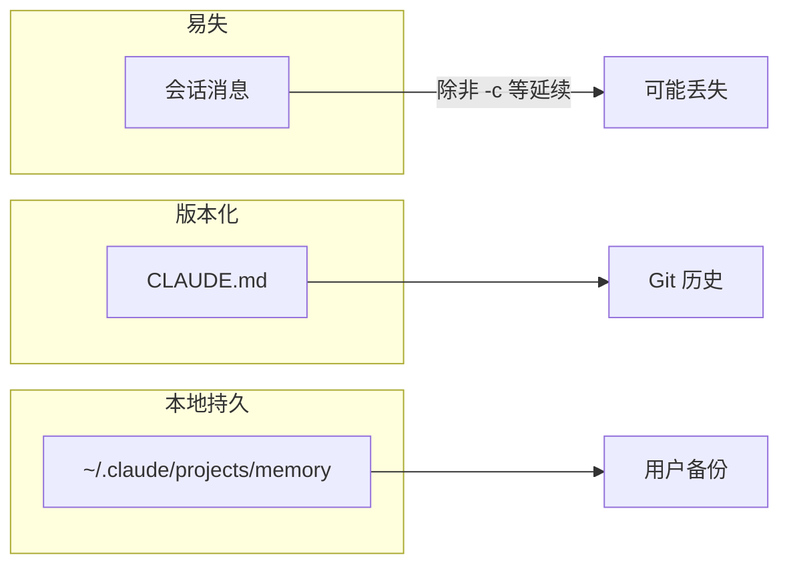
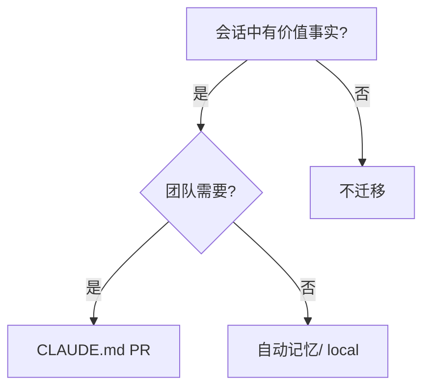
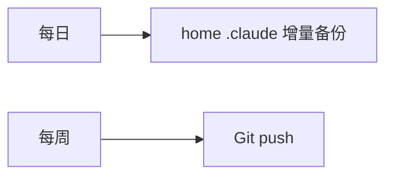

# 9.9 持久化：`claude -c`、会话边界与三层记忆的寿命

> 聊天窗口像沙滩写字，潮水一来就淡；`CLAUDE.md` 像石碑；自动记忆像你家抽屉里的便签——各有时限，各守其位。

---

## 本节学习目标

1. **说明** 会话记忆的默认寿命：**关闭/新会话**后丢失，除非使用延续标志（教学：**`claude -c`**，以 CLI 文档为准）。
2. **对比** 三层记忆的**持久化介质**：RAM/会话文件 vs Git vs `~/.claude/...`。
3. **规划** 关键信息迁移：**会话 → 文件或 CLAUDE.md 或审后记忆**。
4. **解释** `.gitignore` 对 `CLAUDE.local.md` 与本地记忆目录的意义。
5. **制定** 备份策略：换机器时迁移哪些目录。

---

## 生活类比：三种笔记本的存档方式

| 类型 | 存档 |
|------|------|
| 草稿纸会话 | 用完即弃 |
| 团队手册 | Git 远程仓库 |
| 私人便签 | 本机备份/加密磁盘 |

---

## Mermaid：数据寿命对比



---

## `claude -c`（教学说明）

| 维度 | 说明 |
|------|------|
| 意图 | **延续**或**携带**上下文/会话状态（以实现为准） |
| 用户价值 | 减少「新开窗口从头讲」的摩擦 |
| 注意 | 不等于无限磁盘；**仍可能被压缩** |

### 伪 CLI 帮助

```text
claude -c   # continue / carry（具体语义见官方 --help）
```

> 务必阅读你所安装版本的官方文档；此处为**机制占位**。

---

## 表：信息应落何处

| 信息 | 会话 | 自动记忆 | CLAUDE.md | Git 其他文档 |
|------|------|----------|-----------|----------------|
| 当日调试细节 | 是 | 可 | 否 | 可选 |
| 团队命令 | 可 | 否 | **是** | 可 |
| 个人语气 | 可 | 是 | local | 否 |
| 架构决策 | 摘要 | 否 | **是** | ADR |

---

## 源码片段：会话导出（用户侧脚本思路）

```bash
#!/usr/bin/env bash
# 将重要结论人工粘贴到 SESSION.md 后执行
git add SESSION.md && git commit -m "chore: archive session notes"
```

自动化导出取决于客户端是否提供 API；**人工+文件**永远可用。

---

## Mermaid：迁移决策树



---

## 换机清单

| 路径 | 是否迁移 |
|------|----------|
| `~/.claude/CLAUDE.md` | 通常要 |
| `~/.claude/projects/memory/` | 若要保留个性化 |
| 仓库内 `CLAUDE.md` | 已随 Git |
| `CLAUDE.local.md` | 私人；自行拷贝 |

---

## 练习

1. 列出你本周应升格到 `CLAUDE.md` 的三条信息。  
2. 写一条「团队规范」：会话结束前必须执行什么动作。

---

## FAQ

**Q：Git 会提交自动记忆吗？**  
A：默认在 home 目录，**不在仓库**；除非误配。

**Q：`-c` 能恢复工具输出吗？**  
A：不一定；**Tier1 仍可能清理**旧工具结果。

---

## 小结

持久化策略决定你不会「每次重来」：**会话**负责当下，**`-c` 类机制**缓解断裂，**CLAUDE.md** 固化团队真相，**自动记忆**保存个人偏好——三者分工明确，**关键事实最终应上 Git**。

---

## 附录：威胁模型简表

| 威胁 | 缓解 |
|------|------|
| 笔记本丢失 | 磁盘加密 |
| 记忆含敏感 | 审计+删除 |
| 仓库泄漏 | 密钥不进任何层 |

---

## 与合规删除

用户行使删除权时：

- 清 `~/.claude/projects/<id>/memory/*`  
- 审查是否有云同步副本  

---

## Mermaid：备份频率建议



---

## 反模式

| 反模式 | 后果 |
|--------|------|
| 唯一真相只在聊天 | 人走茶凉 |
| local 提交进远程 | 隐私泄漏 |
| 从不 push CLAUDE.md | 团队不同步 |

---

## 术语

| 英文 | 中文 |
|------|------|
| persistence | 持久化 |
| continue session | 延续会话 |

---

## 与 9.6 KAIROS

流水账持久化在磁盘；**做梦**读写同一介质——理解文件布局有助于排障。

---

## 多设备同步警示

若记忆目录被云盘双向同步：

- 可能冲突；  
- 优先**单写者**或**最后写入 wins** 策略。

---

## 企业 SSO 场景

换账号可能导致 `~/.claude` 路径变化——确认**租户隔离**文档。

---

## 快速命令备忘

```bash
# 查看记忆目录（示意）
ls -la ~/.claude/projects/

# 搜索敏感词自检
rg -n "sk-|BEGIN RSA|password=" ~/.claude/projects/
```

---

## 与 9.10 练习篇衔接

在练习中你将**模拟一次换机**，列出必须拷贝的路径。
