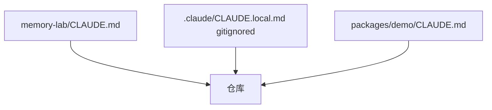
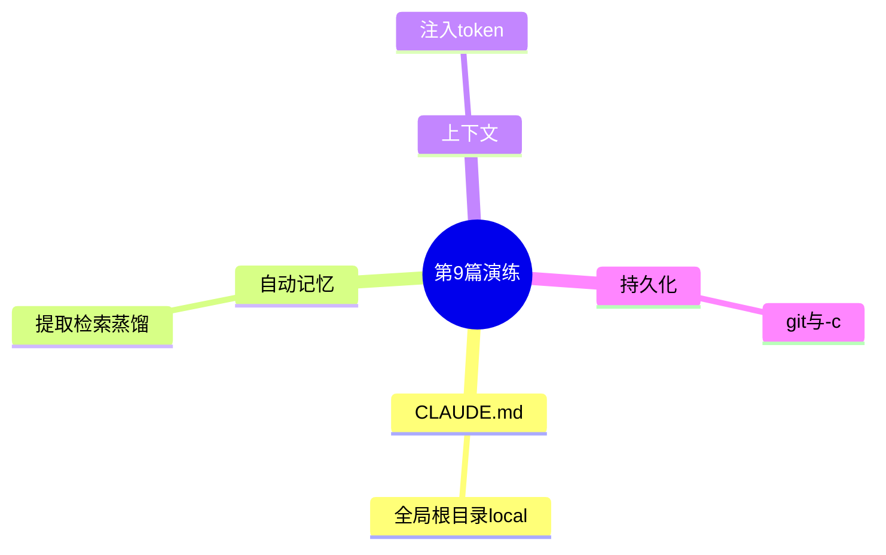

# 9.10 综合练习：从空白仓库到「可记忆」协作

> 像考驾照前的场地练习：把本篇机制跑一遍，才算真会。

---

## 本节学习目标

1. **完成** 一套最小演练：创建 `CLAUDE.md`、模拟 `CLAUDE.local.md`、书写记忆卡片。
2. **自查** 精确度优先：为同一查询设计 **0/3/5** 条注入的预期。
3. **演练** 蒸馏：把流水账手工折叠成偏好/背景两类。
4. **对照** 第 8 篇：估算记忆注入对 **60% 警戒线** 的影响。
5. **输出** 团队规范草案（半页纸）。

---

## 练习 A：分层文件搭建（45 分钟）

### 步骤

1. 新建仓库 `memory-lab`。
2. 添加根 `CLAUDE.md`（50 行内）：运行、测试、目录说明。
3. 添加 `.claude/CLAUDE.local.md`（3～10 行）个人偏好；**gitignore** 之。
4. 可选：添加 `packages/demo/CLAUDE.md` 目录级规则。

### 验收标准

| 项 | 标准 |
|----|------|
| 根文件 | `pnpm`/`npm` 命令可复现 |
| local | 不出现在 `git status` |
| 目录级 | 仅对子包生效的描述清晰 |

---

## 练习 B：记忆卡片写作（30 分钟）

写 **5 张** JSON 卡片（虚构即可），其中 **2 张** 应被精确度优先策略**拒绝注入**。

```json
[
  {
    "title": "具体可检索标题",
    "description": "1～3 句可执行描述",
    "should_inject_for_query_auth": true
  }
]
```

### 讨论题

- 哪两张太泛？  
- 如何把泛标题改到可注入？

---

## Mermaid：练习 A 目录结构



---

## 练习 C：双模型检索桌游（20 分钟）

三人一组：

1. **法官**给出用户查询。  
2. **Sonnet 扮演者**快速从 20 张卡片标题中选 ≤5。  
3. **主模型扮演者**仅基于 5 张回复。  
4. 复盘：漏了哪张关键卡？为什么标题没帮到？

---

## 练习 D：KAIROS 蒸馏（30 分钟）

给定流水账：

```text
[09:10] 用户讨厌 any
[09:40] 用户说先别写测试（临时）
[10:05] 用户要求 pnpm
[10:06] 用户要求 pnpm（重复强调）
[11:00] 用户说 E2E 要 docker
```

**任务**：输出蒸馏后的 **preference / project** 卡片；标注丢弃了哪行及原因。

---

## 练习 E：上下文账簿（15 分钟）

假设：

- `CLAUDE.md` 折合 **2.5K tokens**  
- 注入 **5 条**记忆各 **200 tokens**  
- 消息 **90K tokens**

填写下表：

| 块 | tokens |
|----|--------|
| CLAUDE.md | 2500 |
| 记忆 | ? |
| 消息 | 90000 |
| **合计** | ? |
| 占 200K 比例 | ? |
| 是否过 60%？ | ? |

---

## 练习 F：持久化剧本

描述场景：**笔记本送修一周**，你用备用机。

列出你会：

1. **拷贝**哪些目录？  
2. **无法恢复**什么（若没 Git）？  
3. **`-c`** 能否救你？

---

## 评分 rubric（自学用）

| 等级 | 标准 |
|------|------|
| 及格 | 分清三层记忆 |
| 良好 | CLAUDE.md 分层正确 + 5 卡片规范 |
| 优秀 | 蒸馏+检索+token 账簿全对 |

---

## 参考答案节选（练习 D）

| 流水行 | 蒸馏命运 |
|--------|----------|
| 讨厌 any | preference：TypeScript 严格 |
| 先别写测试 | **丢弃**（临时） |
| pnpm×2 | 合并一条 preference |
| E2E docker | project 背景 |

---

## Mermaid：全篇知识串联



---

## 团队规范草案模板

```markdown
# 记忆与 CLAUDE 规范 v0.1
1. 团队真相只进 Git（CLAUDE.md / ADR）
2. 个人偏好进 local 或自动记忆
3. 记忆卡片 title 必须可检索
4. 单条 description ≤ 120 词
5. 每月审计自动记忆
6. 密钥永不写入任何层
```

---

## FAQ

**Q：必须全做吗？**  
A：至少 **A+B+D+E**；C 适合工作坊。

**Q：没有 Claude Code 环境？**  
A：纸面推演同样有效。

---

## 小结

练习把 **CLAUDE.md 层级、自动记忆、双模型检索、精确度优先、KAIROS 蒸馏、上下文成本、持久化** 穿成一条可执行链。完成本篇，你应具备**搭建与治理**记忆系统的基础能力。

---

## 附录：打卡清单

- [ ] 根 `CLAUDE.md`  
- [ ] `.gitignore` 含 local  
- [ ] 5 张规范卡片  
- [ ] 1 次蒸馏手写  
- [ ] 1 次 token 估算  
- [ ] 半页团队规范  

---

## 延伸阅读

- 第 8 篇全文：上下文与压缩。  
- 第 5 篇：动态边界与拼装。

---

## 最后寄语

记忆系统的敌人不是「忘」，而是**脏、重、乱**。保持**短、准、审**，比追求「全记住」更接近专业用法。

---

## 附加挑战（可选）

用脚本统计你的 `CLAUDE.md` 行数：若在 **200+**，尝试删到 **120** 并保证信息不丢（通过链接到 `docs/`）。

---

## 与开源协作

对外开源前：

```bash
git check-ignore -v .claude/CLAUDE.local.md
rg -n "SECRET|TOKEN" CLAUDE.md
```

---

## 术语收官

| 英文 | 中文 |
|------|------|
| rubric | 评分量规 |
| drill | 演练 |
