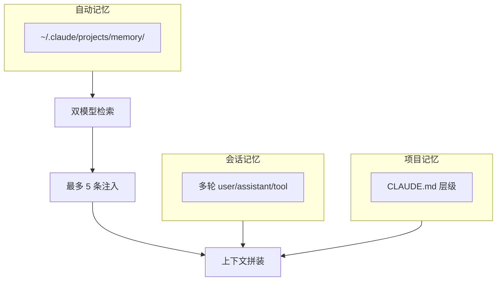
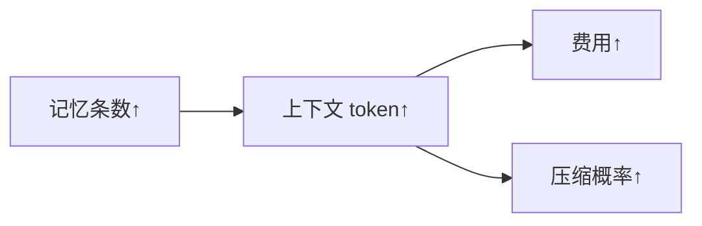
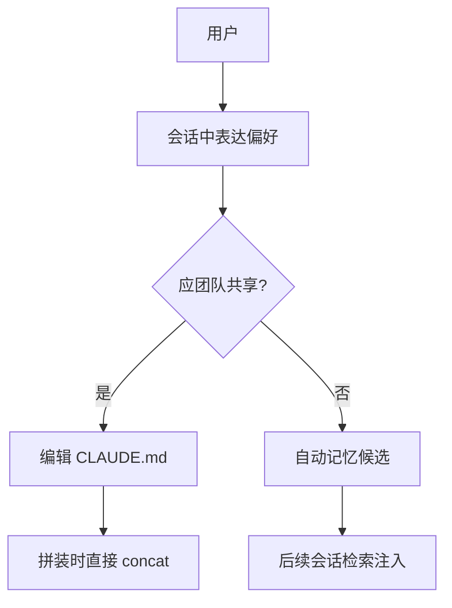

# 第 9 篇：记忆系统（Memory System）

> **Claude Code 完全指南 V2** · 会话会忘、仓库不会忘；记忆把「冷知识」从聊天里救出来。

---

## 本篇学习目标

完成本篇后，你应能够：

1. **区分** 三层记忆：**会话记忆**（当前对话）、**项目记忆**（`CLAUDE.md` 等由开发者维护）、**自动记忆**（`~/.claude/projects/memory/` 等由 Claude 观察写入）。
2. **解释** 会话记忆的易失性：关闭后丢失，除非使用类似 **`claude -c`** 的延续机制（以你所用 CLI 为准）。
3. **绘制** `CLAUDE.md` 的层级拼接顺序：**全局** → **项目根** → **目录级** → **`.claude/CLAUDE.local.md`（个人、可 gitignore）**。
4. **说明** 自动记忆提取与 **双模型检索**（快速 Sonnet 扫标题/描述，**最多注入 5 条**）如何协作。
5. **贯彻** **精确度优先**：宁可少注入，也不塞无关记忆；并理解 **记忆注入会增加上下文 token**（与第 8 篇联动）。

---

## 9.1 为什么需要「记忆系统」

### 生活类比：三本笔记本

- **会话记忆**像**草稿纸**：写满就扔，除非你把重要那页撕下来贴进档案袋。
- **项目记忆（CLAUDE.md）**像**团队手册**：谁都能读，版本控制，长期有效。
- **自动记忆**像**私人助理的便签本**：它观察你习惯，悄悄记下「咖啡半糖」，但你要能审查、纠正、删除。

### 核心论断：上下文有限，记忆是「外置硬盘」

第 8 篇强调 **200K** 窗口与压缩；本篇强调：**不被压缩卷走的东西，应落在记忆层**。

| 载体 | 谁写 | 持久性 | 典型内容 |
|------|------|--------|----------|
| 会话 | 用户+模型 | 低（关会话丢） | 当下推理链 |
| CLAUDE.md | 开发者 | 高（Git） | 命令、约定、架构 |
| 自动记忆 | Claude | 中高（本地文件） | 偏好、重复痛点 |

---

## Mermaid：三层记忆与 Claude Code 会话



---

## 源码片段（概念）：拼装时加载记忆

```typescript
type MemoryLayer = "session" | "project" | "auto";

function buildPrompt(ctx: WorkspaceContext) {
  const projectBlock = loadClaudeMdStack(ctx.root); // 全局→根→目录→local
  const candidates = listAutoMemories(ctx.projectId);
  const picked = dualModelRetrieve(candidates, ctx.userQuery, { max: 5 });
  return concatSystemParts([projectBlock, formatInjections(picked)]);
}
```

---

## 与第 8 篇的交界：记忆不是免费

每注入一条记忆，都在吃掉 **token 预算**：



因此 **精确度优先**（宁缺毋滥）同时是**成本策略**。

---

## 本篇路线图（10 节）

| 节 | 文件 | 主题 |
|----|------|------|
| 9.1 | `index.md` | 总览与三层记忆 |
| 9.2 | `02-claude-md.md` | CLAUDE.md 层级与篇幅 |
| 9.3 | `03-auto-extraction.md` | 自动记忆提取 |
| 9.4 | `04-dual-model-retrieval.md` | 双模型检索 |
| 9.5 | `05-precision-first.md` | 精确度优先 |
| 9.6 | `06-kairos-dreaming.md` | KAIROS 做梦模式 |
| 9.7 | `07-dream-distillation.md` | 做梦蒸馏 |
| 9.8 | `08-memory-context.md` | 记忆与上下文交互 |
| 9.9 | `09-persistence.md` | 持久化与 `claude -c` |
| 9.10 | `10-practice.md` | 练习与检查清单 |

---

## KAIROS 做梦模式（预告）

长会话中，自动记忆可先当**流水账**；在**低活跃**、**夜间**或触发 **`dream` 技能**时，AI「睡觉」把日志**蒸馏**为结构化的「用户偏好」与「项目背景」。详见 9.6～9.7。

---

## 常见误解

| 误解 | 纠正 |
|------|------|
| 「记忆越多越好」 | 注入有上限与成本，**精确度优先** |
| 「自动记忆永远正确」 | 需审计；可删可改 |
| 「CLAUDE.md 越长越好」 | 建议 **50～200 行**甜区，超长难维护 |

---

## 练习（开篇）

1. 列出三条你只愿意放在 `CLAUDE.local.md` 而不愿意提交 Git 的信息。  
2. 画一张图：你的项目里「会话 vs 仓库文档」各自负责什么。

---

## 术语表

| 术语 | 含义 |
|------|------|
| Injection | 将记忆块写入当轮上下文 |
| Retrieval | 从候选集中挑选相关记忆 |
| Distillation | 从流水账压缩成结构化偏好 |

---

## 小结

记忆系统是 Claude Code 的**第二存储层次**：会话负责当下，**CLAUDE.md** 负责团队真相，**自动记忆**负责个性化沉淀。下一步深入 **`02-claude-md.md`**，把层级与拼接规则写进你的肌肉记忆。

---

## 附录：目录级 CLAUDE.md 示意图（文字版）

```text
~/.claude/CLAUDE.md                 ← 全局
repo/CLAUDE.md                      ← 项目
repo/services/api/CLAUDE.md         ← 子目录（若存在）
repo/.claude/CLAUDE.local.md        ← 个人（gitignore）
```

拼接时按**由广到窄**或产品定义顺序叠加；冲突时**窄范围覆盖**常见（以实现为准）。

---

## 安全提示

自动记忆可能记录路径、命令习惯；**敏感凭证**应走密钥管理，不进记忆文件。

---

## Mermaid：本篇阅读顺序


---

## 与生态位对照

| 系统 | 类比功能 |
|------|----------|
| `.cursor/rules` | 项目规则（另一产品） |
| `AGENTS.md` | 代理说明（社区约定） |
| `CLAUDE.md` | Claude Code 一等公民 |

---

## 延伸阅读钩子

- 第 8 篇：`08-memory-context.md` 将用预算表量化注入成本。  
- 第 5 篇：动态边界决定记忆块落在 system 的哪一段。

---

## 版本说明

具体路径 `~/.claude/projects/memory/`、命令 `claude -c`、技能名 `dream` 以你所安装版本为准；本篇以**机制教学**为主。

---

## 自测（简答）

1. 为什么「最多 5 条」与精确度优先一致？  
2. `CLAUDE.local.md` 为什么要 gitignore？

---

> **下一节**：`02-claude-md.md` —— 从全局到本地的拼接艺术，以及 50～200 行的维护纪律。

---

## 9.1 补充：一张表看懂「谁写、谁读、谁丢」

| 层 | 典型写入者 | 典型读者 | 何时可能丢 |
|----|------------|----------|------------|
| 会话 | 你 + 模型 | 当前线程 | 关窗口、强压缩、未 `claude -c` |
| CLAUDE.md | 开发者/PR | 所有贡献者 | 仅当误删 Git 提交 |
| 自动记忆 | Claude 观察 | 未来会话检索 | 你清目录、换机未备份 |

---

## Mermaid：记忆写入与读取方向



---

## 与「精确度优先」的一句话

**记忆系统的 KPI 不是条数，而是「注入后更少纠正」。** 第 9.5 节展开。

---

## 与「KAIROS」的一句话

**流水账 + 择机做梦蒸馏 = 低成本个性化。** 第 9.6～9.7 节展开。

---

## 快速对照：第 8 篇链接

| 第 8 篇概念 | 第 9 篇关联 |
|-------------|-------------|
| 60% 介入 | 记忆与 CLAUDE 文本也占该 60% |
| Tier2 87% | 长描述记忆加速触线 |
| `/compact` | 压会话，不替代 CLAUDE.md |

---

## 自测答案提示

1. 「最多 5 条」限制噪声与 token，与「宁缺毋滥」一致。  
2. `CLAUDE.local.md` gitignore 以免个人路径、口味、本地密钥风格描述进入团队仓库。
