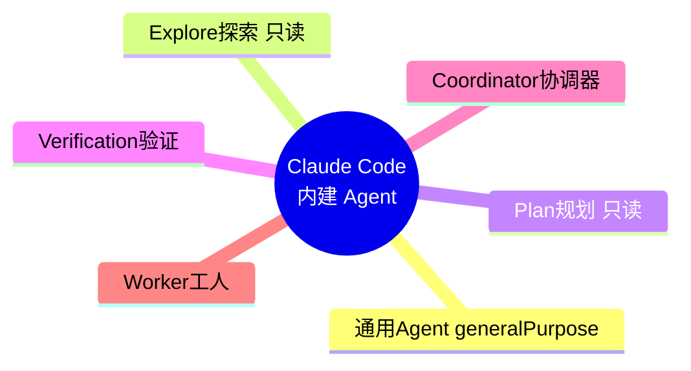
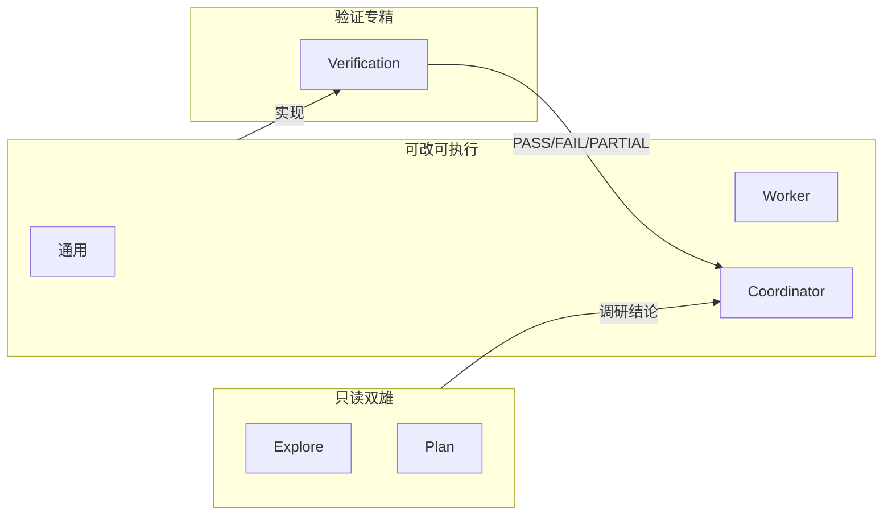
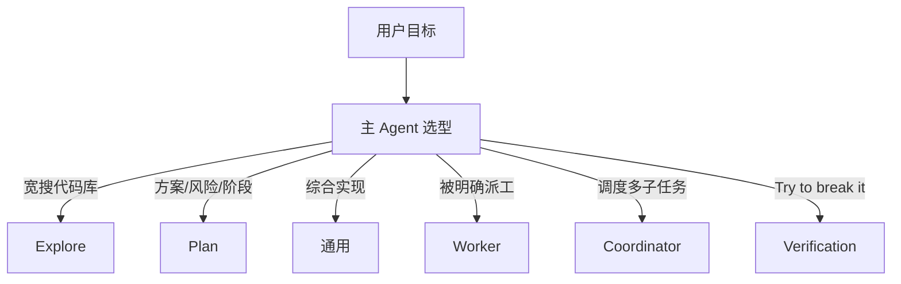
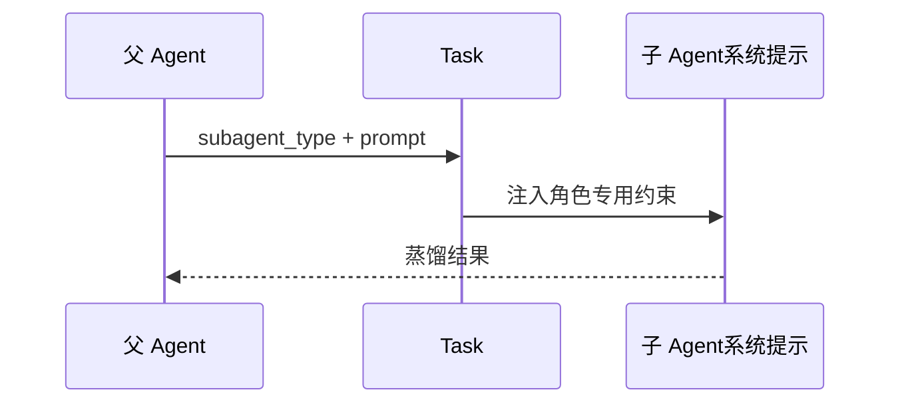

# 10.2 六个内建 Agent 角色全图

> **系列**：Claude Code 完全指南 V2 · 第 10 篇

---

## 学习目标

1. **默写**六个内建 Agent 的名称及其**主要职责**。
2. **对照表格**说明每个角色在**文件系统**、**Bash**、**子 Agent** 上的能力边界。
3. **解释**为何 **Explore / Plan** 必须 **只读**，以及 **Verification** 为何要与写代码路径隔离。
4. **选择**在真实任务中应启用哪个 `subagent_type`，避免「用 Plan 去改代码」这类错配。

---

## 生活类比：剧组分工

一部电影需要：采景员（**Explore**，只看不拆景）、编剧统筹（**Plan**，写分镜不动摄影机）、执行导演（**Coordinator**）、场工搬运搭景（**Worker**）、替身试险（**Verification**，专找穿帮）、以及什么都能干一点的**通用 Agent**。没人会要求采景员当场改搭建——那是**职责越界**。

---

## 六角色一览图







---

## 总表：角色 × 能力 × 限制

| 角色 | 英文标识 | 核心职责 | 文件创建/修改/移动 | Bash 典型范围 | 能否再派子 Agent |
|------|----------|----------|-------------------|---------------|------------------|
| 通用 Agent | `generalPurpose` | 研究、实现、执行多步任务 | 按策略通常允许 | 较宽（依版本策略） | **否**（子 Agent 禁止递归，见 10.9） |
| Explore 探索 | `explore` | 快速定位文件、符号、调用链 | **禁止**（只读模式） | **仅** `ls`、`git status` 等白名单 | **否** |
| Plan 规划 | `plan` | 架构权衡、阶段划分、风险清单 | **禁止**（只读模式） | **仅**白名单只读命令 | **否** |
| Verification 验证 | `verification`（若版本提供） | Build/Test/Lint、对抗探测、判决 | 依产品：常为读+执行测试 | 测试、curl、自动化脚本等 | **否** |
| Coordinator 协调器 | `coordinator` | 拆分阶段、并行/串行派工、汇总 | 可调度他人改；自身策略因版本而异 | 调度为主 | 通过 Task **派子 Agent**（仅父级语境） |
| Worker 工人 | `worker` / 派工语境 | **被指派**的具体活：搜/改/跑 | 通常允许在指派范围内修改 | 任务相关命令 | **否** |

> **注意**：上表为**教学抽象**。实际以你所用 Claude Code 版本的 **工具策略与 JSON Schema** 为准；尤其是 Verification 的文件写入权限可能收紧为「仅报告」。

---

## 各角色详解（简明版）

### 1. 通用 Agent（generalPurpose）

- **定位**：默认「全能型」子 Agent，适合**中等复杂度**、边界不那么极端的任务。
- **适用**：单路径功能开发、重构局部模块、联调脚本。
- **风险**：若任务含糊，容易与主 Agent **重复劳动**；应配合 10.6 的**明确派工**。

**示意调用（字段名随版本调整）**：

```json
{
  "tool": "Task",
  "subagent_type": "generalPurpose",
  "description": "实现订单取消 API",
  "prompt": "在 services/order/cancel.go 第 40-95 行附近实现…（须含验收标准）"
}
```

---

### 2. Explore 探索（explore · 纯只读）

- **定位**：**代码库 GPS**，不负责落地修改。
- **硬约束**：**不能**创建/修改/移动文件；Bash **只允许** `ls`、`git status` 等只读白名单。
- **典型产出**：受影响文件列表、相关符号、目录结构、Git 状态摘要。

---

### 3. Plan 规划（plan · 纯只读）

- **定位**：**调研与方案**，强调「**想清楚再动手**」。
- **硬约束**：与 Explore 同属 **readonly** 阵营：不动文件系统；Bash 只读。
- **典型产出**：分阶段计划、风险、回滚策略、测试清单。

---

### 4. Verification 验证

- **定位**：**Try to break it** 的独立裁判。
- **核心**：**严禁**只看代码；**强制** Build/Test/Lint；前端浏览器自动化；后端 **curl**；**adversarial probes**。
- **输出**：**PASS / FAIL / PARTIAL**；与写代码 Agent **利益隔离**（10.7）。

---

### 5. Coordinator 协调器

- **定位**：主 Agent 进入 **项目经理** 模式：拆阶段、派并行/串行 Worker。
- **典型模式**：Phase1 三只 Worker 并行搜索 → Phase3 两只 Worker **串行**改**不同文件**防冲突（10.5）。

---

### 6. Worker 工人

- **定位**：**Fork 出来的执行者**，不是经理。
- **意识注入**：不要向用户/父级**反复提问**；**直接工具干活**；**严禁**再生成子 Agent（10.6、10.9）。
- **输入**：必须是**可执行**说明：路径、行号、期望行为、完成定义。

---

## 角色选择决策表

| 用户/主 Agent 的意图 | 首选子 Agent | 次选 |
|----------------------|--------------|------|
| 「这仓库里谁调用了 X？」 | Explore | generalPurpose（仅当 Explore 不可用） |
| 「给我三期迭代方案和风险」 | Plan | 主 Agent 自规划（小任务） |
| 「实现并自测」 | Worker + 末尾 Verification | generalPurpose |
| 「专门挑刺、跑 CI 等价物」 | Verification | 外部 CI |
| 「大型改造分阶段推进」 | Coordinator | 主 Agent 强自制 |

---

## 源码片段：只读标志在调用层的表达

```json
{
  "tool": "Task",
  "subagent_type": "explore",
  "readonly": true,
  "description": "Fork started — processing in background: 定位 payment 引用",
  "prompt": "只读搜索：列出所有引用 payment.Service 的 Go 文件路径…"
}
```

```json
{
  "tool": "Task",
  "subagent_type": "plan",
  "readonly": true,
  "description": "Fork started — processing in background: 规划迁移步骤",
  "prompt": "在只读前提下阅读目录结构与接口定义，输出三阶段迁移计划…"
}
```

`readonly: true` 与 **Explore/Plan** 的系统提示共同保证：**工具层拒绝写操作**（具体错误信息因实现而异）。

---

## 错误配型示例（反模式）

| 反模式 | 为何糟糕 | 应改为 |
|--------|----------|--------|
| Plan 里写「顺便改掉这个 Bug」 | 违反只读职责 | Worker + 明确行号 |
| Explore 里要求「重构 utils」 | Explore 不能改文件 | 先 Explore 列点，再派 Worker |
| Verification 与 Worker 同上下文合并 | 利益不隔离 | 分两次 Task，Verification 独立 |
| Worker 收到「基于发现修」 | 指令模糊（10.6） | 父 Agent 先合并 Explore 输出 |

---

## 与 Task 工具的关系（复习）



**子 Agent 独立上下文**：每个 `Task` 调用相当于**新会话**，父会话只保留**摘要边**。

---

## 安全与合规视角

| 维度 | Explore/Plan | Worker/通用 |
|------|--------------|-------------|
| 误删文件风险 | 低（写拒绝） | 需代码审查与测试 |
| 秘密泄露 | 仍可能打印环境变量 | 同左；Verification 日志需脱敏 |
| 供应链 | 只读降低篡改 | 修改依赖需额外门禁 |

---

## 小结

- **六角色**覆盖 **搜、想、干、验、调度、通用** 全链路。
- **Explore + Plan** = **只读双雄**，Bash **白名单**（`ls` / `git status`）。
- **Verification** = **外部化质检**，**PASS/FAIL/PARTIAL**。
- **Worker** = **派工执行体**，配合 **反偷懒** 与 **防递归** 使用。

---

## 自测

1. 为何 Plan 不能改文件？从**职责分离**与**安全**各答一点。  
2. 何时选 Coordinator 而非 generalPurpose？  
3. Verification 与「写代码子 Agent」为何要**利益隔离**？

---

*上一节：[10.1 蜂群作战](./index.md) · 下一节：[10.3 Explore](./03-explore-agent.md)*
