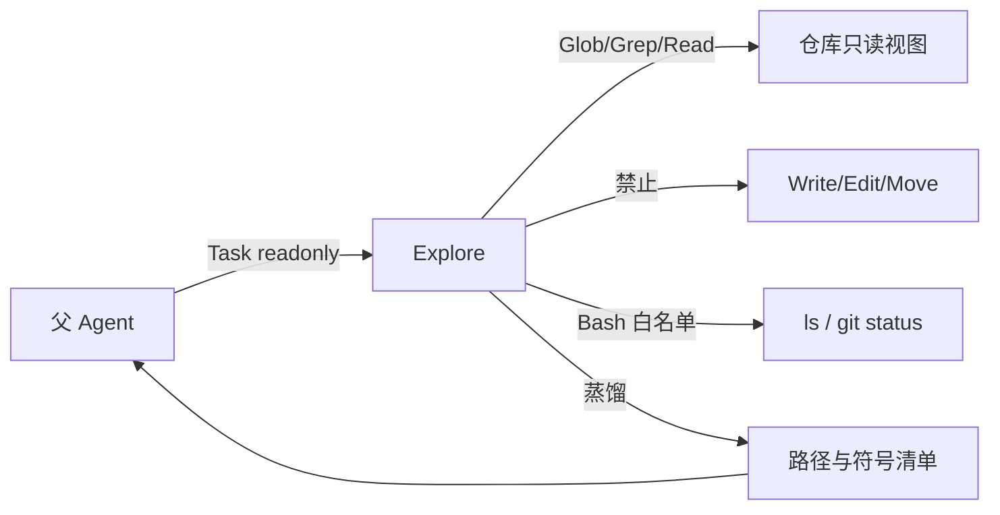
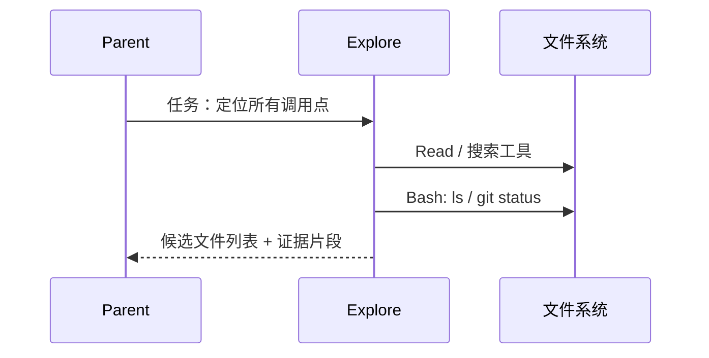
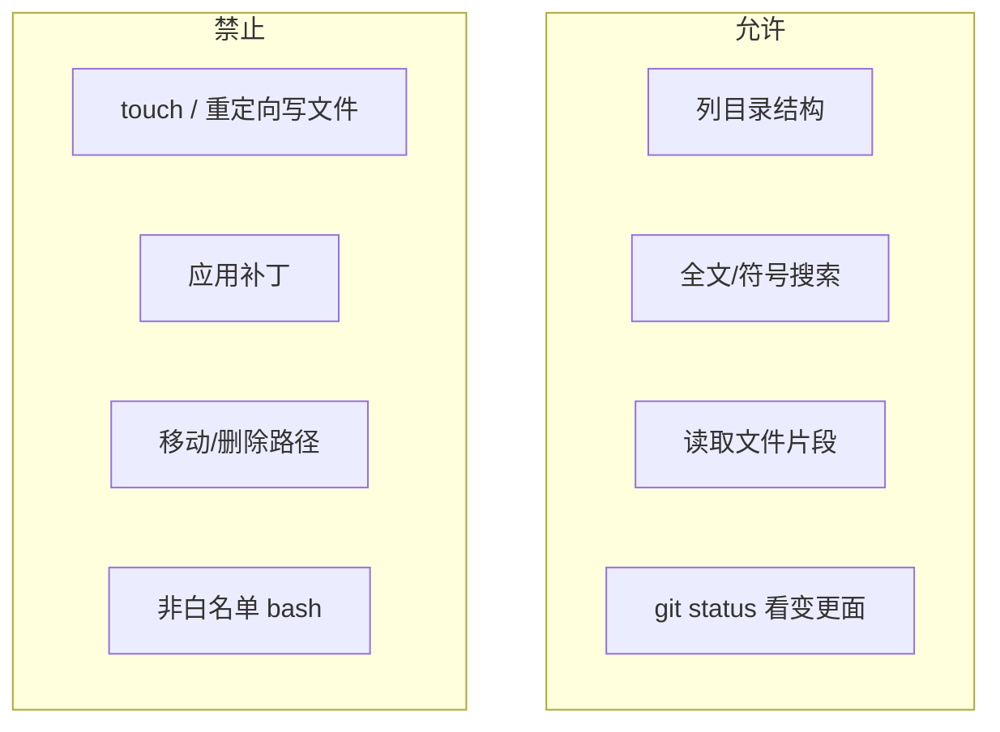
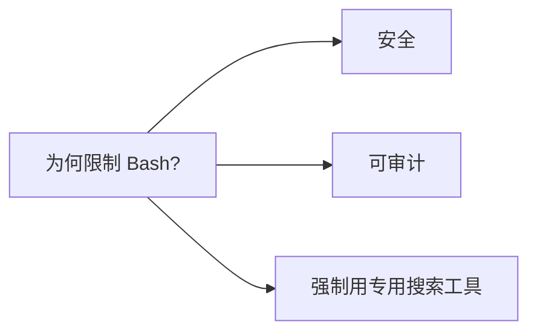

# 10.3 Explore 探索专家（只读）

> **系列**：Claude Code 完全指南 V2 · 第 10 篇

---

## 学习目标

1. **陈述** Explore Agent 的 **只读** 语义：不得创建、修改、移动文件。
2. **列举** Bash 允许的**白名单**命令（如 `ls`、`git status`）及设计原因。
3. **设计**适合派给 Explore 的任务描述模板，使父 Agent 能**合并**蒸馏结果。
4. **对比** Explore 与 generalPurpose：何时必须**强制只读**以避免副作用。

---

## 生活类比：博物馆导览员

Explore 像**导览员**：可以带你走遍展厅、指给你看展品编号与动线，但**不能**触碰展品、更不能把展品换位置。代码库就是展馆：**读**是本职工作，**写**属于「布展队」（Worker）的事。

---

## Explore 在蜂群中的位置







---

## 能力/限制总表

| 类别 | Explore 行为 | 说明 |
|------|--------------|------|
| 读文件 | 允许（通过 Read 等工具） | 核心能力 |
| 创建文件 | **禁止** | 只读模式硬约束 |
| 修改文件 | **禁止** | 同上 |
| 移动/重命名 | **禁止** | 同上 |
| Bash | **仅** `ls`、`git status` 等只读白名单 | 防 `rm -rf`、防意外写 |
| 子 Agent | **禁止**再 Task | 防递归（10.9） |

---

## 典型用途清单

| 场景 | 派 Explore 的价值 | 父 Agent 下一步 |
|------|-------------------|-----------------|
| 新人接手仓库 | 快速得到模块地图 | Plan 或 Worker 分阶段切入 |
| Bug 定位前宽搜 | 收敛相关文件集合 | 明确行号后派 Worker |
| 重命名影响分析 | 列举引用点 | 设计迁移顺序 |
| 合规审计只读 | 不产生写审计噪音 | 输出报告 |

---

## 任务描述模板（推荐给父 Agent）

```markdown
Fork started — processing in background: Explore 只读任务

【目标】列出所有引用 `package auth` 中 `ValidateToken` 的位置。

【约束】
- 只读：不得创建/修改/移动任何文件。
- Bash 仅允许：ls、git status（如需）。

【输出格式】
1. 文件路径列表（按目录分组）
2. 每文件一行摘要：函数名或调用上下文
3. 若不确定，标注「需人工确认」而非猜测修改
```

统一前缀 **Fork started — processing in background** 用于 **10.8 缓存优化**。

---

## 源码片段：Task 调用示例

```json
{
  "tool": "Task",
  "subagent_type": "explore",
  "readonly": true,
  "model": "fast",
  "description": "Fork started — processing in background: 搜 ValidateToken",
  "prompt": "只读探索：…（粘贴上文模板）"
}
```

> `model: "fast"` 为可选：宽搜类任务可用更快模型降低成本（以产品支持为准）。

---

## Explore 不应做的事（反模式）

| 反模式 | 后果 | 修复 |
|--------|------|------|
| 「顺手修一下格式」 | 违反只读 | 另开 Worker |
| 运行 `npm test` | 可能非白名单/非预期 | 交给 Verification 或 shell 专类 |
| 没有输出结构 | 父 Agent 难以合并 | 强制表格/Markdown 结构 |
| 猜测不存在路径 | 误导后续 | 标注置信度与搜索范围 |

---

## 与 Plan 的边界

| 维度 | Explore | Plan |
|------|---------|------|
| 重心 | **在哪、有哪些** | **怎么拆、风险是啥** |
| 典型工具 | 搜索、目录、读片段 | 读 + 结构化推理 |
| 产出 | 清单、地图 | 阶段、里程碑、回滚 |

正确流水线：**Explore 给地图 → Plan 给路线图 → Worker 施工 → Verification 验收**。

---

## 深入：为何 Bash 收紧到 ls / git status？

1. **最小权限**：Explore 的目标是**观测**，不是**操作环境**。
2. **可复现**：`git status` 提供变更面快照，利于与 CI 对齐。
3. **防偷懒**：避免 Explore 用一行脚本「代替思考」，绕过结构化搜索。



---

## 父 Agent 合并 Explore 结果的检查表

- [ ] 每条路径是否**真实存在**（抽样 Read 验证）
- [ ] 是否混入了**需要写操作**才能验证的假设
- [ ] 是否遗漏 **测试目录** / **生成代码** 目录（应要求 Explore 显式说明搜索范围）
- [ ] 输出是否可直接转化为 **Worker 派工单**（路径 + 行号 + 期望）

---

## 案例简叙：「支付回调重复入账」

1. **Explore**：只读列出 `webhook`、`ledger`、`idempotency` 相关文件与调用边。
2. **父 Agent**：从报告中圈定 `internal/payment/webhook.go:120-180`。
3. **Worker**：在圈定范围内实现幂等键校验。
4. **Verification**：curl 重放 + 对抗性重复 POST。

若在步骤 1 就让 Explore「试着改一下」，会破坏**证据链**且可能违反工具策略。

---

## 小结

- Explore = **只读 GPS**，**不能**动文件，Bash **白名单**。
- 产出应**结构化**，便于父 Agent **派工**与 **Verification** 对照。
- 与 **Plan** 分工：**地图 vs 路线图**。

---

## 自测

1. 为何 Explore 禁止 `echo > file`？  
2. 给出两个适合 Explore 的任务标题（description）。  
3. Explore 输出中最重要的三列应是什么？

---

## 附录：Explore 输出字段示例（可复制）

| 文件路径 | 行号范围 | 符号/上下文 | 备注 |
|----------|----------|-------------|------|
| `internal/auth/jwt.go` | 45-78 | `ParseToken` | 核心解析 |
| `cmd/api/main.go` | 12-30 | 中间件挂载 | 需与 Worker 对齐 |

---

*上一节：[10.2 六角色](./02-six-agents.md) · 下一节：[10.4 Plan](./04-plan-agent.md)*
