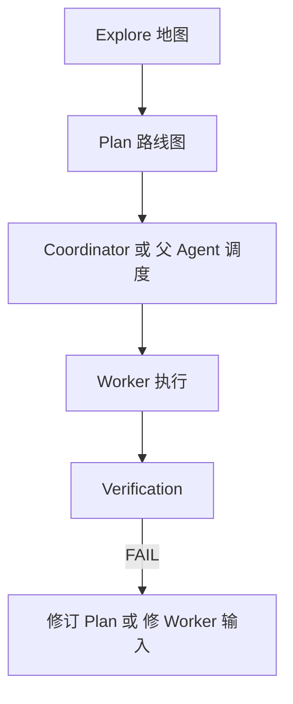
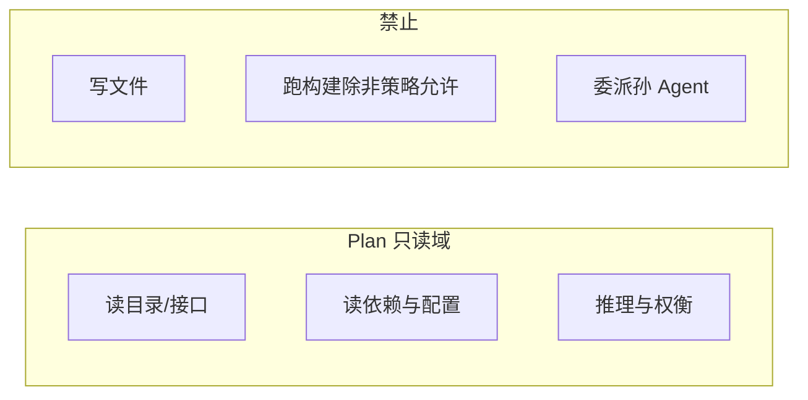
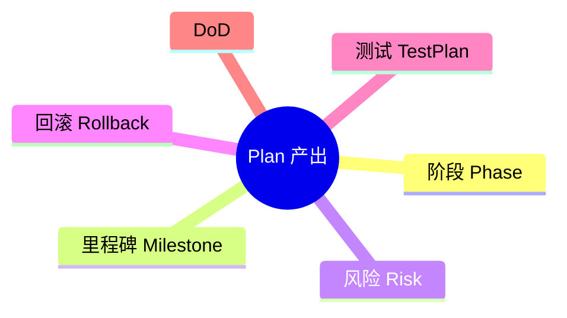
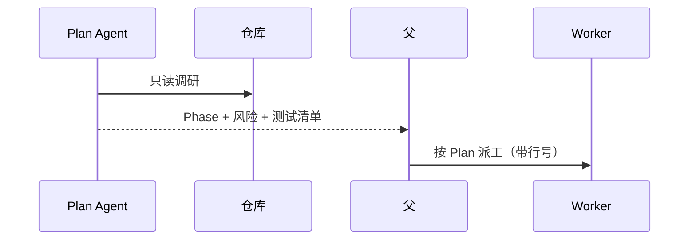

# 10.4 Plan 规划专家（只读 · 调研不动手）

> **系列**：Claude Code 完全指南 V2 · 第 10 篇

---

## 学习目标

1. **说明** Plan Agent 与 Explore 同为 **readonly**，但在产出形态上偏 **阶段、风险、依赖**。
2. **运用**「调研不动手」原则：Plan **只输出可执行计划**，不直接改仓库。
3. **编写**可被 Worker/Verification 消费的**测试清单与完成定义（DoD）**。
4. **识别**何时应用 Plan 而非让主 Agent 边想边改。

---

## 生活类比：建筑设计师与施工队

Plan 像**建筑师画施工图**：可以现场勘测、读规范、标尺寸，但**不会**在图纸上把墙砌起来。砌墙是 **Worker**；**验收**是 **Verification**。若建筑师边画边拆墙，图纸与现场将永远对不上——对应到软件就是**计划与 diff 纠缠**，难以复盘。

---

## Plan 在流水线中的角色







---

## Plan vs Explore 对照表

| 维度 | Explore | Plan |
|------|---------|------|
| 主要问题 | 「东西在哪？」 | 「先做什么、后做什么？」 |
| 典型输出 | 路径列表、调用图文字描述 | 分阶段计划、依赖排序 |
| 只读 | 是 | 是 |
| Bash | `ls`、`git status` 等 | 同左（教学抽象） |
| 是否给行号 | 常给 | 可引用 Explore 行号并**复核** |

---

## Plan 的标准输出结构（推荐）

父 Agent 应要求子 Plan 按固定 Markdown 骨架返回，便于机器与人阅读：

```markdown
## 目标重述
（一句话）

## 现状摘要
- 相关模块：…
- 已知约束：…

## 阶段划分
### Phase 1 — …
- 输入：…
- 输出：…
- 风险：…

### Phase 2 — …
…

## 测试与验收
- 单元测试：…
- 集成：curl / 浏览器场景 …
- adversarial：…

## 回滚策略
…

## 开放问题
（需用户决策的点，Plan 不擅自假设）
```

---

## 源码片段：Task 调用

```json
{
  "tool": "Task",
  "subagent_type": "plan",
  "readonly": true,
  "description": "Fork started — processing in background: 规划缓存迁移",
  "prompt": "在只读前提下阅读 docs/ 与 pkg/cache/，输出三阶段迁移计划，不得修改任何文件。必须包含测试计划与回滚。"
}
```

---

## 「调研不动手」的纪律

| 行为 | 是否允许 | 说明 |
|------|----------|------|
| Read 多个文件归纳接口 | 允许 | 调研 |
| 建议重命名符号 | 允许 | 文字建议 |
| ApplyPatch 修改 | **禁止** | Worker 事 |
| 写临时脚本落盘 | **禁止** | 破坏只读 |
| 输出「应由 Worker 执行的精确指令块」 | 允许 | 移交施工 |



---

## Plan 与 Coordinator 的协同

**Coordinator** 可把 Plan 的输出当作 **Gantt 的逻辑版**：

| Plan 输出 | Coordinator 动作 |
|-----------|-------------------|
| Phase 1 仅只读搜索 | 并行派多个 Explore/Worker 搜 |
| Phase 3 改多个不相交文件 | 可并行 Worker |
| Phase 3 改同一文件 | **串行**或单 Worker |

---

## 反模式

| 反模式 | 为何有害 | 替代 |
|--------|----------|------|
| Plan 内「我帮你改了 README」 | 违反只读 | Worker |
| 计划过于宏大不可验收 | Worker 迷失 | 每 Phase 附 DoD |
| 无测试计划 | Verification 无法对齐 | 显式 curl/用例名 |
| 与 Explore 重复劳动 | 浪费 token | Explore 先收敛范围 |

---

## 深入：Plan 如何服务 Verification？

在计划中提前写明：

1. **必须绿的命令**：`go test ./...`、`pnpm lint` 等。  
2. **对抗性场景**：空输入、超大 body、重复请求。  
3. **PARTIAL 的允许条件**（例如仅文档未更新但核心绿）。

这样 **Verification** 的 **PASS/FAIL/PARTIAL** 与 **Plan** 对齐，减少扯皮。

---

## 案例骨架：API 版本化

1. **Explore**：列出现有路由与中间件文件。  
2. **Plan**：Phase1 加兼容层；Phase2 切换默认版本；Phase3 删废弃；每阶段附测试与监控指标。  
3. **Worker**：严格按 Phase 派工。  
4. **Verification**：Try to break it + curl 新旧路径。

Plan **全程只读**；若 Phase 需要样例 JSON，**用文字**给出，不写文件。

---

## 父 Agent 审核 Plan 的检查表

- [ ] 每个 Phase 是否有**明确输出物**（文件/接口/配置键）？
- [ ] 依赖是否**无环**？
- [ ] 测试是否覆盖 **happy path + 至少两条边**？
- [ ] 是否把「应派给 Worker 的行号」从 Explore **接力**过来？

---

## 与「反偷懒」的关系（10.6 预告）

Plan 可以写得很漂亮，但若父 Agent 给 Plan 的输入是「你看着办」，Plan 会**泛化**。父 Agent 应提供：**业务目标 + Explore 的硬证据 + 约束（时间/兼容）**。

---

## 小结

- **Plan** = **只读**战略家；**Explore** = **只读**侦察兵。
- 产出聚焦 **阶段、风险、测试、回滚**，**不落地修改**。
- 与 **Coordinator / Worker / Verification** 形成 **想→干→验** 闭环。

---

## 自测

1. Plan 与 Explore 各回答哪类问题？  
2. 为什么 Plan 不应写临时文件？  
3. 写出你心目中 Phase 的「完成定义」三要素。

---

*上一节：[10.3 Explore](./03-explore-agent.md) · 下一节：[10.5 Coordinator](./05-coordinator.md)*
