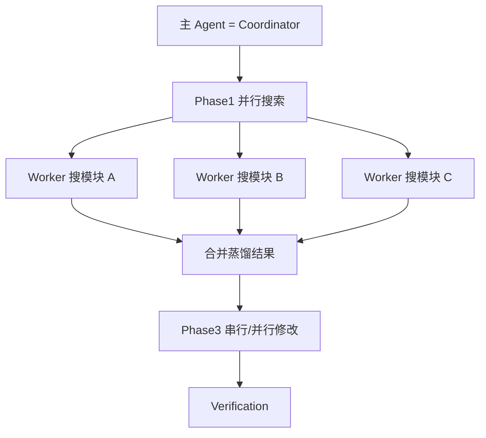
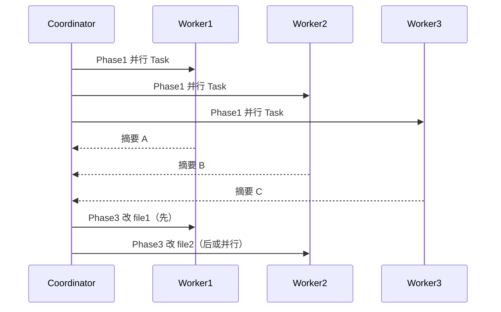
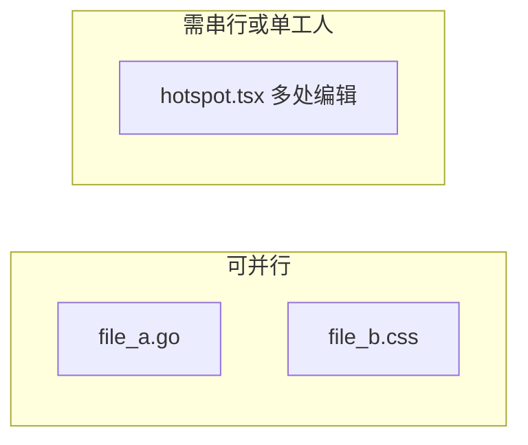
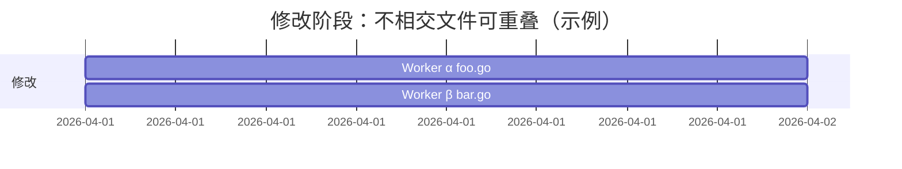

# 10.5 Coordinator 协调器（项目经理调度）

> **系列**：Claude Code 完全指南 V2 · 第 10 篇

---

## 学习目标

1. **描述** Coordinator 模式下主 Agent 的**项目经理**心智：拆阶段、派工、汇总。
2. **设计** Phase1 **并行**宽搜与 Phase3 **串行**修改策略，降低**文件冲突**概率。
3. **解释**为何「改同一热点文件」应**排队**，而「改不相交文件」可**并行**。
4. **对接** Explore/Plan/Worker/Verification 在协调流中的**时间序**。

---

## 生活类比：工地总包

**Coordinator** 像总包项目经理：同时安排水电工、木工**并行**勘测（Phase1），但在**同一面墙**上不能两人同时开槽——必须**串行**（Phase3）。验收员（Verification）独立巡检，不站队某工种。

---

## Coordinator 模式总览







---

## Phase 设计模板（推荐）

| 阶段 | 目的 | 并行度 | 典型子 Agent |
|------|------|--------|--------------|
| Phase1 | 宽搜、建候选集 | **高**（3+ Worker） | Explore / Worker 只读搜 |
| Phase2 | 锁定修改列表与顺序 | 单线程思考 | 主 Coordinator |
| Phase3 | 落地修改 | **按文件不相交并行**；相交则**串行** | Worker |
| Phase4 | 质检 | 独立 | Verification |

---

## 典型调度：Phase1 三只 Worker 并行搜索

**目标**：尽快获得「全库与 Bug 相关的触点」。

```markdown
Coordinator 指令（示意）

Phase1 — 并行（3 Task）：
- Worker A：搜索关键字 `timeout` 于 `services/` 下，返回路径+行号。
- Worker B：搜索 `retry` 于 `pkg/net/` 下。
- Worker C：Explore 只读列 `infra/` 与 `deploy/` 中与外部调用相关文件。

统一 description 前缀：Fork started — processing in background
```

合并规则：Coordinator **去重路径**，**标注冲突假设**，再进入 Phase2。

---

## Phase3：两只 Worker 串行修改不同文件（防冲突）

当候选集中有两个**不相交**文件需修改时：

| 顺序 | Worker | 文件 | 说明 |
|------|--------|------|------|
| 1 | Worker-α | `api/handlers/foo.go` | 先完成并简短摘要 |
| 2 | Worker-β | `worker/processor/bar.go` | 依赖 α 的接口契约时再派 |

若两文件**无依赖**，可**并行**两只 Worker；Coordinator 仍需在汇总时做**接口一致性**检查。



若 **同一文件**：


---

## 源码片段：并行 Task 伪代码（概念）

```text
# 非真实语言，仅表达协调逻辑

parallel_tasks = [
  Task(subagent_type="worker", prompt="…搜 services/…"),
  Task(subagent_type="worker", prompt="…搜 pkg/net/…"),
  Task(subagent_type="explore", readonly=true, prompt="…列 infra/…"),
]
results = gather(parallel_tasks)
merge_plan = coordinator_merge(results)
serial_tasks = [
  Task(subagent_type="worker", prompt="改 api/handlers/foo.go 第 40-80 行…"),
  Task(subagent_type="worker", prompt="改 worker/processor/bar.go 第 10-55 行…"),
]
```

实际在 Claude Code 中由**主 Agent** 通过多次 **Task 工具调用**实现；是否真并行取决于**运行时调度**（教学上按「可同时发起」理解）。

---

## Coordinator 与 Plan/Explore 的分工

| 角色 | 贡献 |
|------|------|
| Explore | Phase1 **只读**候选，轻量 |
| Plan | Phase2 前给出**风险与阶段**蓝图 |
| Coordinator | **拍板**并行度与顺序 |
| Worker | **执行** |
| Verification | **判决** |

---

## 冲突类型与策略表

| 冲突类型 | 现象 | 策略 |
|----------|------|------|
| 文件级 | 两 Worker 同改一文件 | **串行**或单 Worker |
| 逻辑级 | A 改接口 B 未跟进 | Phase2 **锁定契约**再派工 |
| 测试级 | 单元绿、集成红 | Verification **FAIL**，回滚或补测 |
| 过程级 | 子任务描述含糊 | **反偷懒**（10.6）重写 prompt |

---

## 反模式

| 反模式 | 后果 |
|--------|------|
| Phase1 只派一只 Worker 全库盲跑 | 时延大、上下文噪声 |
| Phase3 并行改同一文件 | diff 冲突、逻辑撕裂 |
| 跳过合并直接派下一波 | 重复劳动/矛盾补丁 |
| Coordinator 亲自写大量代码 | 失去调度视角 |

---

## 与消息路由的关系（10.10）

Coordinator 应要求子 Agent 返回**固定字段**：`summary` / `touched_files` / `open_questions`，便于父级**路由**到下一 Task。

---

## 案例简叙：配置热更新

1. Phase1：三 Worker 并行搜 `config`、`viper`、`watch`。  
2. Phase2：合并后锁定 `internal/config/loader.go` 与 `cmd/agent/main.go`。  
3. Phase3：两文件**可并行**两 Worker（若团队策略允许）；若共享锁逻辑在同一函数，则**串行**。  
4. Verification：`go test` + 对抗性「坏 YAML」输入。

---

## 小结

- Coordinator = **项目经理**：**并行宽搜、串行热点、合并蒸馏**。
- Phase1 **多路并行**，Phase3 **按文件相交关系**决定并行或排队。
- 与 **Verification** 配合形成**调度→执行→判决**闭环。

---

## 自测

1. 何时 Phase3 必须串行？  
2. Phase1 并行三只 Worker 的收益与成本各是什么？  
3. Coordinator 输出合并时最少应检查哪三类信息？

---

*上一节：[10.4 Plan](./04-plan-agent.md) · 下一节：[10.6 反偷懒](./06-anti-lazy.md)*
