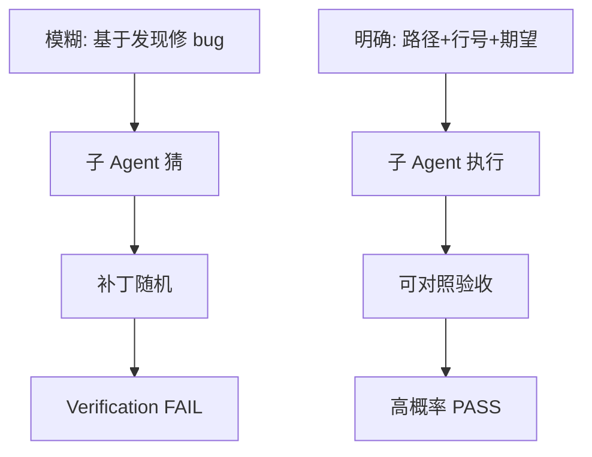
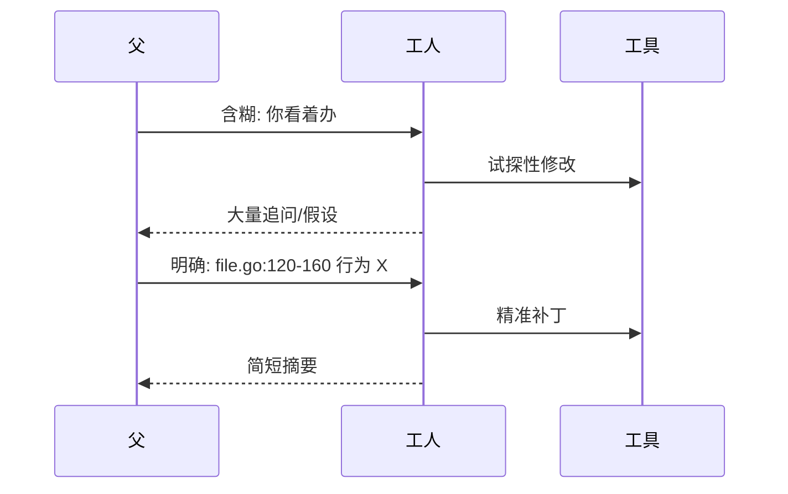
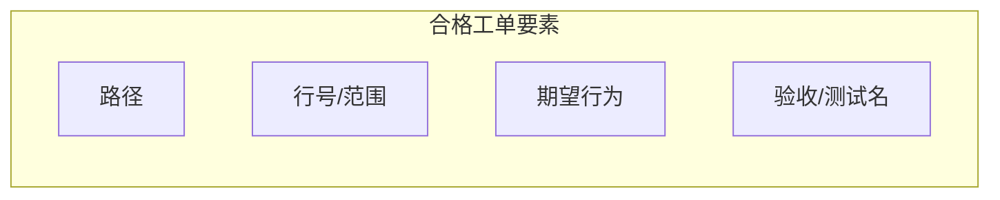
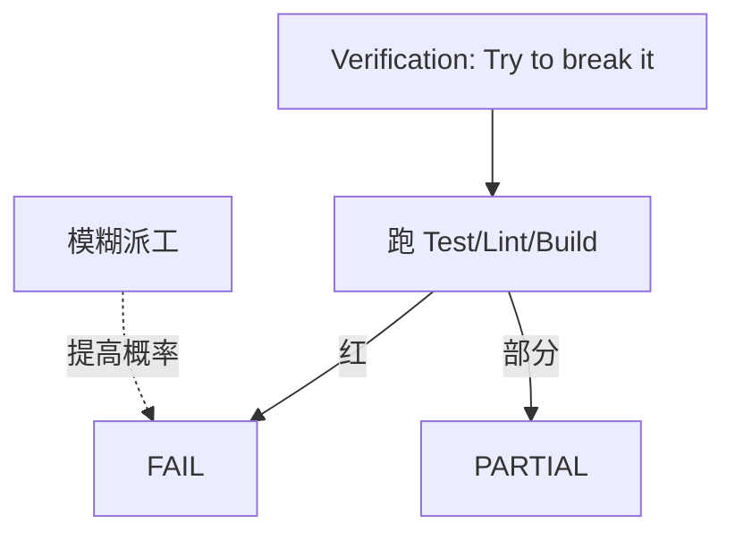

# 10.6 反偷懒机制与工人意识注入

> **系列**：Claude Code 完全指南 V2 · 第 10 篇

---

## 学习目标

1. **定义**主 Agent 分配任务时的**模糊指令反模式**（如「基于发现修 Bug」）及其危害。
2. **撰写**合格派工单：**路径 + 行号 + 期望行为 + 验收**，禁止把「想清楚」甩给子 Agent。
3. **背诵**工人意识注入要点：**Fork 出来的工人，不是经理；不要交流提问；直接工具干活；严禁再生成子 Agent**。
4. **关联**反偷懒与 **Verification**：模糊输入 → 模糊实现 → **FAIL/PARTIAL** 概率上升。

---

## 生活类比：装修工单

若你对工人说「看着弄」，你会得到**随机风格的墙漆**。若你说「客厅东墙，色号 NN-01，两遍面漆，验收照 CIEC 标准拍照」，工人才能**一次性做对**。主 Agent 写子任务同理：**模糊指令 = 授权偷懒**。

---

## 反偷懒：主 Agent 的责任边界







---

## 禁止的模糊指令（示例表）

| 模糊说法 | 问题 | 改写方向 |
|----------|------|----------|
| 「基于你的发现修 Bug」 | 发现不在父上下文 | 父 Agent **先合并 Explore** 再写行号 |
| 「优化一下性能」 | 无基线无指标 | 指定函数/接口 + pprof 场景 |
| 「重构这块」 | 范围不明 | 文件列表 + 禁止行为 + 允许行为 |
| 「对齐业界最佳实践」 | 不可测试 | 给出具体规范链接或规则条目 |
| 「顺便修一下测试」 | 无测试名 | `TestFoo_Bar` + 期望断言 |

---

## 合格派工单模板（Worker / generalPurpose）

```markdown
Fork started — processing in background: Worker 派工

【身份】你是 Fork 出来的工人，不是经理。不要向用户或父级反复提问；
        直接调用工具完成工作；严禁再生成子 Agent（Task）。

【范围】仅修改 `internal/billing/invoice.go` 第 142-201 行及同文件内直接必要的 import。

【问题】当 `TaxRate` 为 nil 时当前会 panic。

【期望】在计算总价前使用默认税率 0；记录 debug 日志一行（已有 logger）。

【禁止】不得修改 `go.mod`；不得重命名导出符号。

【验收】`go test ./internal/billing/...` 全绿；若红，自行修复至绿或回报精确错误块。

【输出】1) 变更摘要 2) 触及文件列表 3) 测试输出摘要
```

---

## 工人意识注入（原文可贴入 prompt）

以下段落建议由 **父 Agent** 在每次派 **Worker** 时**原样或略作裁剪**附带：

```text
你是 Fork 出来的工人，不是经理。
不要交流提问；在信息不足时基于仓库可见证据做最小合理假设并继续。
直接工具干活：读、搜、改、跑测试。
严禁再生成子 Agent（不要调用 Task 创建孙 Agent）。
```

---

## 为何「禁止子 Agent 再提问」？

| 原因 | 说明 |
|------|------|
| 延迟 | 问答往返拉长 wall time |
| 上下文漂移 | 子窗口与父窗口易不一致 |
| 责任回滚 | 失败时难以判定「谁没问清」 |

**例外**：致命缺失（如密钥、产品二选一）可由子 Agent **单次**在摘要中标注 `BLOCKED: 需人类确认 X`，但不应展开多轮闲聊。

---

## 与 Explore/Plan 的衔接

| 步骤 | 负责方 | 产出 |
|------|--------|------|
| 宽搜 | Explore | 路径+行号候选 |
| 战略 | Plan | 阶段与风险 |
| **合并** | **父 Agent** | **去模糊**后的工单 |
| 施工 | Worker | diff |

**父 Agent 禁止**把「合并」甩给 Worker：那是**经理活**。

---

## 源码片段：父 Agent 内部 checklist（伪代码）

```text
function dispatch_worker(explore_result, bug_report):
  require explore_result.paths.non_empty
  for each change:
    require change.file
    require change.line_range
    require change.expected_behavior
    require change.verification_command
  prompt = render_template(WORKER_TEMPLATE, change)
  Task(subagent_type="worker", prompt=prompt)
```

---

## Verification 对模糊派的「报复链」



模糊派工 → 子 Agent **过度猜测** → 测试未覆盖分支 → **adversarial probes** 抓穿 → **FAIL** 或 **PARTIAL**。

---

## 反模式对照表（经理 vs 工人）

| 经理（父/Coordinator）应做 | 工人（Worker）应做 |
|----------------------------|-------------------|
| 合并 Explore 输出 | 按行号改 |
| 决定并行/串行 | 不调度他人 |
| 写清验收命令 | 跑命令并贴摘要 |
| 对接 Verification 结果 | 不「自评满分」 |

---

## 案例：从模糊到明确

**模糊**：「Worker：根据前面讨论修登录。」

**明确**：

- 文件：`auth/login.go`  
- 行号：`88-112`（`VerifyPassword`）  
- 期望：连续失败 5 次后锁定 15 分钟；错误信息不区分用户不存在与密码错误  
- 验收：`go test ./auth -run TestLogin` + `curl` 样例两条  

---

## 小结

- **反偷懒**核心：**主 Agent 去模糊**，子 Agent **执行**。
- **工人意识注入**减少无效对话，**硬禁**子 Agent 再 Fork。
- 与 **Verification** 形成压力：**含糊工单 → 更易 FAIL**。

---

## 自测

1. 写出两句「模糊指令」并改写为「明确工单」。  
2. 工人意识注入三条禁令是什么？  
3. 为什么合并 Explore 结果不该由 Worker 代劳？

---

*上一节：[10.5 Coordinator](./05-coordinator.md) · 下一节：[10.7 Verification](./07-verification-agent.md)*
